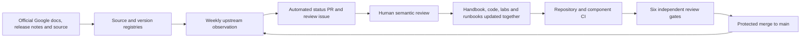

# Enterprise Agent Platform Engineering on Google Cloud

An evidence-led engineering reference for designing, building, securing, deploying, and operating enterprise agent platforms on Google Cloud.

This repository is for Forward Deployed Engineers, customer engineers, platform teams, architects, security engineers, and SREs delivering production systems—not demonstration chatbots.

> [!IMPORTANT]
> **Repository status: complete Draft handbook; zero chapters Approved.** All fifteen
> volumes now contain long-form FDE guidance and Volumes 2–15 have production-
> shaped companion artifacts. Local tests validate code and qualification logic,
> not a customer deployment. Use the [content status](docs/STATUS.md) and [chapter
> inventory](docs/CHAPTER_INVENTORY.md) before relying on material in production.

## Start here

- [Handbook contents](SUMMARY.md)
- [Content status and release gates](docs/STATUS.md)
- [Chapter and artifact inventory](docs/CHAPTER_INVENTORY.md)
- [Research and review workflow](docs/RESEARCH_AND_REVIEW.md)
- [Writing and evidence rules](STYLE_GUIDE.md)
- [Contribution workflow](CONTRIBUTING.md)
- [Current upstream baseline](references/BASELINE.md)
- [Latest automated upstream observation](references/UPSTREAM_STATUS.md)
- [Repository roadmap](ROADMAP.md)

## Evidence model

Every architecture section uses exactly one classification:

- 🟢 **Official Google Capability** — supported by a cited official document, source repository, or sample.
- 🟡 **Enterprise Architecture Recommendation** — handbook guidance derived from documented capabilities; not a product guarantee.
- 🔵 **Field Pattern** — a reusable delivery pattern that must be validated for the customer context.

Preview, private-preview, allowlist, regional, quota, and known-limitation status must be stated next to the affected claim. An unlabeled architectural claim is a documentation defect.

## Current technology baseline

The dated source of truth is [references/versions.json](references/versions.json). At bootstrap on 2 August 2026, the latest official ADK Python release verified through the Google repository is `v2.6.1`. Managed Google Cloud services are tracked by release notes and capability maturity rather than fabricated semantic versions.

## How the repository works end to end

The repository treats documentation, executable examples, infrastructure, delivery controls, labs, operations, and evidence as one versioned product. A handbook claim is not considered maintained merely because its Markdown still renders.



The lifecycle is:

1. **Register evidence.** Every official document, release page, source tag, or sample used by a chapter is recorded in `references/sources.json` with an owner, verification date, and review interval. Qualified software and module versions are recorded in `references/versions.json`.
2. **Research before editing.** The chapter owner compares the official documentation, tagged code, samples, release notes, maturity, regions, quotas, and limitations before changing a claim or implementation.
3. **Change the complete delivery unit.** A pull request updates affected prose, Terraform/Python, diagrams, labs, delivery controls, operations material, evidence ledgers, and source records together.
4. **Run local gates.** Repository structure, links, source metadata, tests, Terraform, qualification rules, and relevant examples are validated locally.
5. **Run pull-request CI.** Documentation-wide checks and the affected volume workflows must pass. Examples and qualification records cannot silently claim customer-production evidence.
6. **Complete human review.** Research, architecture, implementation, security, operations, and customer-delivery reviewers approve the change. Automation can detect drift but cannot decide what an upstream change means for a customer architecture.
7. **Merge through branch protection.** Only reviewed changes merge to `main`. Chapter status becomes `Approved` only when its front matter, evidence, tests, and `docs/STATUS.md` all satisfy the publication contract.
8. **Re-enter maintenance automatically.** The weekly upstream workflow compares the merged baseline with current official releases and every source's review deadline. Drift creates a new review obligation and starts the cycle again.

## How documentation stays current

The maintenance mechanism is implemented by [upstream-docs-refresh.yml](.github/workflows/upstream-docs-refresh.yml), [check_sources.py](scripts/check_sources.py), and [render_upstream_status.py](scripts/render_upstream_status.py).

Every Monday at 19:23 UTC, and whenever manually dispatched, the workflow:

1. Queries official GitHub release APIs for each tracked versioned dependency.
2. Compares observed releases with the qualified versions in `references/versions.json`.
3. Checks every registered source's verification age and review interval.
4. Checks registered URLs for reachability.
5. Regenerates [references/UPSTREAM_STATUS.md](references/UPSTREAM_STATUS.md), including version drift, query failures, and overdue semantic reviews.
6. Uploads the status document and raw source-check result as a 30-day workflow artifact.
7. Opens or updates the `automation/upstream-status` pull request when the generated report changes.
8. Opens or updates an `Upstream documentation review required` issue when a source is stale, unreachable, invalid, or a tracked release differs from the baseline.
9. Closes that automation issue only when scheduled upstream validation returns to green.

The generated pull request updates only the observation report. It deliberately does **not** rewrite handbook prose, change maturity labels, alter Terraform pins, promote a new baseline, or advance `verified_at` dates. Those changes require a maintainer to inspect the official material and submit a semantic update. This prevents an upstream release number from being mistaken for customer-ready qualification.

### Update ownership and response

The `owner` field in `references/sources.json` routes each finding to its volume. The owner must:

- identify every affected claim and implementation artifact;
- decide whether the change is compatible, breaking, deprecated, regional, Preview, or operational only;
- update code and documentation together;
- run the relevant sandbox, security, evaluation, recovery, performance, and cost checks;
- update `verified_at` only after completing that review;
- update `references/versions.json` only after the new implementation baseline qualifies; and
- record review results in the volume evidence ledger and `docs/STATUS.md`.

Automation detects known-source drift. It cannot discover an entirely new undocumented source, interpret changed prose at an unchanged URL, prove a managed service in a customer environment, or approve production use. Review intervals force unchanged URLs back through semantic review so those limitations remain visible.

### GitHub configuration required

For the maintenance loop to work, repository administrators must:

- use `main` as the protected default branch;
- allow GitHub Actions to create and approve pull requests;
- allow the workflow `GITHUB_TOKEN` the explicit `contents: write`, `pull-requests: write`, and `issues: write` permissions declared in the workflow;
- require documentation quality and affected component workflows before merge; and
- prevent direct human and automation pushes to `main`.

If organization policy forbids write-capable workflow tokens, keep the scheduled checks read-only and route their artifact to an external issue/PR automation identity. Do not weaken branch protection.

## GitHub workflow map

| Workflow | Trigger | Responsibility | Writes production/cloud state? |
|---|---|---|---|
| `docs-quality.yml` | Every pull request, push to `main`, manual | Repository structure, local tooling tests, and offline source metadata | No |
| `upstream-docs-refresh.yml` | Weekly schedule, manual | Refresh upstream observation PR/artifact and synchronize the drift issue | Repository report branch and issue only |
| `volume-2-platform-ci.yml` | Relevant PR/push | Admission service, delivery policy, labs, and Terraform validation | No |
| `volume-3-adk-ci.yml` | Relevant PR/push | ADK graph, deterministic evaluation, compilation, delivery, and labs | No |
| `volumes-4-10-ci.yml` | Relevant PR/push | Shared production kit and fail-closed qualification gates | No |
| `volumes-11-15-ci.yml` | Relevant PR/manual | Registry, Gateway, Identity, Cloud Armor, Gemini Enterprise and Terraform tests | No |
| `volume-2-terraform-apply.yml` | Manual dispatch with protected environment approval | Apply the exact reviewed Terraform plan using WIF identities | Yes, only the selected governed-cell environment |

Scheduled documentation maintenance never deploys Google Cloud resources.

## Local validation

```bash
python3 scripts/validate_repository.py
python3 -m unittest discover -s tests -v
python3 scripts/check_sources.py --offline
python3 scripts/render_upstream_status.py --offline --output /tmp/UPSTREAM_STATUS.md
```

Network source checks are intentionally separate:

```bash
python3 scripts/check_sources.py
```

## Repository layout

```text
docs/          Handbook volumes, templates, status, and research policy
diagrams/      Shared Mermaid conventions and reusable diagrams
terraform/     Infrastructure standards, modules, and examples
examples/      Production-oriented reference implementations
labs/          Reproducible FDE labs
adr/           Architecture decision records
assets/        Non-source visual assets
references/    Version baseline and machine-readable source registry
scripts/       Quality and upstream-freshness checks
tests/         Tests for repository tooling
```

## What is implemented now

- Fifteen substantive long-form Draft volumes covering foundations, platform, ADK,
  runtime, security, SRE, engineering references, industry overlays, FDE delivery,
  evolution/migrations, Agent Registry, Agent Gateway, Agent Identity, Cloud Armor,
  and the Gemini Enterprise app.
- A Volume 2 executable field kit: IAP-authenticated admission service, governed-cell Terraform, keyless plan/apply workflows, provenance-aware build/release controls, Agent Platform qualification labs, and operations runbooks.
- A Volume 3 executable field kit: an ADK v2.6.1 graph, deterministic policy/approval/idempotency/reconciliation controls, hermetic evaluation gate, guarded Agent Runtime qualification deployment, CI, labs, operations, and immutable source evidence.
- A shared Volumes 4–10 field kit: tested runtime placement/capacity, action
  security, SLO/recovery, source freshness, industry overlay, engagement gates and
  version-compatibility controls; seven fail-closed qualification records, labs,
  operations packs, dated research/evidence ledgers and dedicated CI.
- Five dedicated control-plane/app handbooks with tested Registry, Gateway,
  Identity, Cloud Armor and Gemini Enterprise app admission logic; fail-closed
  qualification records, labs, operations, evidence ledgers and CI; plus a composed,
  version-pinned enterprise Terraform stack for all five capabilities.
- Evidence classification, source registry, exact ADK baseline, publication lifecycle, review gates, and upstream-freshness automation.
- Repository quality tests, GitHub issue templates and CI.

## What remains

Every volume remains Draft until cloud/framework CI where applicable, an
authorized customer sandbox, integration/security/evaluation/recovery/load and
industry-specific tests, and independent review gates pass. The repository does
not fabricate those results: qualification examples intentionally fail production
validation. The definitive state is maintained in [docs/STATUS.md](docs/STATUS.md).

## License and support

No license or Google support status has yet been declared by the repository owner. Do not assume this repository is an official Google publication. Product claims link to official sources so readers can verify them independently.
