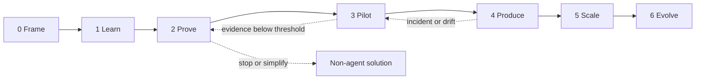

# Forward Deployed Engineer customer adoption playbook

> [!IMPORTANT]
> **Status: independent field system, Draft.** This playbook synthesizes public
> Google Cloud adoption and architecture guidance with public OpenAI and Anthropic
> forward-deployment and agent-engineering practices. It is not a representation
> of any vendor's private consulting method, employment policy, or contractual
> service. Google product claims must still be supported by Google evidence.

## Purpose

Use this playbook to move a customer from an ambiguous AI ambition to a measured,
governed, operated agentic service and an independent customer team. It connects
the detailed technical volumes to an engagement path an FDE can execute with
business, engineering, security, data, risk, operations and change stakeholders.

The primary practical role contract for this Google-oriented repository comes from
Google's own current public FDE material:

- Google Cloud describes a GenAI FDE as an embedded builder who codes, debugs and
  jointly ships agentic solutions in customer environments; removes integration,
  data-readiness and state blockers; builds eval and observability systems; creates
  reusable field patterns and product feedback; and co-builds customer capability.
  [Google Cloud GenAI FDE role](https://www.google.com/about/careers/applications/jobs/results/143358812177212102-forward-deployed-engineer-genai-google-cloud)
- Google's senior GenAI FDE description adds production launch ownership,
  measurable ROI, live infrastructure and security integration, strategic account
  embedding, adoption and Google Cloud product feedback.
  [Google Cloud FDE IV role](https://www.google.com/about/careers/applications/jobs/results/143122286080074438-forward-deployed-engineer-iv/)
- The Gemini Enterprise Customer Experience FDE role emphasizes Customer User
  Journeys, Terraform, enterprise knowledge integration, agent debugging,
  high-traffic incident response and customer adoption.
  [Google Cloud GECX FDE role](https://www.google.com/about/careers/applications/jobs/results/103848231200268998-forward-deployed-engineer/)
- Google publishes practical Gemini Enterprise implementation guidance jointly
  authored by an FDE and product engineer, connecting field delivery to reusable
  ADK/A2A implementation material.
  [Gemini Enterprise and A2UI guide](https://cloud.google.com/blog/topics/developers-practitioners/guide-to-gemini-enterprise-and-a2ui-integration)

The complete mapping from these responsibilities to engagement artifacts is in
the [Google FDE operating model](GOOGLE_FDE_OPERATING_MODEL.md).

OpenAI and Anthropic provide secondary cross-industry corroboration:

- OpenAI describes FDE ownership from discovery and technical scoping through
  system design, build and production rollout, measuring adoption, workflow impact
  and eval-driven feedback and codifying reusable field patterns. [OpenAI FDE role](https://openai.com/careers/forward-deployed-engineer-munich-munich-germany/)
- OpenAI describes embedded engineers connecting models to customer data, tools,
  controls and business processes so production systems work reliably in daily
  operations. [OpenAI Deployment Company](https://openai.com/index/openai-launches-the-deployment-company/)
- Anthropic's public Applied AI role emphasizes pair programming, prototypes,
  code contribution, agent architectures, context engineering, evaluation, cost
  optimization, reusable tooling, technical content and customer workshops.
  [Anthropic Applied AI posting](https://job-boards.greenhouse.io/anthropic/jobs/5343697008)
- Anthropic recommends starting with the simplest effective system and adding
  agentic complexity only when evaluation shows it is needed. [Building effective agents](https://www.anthropic.com/engineering/building-effective-agents)
- Independently, Google Cloud adoption guidance emphasizes task-integrated
  workflows, curated enterprise context,
  iteration with real users, measurable value, secure data foundations and the
  operational, security, reliability, cost and performance pillars.
  [Google Cloud transformation lessons](https://cloud.google.com/transform/beyond-the-pilot-five-hard-won-lessons-from-google-clouds-ai-transformation-strategy),
  [AI and ML Well-Architected perspective](https://docs.cloud.google.com/architecture/framework/perspectives/ai-ml)

These sources support a field pattern; they do not remove customer accountability
for objectives, risk, production authorization, data use, legal decisions or
operations.

## Definition of customer success

An engagement succeeds only when all five outcomes are present:

1. **Business:** a named workflow metric improves for the intended population.
2. **User:** real users adopt the capability and can recognize, correct and
   escalate failures.
3. **Technical:** the service meets evaluated quality, latency, reliability,
   security and cost boundaries.
4. **Operational:** the customer can deploy, observe, support, recover, roll back,
   change and retire it.
5. **Capability transfer:** customer engineers and operators demonstrate the work
   without dependence on the FDE.

A polished demonstration, an accurate answer set, infrastructure deployment, or
training attendance alone is not customer success.

## Adoption journey



Advancement is evidence-based, not calendar-based. A customer may intentionally
remain at Level 3 for a bounded internal workflow or choose a deterministic
application instead of an agent.

### Level 0 — Frame

**Question:** What work should improve, for whom, by how much, within which
constraints?

FDE activities:

- Observe the current workflow with actual operators and exceptions.
- Establish cycle time, quality, rework, risk, cost and satisfaction baselines.
- Identify sponsor, product owner, technical owner and control owners.
- Define scope, prohibited uses, stop conditions and decision rights.
- Build the stakeholder, access, dependency and RAID maps.

Exit evidence:

- Customer-approved engagement charter.
- Measurable baseline and target with an authoritative measurement source.
- Named owners and escalation route.
- Initial data, integration, regulatory and production constraints.
- Explicit decision to proceed with discovery.

### Level 1 — Learn and qualify

**Question:** Is an agent the lowest-risk effective solution?

FDE activities:

- Decompose the workflow into deterministic, retrieval, reasoning and action steps.
- Compare form/rules/search/API/model-call/workflow/agent options.
- Assess data authority, evaluation feasibility, integration stability and fallback.
- Assign an autonomy level: retrieve, draft, recommend, propose action,
  human-approved action, or narrow reversible automation.
- Demonstrate model and tool failure modes to business and control owners.

Exit evidence:

- Ranked use-case scorecard and rejected-use-case record.
- Current-state workflow and target task design.
- Autonomy/risk decision and prohibited-action list.
- Initial golden cases, adversarial cases and expert evaluator commitment.
- Architecture-option brief including a non-agent alternative.

### Level 2 — Prove a thin vertical slice

**Question:** Can one valuable path cross realistic boundaries safely?

The slice includes a real authentication shape, one authoritative source, one
bounded tool, typed state, trace and evaluation capture, failure handling and a
repeatable deployment path. Use synthetic or customer-approved sandbox data.

FDE activities:

- Pair with customer engineers; avoid a separate throwaway demo stack.
- Pin model, ADK, dependency and infrastructure versions.
- Implement deterministic policy outside model discretion.
- Add idempotency, timeouts, budgets, reconciliation and manual fallback.
- Build golden, negative, injection, authorization and tool-failure evaluations.
- Record architecture decisions and open production gaps.

Exit evidence:

- Reproducible sandbox deployment and cleanup.
- Versioned code, Terraform, tests and evaluation set in customer-owned locations.
- Traceable results against initial value and safety thresholds.
- Threat model seed, data flow, identity map and action contract.
- Evidence-backed decision to pilot, simplify, defer or stop.

### Level 3 — Pilot with real users

**Question:** Does the solution improve real work without unacceptable harm or
operational burden?

FDE activities:

- Select a representative cohort and controlled workflow boundary.
- Train users on intended use, uncertainty, correction, escalation and fallback.
- Instrument exposure, activation, task completion, correction, override,
  abandonment, unsafe outcome, latency and unit cost.
- Review sampled traces with domain experts and affected teams.
- Run weekly product/evaluation/operations reviews and close top failure clusters.

Exit evidence:

- Adoption funnel and segmented business outcome compared with baseline.
- Production-representative evaluation and error taxonomy.
- Support demand, manual fallback capacity and user feedback.
- Stable technical and business thresholds over the agreed observation window.
- Customer decision to harden, constrain, redesign or stop.

### Level 4 — Produce and operate

**Question:** Can the customer safely depend on, change and recover the service?

Required gates:

1. Research and architecture.
2. Implementation and supply chain.
3. Security, privacy, data and responsible-use review.
4. Evaluation, performance, reliability and cost.
5. Operations, incident, recovery, rollback and support.
6. Customer delivery, adoption and handover.

Exit evidence:

- Approved production topology, IAM, network, data and action policies.
- SLOs, alerts, dashboards, on-call, escalation and support boundaries.
- Tested deployment, canary, rollback, backup/restore and disaster recovery.
- Capacity, quota and unit-economics evidence.
- Go/no-go decision by authorized customer owners.
- Controlled rollout and post-launch review dates.

### Level 5 — Scale through a paved road

**Question:** Can other teams deliver safely without recreating the platform or
its mistakes?

FDE activities:

- Convert the validated slice into templates, skills, modules and service catalog.
- Establish agent registry, gateway, identity, tenancy and policy boundaries.
- Define platform/workload ownership and exception governance.
- Introduce portfolio use-case intake, evaluation baselines and FinOps allocation.
- Measure reuse, time to first qualified slice, exception load and platform SLOs.

Exit evidence:

- Self-service path with bounded defaults and policy tests.
- Multiple isolated teams qualified through the same controls.
- Central visibility without cross-tenant data or authority leakage.
- Version compatibility, deprecation and migration policy.
- Customer platform team owns roadmap and support.

Google's current multi-tenant reference architecture uses centralized governance
with isolated tenant projects, IAM boundaries, VPC Service Controls, centralized
logging and Agent Runtime. Treat it as an input to customer-specific design, not a
universal topology. [Google Cloud multi-tenant agentic AI architecture](https://docs.cloud.google.com/architecture/multi-tenant-agentic-ai-system)

### Level 6 — Evolve and retire

**Question:** Can the customer absorb upstream change without uncontrolled
behavior, cost or risk?

FDE activities:

- Monitor product, model, framework, source, security and policy drift.
- Re-run regression, safety, trajectory and business evaluations before promotion.
- Use shadow, canary, cohort and dual-version migration where state is involved.
- Maintain rollback/roll-forward, compatibility and data-exit procedures.
- Retire unused agents, identities, tools, data stores, routes and spend.

Exit evidence:

- Tested change and migration process.
- Versioned evaluation history and production feedback loop.
- Periodic access, data, tool, model and cost recertification.
- Safe retirement evidence and updated service catalog.

## Engagement operating system

### Decision and evidence chain

Every material decision must trace through:

```text
business outcome → workflow requirement → customer constraint → architecture
decision → implementation contract → evaluation/test → operational evidence →
customer acceptance → production telemetry
```

If a link is missing, record an open decision or risk. Do not fill it with an
assumption disguised as a best practice.

### Weekly cadence

| Forum | Participants | Evidence reviewed | Decision |
|---|---|---|---|
| operator observation | users, product, FDE | real workflow and exceptions | next failure/value focus |
| build/eval | customer engineers, FDE, domain evaluator | code, traces, eval results | accept, fix, simplify |
| architecture/control | platform, security, data, risk, SRE | ADRs, DFD, policies, NFR evidence | approve, constrain, reject |
| adoption/value | sponsor, product, change lead | baseline, adoption and outcome | continue, expand, stop |
| delivery governance | accountable owners | RAID, dependencies, scope and gates | priority and escalation |

### Engagement artifacts

Use [the executable delivery kit](../delivery/fde-adoption/README.md). Keep the
charter, discovery, decisions, evaluation, qualification, runbooks and handover in
customer-owned systems. The handbook repository may store reusable sanitized
patterns; it must not store customer confidential information.

## Use-case portfolio decisions

Score value and feasibility separately from risk. Reject novelty without an owner
or baseline. Favor early work that is frequent, measurable, bounded, reversible,
supported by authoritative data and evaluable by available experts.

Do not begin with:

- irreversible or rights-affecting autonomous actions;
- unavailable or legally uncertain data;
- desktop automation that bypasses supported APIs and controls;
- subjective goals without an accountable acceptor;
- a workflow whose manual fallback has no capacity;
- a required product capability that is unsupported in the customer's region or
  has an unaccepted maturity level;
- a multi-agent design when a deterministic workflow or single model call meets
  the outcome.

## Evaluation strategy

Build evaluation with discovery, not after the pilot. Maintain:

- task-success cases sampled across important variants and populations;
- tool trajectory and parameter assertions;
- groundedness and citation checks;
- authorization, prompt injection, data leakage and prohibited-action tests;
- timeouts, dependency failures, partial writes and unknown-outcome tests;
- quality, safety, latency, availability and cost thresholds;
- expert review and user outcome evidence;
- production feedback transformed into regression cases.

Anthropic's public evaluation guidance recommends combining multiple graders and
examining agent trajectories over the lifecycle, while Google ADK supports
trajectory, response, groundedness, safety and multi-turn criteria suitable for
CI and deeper evaluation. [Anthropic agent evals](https://www.anthropic.com/engineering/demystifying-evals-for-ai-agents),
[Google ADK evaluations](https://adk.dev/evaluate/)

## Ninety-day reference sequence

The sequence is a planning aid, not a promise. Advance only when evidence passes.

| Period | Primary outcome | FDE focus | Customer decision |
|---|---|---|---|
| days 1–10 | frame and qualify | observe workflow, baseline, owners, data/action/eval feasibility | select, constrain or reject use case |
| days 11–30 | prove | pair-build thin slice, policies, tests, telemetry, architecture | pilot, simplify or stop |
| days 31–55 | pilot | real cohort, adoption and failure learning, hardening backlog | production investment decision |
| days 56–75 | qualify | security, reliability, recovery, performance, cost, support and change | go/no-go conditions |
| days 76–90 | launch and transfer | controlled rollout, game day, teach-back, ownership and roadmap | customer accepts operations |

## Handover is a tested capability

The customer team must demonstrate that it can:

- explain architecture and trust boundaries;
- deploy a known version and roll it back;
- add and evaluate a bounded change;
- diagnose a failed tool or degraded model response;
- revoke an identity, tool, route or agent revision;
- respond to a simulated security and reliability incident;
- restore state and reconcile an unknown action outcome;
- observe adoption, quality, reliability and cost;
- update evidence and decide whether to promote an upstream change;
- retire the service and remove residual access and data.

Training attendance is supporting evidence, not competency evidence.

## FDE anti-patterns

- Building before a measurable workflow and accountable owner exist.
- Treating the model demonstration as the product.
- Hiding Preview, region, quota, support, data or authority constraints.
- Letting the model decide policy, approval or authorization.
- Evaluating only expected answers and not tool trajectories or failure paths.
- Deploying a broad service account because the thin slice is blocked.
- Measuring calls or licenses while ignoring task completion and user correction.
- Scaling use cases before the first service is operable.
- Leaving customer knowledge in the FDE's notebook.
- Remaining the only person who can deploy, debug or change the system.

## Related handbook material

- [Volume 9 detailed FDE delivery handbook](volume-9-fde/README.md)
- [Volume 1 foundations](volume-1-foundations/README.md)
- [Volume 2 platform architecture](volume-2-platform/README.md)
- [Volume 3 ADK engineering](volume-3-adk/README.md)
- [Volume 5 security and governance](volume-5-security/README.md)
- [Volume 6 reliability and operations](volume-6-sre/README.md)
- [Volume 10 evolution and migrations](volume-10-evolution/README.md)
- [Agentic documentation-maintenance operations](../operations/fde-documentation-maintainer/README.md)
