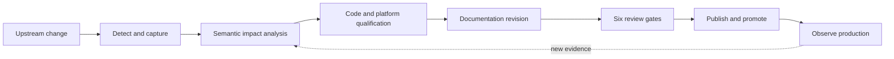
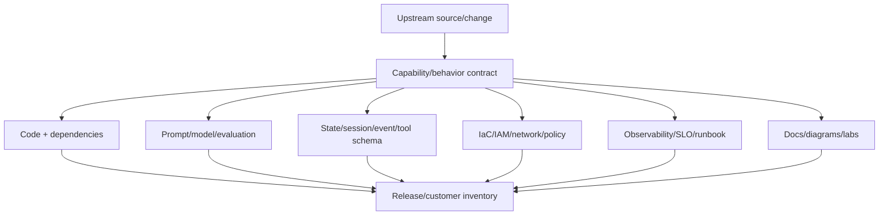

# Volume 10 — Evolution and migrations

> [!CAUTION]
> **Status: Draft lifecycle system — not an upgrade authorization.** Revalidated
> 2 August 2026. The repository baseline records ADK Python 2.6.1 and Agent
> Platform SDK 1.163.0 from official tagged source/package evidence, but every
> customer release requires independent compatibility and product qualification.
> Current July 2026 model changes include breaking request behavior and announced
> retirements. See the [evidence ledger](../../references/implementation/volume-10-evolution.md).

**Audience:** FDEs, maintainers, platform/application owners, model/evaluation
teams, security/SRE, documentation owners, customer change managers and auditors.  
**Core invariant:** upstream availability is not adoption; a change reaches
production only through impact analysis, qualification, controlled migration and
retirement evidence.

## Mission

Keep the platform and handbook correct as ADK, Agent Platform, models, APIs, service names, maturity, regions, quotas, security findings, and standards change.

## 🟢 Official Google Capability baseline

Google publishes Agent Platform release notes and official ADK releases, source, documentation, and samples. These establish upstream facts but do not identify which customer deployments or handbook claims are affected. The repository must perform that impact analysis. Primary feeds are [Agent Platform release notes](https://docs.cloud.google.com/gemini-enterprise-agent-platform/release-notes), [ADK Python releases](https://github.com/google/adk-python/releases), [ADK source](https://github.com/google/adk-python), and [ADK samples](https://github.com/google/adk-samples).

## Chapter map

| # | Chapter | Engineering outcome | Required artifacts |
|---|---|---|---|
| 1 | Upstream intelligence | Monitor authoritative docs, source, samples, releases, deprecations, and security changes | Source registry; polling jobs; ownership rota |
| 2 | Semantic impact analysis | Map an upstream change to claims, code, IaC, labs, diagrams, controls, and deployments | Dependency graph; impact report; affected-content query |
| 3 | Dependency qualification | Test new ADK, SDK, provider, Python, container, and OTel versions before adoption | Compatibility matrix; qualification pipeline; ADR |
| 4 | ADK migration engineering | Handle API, event schema, session, state, resume, tool, callback, and evaluation changes | Dual-version tests; state migration; rollback plan |
| 5 | Platform and API evolution | Manage product renames, API compatibility names, maturity transitions, location changes, and quota behavior | Naming map; capability diff; deployment audit |
| 6 | Model migration | Re-evaluate prompts, structured output, tools, safety, quality, latency, tokens, and provisioned capacity | Evaluation report; canary; fallback and retirement plan |
| 7 | In-flight compatibility | Upgrade without corrupting durable executions, events, artifacts, approvals, or audit evidence | Version envelope; routing strategy; reconciliation lab |
| 8 | Handbook publication lifecycle | Move Proposed through Approved and Superseded using evidence and review gates | Status automation; stale-content report; release notes |
| 9 | Deprecation and retirement | Remove endpoints, agents, tools, identities, state, data, infrastructure, and documentation safely | Consumer inventory; retirement runbook; deletion evidence |

## Living knowledge loop



## 🟡 Enterprise Architecture Recommendation

Do not automatically rewrite handbook prose from release-note text. Automation should detect, link, age, and scope changes; accountable engineers decide semantic impact, update implementations, and re-run review gates.

## Change severity

| Severity | Example | Required response |
|---|---|---|
| Critical | Security issue, retired endpoint, data exposure, broken auth | Immediate containment; affected content unapproved; customer notification path |
| High | Breaking API/schema change, model shutdown, regional removal | Block promotion; migration issue and compatibility testing |
| Medium | New GA capability, behavior change, quota or limitation update | Scheduled impact review and architecture reassessment |
| Low | Clarification, sample improvement, non-semantic rename | Verify references and update during normal cycle |

## Exit criteria

Every Approved chapter has an owner, source dependencies, next-review date, and automated freshness signal; a release change can be traced to affected content and deployments; migrations include rollback and in-flight compatibility; and superseded guidance is clearly retained or retired without broken inbound references.

---

## 1. Current dated baseline

| Surface | Reviewed baseline | Evidence | Warning |
|---|---|---|---|
| Python | `>=3.12`; exact minor selected per app | [versions.json](../../references/versions.json) | library/runtime support must be checked |
| Google ADK Python | `2.6.1`, tag commit `740582e...` | [official tag](https://github.com/google/adk-python/tree/v2.6.1) | main branch is not release evidence |
| Agent Platform Python SDK | `google-cloud-aiplatform==1.163.0` | [official release](https://github.com/googleapis/python-aiplatform/releases/tag/v1.163.0) | legacy identifiers/API paths can remain |
| Agent Starter Pack | `0.41.3`, reviewed commit | [official tag](https://github.com/GoogleCloudPlatform/agent-starter-pack/tree/v0.41.3) | sample/template is not customer qualification |
| Terraform/provider | `1.15.8` / Google provider `7.42.0` | [versions.json](../../references/versions.json) | module/provider constraints are stack-specific |
| Agent Platform docs | observed 2 August 2026 | [release notes](https://docs.cloud.google.com/gemini-enterprise-agent-platform/release-notes) | current pages can change after this date |

🟢 **Official Google Fact.** Official git tags confirm ADK Python `v2.6.1` at the
recorded commit. The repository compiles the Volume 3 graph against the installed
release during qualification. This demonstrates selected local API compatibility,
not the correctness of every integration or customer workload.

🟢 **Official Google Fact.** The 22 April 2026 platform release renamed Agent
Engine to Agent Runtime while compatibility identifiers such as
`ReasoningEngine` remain documented. Renaming prose must not rename stable API,
IAM, Terraform, metric or log identifiers without evidence.

## 2. Upstream intelligence and ownership

Monitor at least:

- Agent Platform, Gemini Enterprise and relevant Google Cloud release notes;
- feature, location, data-residency, quota, SLA and deprecation pages;
- ADK documentation, official source tags/releases and migration guidance;
- SDK/provider/module/runtime/container releases and support policies;
- model cards/specifications, lifecycle, safety and pricing pages;
- Gateway/Identity/Registry/Model Armor/SCC security changes;
- OpenTelemetry semantic conventions/exporter changes;
- CVEs/security advisories, artifact scanner and dependency notices; and
- customer support advisories, contracts and approved exception dates.

[`references/sources.json`](../../references/sources.json) records source owner,
tier, last verification and review interval. A rota reviews high-volatility feeds
weekly and critical security/retirement notices immediately. Automation checks
freshness and links; an engineer reviews semantics.

### 2.1 Change intake record

```yaml
change_id: upstream-YYYYMMDD-NNN
source_id: agent-platform-release-notes
observed_at: RFC3339
published_at: RFC3339_OR_UNKNOWN
old: EXACT_VALUE
new: EXACT_VALUE
surfaces: [model-api, request-schema]
type: breaking|deprecation|retirement|security|maturity|region|quota|behavior|rename
official_urls: [URL]
owner: ROLE
initial_severity: high
affected_assets: []
affected_customers: PRIVATE_INVENTORY_REFERENCE
containment_or_due_date: DATE
```

Do not ingest page text into production configuration automatically. Preserve the
source/date/hash or diff where licensing and policy allow, then interpret it.

## 3. Current 2026 change examples

These examples teach impact analysis and must be rechecked.

### 3.1 July model breaking behavior

🟢 **Official Google Fact.** The 21 July 2026 Agent Platform release notes announce
Gemini 3.6 Flash and 3.5 Flash-Lite GA and list potentially breaking behavior:
some custom sampling values are ignored, some penalty parameters error, and a
request whose final turn is model output is rejected. A “newer compatible model”
assumption is therefore unsafe.

Impact questions: Which clients set those parameters? Do ignored parameters
change evaluation behavior? Can sessions/resume emit a model-final last turn? Do
ADK adapters normalize it? Are structured outputs/tool calls/safety/tokens/
latency/capacity different? Which prompts and evaluators need recalibration?

### 3.2 Model retirements

🟢 **Official Google Fact.** Current model lifecycle pages publish release,
retirement and replacement information; open MaaS deprecation pages state that a
retired model endpoint becomes unavailable. On 21 July 2026 several open MaaS
endpoints were deprecated with 21 October 2026 retirement dates. Treat the live
page—not this snapshot—as authority.

### 3.3 SDK migration

🟢 **Official Google Fact.** Current Gemini migration guidance states that Vertex
AI SDK releases after June 2026 will not support Gemini and directs new Gemini
features toward the Google Gen AI SDK. This may affect model client code while
Agent Runtime resource management remains in the Agent Platform SDK. Inventory
imports and responsibilities rather than replacing one package name globally.

### 3.4 Capability maturity and API coexistence

June 2026 releases moved Gateway/Observability capabilities to GA while other
modes and APIs remain Preview; Agent Identity APIs have migration/coexistence
details; runtime revisions/traffic remain Preview. Maturity transitions trigger
reassessment, not automatic architecture change. Preview acceptance and exit
plans remain until the exact selected capability graduates and is requalified.

## 4. Semantic impact graph



For each source ID, map handbook claims, source files, tests, dependency locks,
containers, Terraform modules, policies, APIs, model IDs, prompts/evaluators,
workflow/state/event/tool versions, dashboards/alerts/runbooks, labs and customer
release manifests. Exact customer inventories are private references.

The local [`affected_assets`](../../examples/python/fde-production-kit/src/fde_kit/evolution.py)
shows deterministic map expansion from source and changed surface. Production
systems need an owned SBOM/dependency/asset graph, not a repository text search alone.

## 5. Severity and response

| Severity | Criteria | Initial SLA/response is customer-defined |
|---|---|---|
| critical | exploited/security exposure, removed endpoint, broken auth, data/action corruption | contain, mark affected releases/content unqualified, incident/customer path |
| high | breaking API/schema, imminent retirement, region/terms loss, state incompatibility | block promotion; migration owner and deadline |
| medium | GA/Preview change, behavior/quota/limitation, recommended migration | scheduled assessment and qualification |
| low | clarification, sample/docs change, non-semantic name | verify dependency and normal publication |

[`classify`](../../examples/python/fde-production-kit/src/fde_kit/evolution.py)
conservatively marks security/removal critical and state/session/resume/auth/tool/
runtime API changes high. Customer exposure, exploitability, retirement date and
business impact can raise severity. A product becoming GA is not automatically low risk.

## 6. Dependency qualification

Create an isolated candidate branch and immutable dependency lock. Never test
unreleased `main` in production unless the customer intentionally accepts that
supply-chain risk and support model.

Qualification layers:

1. install/build/import and package metadata/license;
2. unit/type/lint/static/security and dependency resolution;
3. API/serialization/tool/event/session/state/resume compatibility;
4. graph/workflow cancellation, concurrency and failure behavior;
5. auth/IAM/Gateway/Registry/network and runtime deployment contract;
6. deterministic, golden, trajectory, safety and adversarial evaluation;
7. latency/token/cost/load/quota/telemetry comparison;
8. restore, in-flight migration, rollback/roll-forward and reconciliation;
9. artifact/SBOM/provenance/vulnerability and promotion; and
10. documentation/runbook/support/skills changes.

Test current and candidate in the same harness/data/environment where possible.
Record expected differences. A green import test or successful API call does not
qualify model quality or durable execution compatibility.

## 7. ADK migration engineering

Inventory imports, agent/workflow classes, runners, events, callbacks/plugins,
tools/MCP/A2A, session/memory/artifact services, auth, evaluation, telemetry and
deployment wrappers. Read official release notes, migration docs and tagged diff.

### 7.1 Dual-version contract suite

Feed the same normalized cases into old and candidate releases and compare:

- graph construction and node/routing semantics;
- event ordering, IDs, actions, content/parts and serialization;
- session create/get/list/append and ownership/concurrency;
- checkpoint/resume/cancellation and long-running execution;
- function/tool schema generation, coercion, errors and retries;
- callbacks/plugins/auth context and side effects;
- artifacts/memory references and deletion;
- trace span names/attributes/content events and metrics;
- evaluation input/output and trajectory; and
- Agent Runtime packaging, deployment and invocation.

Normalize intentionally unstable fields such as timestamps and generated IDs,
but never normalize away semantic differences. Preserve fixtures representing
real supported state versions with approved synthetic data.

## 8. Version envelope and in-flight compatibility

Every durable execution carries an envelope:

```json
{
  "release": "agent-2026-08-02.1",
  "workflow_schema": 3,
  "event_schema": 4,
  "state_schema": 2,
  "tool_contract": 7,
  "approval_digest_schema": 3,
  "model_profile": "case-summary-v5",
  "policy_version": "policy-19"
}
```

The shared `VersionEnvelope` rejects a workflow-topology change without an event
boundary and a tool-contract change without an approval-digest change. A real
compatibility matrix is richer and explicitly lists which release can read,
write, resume, route and retire each version.

### Migration strategies

- **drain:** old release finishes old work; new release accepts new work;
- **version route:** envelope routes each session/event to a compatible revision;
- **read old/write new:** candidate migrates on write with reversible marker;
- **offline migration:** pause admissions, backup, transform, verify, resume;
- **dual read/shadow:** compare candidate without committing effects;
- **abandon/manual:** explicitly terminate unsafe old work and route humans.

Never let a traffic splitter decide state compatibility. Direct revision calls,
queues, scheduled work and callbacks can bypass root traffic rules. Inventory
every ingress and in-flight path.

## 9. State and schema migration

Migration plan includes source/target schema, invariants, volume, access pattern,
backup/restore, dry run, validation queries, batch/checkpoint rate, concurrency,
dual-read/write period, error/quarantine path, rollback boundary, RTO/RPO,
monitoring, owner and deletion/retention.

Use expand-and-contract where possible: add compatible fields/readers, deploy
dual-capable code, migrate/backfill, verify, switch writers, observe, then remove
old paths in a later release. Do not conflate session, workflow, memory, cache,
operation ledger, business state, evaluation or audit migrations.

Approval hashes and idempotency keys are versioned. If tool semantics or canonical
serialization changes, old approval cannot authorize the new action. Unknown
writes are reconciled against the business system before replay or migration.

## 10. Model migration

Changing a model is an application release even when the endpoint string is the
only code diff. Freeze current/candidate IDs and profiles. Review specification,
regions, lifecycle, safety, input/output modalities, context, structured output,
function calling, parameters, token accounting, latency/capacity, grounding,
provisioned consumption and terms.

Evaluation covers representative languages/groups/tasks, citations/groundedness,
structured schema, tool selection/arguments/trajectory, abstention/uncertainty,
injection/exfiltration/safety, long context/multimodal, missing/conflicting data,
latency/tokens/cost and customer critical cases. Calibrate judges against experts.

Run offline → shadow → small canary → progressive traffic. Gate on quality,
safety, action invariants, latency, errors, tokens/cost and support burden. A new
model can improve average quality and regress a critical action. Preserve a
qualified fallback only while it remains available, compatible and safe.

## 11. Platform/API migration

Build an identifier map for documentation name, API service/version/resource,
SDK class, Terraform resource, IAM permission/role, organization constraint,
monitored resource/metric/log, CLI command and console label. Update only what
the official compatibility contract changes.

Before v1alpha/v1beta → v1 or legacy → new API migration compare resource names,
field defaults/required/output-only status, enum values, update masks, long-
running operations, etags/concurrency, IAM/auth audience, pagination/filter,
error/retry, quota, regional endpoint, audit logs and Terraform/provider state.

Export/read current configuration where authorized, render candidate desired
state, calculate semantic diff, test create/read/update/delete in sandbox, import
or migrate state safely, and prove rollback or roll-forward. Console success is
not API compatibility evidence.

## 12. IaC and provider migration

Pin Terraform/provider/module versions. Read upgrade guides and schemas. Run
format/validate, provider lock verification, initialization without unreviewed
upgrade, saved plan in each non-production environment, policy/security checks,
apply, drift/readback and destroy only exact disposable test resources.

Inspect state schema, resource address changes, replacement (`ForceNew`) risk,
defaults, IAM authoritative/additive semantics, beta/GA resource migration and
import. Never apply a provider update directly to production from an automatically
opened dependency pull request. Back up and protect state according to customer policy.

## 13. Observability migration

An SDK/ADK/runtime upgrade can rename spans/attributes, change default tracing,
content capture, sampling, exporter or monitored resources. Compare telemetry
goldens: trace topology, correlation, required fields, cardinality, content/privacy,
metrics and distributions, logs/audit, dashboards, SLI joins, alerts, online
evaluation filters and cost.

Run old and candidate synthetic probes. Missing series must show unknown/bad as
designed, not green. Update dashboards/alerts/runbooks atomically with deployment
or keep dual-compatible queries during migration.

## 14. Security migration

Security changes can alter authentication audience, agent identity/API, Gateway
mode, delegated-token custody, IAM permission, content template/filter, Registry
metadata, SCC finding, artifact admission or dependency vulnerability.

Threat-model the migration itself: dual APIs/credentials, temporary broad roles,
bypass endpoints, mirrored resources, stale cached decisions, rollback identities,
untrusted conversion scripts and exposed migration data. Use least privilege,
short duration, monitored exceptions, dual negative tests and explicit revocation.
Close temporary paths and prove they are closed.

## 15. Release, canary and rollback

The candidate manifest binds every version. Deploy immutable artifacts. Route
test/shadow traffic explicitly; where revisions/traffic are Preview, record terms
and direct-revision bypass. Progressive release watches business outcome, quality,
safety, authorization, target effects, SLOs, telemetry, capacity and cost.

Rollback checklist:

- Is old artifact still trusted and supported?
- Can it read current state/events/sessions and tool schemas?
- Can old prompts/model/policy coexist with changed data?
- Which approvals/idempotency keys are invalid?
- What in-flight work already crossed an irreversible boundary?
- Will telemetry and alerts still work?
- Must we roll forward data before code can roll back?

Use business-action kill switches independent of code rollback. Reconcile already
committed effects; compensation is a new authorized business action.

## 16. Handbook lifecycle

Statuses:

| Status | Meaning |
|---|---|
| Draft | researched/implemented but not independently/customer approved |
| Proposed | complete evidence submitted for review |
| Approved | scope/version/date/owners and reviews accepted |
| Superseded | replaced but retained for traceability/migration |
| Retired | no supported use; inbound links redirected/archive retained per policy |

Approval requires source freshness, code/tests, diagrams, security/privacy/data,
SRE/cost, customer/FDE usability and editorial/link review. Publication records
release notes, migration impact, sources, reviewed versions and limitations.
Never label the repository production-approved because local unit tests pass.

## 17. Deprecation and retirement

Start before the vendor deadline. Inventory consumers, owners, environments,
traffic, identities, state/events/data, downstream tools, dashboards/alerts,
support/contracts and retention. Publish migration and stop-new-use dates. Test
replacement and coexistence, migrate in waves, monitor, freeze old entry, drain or
route in-flight work, reconcile effects, then retire.

Retirement evidence includes zero authorized traffic for an agreed period,
disabled endpoints/routes/agents/tools, revoked identities/secrets/policies,
removed Registry entries and permissions, archived required artifacts/evidence,
exported/deleted state/data according to retention and legal hold, released quota/
capacity, updated docs/runbooks/inventory and customer owner acceptance.

Do not broadly delete projects, shared networks, keys, evidence buckets or state.
Use exact-resource plans and preserve recoverability/records requirements.

## 18. Emergency change

For active security/retirement incidents: establish incident command; identify
exposure and affected releases; contain the narrow action/identity/route/version;
preserve approved evidence; notify customer decision owners; qualify the smallest
safe patch/fallback; deploy progressively when possible; reconcile business
effects; then complete full review retrospectively within customer policy.

Emergency authority is time-bound, logged and cannot silently become a permanent
exception. Speed changes review sequencing, not truth or ownership.

## 19. CI and automation

[The Volumes 4–10 CI workflow](../../.github/workflows/volumes-4-10-ci.yml) runs
dependency-free unit tests, source/reference checks and qualification schema tests.
The repository version checker compares selected package baselines with configured
indexes. Customer CI adds dual-version matrices, online sandbox integration,
evaluation, IaC plans, artifact/SBOM/provenance, state migration and canary gates.

Automation may open issues/PRs, identify stale sources, produce semantic diffs and
run tests. It must not automatically approve maturity, migrate customer state,
change model IDs, widen IAM, apply production IaC or delete retired resources.

## 20. Common mistakes

### Implementation artifact map

🔵 **Field Pattern.** [`fde_kit.evolution`](../../examples/python/fde-production-kit/src/fde_kit/evolution.py)
implements typed severity, impact and version-envelope checks. Terraform/provider/
module locks live with the [Volume 2 stack](../../terraform/volume-2-platform/README.md);
candidate locks are qualified in isolation before a saved plan. [Cloud Build](../../delivery/volumes-4-10/cloudbuild.yaml)
and [GitHub Actions](../../.github/workflows/volumes-4-10-ci.yml) run reference and
compatibility gates. Cloud Deploy promotes a candidate digest only after dual-
version, state, evaluation, canary and rollback/roll-forward evidence; it never
changes a model or dependency simply because an upstream release exists.

- Updating to `main` or unpinned package because a fix is needed.
- Treating SemVer or import success as state/tool/model compatibility.
- Changing a model ID without full evaluation and capacity review.
- Renaming real API/IAM/metric identifiers after a product marketing rename.
- Assuming GA transition means identical behavior or automatic architecture benefit.
- Waiting until retirement week to inventory consumers and provision capacity.
- Applying provider dependency PRs directly to production.
- Migrating active sessions without version routing or drain strategy.
- Reusing approvals after canonical tool semantics change.
- Rolling back code over incompatible data/events or irreversible effects.
- Losing dashboards/SLOs because telemetry defaults changed.
- Automatically rewriting handbook claims from release notes.
- Deleting old state/evidence before retention, hold and recovery approval.

## 21. Production checklist

- [ ] Every upstream source has owner, cadence, last/next review and failure alert.
- [ ] Change intake records exact source/date/type/deadline and semantic diff.
- [ ] Dependency graph maps claims, code, IaC, policies, models, state, ops and customers.
- [ ] Severity and containment are customer-impact based.
- [ ] Current/candidate immutable locks and artifacts are retained.
- [ ] Dual-version tests cover API, event, session, state, resume, tools, auth and telemetry.
- [ ] Model migration passes representative, critical, adversarial, latency/token/cost gates.
- [ ] In-flight work has version envelope, route/drain/migrate and reconcile plan.
- [ ] IaC/provider plan identifies replacement/state/import and rollback risk.
- [ ] Canary and business-action kill switch cover direct and queued ingress.
- [ ] Docs/runbooks/dashboards/alerts/support/training change with release.
- [ ] Retirement proves zero use, revocation, retention-safe cleanup and owner acceptance.

## 22. Architecture decision record

**Decision:** Maintain a source-owned change registry, semantic dependency graph,
dual-version qualification, explicit version envelopes, progressive migration and
evidence-based retirement.

**Context:** ADK, Agent Platform, models, APIs, product names, identity, telemetry,
regions and quotas evolve independently. Customer workflows can stay in flight
across releases and perform irreversible actions.

**Consequences:** Upgrades are product releases with owners and evidence. Old/new
paths coexist temporarily. State schemas and approvals are versioned. Automation
detects but does not make semantic or production decisions.

**Validation:** Inject a security change, ADK event change, model breaking request,
provider replacement, telemetry rename and endpoint retirement; trace affected
assets; qualify dual versions; migrate in-flight work; canary; rollback/forward;
reconcile; retire and audit evidence.

**Revisit when:** source volume, customer inventory, platform release mechanisms,
state architecture, contractual support or change frequency requires stronger tooling.

## 23. FDE migration notebook

For every upgrade answer: why now; deadline/security/value; exact old/new; official
evidence; affected customers/actions/data/state; incompatible behavior; current/
candidate quality/SLO/cost; capacity; migration/rollback boundary; in-flight route;
retirement; owners; and observation that would halt rollout.

“Latest” is not a rationale. Good reasons include security support, approaching
retirement, required capability, measured quality/cost improvement or reducing an
accepted Preview dependency. A stable supported baseline can remain pinned while
qualification proceeds.

## 24. Qualification lab

Run [the Volume 10 lab](../../labs/volume-10-evolution/README.md). The exercise
simulates an ADK event change plus model retirement. Engineers update the source
record, map impacts, run current/candidate tests, reject an incompatible envelope,
route old sessions, canary synthetic traffic, handle a bad quality segment,
reconcile a write, update docs/runbooks and retire the old dependency without
deleting required evidence.

## 25. Operations checklist

- [ ] On-call knows deployed dependency/model/policy/workflow versions from a request.
- [ ] Deprecation deadlines and source freshness appear in owned work queues.
- [ ] Unsupported/revoked old revisions cannot be invoked directly or from queues.
- [ ] Version routing and reconciliation cover in-flight and callback paths.
- [ ] Telemetry migration gaps cannot report healthy by absence.
- [ ] Emergency paths and temporary permissions expire.
- [ ] Post-migration value, quality, SLO, cost and support burden are reviewed.

## 26. Official references

- [ADK Python source at the exact v2.6.1 commit](https://github.com/google/adk-python/tree/740582e9f283cd23ff5cec1389400b422513f765)
- [Agent Platform Python SDK source at the exact v1.163.0 commit](https://github.com/googleapis/python-aiplatform/tree/6845eaf9c5513198f6eba11d2c091a4a29c35565)
- [Agent Platform release notes](https://docs.cloud.google.com/gemini-enterprise-agent-platform/release-notes)
- [Model versions and lifecycle](https://docs.cloud.google.com/gemini-enterprise-agent-platform/models/model-versions)
- [Open model deprecations](https://docs.cloud.google.com/gemini-enterprise-agent-platform/models/deprecations/open-models)
- [Migrate to latest Gemini models](https://docs.cloud.google.com/gemini-enterprise-agent-platform/models/migrate)
- [ADK Python releases](https://github.com/google/adk-python/releases)
- [ADK Python source at v2.6.1](https://github.com/google/adk-python/tree/v2.6.1)
- [Agent Platform Python SDK releases](https://github.com/googleapis/python-aiplatform/releases)
- [Agent Platform framework support policy](https://docs.cloud.google.com/gemini-enterprise-agent-platform/machine-learning/framework-support-policy)
- [Agent Runtime revisions and traffic](https://docs.cloud.google.com/gemini-enterprise-agent-platform/scale/runtime/manage-revisions-and-traffic)
- [Implementation evidence ledger](../../references/implementation/volume-10-evolution.md)

## 27. Handbook completion and living operation

Volumes 1–10 now form one delivery loop: qualify the outcome; build the platform;
engineer the ADK application; place and release the runtime; govern security;
operate reliability; use dated references; apply customer industry controls;
deliver and transfer; then evolve or retire. Completion of this draft means the
repository has a production-shaped method and executable local controls. It does
not mean any customer deployment is approved. Each qualification record starts false.
