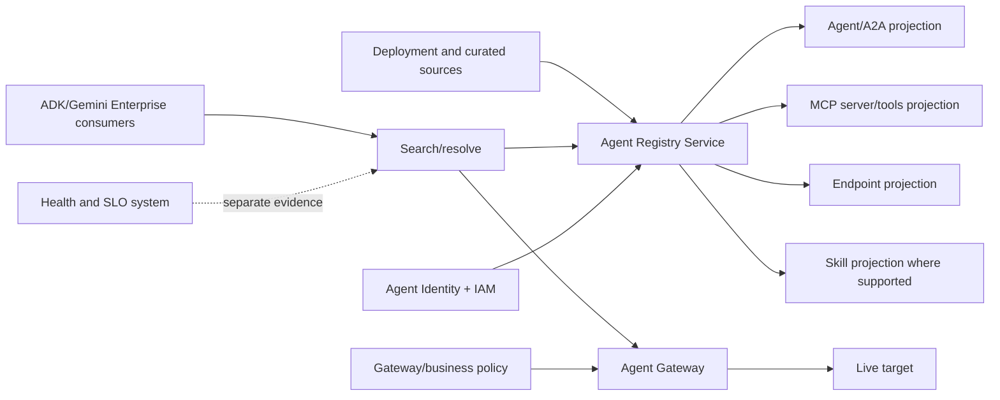
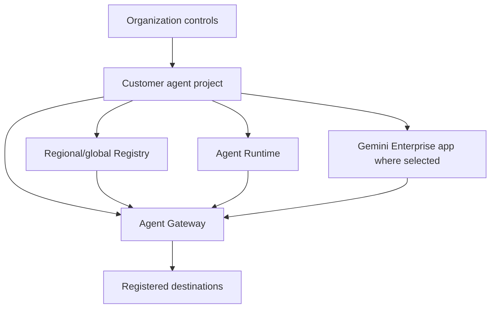
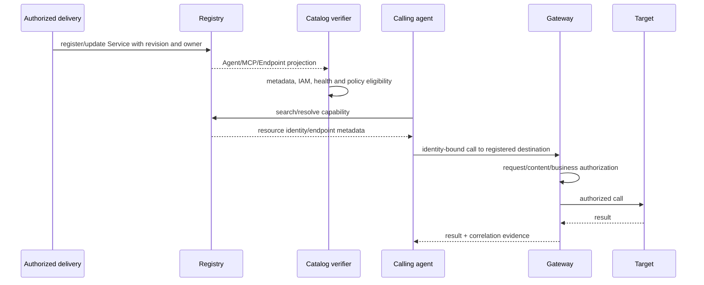
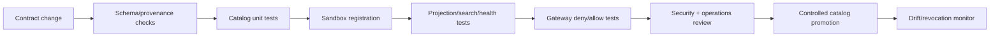
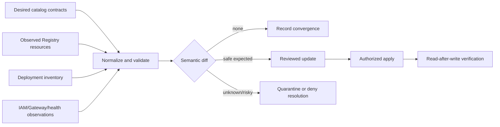
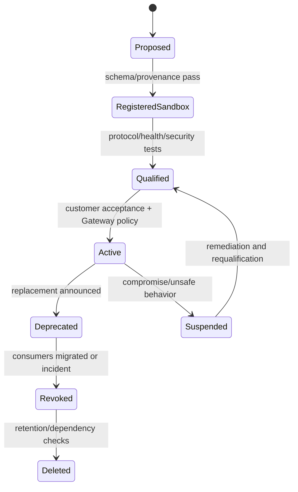

# Volume 11 — Agent Registry production engineering

> [!CAUTION]
> **Status: complete draft, not production authorization.** Revalidated 2 August
> 2026. Agent Registry is a catalog/governance control plane; registration does
> not prove endpoint health, business authorization, safety or customer approval.
> Production use requires the fail-closed evidence record and independent reviews.

**Audience:** forward deployed engineers, platform/catalog owners, agent and MCP
teams, security, SRE, enterprise architects and customer change authorities.  
**Invariant:** an agent can discover only an owned, current, policy-eligible
resource, and discovery never silently becomes authorization.

## Executive outcome

Agent Registry is the enterprise catalog for agents, MCP servers/tools, endpoints
and supported skills. Google describes automatic and manual registration, search,
bindings and ADK resolution in the [Agent Registry overview](https://docs.cloud.google.com/agent-registry/overview).
The Registry API is enabled per project and Registry data does not migrate when a
project changes, according to [setup](https://docs.cloud.google.com/agent-registry/setup).

This volume turns that capability into an operating system: catalog ownership,
provenance, metadata review, IAM separation, location/topology decisions, health
overlay, Gateway mediation, drift detection, revocation and recovery.

### Evidence legend

- 🟢 **Official Google capability:** directly supported by the linked current doc,
  API, tagged source or Google-owned sample.
- 🟡 **Enterprise recommendation:** a production choice the customer must review.
- 🔵 **FDE field pattern:** a reusable delivery method, not a Google product promise.

## Customer problem and discovery

Without a governed catalog, teams hard-code URLs, copy OAuth secrets, cannot tell
which “orders agent” is authoritative, and keep invoking retired tools. Registry
addresses discovery and governance metadata, but the FDE must establish trust.

Ask and record:

1. Which agents, A2A skills, MCP servers/tools, REST endpoints and standalone
   skills exist; who owns each resource and its incident path?
2. Which registrations are automatic, manually curated or imported; what source
   proves deployment revision and protocol contract?
3. Which project/location owns the catalog, and how does it align with Runtime,
   Gateway and Gemini Enterprise?
4. Who may create/edit/delete metadata and bindings? Can an agent edit its own
   destructive annotations?
5. What makes a resource searchable, eligible, healthy, deprecated or revoked?
6. How quickly must consumers stop resolving a compromised destination?
7. Which customers/tenants may discover the resource, and which may invoke it?
8. What audit, retention, CMDB and change-management evidence is required?

Deliver a catalog inventory, topology ADR, metadata schema, IAM matrix, lifecycle,
health contract, policy/binding matrix, SLOs, runbooks and migration plan.

## Capability and maturity baseline

| Surface | Baseline on 2026-08-02 | Engineering consequence |
|---|---|---|
| Central catalog | 🟢 agents, MCP servers/tools, endpoints and skills are modeled | normalize ownership and provenance |
| Setup | 🟢 project-level API `agentregistry.googleapis.com` | project change is a rebuild/migration exercise |
| Data model | 🟢 writable `Service`; query projections include `Agent`, `McpServer`, `Endpoint` | do not patch read-only projections |
| Registration | 🟢 automatic and manual paths | record provenance; reconcile rather than duplicate |
| Search | 🟢 keyword/search surfaces; exact skill features vary by maturity | gate exact feature, region and release |
| Bindings/endpoints | 🟢 documented; `us`/`eu` multi-region restrictions apply | choose supported regional/global topology |
| ADK resolution | 🟢 documented `AgentRegistry` integration; current page requires ADK `>=1.29.0` | repository pin 2.6.1 satisfies version floor, not cloud qualification |
| Registry MCP server | 🟢 IAM principal required; API keys are not the documented auth | use workload/user IAM, not embedded keys |

Recheck the live [concepts](https://docs.cloud.google.com/agent-registry/concepts),
[data model](https://docs.cloud.google.com/agent-registry/data-model), [locations and
bindings](https://docs.cloud.google.com/agent-registry/manage-bindings), and
[release notes](https://docs.cloud.google.com/gemini-enterprise-agent-platform/release-notes)
before every customer design review.

## Architecture boundaries



Registry answers “what resource and metadata are cataloged?” Gateway/IAM answer
“may this interaction proceed?” Health probes answer “is it currently usable?”
Business policy answers “may this user/agent perform this method with these
parameters?” Keep all four decisions independently observable.

### Project and regional topology



🟡 Select topology from the current Gateway/Registry/app location matrices and
document data/control-plane implications. Do not assume `us` or `eu` multi-region
support for Registry endpoints/bindings. A project switch does not migrate data.

### Registration and invocation sequence



## Resource contract

Every cataloged service needs a source-controlled contract:

```yaml
catalog_contract_version: 1
resource_name: orders-agent
kind: agent
protocol: a2a
owner: orders-platform
security_owner: enterprise-agent-security
incident_service: orders-agent
source_revision: 0123456789abcdef
deployment_resource: projects/PROJECT/locations/REGION/reasoningEngines/ID
location: us-central1
endpoint: https://example.com
capabilities:
  - id: lookup-order
    data_classification: confidential
    side_effect: none
  - id: cancel-order
    data_classification: restricted
    side_effect: irreversible
maturity: ga
consumers: [employee-assistant]
gateway_policy: orders-agent-v7
health_contract: orders-agent-slo-v3
review_by: 2026-09-01
```

🟡 Never use descriptions as the only authorization input. Tool annotations such
as read-only/destructive hints influence orchestration but can be modified by
Registry editors. Google warns that editor/admin access can alter critical
metadata in [roles and permissions](https://docs.cloud.google.com/agent-registry/roles-permissions).
Enforce side-effect and parameter rules in Gateway/application policy.

## Registration patterns

### Automatic registration

Use automatic registration for supported deployed services, then reconcile the
generated projection with source control and deployment inventory. An automatic
record is authoritative about platform discovery, not about customer ownership,
approval or health.

For supported Google remote MCP servers, enabling the relevant API can register
the server. GKE MCP registration uses documented labels/annotations and Workload
Identity configuration; follow [register MCP servers](https://docs.cloud.google.com/agent-registry/register-mcp-servers)
exactly. Treat cluster annotations as controlled deployment configuration.

### Manual registration

Use the writable `Service` representation for a custom/external target and query
the projected resource after creation. Validate HTTPS URI, protocol, owner,
location, source revision, authentication expectation, capabilities and lifecycle.
The [registration quickstart](https://docs.cloud.google.com/agent-registry/quickstart-register-agent)
is a mechanics reference, not the production approval process.

### Endpoint and binding constraints

An endpoint is a target URL for a REST API. The official [endpoint guide](https://docs.cloud.google.com/agent-registry/register-endpoints)
and [binding guide](https://docs.cloud.google.com/agent-registry/manage-bindings)
state that these are not supported in `us`/`eu` multi-regions. Validate the live
supported location and do not “fall back” to an unreviewed region.

## Search, resolution and orchestration

Search is user/developer discovery; runtime resolution must be deterministic:

- constrain kind, project/location, owner, maturity and policy eligibility;
- reject zero or multiple authoritative results;
- retain Registry resource name and source revision in traces;
- apply bounded cache TTL and a revocation invalidation mechanism;
- probe health separately and fail over only to an equivalent approved target;
- route production invocation through Gateway where the topology supports it.

The official [ADK resolution guide](https://docs.cloud.google.com/agent-registry/resolve-endpoints-and-build-orchestrators)
documents dynamic Registry resolution. The reviewed ADK baseline is pinned in
[`references/versions.json`](../../references/versions.json); source version and
cloud service behavior must both pass qualification.

Google publishes reusable public skills in [google/skills at reviewed commit
`41f503f`](https://github.com/google/skills/tree/41f503f7d7f878bf77f0700487d60cf0490d72fd).
🟢 This is official Google-owned source. 🟡 It is not automatically customer-safe:
pin, review instructions/scripts/dependencies, evaluate, and admit it like code.

## IAM and separation of duties

| Actor | Needed action | Control |
|---|---|---|
| catalog viewer | list/get/search | viewer/custom least privilege |
| registration pipeline | create/update selected Service resources | narrow editor path with change review |
| catalog administrator | service/permission administration | separate, time-bound privileged group |
| calling agent | resolve allowed resources | per-agent identity and least privilege |
| gateway | resolve/match destination and enforce | service identity, policy and logs |
| auditor | read config/audit evidence | read-only independent role |

🟡 Do not grant Registry editor/admin roles directly to runtime agents. Separate
registration from invocation, require peer review for capability/endpoint/owner/
destructive-hint changes, and alert on privileged writes. Use IAM allow/deny and,
where supported and approved, organizational controls; never embed API keys for
the Registry MCP server—the [official guide](https://docs.cloud.google.com/agent-registry/use-agentregistry-mcp)
requires an IAM principal.

## Security engineering

| Threat | Prevent/detect/recover control |
|---|---|
| poisoned endpoint | reviewed provenance, HTTPS, Gateway policy, health and owner verification |
| misleading capability/tool metadata | schema/policy validation; business rules outside metadata |
| confused deputy | per-agent/user/tenant context; method/parameter authorization |
| catalog enumeration | least-privilege visibility and audit |
| stale destination | TTL, deployment reconciliation, revoke test |
| unauthorized edit/delete | separated IAM, audit alerts, immutable desired state |
| cross-region/data-policy breach | topology admission against live docs/ADR |
| supply-chain skill/tool | pinned source, review, sandbox/evaluation, SBOM |

The local [`registry.py`](../../examples/python/fde-production-kit/src/fde_kit/registry.py)
rejects duplicate/unowned/insecure/protocol-invalid/preview entries and invalid
bindings. It is an example admission layer; production calls still use official
client libraries from the [client library reference](https://docs.cloud.google.com/agent-registry/reference/libraries).

## Reliability and observability

Define customer SLOs for successful eligible resolution, freshness/revocation
convergence and catalog correctness. Suggested SLIs:

- eligible unique resolutions / eligible attempts;
- p50/p95/p99 search and resolve latency;
- stale/ownerless/duplicate/invalid resources;
- endpoint health by separately measured probe;
- deployment-to-registration and revoke-to-denial delay;
- unauthorized write/delete count;
- cached resolution age and Gateway unmatched-destination denies.

Correlation fields: trace/request ID, Registry resource name/kind/location,
source revision, calling principal/agent, policy version, resolved destination
identifier, cache status and decision—not tokens, secrets or sensitive payloads.

### Failure matrix

| Failure | Detection | Safe behavior | Recovery |
|---|---|---|---|
| Registry unavailable | resolve error/latency burn | bounded approved cache or deny, per ADR | restore service path; reconcile freshness |
| zero result | resolver counter | deny and operator-visible error | repair registration/policy |
| duplicate result | uniqueness validator | deny ambiguity | quarantine/rename/delete reviewed duplicate |
| endpoint unhealthy | probe/invocation SLI | do not mark catalog healthy | target recovery or approved equivalent |
| malicious edit | audit/change diff | revoke route/binding, freeze writes | restore reviewed desired state |
| project migration | migration checklist | no implicit switch | export/recreate/rebind/retest explicitly |

Back up source-controlled desired state, ownership, policy/binding intent and
resource mappings. Do not describe Registry as a business database backup. Test
reconstruction in a new authorized sandbox and preserve identity/name changes.

## CI/CD and promotion



Required promotion evidence: exact revision, API/location check, planned diff,
IAM review, metadata and side-effect review, endpoint/protocol conformance,
health/load test, Gateway policy tests, negative discovery/invocation tests,
rollback/revoke exercise and accountable acceptance. Never let CI automatically
delete a shared production registration from a branch deletion.

Run locally:

```bash
PYTHONPATH=examples/python/fde-production-kit/src \
  python3 -m unittest examples/python/fde-production-kit/tests/test_registry.py -v
python3 delivery/volumes-11-15/validate_qualification.py \
  labs/volume-11-agent-registry/qualification.example.json --production
```

The second command is expected to fail for the example.

## FDE production workshop

## Catalog lifecycle implementation playbook

### Establish desired and observed state

Maintain two related inventories. Desired state is the reviewed contract in source
control: owner, protocol, capability, side effect, location, endpoint intent,
identity, Gateway policy, maturity and retirement date. Observed state is the live
Registry `Service` and projected Agent/MCP/Endpoint/Skill resources plus deployment,
IAM, Gateway and health observations. Never overwrite desired state with observed
state automatically; reconcile differences into an approval workflow.



Reconciler rules are conservative:

- a new observed resource without an owner/contract is quarantined from production
  eligibility even if automatic registration is expected;
- disappearance does not trigger blind recreation until deployment/lifecycle intent
  is known;
- endpoint or protocol change is security-relevant and requires Gateway/health
  requalification;
- description-only change is still reviewed when orchestrators expose it to a
  model or user;
- tool/capability/side-effect change invalidates authorization and evaluation;
- owner or incident-service removal blocks promotion;
- a location/project change is a migration, never metadata maintenance.

### Registration adapter boundary

Keep official client calls behind a typed adapter. The adapter accepts only a
validated contract and returns resource name, etag/version where exposed, operation
ID and read-back projection. It sets deadlines, classifies retryable transport
errors, and never retries an ambiguous create/update without idempotency or
read-after-write reconciliation. Log resource identifiers and decision reasons,
not credentials or sensitive descriptions.

```python
from dataclasses import dataclass
from typing import Protocol

@dataclass(frozen=True)
class RegistrationResult:
    resource_name: str
    observed_kind: str
    observed_location: str
    operation_id: str | None

class RegistryAdapter(Protocol):
    def apply_service(self, contract: "ValidatedContract") -> RegistrationResult: ...
    def get_projection(self, resource_name: str) -> RegistrationResult: ...
```

This interface is illustrative. Bind it to the current official client-library/API
schema rather than copying field names from a handbook. Treat `AlreadyExists`,
concurrent etag conflict, permission denied, unsupported location and long-running
operation timeout as different outcomes. A timeout followed by successful read-back
is not a failed registration; a timeout with ambiguous state requires reconciliation.

### Environment and tenancy model

Separate development, test and production resources by project and policy boundary
where the customer landing zone requires it. Do not depend on a display-name suffix
for isolation. Decide whether tenants share a catalog from supported visibility/IAM
semantics and threat model; do not encode tenant isolation only in descriptions.

For a shared enterprise catalog, define discoverability separately from invocation:

| Dimension | Catalog control | Invocation control |
|---|---|---|
| environment | project/location/resource eligibility | Gateway route and target |
| tenant | visibility/metadata minimization where supported | verified tenant/object policy |
| user group | Registry/IAM search access | end-user authorization |
| agent | per-agent resolve permission | Agent Identity and method policy |
| capability | indexed metadata and maturity | exact tool/method/parameter rule |
| lifecycle | active/deprecated/revoked state | route disable and credential revoke |

If Registry visibility cannot meet a required confidentiality boundary, use separate
supported projects/catalogs or a customer-approved discovery service; do not publish
sensitive endpoint/capability descriptions and hope Gateway denial is sufficient.

## Lifecycle and change management



Deprecation includes replacement resource, consumer inventory, deadline, dual-run
compatibility, telemetry and notification. Revocation disables invocation first,
invalidates caches, removes bindings and credentials, then changes/deletes catalog
state. Deletion first can leave clients using cached endpoints without a visible
control-plane record. After retirement, prove no search, resolution, route, token,
traffic or business action remains.

## SLO design and capacity

Registry availability is not the application SLO by itself. For a journey with
dynamic resolution, define:

```text
eligible_resolution_success = unique eligible resolutions / eligible attempts
freshness_lag = observed_at - deployment_or_revocation_change_at
catalog_correctness = sampled correct owned entries / sampled entries
revocation_convergence = last_successful_invocation_at - revoke_requested_at
```

Budget resolution latency and failure inside end-to-end latency. Cache only after
classifying operations: read-only, low-risk calls may use a bounded last-known-good
resolution during a short control-plane outage; destructive/restricted calls may
require current Gateway/authorization evidence. The ADR must specify TTL, maximum
stale window, invalidation signal, cache key (including project/location/policy) and
behavior when identity/policy changes before TTL.

Capacity-test search cardinality, concurrent deployment registration, orchestrator
resolution bursts, pagination, large metadata, cache cold starts and audit/log
volume. Check current quotas rather than embedding numbers. Backoff with jitter on
documented retryable status only and cap retry amplification.

## Detailed incident runbooks

### Compromised or poisoned registration

1. Declare incident and freeze nonessential Registry writes.
2. Capture resource/project/location, current/previous desired state, IAM writes,
   bindings, Gateway decisions, callers, caches and target traffic.
3. Disable Gateway routes/bindings and target credentials before editing metadata.
4. Remove privileged actor access and rotate affected external credentials.
5. Identify every consumer that resolved/cached/invoked the target and reconcile
   possible data or business actions.
6. Restore reviewed metadata/endpoint, run negative and protocol/health tests,
   canary a read-only call, then reopen.
7. Publish root cause, blast radius, evidence gaps and preventive controls.

### Registry outage or regional failure

Apply the cache/degrade ADR; do not create an ad-hoc second catalog in another
region. Separate control-plane unavailability from target unavailability. Preserve
caller errors and latency, engage Google support under the customer support plan,
and test recovery read/search/resolve/binding. Reconcile registrations made by
deployment pipelines during the outage.

### Accidental bulk deletion

Stop writers and export audit evidence. Reconstruct from reviewed desired state in
dependency order, read back projections, restore only accepted bindings/routes,
invalidate old caches and execute full security/health/evaluation gates. Record any
new resource identifiers. Recovery time starts at impact, not first successful API
create, and ends only when consumers resolve correctly.

## Customer handover pack

Hand over: topology and naming ADRs; owned inventory; role/change matrix; desired-
state repository; client/reconciler contract; dashboard/alerts; privileged audit
queries; cache/revocation design; three runbooks; lab evidence; open Preview/location
exceptions; source freshness owner; monthly access/catalog review; quarterly revoke
and reconstruction exercise. Require an operator to demonstrate registration,
search diagnosis, route disable, audit attribution and recovery without the FDE.

### Thin slice

Choose one read-only customer journey: employee asks order status; orchestrator
discovers the approved orders agent; Gateway authorizes; agent returns a synthetic
result. Establish the identity/correlation chain before adding destructive tools.

### Failure and adversarial drills

Test duplicate registration, wrong region, wrong protocol, owner removal, stale
revision, poisoned description/tool hint, dead endpoint, Registry/IAM denial,
Gateway mismatch, cache after revocation and reconstruction. Measure denial and
recovery, not only happy-path discovery.

### Definition of done

- [ ] Catalog inventory and owners accepted.
- [ ] Project/location/topology checked against current docs.
- [ ] Automatic/manual provenance and resource model verified.
- [ ] Metadata schema separates description from authorization.
- [ ] IAM separates viewer, registrar, administrator, agent and auditor.
- [ ] Endpoint health, search uniqueness and protocol tests pass.
- [ ] Bindings and Gateway resolution are supported and tested.
- [ ] Drift, audit, revocation, cache and recovery drills pass.
- [ ] Qualification record has immutable external evidence for every gate.
- [ ] Research, architecture, implementation, security, operations and customer
      delivery reviews are independent and recorded.

## ADR — central catalog with mediated invocation

**Context:** enterprise agents need reusable discovery without hard-coded targets.  
**Options:** static application config; bespoke CMDB; Agent Registry alone; Agent
Registry plus Gateway/Identity/health/business policy.  
**Decision:** use Registry as catalog and supported resolution plane, with
source-controlled ownership/provenance and separate Gateway, identity, health and
business-authorization decisions.  
**Consequences:** stronger discoverability/audit and dynamic composition; added
control-plane dependency, regional design, cache/revocation and metadata governance.  
**Revisit:** feature maturity/location changes, multi-project requirements, SLO
failure, catalog compromise or unsupported consumer topology.

## FDE notebook — why this component

Use Registry when many teams/agents/tools need governed discovery and lifecycle.
Do not add it to a single static integration merely for architecture symmetry.
It reduces URL/catalog entropy; it does not make a target trustworthy by itself.
The customer outcome is faster safe reuse and revocation with accountable owners,
not “number of registered agents.”

## Official evidence and local artifacts

Production Terraform: [Agent Registry module](../../terraform/volumes-11-15-enterprise/modules/agent-registry/README.md) and [composed Volumes 11–15 stack](../../terraform/volumes-11-15-enterprise/README.md).

- [Agent Registry overview](https://docs.cloud.google.com/agent-registry/overview)
- [Setup](https://docs.cloud.google.com/agent-registry/setup)
- [Concepts and resource names](https://docs.cloud.google.com/agent-registry/concepts)
- [Data model](https://docs.cloud.google.com/agent-registry/data-model)
- [Roles and permissions](https://docs.cloud.google.com/agent-registry/roles-permissions)
- [Search agents and tools](https://docs.cloud.google.com/agent-registry/search-agents-and-tools)
- [Register MCP servers](https://docs.cloud.google.com/agent-registry/register-mcp-servers)
- [Resolve endpoints with ADK](https://docs.cloud.google.com/agent-registry/resolve-endpoints-and-build-orchestrators)
- [Gemini Enterprise Registry import](https://docs.cloud.google.com/gemini/enterprise/docs/connectors/custom-mcp-server/import-govern-mcp-server-agent-registry)
- [Official Google API definitions at reviewed commit `3f9c9d7`](https://github.com/googleapis/googleapis/tree/3f9c9d72cb20768ca4ac9f12030faaf43b13c231)
- [Implementation evidence ledger](../../references/implementation/volume-11-agent-registry.md)
- [Lab](../../labs/volume-11-agent-registry/README.md) and [operations](../../operations/volume-11-agent-registry/README.md)

## Exit criterion

A customer can register, search, resolve, govern, monitor, revoke and reconstruct
catalog resources with unique ownership and immutable evidence; unauthorized,
ambiguous, stale or unhealthy destinations do not become production invocations.
