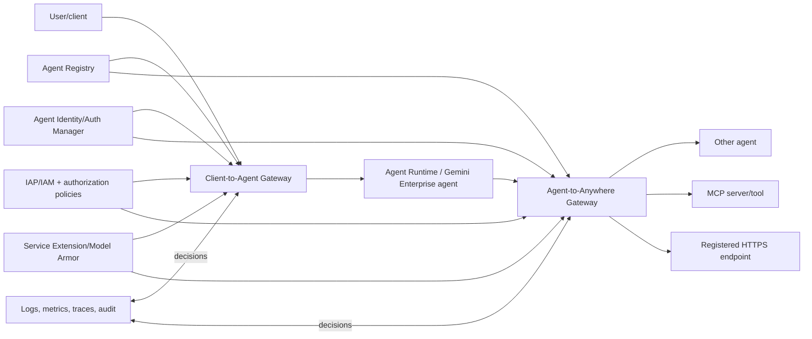
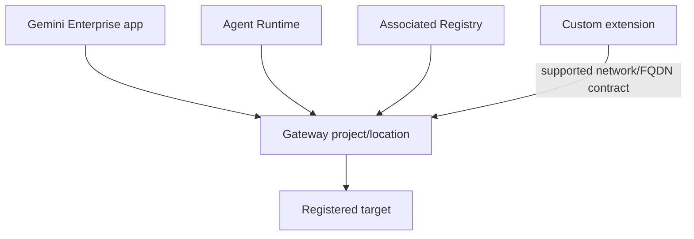
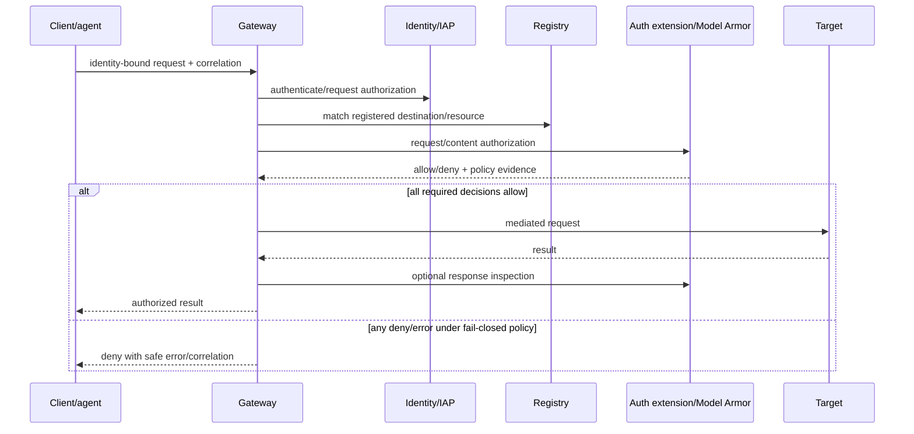
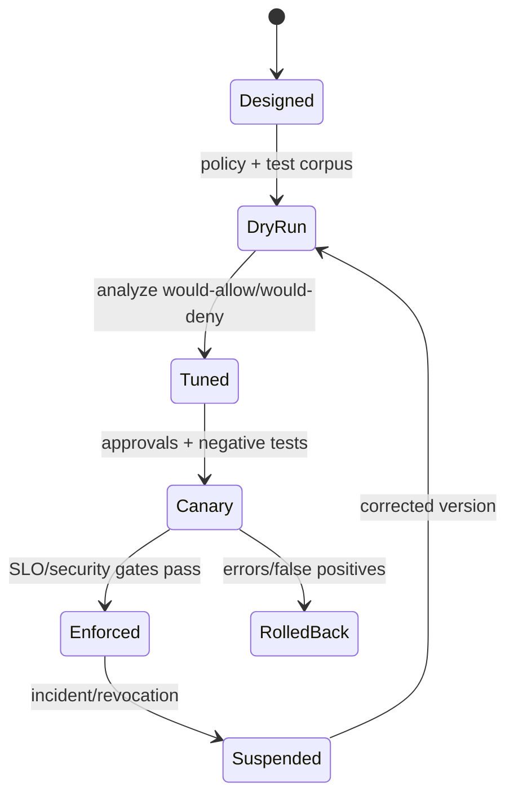
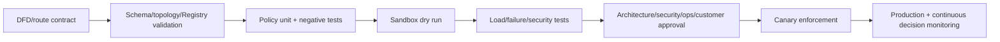
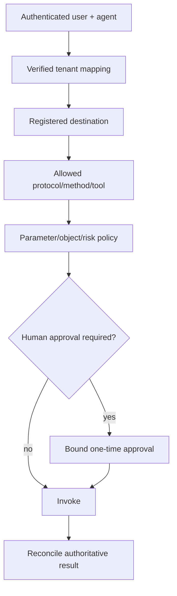

# Volume 12 — Agent Gateway production engineering

> [!CAUTION]
> **Status: complete draft, not production authorization.** Revalidated 2 August
> 2026. Agent Gateway became GA on 18 June 2026, but exact extensions, policy
> profiles, locations and integrations require live verification. No example
> fail-open setting is an enterprise default.

**Audience:** FDEs, network/platform/security teams, agent and tool owners, SRE,
SOC, enterprise architects and customer approvers.  
**Invariant:** no agentic interaction crosses a trust boundary unless its source,
destination, identity, request and—where required—content/action are authorized
and attributable.

## Executive outcome

Google defines Agent Gateway as the networking component that secures and governs
user-to-agent, agent-to-tool and agent-to-agent connectivity. It operates in two
modes: Client-to-Agent ingress and Agent-to-Anywhere egress. Read the [overview](https://docs.cloud.google.com/gemini-enterprise-agent-platform/govern/gateways/agent-gateway-overview)
and current [setup guide](https://docs.cloud.google.com/gemini-enterprise-agent-platform/govern/gateways/set-up-agent-gateway).

The production task is larger than creating a Gateway: choose topology, register
destinations, bind Agent Identity, preserve default deny, layer IAP/IAM and
request/content authorization, qualify extensions, manage dry-run-to-enforcement,
observe policy outcomes, load/failure test, reconcile actions and roll back safely.

## Evidence legend

- 🟢 official Google capability; 🟡 enterprise recommendation; 🔵 FDE pattern.
- A feature is accepted only at the exact mode/API/location/maturity documented,
  not because the product family is GA.

## Customer discovery

Map every interaction, not only networks:

| Question | Required decision |
|---|---|
| Who calls which agent/tool/agent? | source/destination/resource inventory |
| Is the path ingress or egress? | Gateway mode and placement |
| Whose authority applies? | end user, agent, service and delegated identity chain |
| Which methods/parameters/content are allowed? | policy and extension contract |
| What is destructive or material? | approval/idempotency/reconciliation boundary |
| What must never leave a location/tenant? | data/content/egress constraints |
| What happens when auth service is unavailable? | fail-closed or accepted exception |
| What are expected RPS/payload/streaming/latency? | capacity and SLO |
| Which logs may contain payloads? | privacy/retention/access design |

Deliver a trust-boundary DFD, route inventory, Registry resources, identity matrix,
authorization policy, extension SLO, content inspection, test corpus, telemetry,
incident/rollback plan and evidence record.

## Current capability baseline

🟢 The [release notes](https://docs.cloud.google.com/gemini-enterprise-agent-platform/release-notes)
mark Agent Gateway GA on 18 June 2026 and Model Armor integration GA on 24 June.
The [setup guide](https://docs.cloud.google.com/gemini-enterprise-agent-platform/govern/gateways/set-up-agent-gateway)
documents default IAP authorization, registered destinations, default-deny egress,
dry-run setup and identity/topology requirements.

| Capability | Use | Qualification question |
|---|---|---|
| Client-to-Agent | govern clients/users reaching agents | client identity, IAP/IAM, content and app auth |
| Agent-to-Anywhere | govern agent-to-agent/tool/API egress | registered target, agent identity, method/content policy |
| IAP authorization | baseline request access | exact principal and `iap.webServiceVersions.egressViaIAP` permission |
| Service Extensions | custom request/content authorization | profile, gRPC contract, location/network/SLO/failure mode |
| Model Armor | prompt/response inspection where supported | template, false positives, privacy, latency, bypass |
| Observability | Gateway logs/dashboard/scorecard | enabled storage, access, fields and alerts |

## Architecture



Gateway is not Cloud Armor. Cloud Armor filters supported load-balancer ingress
at L3–L7; Gateway governs agentic ingress/egress with Registry/Identity and
authorization context. Neither replaces application business authorization.

### Placement and project constraints



Validate exact same-project/region requirements in the current setup and Runtime
route guides. The [Runtime Gateway deployment guide](https://docs.cloud.google.com/gemini-enterprise-agent-platform/scale/runtime/agent-gateway-runtime-deploy)
requires agent and Gateway alignment and shows `identity_type=AGENT_IDENTITY` for
mediated features. Gemini Enterprise may use `us`/`eu` multi-regions while Runtime,
Registry and Gateway resources are regional; follow the documented mapping rather
than matching strings mechanically.

## Request lifecycle and decision chain



Authorization layers:

1. authenticate client/user/agent and validate proof-of-possession;
2. authorize source access to Gateway/agent through IAP/IAM;
3. require the destination to be registered and policy-eligible;
4. authorize protocol/method/tool and relevant request attributes;
5. inspect content where risk and supported capability demand it;
6. apply tenant/user/business/parameter/approval/idempotency rules;
7. authorize/inspect response and log a privacy-safe decision.

An allow in one layer never overrides a deny or missing decision in another.

## Policy contract

```yaml
gateway_policy_version: orders-egress-v7
mode: agent-to-anywhere
source_agent: REGISTRY_RESOURCE
destination: REGISTRY_RESOURCE
identity: AGENT_SPIFFE_PRINCIPAL
request:
  protocols: [mcp]
  methods: [tools/call]
  tools: [lookup_order]
content:
  model_armor_template: TEMPLATE_RESOURCE
  custom_extension: REQUEST_AUTHZ_EXTENSION
business:
  tenant_from: verified_identity_claim
  destructive_tools: deny
failure:
  auth_extension: fail_closed
  registry_unknown: deny
  identity_unknown: deny
rollout:
  dry_run_evidence: gs://EVIDENCE/policy-v7/
  canary_percent: 5
owner: orders-security
```

🟡 Keep policy under source control, require semantic diff and reject wildcard
source/destination/method/tool for production unless a bounded exception exists.
Do not use untrusted headers or model-produced tenant IDs as verified attributes.

## Delegated authorization and extensions

The [delegated authorization guide](https://docs.cloud.google.com/gemini-enterprise-agent-platform/govern/gateways/delegate-authorization)
documents request (`REQUEST_AUTHZ`) and content (`CONTENT_AUTHZ`) profiles, IAP,
Model Armor and custom Service Extensions. It also documents constraints such as
profile/protocol applicability, extension limits and processing contracts.

Production extension requirements:

- authenticated private service/network path as officially supported;
- strict schema, size/time budget and deterministic decision;
- no raw secret or unnecessary payload logging;
- bounded deadline, capacity, retries only where safe and circuit behavior;
- versioned decision reason and policy revision in logs;
- explicit fail-open/closed decision by risk class;
- load, malformed request, timeout, partial response and outage tests.

Official examples may contain `failOpen: true` to illustrate configuration. 🟡
That is not evidence to fail open for protected enterprise actions. Default to
fail closed for writes, restricted data and material decisions; document any
availability exception, compensating control, exposure window and reconciliation.

## Dry run to enforcement



Dry-run evidence must include representative legitimate, unauthorized, malformed,
cross-tenant, injected, destructive, oversized and dependency-failure traffic.
Compare intended labels to decisions. A low deny rate is not correctness.

## Identity and credential flow

Use Agent Identity for per-agent attribution where the documented flow requires or
supports it. With Gemini Enterprise and Gateway, the [Agent Identity overview](https://docs.cloud.google.com/gemini-enterprise-agent-platform/govern/agent-identity-overview)
states that end-user credentials can be encrypted by Auth Manager and decrypted at
Gateway so the agent does not receive the raw credential. Preserve user + agent +
target attribution. Do not pass tokens through prompts, tool arguments, traces or
application logs.

## Security and threat model

| Threat | Gateway control | Complementary control |
|---|---|---|
| unregistered egress/SSRF | default deny + Registry destination | private networking/DNS/endpoint controls |
| confused deputy | source/user/agent/request auth | business object authorization |
| prompt injection invokes tool | content/method/tool policy | ADK tool design, approval, minimal scopes |
| credential theft | Identity/Auth Manager/Gateway brokerage | secret inventory/rotation/no logs |
| extension bypass/outage | required profile, fail-closed, alerts | capacity and incident runbook |
| replay/duplicate write | identity/request context | idempotency key and reconciliation |
| data exfiltration | egress/content restrictions | classification/DLP/residency |
| audit evasion | Gateway/IAM/audit telemetry | protected sinks/retention/correlation |

The local [`gateway.py`](../../examples/python/fde-production-kit/src/fde_kit/gateway.py)
rejects unregistered destinations, missing Agent Identity/request/content controls,
logging gaps, production fail-open and dry-run-only routes. It is qualification
logic, not an emulation of the managed service.

## Observability and SRE

Google documents the `networkservices.googleapis.com/Gateway` monitored resource,
Gateway logs, dashboards and scorecards in [monitor Agent Gateway](https://docs.cloud.google.com/gemini-enterprise-agent-platform/govern/gateways/monitor-agent-gateway).
Logs can include MCP method/tool, matched Registry resource and extension details.
The observability dashboard may depend on the documented log bucket/analytics setup.

Required signals:

- request rate, authorized/denied/errors by mode/route/policy;
- authentication/IAP/Registry/Identity/policy/extension/downstream failure reason;
- authorization extension latency, timeout, saturation and decision distribution;
- unmatched/unregistered destination attempts;
- MCP method/tool and Registry resource, with no sensitive arguments;
- end-to-end latency and successful authorized business outcomes;
- dry-run would-deny/allow deltas and policy-version adoption.

SLOs are customer-defined. Establish availability and latency for authorized
interactions, plus a security SLO such as zero unauthorized protected actions.
Budget Gateway and extension latency inside the user journey. Alert on burn rates,
not a single global error threshold.

### Troubleshooting ladder

Use the official [troubleshooting guide](https://docs.cloud.google.com/gemini-enterprise-agent-platform/troubleshooting/troubleshoot-agent-gateway)
then isolate: DNS/network → Gateway/resource placement → Registry destination →
Agent Identity/proof → IAP permission → Gateway policy → extension/Model Armor →
target auth/network → target application. Default deny makes missing prerequisites
visible; do not loosen all policies to diagnose.

## Failure, recovery and rollback

| Failure | Safe response | Evidence/recovery |
|---|---|---|
| Registry lookup failure | deny new unknown destination; bounded approved behavior only | registry/gateway correlation and restore |
| IAP/identity denial | do not substitute shared credential | repair grant/identity after audit |
| extension timeout | protected action fails closed | capacity/rollback/extension recovery |
| Model Armor false positive | safe denial and support path | redacted sample, template tuning, canary |
| downstream timeout | bounded retry only for idempotent call | reconcile side effects before retry |
| policy bad rollout | freeze/canary rollback to reviewed version | diff, decision metrics, postmortem |
| logging loss | block high-risk launch or invoke contingency | restore sink/dashboard and backfill limits |

Back up desired configuration, Registry mappings, extension revisions, IAM and
evidence—not managed service internals. Restore to an authorized topology, replay
negative/positive tests, and reconcile in-flight writes before reopening.

## Performance and cost

Load-test payload sizes, streaming, concurrent agent/tool fan-out, extension
latency, downstream latency and deny floods. Model Gateway, extension, Model Armor,
logging and downstream costs separately using current pricing. Set budgets/quotas
and cardinality controls; never reduce security logs blindly to save cost.

## Delivery pipeline



The shared [qualification gates](../../delivery/volumes-11-15/README.md) and
[`gateway.py`](../../examples/python/fde-production-kit/src/fde_kit/gateway.py)
run in GitHub Actions and Cloud Build. Deployment must use separate least-privilege
identities, immutable artifacts, protected environments and an audited rollback.

## FDE lab and acceptance

## Gateway implementation playbook

### Build the interaction inventory

Represent each edge as a versioned route, not a network wildcard. Start from user
journeys and enumerate source principal, delegated user, tenant/environment,
Registry destination, protocol, methods/tools, data classes, side effects, approval,
idempotency, expected volume/latency and failure behavior. Generate a DFD and policy
tests from the same inventory, but require human review of semantic changes.

| Change | Required requalification |
|---|---|
| source agent/principal | identity, IAM, tenancy and abuse tests |
| destination/endpoint | Registry provenance, health, network and data review |
| MCP method/tool | parameter schema, side effect, approval and evaluation |
| content extension/template | false positive/negative, privacy, latency and outage |
| fail-open/closed | security authority, failure drill and reconciliation |
| payload/streaming/concurrency | size, timeout, backpressure and capacity |
| delegated credential/scopes | user consent, target binding, revoke and audit |

### Policy compiler boundary

Keep a customer-owned high-level contract and compile to the current official
Gateway/IAM/Service Extension schema. The compiler rejects an unknown field,
wildcard protected action, unregistered resource, missing identity, duplicate rule,
ambiguous precedence, unsupported profile/protocol/location, and unbounded
fail-open. It produces a deterministic policy artifact, semantic summary and test
cases. Never automatically infer allow rules from observed traffic; observed
traffic can include attacks and historical over-privilege.

```python
from dataclasses import dataclass

@dataclass(frozen=True)
class DecisionInput:
    source_principal: str
    delegated_user: str | None
    registry_destination: str
    protocol: str
    method: str
    tool: str | None
    tenant: str
    payload_digest: str
    policy_revision: str

@dataclass(frozen=True)
class DecisionOutput:
    allow: bool
    reason_code: str
    obligations: tuple[str, ...]
```

This is a test-domain contract, not the official wire schema. The real extension
must follow Google's current gRPC/Service Extensions specification. Use stable
reason codes and obligations such as `human-approval`, `redact-response` or
`idempotency-required`; the application enforces obligations and returns evidence.
An LLM does not author the final allow/deny decision.

### Custom authorization extension engineering

Run the extension as a production authorization dependency:

- authenticate calls from the supported Gateway path and reject other callers;
- validate message/body sizes before parsing; use strict schemas and bounded work;
- pre-load policy/cache safely; never call a slow policy database without deadline;
- separate tenant/user/resource data and prevent cache-key omission;
- return deny on malformed or unknown policy state for protected routes;
- export RED/USE metrics and decision reasons without sensitive payloads;
- use immutable revision and readiness that includes policy availability;
- canary revisions, maintain previous compatible revision and test rollback;
- capacity-plan for Gateway fan-out plus attack/deny floods.

If the extension needs an external dependency, model compounded availability. For
independent components, a rough upper-bound journey availability is the product of
component availabilities; use measured dependency correlation for real SLO design.
Avoid retries from Gateway, extension and agent simultaneously. A single bounded
retry owner prevents retry storms.

## Multi-tenant and delegated-user authorization

Do not trust a tenant in prompt/body/header merely because it is present. Derive
tenant/user from authenticated context or a verified server-side mapping and bind
it to the agent's allowed tenant set. Authorize the object in the downstream
system too; a Gateway allow for `crm.update` cannot prove record ownership.



Approval binds user, agent, tenant, tool/method, material parameters, risk, policy
revision, expiry and nonce/idempotency key. A changed parameter invalidates it.
Gateway logs the approval reference, never approval secrets. A successful HTTP
response does not prove the business action occurred; reconcile authoritative state.

## Egress destination and network hardening

Registry default deny prevents unregistered logical destinations but does not by
itself block alternate network paths from agent code. Combine supported Gateway
routing with runtime egress controls, DNS/private connectivity/firewall/service
perimeters as applicable, minimal credentials and detection of direct calls. Test
the expected Gateway endpoint and direct target IP/hostname/private address paths.

For an external MCP/API target, record certificate/hostname expectations, DNS
ownership, provider tenancy, authentication mode, static egress requirement,
region/data transfer, rate limits, schema/version, support and exit. Detect endpoint
changes and require requalification before Registry/Gateway update.

## SLO and load model

Measure by route/risk, not one aggregate:

```text
authorized_success_ratio = successful authorized outcomes / eligible attempts
policy_false_deny_ratio = labeled legitimate denies / labeled legitimate attempts
policy_false_allow_ratio = labeled prohibited allows / labeled prohibited attempts
gateway_overhead = gateway_end - gateway_start minus downstream_time
extension_availability = valid decisions / extension requests
```

For writes, track unknown outcome and reconciliation time. Define maximum request/
response size, concurrency, connection/stream duration, extension deadline, target
deadline and total user deadline. Load cases include cold start, deny flood,
Registry latency, slow extension, large MCP result, agent fan-out, retry burst and
downstream partial failure. Capacity headroom and quota escalation are customer-
specific, backed by measured saturation rather than default numbers.

## Policy rollout and rollback mechanics

1. validate topology, Registry, Identity/IAP and extension support;
2. deploy policy/extension revision dark and execute synthetic probes;
3. enable dry-run on real representative traffic under privacy approval;
4. compare decisions with labeled expectation and investigate every protected
   false allow plus statistically meaningful false denies;
5. canary enforcement to a controlled cohort/route, with automatic traffic stop on
   security, availability, latency or business reconciliation threshold;
6. expand by risk tier; writes follow reads only after approval/idempotency drills;
7. keep previous compatible revision and exact configuration rollback;
8. after rollback, reconcile actions and retain failed policy evidence.

Do not roll back a security policy if doing so reopens an exploited path; contain
with a narrower emergency deny, disable the action or target, and roll forward.

## Detailed incident runbooks

### Suspected authorization bypass

Disable the affected route/tool or enforce a deny at the earliest reliable layer.
Freeze policy/extension changes; preserve Gateway, Registry, Identity, extension,
target and application audit evidence; enumerate user/agent/tenant/method/parameters
and action outcomes; revoke credentials and permissions; reconcile authoritative
systems; notify customer incident/privacy/legal paths; correct and red-team before
canary reopening. “No suspicious model output” is not blast-radius evidence.

### False-deny outage

Identify exact first decision/profile/policy revision and cohort. Maintain denial
for protected unknown cases, but use the reviewed previous policy or narrow expiring
exception for known legitimate traffic. Do not grant wildcard access. Verify logs,
business recovery and exception expiry, then add the case to regression corpus.

### Extension or Registry dependency outage

Apply risk-tier failure policy. Reads may have a pre-approved bounded degradation;
writes/restricted data fail closed. Stop retry amplification, protect dependency
capacity and communicate correlation IDs. Recovery requires positive and negative
probes, backlog/reconciliation and burn-rate reset—not only a healthy pod.

## Customer handover pack

Provide route/DFD and policy repositories, topology/IAM/identity ADRs, Registry
inventory, extension schema/SLO/capacity, test corpus, dry-run/canary evidence,
dashboard/alerts, privacy/log map, on-call and three incident runbooks, emergency
deny/rollback procedure, reconciliation queries, Preview/allowlist exceptions and
source review dates. Customer operators demonstrate a denied unknown destination,
policy trace, safe route disable, extension outage and rollback.

Execute the [ingress/egress lab](../../labs/volume-12-agent-gateway/README.md).
Minimum adversarial cases: unregistered URL, wrong agent/user/tenant, missing IAP
permission, denied MCP tool, prompt injection, oversized/malformed content,
extension timeout/5xx/slow response, downstream partial write, logging loss and
policy rollback.

### Production checklist

- [ ] Interaction DFD and ingress/egress route inventory accepted.
- [ ] Project/location topology matches current docs.
- [ ] Every destination is registered and owned.
- [ ] Agent Identity and IAP/IAM permissions are least privilege.
- [ ] Default deny; request/content/business policies are explicit.
- [ ] Extension/Model Armor profiles, maturity and limits are qualified.
- [ ] Dry-run corpus, canary, load and failure evidence pass.
- [ ] Logs/dashboard/alerts and privacy controls are proven.
- [ ] Idempotency, reconciliation, incident and rollback are exercised.
- [ ] Every production gate points to immutable customer evidence.

## Anti-patterns

- Treating Gateway as a generic internet proxy or Cloud Armor replacement.
- Registering `*` destinations or permitting all MCP methods/tools.
- Trusting model output or caller headers as user/tenant authorization.
- Giving an agent downstream secrets because Gateway “will usually be used.”
- Copying illustrative fail-open configuration into production.
- Enforcing before labeled dry-run and negative/failure tests.
- Retrying a timed-out write without idempotency/reconciliation.
- Declaring success from 2xx rate while authorized business outcomes fail.

## ADR — dual-mode mediated agent connectivity

**Decision:** route supported user-to-agent and agent-to-anywhere interactions
through topology-aligned Gateways; require Registry destinations, Agent Identity,
layered request/content/business authorization and fail-closed protected actions.  
**Alternatives:** direct endpoints; service mesh/API gateway only; application-only
policy.  
**Consequences:** centralized enforcement/telemetry and credential containment,
with added latency, extension availability, regional/project and policy lifecycle.  
**Revisit:** unsupported protocol/topology, SLO breach, maturity change, or a
customer-specific threat model requiring a different enforcement boundary.

## FDE notebook — why Gateway

Choose Gateway where agent interactions cross trust domains and need a common
identity-aware policy/telemetry plane. Keep ordinary load-balancer/WAF, network and
application controls. Measure reduced ungoverned egress, decision attribution and
revocation time—not “number of routes.”

## Official evidence and artifacts

Production Terraform: [Agent Gateway module](../../terraform/volumes-11-15-enterprise/modules/agent-gateway/README.md) and [composed Volumes 11–15 stack](../../terraform/volumes-11-15-enterprise/README.md).

- [Agent Gateway overview](https://docs.cloud.google.com/gemini-enterprise-agent-platform/govern/gateways/agent-gateway-overview)
- [Set up Gateway](https://docs.cloud.google.com/gemini-enterprise-agent-platform/govern/gateways/set-up-agent-gateway)
- [Route Agent Runtime through Gateway](https://docs.cloud.google.com/gemini-enterprise-agent-platform/scale/runtime/agent-gateway-runtime-deploy)
- [Delegate authorization](https://docs.cloud.google.com/gemini-enterprise-agent-platform/govern/gateways/delegate-authorization)
- [Configure IAM policies](https://docs.cloud.google.com/gemini-enterprise-agent-platform/govern/policies/configure-iam-policies)
- [Monitor Gateway](https://docs.cloud.google.com/gemini-enterprise-agent-platform/govern/gateways/monitor-agent-gateway)
- [Troubleshoot Gateway](https://docs.cloud.google.com/gemini-enterprise-agent-platform/troubleshooting/troubleshoot-agent-gateway)
- [Official Google API definitions at reviewed commit `3f9c9d7`](https://github.com/googleapis/googleapis/tree/3f9c9d72cb20768ca4ac9f12030faaf43b13c231)
- [Implementation evidence](../../references/implementation/volume-12-agent-gateway.md),
  [lab](../../labs/volume-12-agent-gateway/README.md), [operations](../../operations/volume-12-agent-gateway/README.md)

## Exit criterion

Every supported interaction is attributable and governed end to end; unknown or
unauthorized sources, destinations, content, methods and actions are denied; the
customer has proven policy rollout, SLOs, failure containment and rollback.
