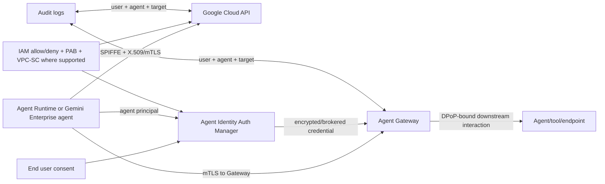
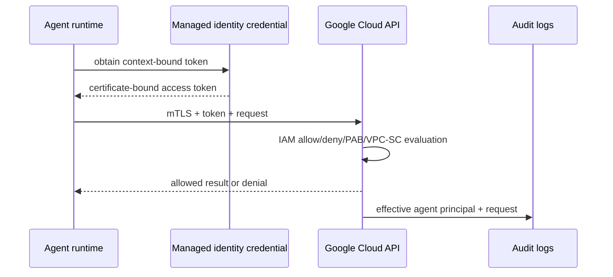
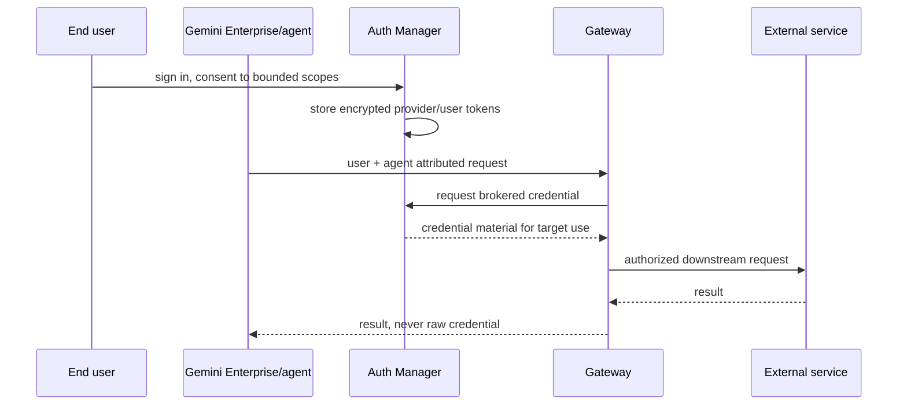
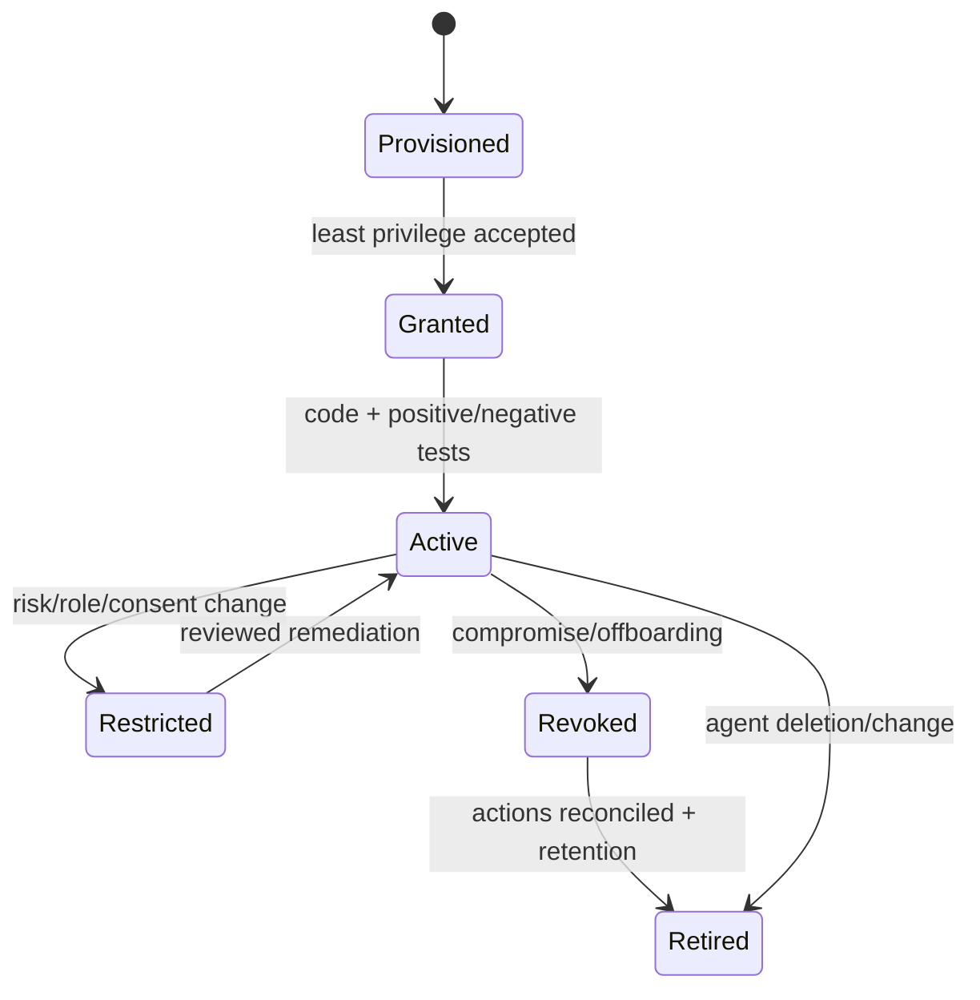
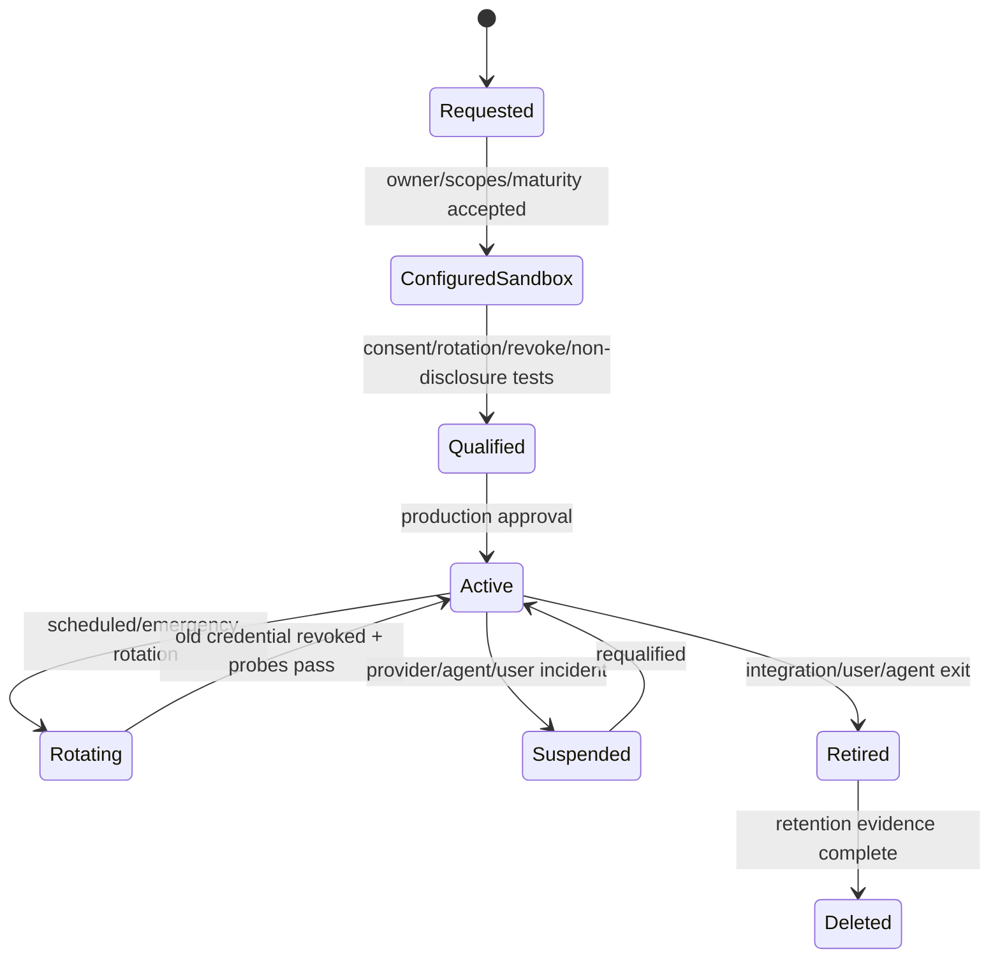

# Volume 13 — Agent Identity production engineering

> [!CAUTION]
> **Status: complete draft, not production authorization.** Revalidated 2 August
> 2026. Per-agent identity support and individual authentication modes have
> different maturity. The current Agent Identity page labels Auth Manager and
> OAuth 3LO/2LO/API-key modes Preview; qualify the exact mode and API.

**Audience:** FDEs, IAM/security architects, Runtime/Gemini Enterprise teams,
Gateway/tool owners, SOC/SRE, privacy and customer risk authorities.  
**Invariant:** every agent acts through its own strongly attested, least-privilege
principal; delegated authority remains attributable to both user and agent; the
agent never learns an unnecessary reusable credential.

## Executive outcome

The [Agent Identity overview](https://docs.cloud.google.com/gemini-enterprise-agent-platform/govern/agent-identity-overview)
describes a SPIFFE-based identity tied to each agent, with Google-managed X.509
credentials and certificate-bound Google Cloud tokens. Unlike shared service
accounts, agent identities are not shared by default, cannot be impersonated and
do not let developers create long-lived service-account keys. Supported hosting
surfaces include Agent Runtime and Gemini Enterprise.

Production engineering must connect lifecycle, trust domain, principal strings,
IAM allow/deny/PAB/VPC-SC posture, Context-Aware Access, Gateway DPoP, Auth Manager,
end-user delegation, audit correlation, revocation and recovery.

## Evidence legend and maturity

- 🟢 official capability; 🟡 enterprise recommendation; 🔵 FDE field pattern.
- “Agent Identity is supported” does not graduate every credential flow.

| Authority and target | Method | Current documented maturity | Production stance |
|---|---|---|---|
| agent → Google Cloud | Agent Identity/mTLS-bound token | use current Runtime/Identity page | preferred when qualified |
| user through agent → external | OAuth 2.0 3-legged | Preview | exception, consent/revoke/exit tests |
| agent → external | OAuth 2.0 2-legged | Preview | exception; secret/target containment |
| agent → external | API key | Preview | exception; rotation and non-disclosure |
| agent → external | HTTP Basic | documented as not recommended | reject in this reference baseline |
| Auth Manager broker | providers/credentials/tokens | Preview on current overview | capability-specific exception |

Recheck release notes, API version, location and terms for each customer launch.

## Customer discovery and authority model

For every action, answer:

1. Is the agent acting on its own authority or for an end user?
2. Which immutable agent resource hosts it and what is its SPIFFE/effective IAM
   principal?
3. What exact resource/method/object may it access, in which tenant/environment?
4. Is user consent present, current, scoped and revocable?
5. Does the target support Google Cloud IAM, OAuth 3LO/2LO, API key or another
   method, and what is the exact maturity/support contract?
6. Where are credentials encrypted/decrypted; can model, agent code, tool args,
   logs, traces or errors reveal them?
7. What happens after agent deletion, redeployment, consent withdrawal, employee
   departure, provider disablement or suspected compromise?
8. Which audit record contains both user and agent attribution?

Create an identity/authority matrix, trust-domain/topology ADR, IAM bindings and
denies, auth-provider inventory, consent UX, credential DFD, maturity exceptions,
revocation SLO, audit queries, incident and recovery plans.

## Identity architecture



Google states that Agent Identity uses mTLS/X.509 for direct first-party access
and DPoP across Gateway for proof-of-possession. With Auth Manager + Gateway +
Gemini Enterprise, end-user credentials can be encrypted in Auth Manager and
decrypted at Gateway so agent code does not see the raw value.

## Principal model

The official format is:

```text
spiffe://TRUST_DOMAIN/resources/SERVICE/RESOURCE_PATH
principal://TRUST_DOMAIN/resources/SERVICE/RESOURCE_PATH
```

Examples differ for `aiplatform/.../reasoningEngines/...` and
`discoveryengine/.../engines/...`; copy the effective identity from the official
resource/API, not from a guessed display name. Organization and project trust
domains also differ. Store immutable resource path and principal in the identity
inventory, while displaying friendly name separately.

```yaml
identity_contract_version: 1
agent_resource: projects/PROJECT/locations/REGION/reasoningEngines/AGENT_ID
effective_principal: principal://TRUST_DOMAIN/resources/aiplatform/RESOURCE_PATH
authority: agent
target: projects/PROJECT/locations/REGION/secrets/orders-api
allowed_permissions: [secretmanager.versions.access]
denied_boundaries: [other-projects, production-write]
caa_required: true
gateway_required: true
auth_mode: agent-identity
owner: orders-platform
security_owner: enterprise-iam
review_by: 2026-09-01
```

Never parse principal strings to infer tenant or business authority. Use a verified
mapping and re-read effective identity after resource recreation.

## Runtime provisioning

The [Runtime setup](https://docs.cloud.google.com/gemini-enterprise-agent-platform/build/runtime/setup)
and [Agent Identity with Runtime](https://docs.cloud.google.com/gemini-enterprise-agent-platform/scale/runtime/agent-identity)
document `identity_type=AGENT_IDENTITY`. An identity-only Runtime instance can be
created before code so IAM may be granted to the per-agent principal, then code is
updated. Without the flag, existing deployments can continue using service
accounts for compatibility; that is not evidence that a shared identity is the
least-risk new design.

Agent identities receive documented default roles for basic model/log/session/
memory/sandbox behavior, with some included surfaces potentially Preview. Review
effective permissions and add only target-specific access. Avoid broad Browser or
project roles merely because a quickstart lists them as possible setup aids.

## Context-Aware Access and proof binding

Google-managed Context-Aware Access binds tokens to the trusted runtime. The
Runtime guide documents a `401` outside that context and an opt-out environment
setting, explicitly not recommended. 🟡 This handbook treats CAA opt-out as a
production rejection unless a customer security authority documents an exceptional
requirement, compensating controls, expiry and adversarial test.

Certificates are auto-managed and currently documented as valid for 24 hours.
That limits credential lifetime but does not replace immediate IAM/provider/route
revocation. Test certificate/token rollover and ensure application retries do not
convert auth denial into repeated side effects.

## Agent-owned Google Cloud access



Grant on the narrow target resource where supported. Use IAM Conditions only with
verified attributes and test expiry/timezone. Deny and Principal Access Boundary
can cap exposure but must be validated for the exact service. The overview notes
legacy limitations for some resource IAM surfaces; confirm product-specific
support rather than assuming every service accepts an agent principal.

## Delegated user and external credentials



For 3LO, verify redirect URI, consent screen, scopes, token refresh, multi-account,
consent withdrawal, user offboarding and tenant separation. For 2LO/API key,
verify provider ownership, secret rotation, audience/target binding, quota and
revocation. Never return credential material as tool output or expose it to a
model. Where Gateway brokerage is not supported, redesign rather than hand the
agent a broad reusable credential silently.

## Least-privilege method

1. inventory required business operation and target object;
2. map operation to exact API permissions from current official IAM docs;
3. provision agent identity before code when possible;
4. grant the smallest target-scoped role/custom role;
5. add deny/PAB/perimeter constraints when supported and justified;
6. test positive and negative agent/user/tenant/environment cases;
7. observe real permission use, remove excess and set review/expiry;
8. requalify on agent recreation, target/API/role change or maturity change.

Avoid giving Agent Registry editor, IAM admin, secret admin or project owner to an
agent. An agent that can change its catalog metadata, policy or credentials can
turn data-plane compromise into control-plane persistence.

## Security threat model

| Threat | Required controls |
|---|---|
| shared identity hides responsible agent | unique lifecycle-bound Agent Identity |
| token stolen from runtime | default CAA, mTLS/DPoP proof binding, no token logs |
| broad role/confused deputy | target-scoped IAM, deny/PAB, user/business policy |
| delegated consent abuse | bounded scopes, dual attribution, revoke/offboard |
| raw secret exposed to model/code | Auth Manager/Gateway brokerage and log redaction |
| cross-tenant provider mix-up | verified tenant/account binding and negative tests |
| identity recreation inherits stale grant | immutable resource inventory and reconciliation |
| audit tampering/gap | protected logs, independent access, correlation alerts |

The local [`identity.py`](../../examples/python/fde-production-kit/src/fde_kit/identity.py)
rejects missing per-agent identity, CAA opt-out, absent least-privilege review,
raw-secret visibility, Basic auth and unapproved Preview modes. It encodes handbook
admission policy, not an official SDK implementation.

## Observability and audit

Log the agent resource/effective identity, user principal when delegated, target,
method, authorization/policy decision, provider identifier (not secret), Gateway
route, trace/request ID and outcome. Build queries per agent, user, provider,
target, denial reason and role change. Restrict Data Access logs and sensitive
fields; prove the SOC can trace an external action from user consent through agent,
Gateway and target.

Key signals: identities by lifecycle state, broad/changed grants, provider changes,
CAA opt-out, token/certificate error rates, consent/revocation, target anomalies,
denied cross-agent access, raw-secret detector hits and attribution gaps.

## Failure and lifecycle state



| Failure | Safe response | Recovery proof |
|---|---|---|
| token/cert expired | refresh through managed path; no shared fallback | rollover test, no duplicate action |
| IAM denial | preserve denial; do not grant broad role under pressure | exact permission review and negative retest |
| provider unavailable | deny/degrade non-destructively | restored provider + consent/token tests |
| consent revoked | stop delegated action immediately | downstream token/access denial |
| suspected theft | revoke grant/provider/route; stop action | audit scope, rotate, reconcile, incident closure |
| agent recreated | treat as new immutable principal | grants remapped/reviewed; old principal removed |

Recovery artifacts are desired IAM/provider/policy definitions and inventories,
not credential backups. Never export long-lived secrets/tokens into DR storage.

## CI/CD, tests and promotion

```mermaid
flowchart LR
    C[Identity contract] --> M[Maturity/location admission]
    M --> I[Create per-agent identity]
    I --> P[IAM/provider policy plan]
    P --> N[Positive + negative auth tests]
    N --> G[Gateway/non-disclosure tests]
    G --> S[Security/privacy/ops approval]
    S --> D[Controlled deployment]
    D --> R[Grant/provider drift + revoke monitor]
```



Run the dependency-free tests and fail-closed record:

```bash
PYTHONPATH=examples/python/fde-production-kit/src \
  python3 -m unittest examples/python/fde-production-kit/tests/test_identity.py -v
python3 delivery/volumes-11-15/validate_qualification.py \
  labs/volume-13-agent-identity/qualification.example.json --production
```

The example must fail. Production evidence includes live effective principal,
trust domain, exact grants/denies, default CAA, maturity/terms, provider/consent,
non-disclosure, audit correlation, revocation and recovery tests.

## FDE lab and adversarial tests

## Identity implementation playbook

### Identity-first deployment sequence

Provision the agent resource/identity before granting application data access when
the supported Runtime flow permits it. Export the platform-reported effective
identity to the IAM delivery stage; never make Terraform guess the trust domain or
principal from project name. Require a reviewed mapping from immutable agent
resource to principal, code revision, owner and environment.


The IAM pipeline takes the effective principal as an immutable artifact, verifies
it belongs to the expected resource/project/trust domain and refuses an empty,
changed or service-account fallback. Apply roles at the smallest supported target.
Where Terraform/provider support lags a managed API, use an approved API/CLI step
with idempotent read-before/write/read-after verification and retain the exact
request/response schema version; do not invent a resource.

### Permission discovery without over-granting

Map each business capability to API method and permissions from official target
service IAM docs. Start denied, run a synthetic request, inspect the exact denial
under secure logs, grant a predefined minimal role or reviewed custom role, and
repeat negative cases. Do not grant basic roles or every permission suggested by a
development stack trace. Some SDK calls perform hidden discovery/quota operations;
separate required runtime permission from developer/console convenience.

Record:

```yaml
grant_record_version: 1
agent_principal: PRINCIPAL_FROM_EFFECTIVE_IDENTITY
target_resource: FULL_RESOURCE_NAME
business_capability: read-approved-order-status
api_methods: [TARGET_METHOD]
permissions: [DOCUMENTED_PERMISSION]
role: CUSTOMER_REVIEWED_ROLE
conditions: [ENVIRONMENT_AND_EXPIRY_IF_SUPPORTED]
deny_or_pab: CUSTOMER_BOUNDARY
positive_test: EVIDENCE_URI
negative_tests: [other-agent, other-tenant, write, expired]
owner: IAM_OWNER
review_and_expiry: DATE
```

Use access analysis/recommender signals as inputs, not automatic removals/grants;
rare disaster operations need explicit justification. Review default agent roles
and any change in their included permissions when the platform evolves.

## Auth Manager/provider lifecycle

For every approved Preview provider, separate provider application registration,
client credential, end-user grant/token, agent permission and Gateway route.



Provider record includes external tenant/account, client/application ID, encrypted
secret reference—not value—OAuth endpoints/audience, redirect URI, scopes, token
lifetime, owning admin, rotation/revoke process, users/agents/routes, maturity terms,
location/data handling and exit date. Verify provider metadata independently;
malicious discovery endpoints can exfiltrate credentials.

For 3LO, bind consent to the authenticated enterprise user and correct external
account. Protect OAuth state/PKCE/redirect handling as supported, prevent login CSRF
and cross-tenant account substitution, show scopes/purpose, and handle declined or
partial consent. Removing app access must also revoke/expire downstream access; a
local database flag alone is insufficient.

For 2LO/API keys, target/audience-bind use at Gateway/extension when supported,
restrict provider-side IP/API/method/quota, rotate without exposing both values to
agent code and disable the old credential after traffic convergence. Canary tokens
or secret scanners can detect leakage but never replace containment.

## User-agent-action attribution

An audit event for delegated activity needs:

- authenticated enterprise user and external account/subject mapping;
- immutable agent resource and SPIFFE/effective principal;
- Gemini Enterprise app/session/request correlation;
- Gateway route/policy, Registry target and auth provider identifiers;
- requested method/tool/object/risk/approval reference;
- target provider request/action ID and reconciled outcome;
- timestamps and policy/code revisions.

Pseudonymize where privacy requires but retain a controlled re-identification path
for incident/audit. Never use raw access/refresh tokens as correlation IDs. Test
clock skew and trace propagation; logs from different systems must join without
copying sensitive payloads into a central unrestricted sink.

## Certificate, token and retry behavior

Agent code should use supported Application Default Credentials/managed pathways,
not cache tokens to disk or export them. Bound request deadlines below user
deadline, refresh before/when the official library requires and classify errors:

| Error | Behavior |
|---|---|
| context/CAA failure | stop; never retry from untrusted location |
| permission denied | stop; raise least-privilege diagnosis, no broad fallback |
| expired/unauthenticated | one supported refresh path; protect write idempotency |
| provider consent required | return bounded user re-consent UX, no shared token |
| provider revoked/invalid grant | stop delegated action and update lifecycle |
| transport/unavailable | bounded retry only if operation semantics are safe |
| unknown write outcome | reconcile provider state before any retry |

Avoid logging SDK credential objects/exceptions that embed headers. Redact at
structured logging boundary and scan test logs/traces/artifacts for canary secrets.

## SLOs and control effectiveness

Identity SLIs include successful context-bound authentication, authorization
decision latency, token/provider acquisition latency, consent completion/denial,
certificate/token refresh failures, privilege-drift age, dual-attribution coverage,
revocation convergence and secret exposure detector hits.

```text
dual_attribution_coverage = actions with verified user and agent / delegated actions
revocation_convergence = last accepted access - revoke requested
least_privilege_coverage = reviewed target-scoped grants / agent grants
provider_success = successful brokered auth / eligible provider requests
```

Segment by agent/provider/target/mode/risk. Availability SLO cannot justify CAA
opt-out or shared credential fallback. Security objectives include zero raw-secret
exposure and zero accepted cross-agent/tenant access. Alert immediately on broad
role, CAA opt-out, provider credential export, identity deletion/recreation and
attribution loss.

## Detailed incident runbooks

### Suspected agent credential compromise

Disable Gateway routes/high-risk tools; revoke target IAM/provider access; preserve
identity, runtime, Gateway and target audit; identify attempted replay outside the
trusted runtime; stop/redeploy compromised code only after preserving evidence;
rotate external provider credentials; reconcile all possible actions; restore
minimal grants to a verified identity; execute cross-agent and replay tests.

### Excessive IAM grant

Determine exposure interval and effective permission/resource scope, not only the
role name. Remove/narrow grant with change evidence, search target audit logs for
the agent principal and affected methods/objects, reconcile reads/writes and add a
policy-as-code test. Do not assume unused permission caused no exposure without
the necessary Data Access logs.

### User offboarding or consent withdrawal

Disable enterprise app access, revoke/expire provider grant, remove cached session/
authorization references, stop in-flight actions where supported and verify target
denial. Preserve retention/legal-hold evidence without retaining usable tokens.

## Migration from shared service accounts

Inventory every agent sharing the account, effective grants, keys, target traffic
and audit consumers. Create one Agent Identity at a time, duplicate only the
minimal required permissions, canary read-only then writes, compare audit and
business outcomes, remove that agent's dependency, and finally disable/delete keys
and shared grants after all consumers prove migration. Retain rollback without
restoring a long-lived key; rollback may mean disabling the agent/action.

## Customer handover pack

Provide trust-domain/resource/principal inventory, identity-first delivery and IAM
repositories, provider/consent register, maturity exceptions, non-disclosure tests,
audit correlation queries, SLO/alerts, rotation/revocation/offboarding/compromise
runbooks, migration debt and quarterly exercises. Operators demonstrate principal
lookup, exact-deny diagnosis, provider disable, user revoke, cross-agent denial and
recovery without receiving any raw credential.

Use [the identity lab](../../labs/volume-13-agent-identity/README.md). Test agent A
against B's resource, old identity after recreation, token outside trusted runtime,
wrong user/tenant/provider/audience, excessive OAuth scope, consent withdrawal,
provider disablement, secret-canary leakage, audit correlation and partial action
around token expiry. Use sandbox data/credentials only.

## Production checklist

- [ ] Every agent and auth provider has owner, target and lifecycle.
- [ ] SPIFFE/effective principals are read from platform state, not guessed.
- [ ] Agent Identity is enabled and default CAA remains enforced.
- [ ] IAM allow/deny/PAB/perimeter support is verified per target.
- [ ] Exact auth mode/API/location maturity and terms are accepted.
- [ ] Raw credential cannot reach model, code, logs, trace or tool response.
- [ ] Delegated actions record both user and agent; consent is revocable.
- [ ] Cross-agent/user/tenant negative tests pass.
- [ ] Rotation, expiry, revoke, offboarding and recovery drills pass.
- [ ] Immutable qualification evidence and independent reviews are complete.

## Anti-patterns

- One service account for every agent because deployment is easier.
- Guessing a principal from display name or copying another agent's grant.
- Disabling CAA to make local token replay work.
- Treating authentication as authorization for business objects/actions.
- Passing OAuth/API keys through prompts or tool parameters.
- Calling all Agent Identity flows GA.
- Keeping delegated access after consent/user/agent lifecycle ends.
- Rotating a credential without reconciling potentially executed writes.

## ADR — per-agent proof-bound identity

**Decision:** provision lifecycle-bound Agent Identity for supported production
agents; keep CAA/proof binding; grant least privilege directly; use Gateway/Auth
Manager for supported external/delegated flows only after maturity acceptance.  
**Alternatives:** default/shared/custom service accounts; application tokens; raw
secrets.  
**Consequences:** precise attribution and reduced replay/key risk; additional IAM,
trust-domain, provider, consent and lifecycle operations.  
**Revisit:** unsupported target/service, feature maturity, topology or measured SLO.

## FDE notebook — why Agent Identity

Agents are independent decision-making workloads; a shared service principal
erases which agent made a request and expands blast radius. Agent Identity makes
the agent a governable principal. It still needs user/business authorization,
minimal tools, approval and Gateway controls. Measure privilege reduction,
attribution completeness and revoke time—not identity count.

## Official evidence and artifacts

Production Terraform: [Agent Identity OAuth module](../../terraform/volumes-11-15-enterprise/modules/agent-identity-auth/README.md) and [composed Volumes 11–15 stack](../../terraform/volumes-11-15-enterprise/README.md).

- [Agent Identity overview](https://docs.cloud.google.com/gemini-enterprise-agent-platform/govern/agent-identity-overview)
- [Runtime environment setup](https://docs.cloud.google.com/gemini-enterprise-agent-platform/build/runtime/setup)
- [Use Agent Identity with Runtime](https://docs.cloud.google.com/gemini-enterprise-agent-platform/scale/runtime/agent-identity)
- [Manage deployed agent access](https://docs.cloud.google.com/gemini-enterprise-agent-platform/scale/runtime/manage-agent-access)
- [Gateway setup](https://docs.cloud.google.com/gemini-enterprise-agent-platform/govern/gateways/set-up-agent-gateway)
- [IAM policy configuration](https://docs.cloud.google.com/gemini-enterprise-agent-platform/govern/policies/configure-iam-policies)
- [Official Google API definitions at reviewed commit `3f9c9d7`](https://github.com/googleapis/googleapis/tree/3f9c9d72cb20768ca4ac9f12030faaf43b13c231)
- [Official Agent Platform Python SDK v1.163.0 source](https://github.com/googleapis/python-aiplatform/tree/v1.163.0)
- [Implementation evidence](../../references/implementation/volume-13-agent-identity.md),
  [lab](../../labs/volume-13-agent-identity/README.md), [operations](../../operations/volume-13-agent-identity/README.md)

## Exit criterion

Every agent and delegated user action is least-privilege, proof-bound, attributable
and revocable; raw reusable credentials stay outside model/agent reach; maturity,
negative tests, incident containment and lifecycle recovery are evidenced.
