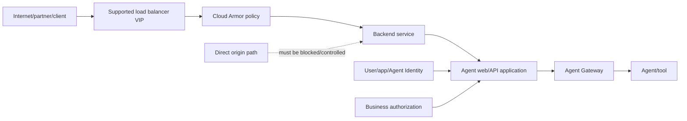
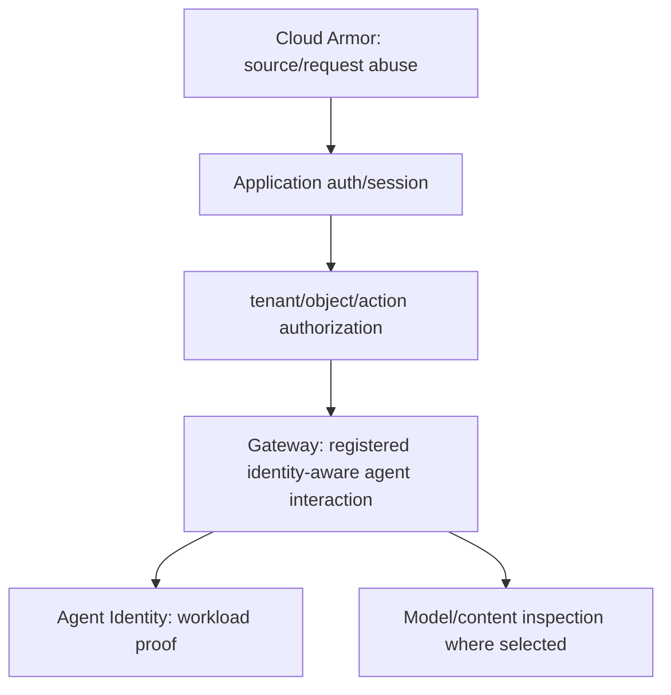
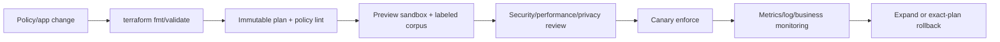
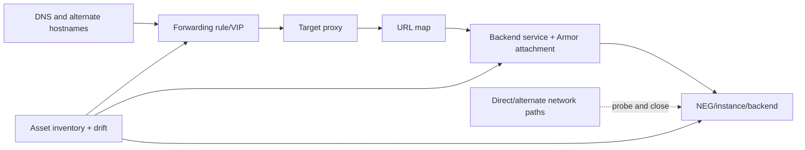

# Volume 14 — Cloud Armor for enterprise agent applications

> [!CAUTION]
> **Status: complete draft, not production authorization.** Revalidated 2 August
> 2026. Cloud Armor features and supported load balancers differ by policy type.
> A policy that is not attached to the real traffic backend provides no protection.

**Audience:** FDEs, network/security/platform engineers, application and agent
owners, SRE/SOC, performance teams and customer risk authorities.  
**Invariant:** supported public/private application ingress reaches the intended
backend only through a verified load-balancer boundary with an attached, observed,
tuned and recoverable policy; edge allow never implies agent/tool authorization.

## Executive outcome

Cloud Armor protects services behind supported load balancers against DDoS and web
attacks using L3–L7 rules, preconfigured WAF rules, rate limiting, bot management
and Adaptive Protection. The [overview](https://docs.cloud.google.com/armor/docs/cloud-armor-overview)
and [security policy overview](https://docs.cloud.google.com/armor/docs/security-policy-overview)
are the capability authority.

For an agent solution, place Cloud Armor at a supported load-balancer ingress for
web/API surfaces. Keep Agent Gateway for identity-aware agentic ingress/egress,
Agent Identity for workload proof, Model Armor/content policy for model payloads,
and application authorization for user/tenant/tool parameters.

## Evidence legend

- 🟢 official capability; 🟡 enterprise recommendation; 🔵 FDE field pattern.
- Exact policy type/load balancer/backend/location/feature applicability must be
  checked live before design and deployment.

## Customer discovery

1. What public, partner, employee or internal HTTP/TCP ingress exists, and can any
   origin/backend be reached around the intended load balancer?
2. Which supported load balancer/backend service and policy type apply?
3. What legitimate IP, geography, path, method, header, payload size, RPS/burst,
   automation and accessibility patterns exist?
4. Which WAF threats, DDoS, scraping, credential stuffing and bot risks matter?
5. How are identities and business actions authorized after edge filtering?
6. What false-positive/business outage is acceptable and who may override a rule?
7. Are request logs enabled, privacy reviewed and retained? Who can view verbose
   WAF details?
8. What attack/load corpus, rollout, rollback, incident and direct-origin test is
   required?

Outputs: ingress/origin inventory, policy-type ADR, Terraform and attachment plan,
WAF/rate/bot threat model, preview analysis, exception register, SLO/dashboard,
attack test, incident and rollback evidence.

## Supported boundary

🟢 Current docs list support across specified external Application Load Balancers,
regional internal Application Load Balancer, proxy Network Load Balancers and
regional external passthrough Network Load Balancer, with features varying. The
[policy overview](https://docs.cloud.google.com/armor/docs/security-policy-overview)
documents backend requirements and hierarchical versus service-level policies.



Cloud Armor evaluates incoming traffic and first-match policy rules. It does not
parse agent intent, grant OAuth consent, constrain MCP tool parameters or decide
whether a customer may cancel an order.

## Policy types and selection

| Type | Typical boundary | FDE check |
|---|---|---|
| backend security policy | application/backend service | load balancer and protocol support, WAF/rate feature |
| edge security policy | upstream edge/cache path | supported fields/features and attachment |
| network edge security policy | L3/L4 network edge | target type and rule language |
| hierarchical policy | org/folder/project guardrail | delegation, evaluation order and exceptions |

Do not attach two incompatible policies or assume a hierarchical rule behaves like
a backend WAF rule. Capture the evaluated policy chain and actual backend relation
from deployed state.

## Rule model and priority

```yaml
policy_version: agent-web-v12
backend_service: projects/PROJECT/global/backendServices/AGENT_WEB
rules:
  - priority: 100
    description: emergency-deny-compromised-cidr expires=2026-08-03
    match: SRC_IPS
    action: deny-403
    preview: true
  - priority: 1000
    description: preconfigured-sqli-reviewed
    match: evaluatePreconfiguredWaf(...)
    action: deny-403
    preview: true
  - priority: 2000
    description: login-rate-limit
    match: request.path.matches('/login')
    action: throttle
    preview: true
  - priority: 2147483647
    description: explicit-default
    match: '*'
    action: allow
    preview: false
owner: edge-security
rollback_revision: agent-web-v11
```

Rules have unique integer priorities; lower numbers evaluate first. The first
matching rule controls the request, including preview logging semantics. Keep
priority bands for organization emergency rules, threat intelligence, WAF,
rate/bot, application exceptions and default. Reject duplicate/implicit ownership.

The local [`armor.py`](../../examples/python/fde-production-kit/src/fde_kit/armor.py)
validates priorities, CIDRs, logging, attachment and preview allowance; it provides
a deterministic IP subset for tests, not the Cloud Armor CEL/WAF engine.

## WAF engineering

Google provides preconfigured WAF rule sets based on OWASP Core Rule Set. Current
overview references CRS 4.22. Use the live [preconfigured WAF rules](https://docs.cloud.google.com/armor/docs/waf-rules)
for exact expressions, versions, sensitivities and signatures.

Rollout method:

1. inventory endpoints, content types, encodings, maximums and legitimate samples;
2. select current stable rule sets/sensitivity using threat model;
3. enable request logging and deploy rules in preview;
4. replay labeled benign and malicious synthetic corpus;
5. inspect matched signature—not only top-level rule;
6. tune narrow signature/path exclusions with owner, reason and expiry;
7. re-run false-negative/positive/load tests;
8. canary enforcement, observe business/error/security SLIs, then expand;
9. requalify on application/API/WAF rule-set change.

Never exclude a whole rule family to fix one endpoint. Verbose logging may reveal
request fragments; apply privacy/access/retention controls and disable after
bounded diagnosis if not approved for steady state.

## Rate limiting and abuse control

The [rate limiting overview](https://docs.cloud.google.com/armor/docs/rate-limiting-overview)
distinguishes throttle and rate-based ban and documents per-backend aggregation,
keys and behavior. A rate-ban rule cannot be changed back to throttle, while a
throttle can be changed to rate-ban; treat rule replacement and state implications
explicitly.

Choose rate key from verified traffic topology. If all clients appear behind one
proxy/NAT, IP rate limiting can block a customer population. Model steady/burst
legitimate traffic, agent fan-out/retry storms, login/search/action differences,
load-balancer distribution and multi-backend semantics. Rate limiting protects
capacity/abuse; application quotas still enforce user/tenant/business contracts.

```mermaid
sequenceDiagram
    participant C as Client
    participant L as Load balancer
    participant A as Cloud Armor
    participant B as Backend/agent app
    C->>L: request
    L->>A: request attributes + backend
    A->>A: first-match WAF/rate/bot evaluation
    alt preview match
      A->>B: request continues; preview decision logged
    else enforced allow
      A->>B: request
    else enforced deny/throttle/redirect
      A-->>C: edge response
    end
```

## Bot management

The [bot management overview](https://docs.cloud.google.com/armor/docs/bot-management)
documents reCAPTCHA action/session tokens, manual challenge and token-abuse rate
controls. Decide whether a human browser flow can complete a challenge; API,
service and accessibility clients may not. Validate hostname/action binding,
token expiry/reuse, privacy/terms, failure behavior and fallback. Bot score is a
risk signal, not identity or business authorization.

## Adaptive Protection and DDoS

The [Adaptive Protection overview](https://docs.cloud.google.com/armor/docs/adaptive-protection-overview)
describes traffic-baseline learning, anomaly alerts, signatures, suggested WAF
rules and Security Command Center findings. Baseline learning can take time.

🟡 Treat a suggestion as incident evidence, not executable truth: examine target,
false-positive blast radius and precedence; create a bounded reviewed rule; use
preview when threat urgency permits; monitor; expire or codify after post-incident
review. L7 DDoS protection still requires proactive user-configured policy rules.

## Identity, Gateway and origin controls



Block direct access to serverless/GKE/VM origins according to the chosen load
balancer architecture; validate health-check/proxy source behavior from official
network docs. A hostname/DNS change is not origin protection. Test an actual
direct-backend request from each reachable network.

## Terraform and delivery

The repository supplies [a minimal policy-as-code module](../../terraform/volume-14-cloud-armor/README.md)
and plan-safety validator. Google also maintains [terraform-google-cloud-armor at
reviewed commit `0757d7c`](https://github.com/GoogleCloudPlatform/terraform-google-cloud-armor/tree/0757d7ca6ccc4b530337f79050f715ca14677c5a).
🟢 Google-owned source is evidence of implementation patterns, not a customer
approval; pin/review/scan/test the exact version and provider plan.



Production workflow requirements: remote protected state, pinned Terraform/provider/
module, Workload Identity Federation, plan/apply separation, protected approval,
exact saved plan, attachment verification, preview evidence, policy diff, rollback
revision and drift detection. Keep emergency console change bounded and reconcile
back to code immediately.

## Logging, metrics and SLOs

Cloud Armor request logs depend on HTTP(S) logging being enabled on each protected
backend; new backend request logging can be off by default. The [policy overview](https://docs.cloud.google.com/armor/docs/security-policy-overview)
explains first-match logging and [monitoring](https://docs.cloud.google.com/armor/docs/monitoring)
documents request and previewed-request metrics, one-minute batches and current
retention behavior.

Dashboard: requests, allowed/blocked/preview, rule/policy/backend, status/latency,
WAF signature, rate outcome, Adaptive alert, origin bypass probe, attachment drift,
application authorized outcomes and Gateway denies. Protect/log-sink IAM and avoid
unbounded high-cardinality labels.

Customer SLOs include legitimate request availability/latency, enforcement
coverage, logging completeness, attachment/bypass invariant and false-positive
budget. Security objective: no known direct-origin path and zero unauthorized
protected agent actions; Cloud Armor alone cannot prove the latter.

## Failure and incident response

| Symptom | Diagnose | Safe action |
|---|---|---|
| deny rule “not working” | backend attachment, traffic path, priority/first match | repair attachment/path; do not add random rules |
| legitimate surge blocked | exact rate key/rule and backend aggregation | narrow expiring exception or rollback |
| WAF false positive | signature/path/sample under privacy controls | narrow tuning in preview/canary |
| attack reaches origin | bypass path/firewall/serverless ingress | contain origin; preserve evidence |
| Adaptive alert | signature, backend, baseline, business traffic | reviewed bounded mitigation |
| logging absent | backend logging/config/sampling/sink | restore before claiming protection evidence |
| policy apply failure | saved plan/state/provider/API | stop, inspect, exact rollback; never partial manual mix |

Use [Cloud Armor troubleshooting](https://docs.cloud.google.com/armor/docs/troubleshooting)
and [create/manage policies](https://docs.cloud.google.com/armor/docs/configure-security-policies)
for official mechanics. Preserve first-match log, deployed policy, backend relation,
load-balancer config and application/Gateway correlation.

## Testing matrix

- positive: supported clients, NAT/proxy cohorts, accessibility, uploads, streaming;
- WAF: labeled SQLi/XSS/RCE/LFI/protocol corpus plus benign equivalents;
- rate: sustained/burst, multi-client same IP, retry storm, distributed sources;
- bot: valid/invalid/expired/replayed tokens and non-browser client;
- topology: intended VIP, alternate hostname, direct backend/internal path;
- resilience: policy propagation, rollback, log sink outage, backend change;
- end-to-end: Armor allow followed by application/Gateway deny of unauthorized tool.

Never run uncontrolled attack/load tests against production or third-party systems.

## Policy-as-code implementation playbook

### Discover the real serving path

Before writing rules, export forwarding rules, target proxies, URL maps, backend
services, serverless NEGs/instance groups/endpoints, health checks, CDN, DNS,
firewalls and application ingress settings. Draw every public, partner, peered,
VPN/interconnect and administrator path. For each backend, read deployed state to
prove which policy is attached. Compare DNS names and certificates but do not use
them as evidence that origin access is impossible.



Create a route-to-policy matrix for every URL-map backend. A default backend and a
path-specific backend may have different policies. Re-run attachment/bypass tests
after load-balancer, GKE Ingress/Gateway, serverless NEG or backend changes. Google
warns that GKE-managed resources can overwrite independently applied Cloud Armor
configuration; select one configuration owner and use the documented GKE method.

### Terraform promotion contract

The narrow module deliberately exposes policy ID but not attachment. In the
customer stack, attachment is a separate reviewed diff because changing a backend
may remove protection. Required plan-policy checks include:

- pinned Terraform/provider/module/source checksums and remote protected state;
- exact project and intended policy type/name;
- unique priority bands and explicit default action;
- no production allow rule left preview-only;
- deny/WAF/rate/bot enforcement only after referenced preview report;
- expiring emergency/exception rules with owner/ticket;
- no unintended policy deletion/replacement or backend detachment;
- backend logging configured at approved sampling/detail;
- saved-plan digest used by the apply job and post-apply read-back.

Plan JSON is sensitive infrastructure metadata. Store with restricted access and
retention; never print secrets or full customer IP lists to public CI. Use keyless
federation, separate plan/apply identities and protected customer approval. After
apply, query the policy and backend relation, run allow/deny probes and compare
deployed fingerprint/revision to the expected plan.

### Rule ownership and exceptions

Maintain a registry:

```yaml
rule_id: agent-web-waf-sqli-v12
policy: agent-web
priority: 1000
type: preconfigured-waf
action: deny-403
preview: false
owner: edge-security
service_owner: employee-agent-web
threat: sql-injection
test_corpus: gs://REDACTED-EVIDENCE/waf-v12/
exceptions:
  - signature: EXACT_SIGNATURE
    path: /bounded/path
    reason: reviewed-parser-false-positive
    expires: 2026-09-01
rollback_revision: agent-web-v11
```

An exception is narrower than the triggering traffic and includes owner, business
impact, evidence, compensating application control, expiry and re-test. Alert
before expiry; on expiry, remove or explicitly reapprove. Never use `allow` at a
higher priority to bypass all later WAF/rate rules for a broad source.

## WAF corpus and tuning method

Build synthetic labeled cases from the application schemas and current OWASP/WAF
signatures: method/path/query/header/cookie/body, JSON/form/multipart, encoding,
compression, Unicode, maximum sizes and malformed variants. Include legitimate
content that resembles code, security documentation or SQL because enterprise
knowledge assistants frequently handle it. Do not place real secrets/PII in the
corpus or issue tracker.

For each matched preview request retain opaque case ID, expected label, policy/rule/
signature, observed action, backend/path/content type, false-positive assessment
and reviewer. Calculate by endpoint and signature:

```text
false_positive_rate = benign cases matched for deny / benign cases
detection_rate = malicious cases matched / malicious cases
preview_coverage = production-like requests evaluated / eligible requests
```

Synthetic detection is not a product guarantee and cannot enumerate zero-days.
Combine with application secure coding, dependency/supply-chain scanning, Gateway
and incident detection. Re-run after WAF expression/rule-set or application parser
change.

## Rate-limit sizing exercise

Measure per journey: legitimate steady RPS, p95/p99 burst, concurrency, enterprise
NAT sharing, mobile reconnect, agent retries/fan-out, batch clients and incident
headroom. Choose rate key only after verifying the load balancer supplies the
intended attribute. Set a preview threshold above known legitimate burst, replay
load, inspect per-backend aggregation and progressively reduce/tune.

Separate low-cost search/autocomplete, expensive generation, login, file upload
and protected action paths. Application quotas enforce user/tenant subscription and
idempotency; Armor mitigates traffic abuse. For a rate-based ban, define ban
threshold/duration, support/unban path and NAT blast radius. Because conversion
back to throttle is restricted as documented, model replacement/rollback before
enforcement.

## Log and metric engineering

Enable supported load-balancer request logging and verify actual Cloud Armor fields
with a synthetic matched rule. Produce structured derived metrics cautiously:
policy/backend/rule/priority/outcome/preview/signature/status and a bounded client
cohort, not raw IP as an unbounded metric label. Keep raw logs access-restricted.

Correlate an opaque request ID from load balancer/Armor through app, Gateway, agent
and tool. Sampling must retain all denied/security-significant events required by
policy and enough allowed traffic for rate/baseline/false-positive analysis. If the
chosen load balancer cannot provide a required field, change the monitoring design;
do not fabricate it.

Example customer alerts:

- enforced deny or throttle deviation by backend/rule and legitimate-journey error;
- preview match surge for high-severity signatures;
- Adaptive Protection alert with backend and baseline confidence;
- policy/backend attachment or config-asset drift;
- request logging silence while backend receives traffic;
- origin-bypass synthetic probe succeeds;
- false-positive support cases exceed budget;
- application/Gateway unauthorized outcome despite Armor allow.

## SLO and capacity model

Define legitimate edge availability as intended legitimate requests that pass
Armor and reach the expected backend divided by eligible legitimate requests.
Measure Armor/load-balancer overhead inside end-to-end p95/p99 and distinguish edge
denial from backend failure. Establish security-control coverage: protected backend
traffic through attached policy, logging coverage, origin-bypass probes and time to
enforce/rollback an emergency rule.

DDoS exercises use customer-approved providers, rate ceilings and Google support/
terms. Do not generate volumetric traffic yourself. Capacity tests within approved
limits validate normal bursts, rate policy and backend autoscaling; they do not
prove global DDoS capacity.

## Detailed incident runbooks

### Active L7 attack

Confirm target backend and first-match evidence; activate incident command and
Google support path; protect logs; create the smallest high-confidence rule in
preview when feasible or enforce under emergency authority; monitor legitimate
business and attacker adaptation; keep Gateway/app capacity protected; expire or
codify the rule after review. Reconcile application actions during overload.

### False-positive production outage

Identify exact policy/rule/signature and affected endpoints/cohorts. Roll back to
the reviewed policy or add a narrow expiring exception; do not disable the entire
WAF. Validate allowed legitimate cases and retained malicious denies, restore SLO,
add regression cases and review why preview/canary missed it.

### Policy detached or origin exposed

Treat as security incident. Restrict origin/network ingress, reattach the reviewed
policy, verify every URL-map backend and direct path, inspect traffic/audit changes
during exposure, rotate credentials if origin auth was bypassable and add asset-
drift plus synthetic bypass detection.

## Customer handover pack

Hand over the path/attachment inventory, policy Terraform/locks/plans, priority and
exception registry, preview corpus/reports, WAF/rate/bot/Adaptive ADRs, privacy/log
map, dashboards/alerts, support escalation, attack/false-positive/detachment
runbooks, emergency authority and quarterly bypass/rollback exercise. Operators
demonstrate first-match diagnosis, attachment verification, narrow exception and
exact rollback without turning off all protection.

## Production checklist

- [ ] Exact policy type/load balancer/backend/feature support verified live.
- [ ] All ingress and direct-origin paths inventoried and tested.
- [ ] Policy and attachment managed as reviewed IaC.
- [ ] Unique priorities/default/owner/expiry and rollback validated.
- [ ] WAF/rate/bot rules pass labeled preview and false-positive analysis.
- [ ] Adaptive suggestions require human review.
- [ ] Backend request logging, dashboards and burn alerts are proven.
- [ ] Cloud Armor, app auth, Gateway, Identity and Model Armor boundaries remain.
- [ ] Attack/load/rollback/incident exercises pass.
- [ ] Qualification evidence and independent reviews are complete.

## Anti-patterns

- Creating a policy but not proving backend attachment.
- Assuming DNS hides or protects the origin.
- Enforcing high-sensitivity WAF without preview corpus.
- One global IP rate for users behind enterprise NAT.
- Copying Adaptive suggestions directly into enforce mode.
- Treating an edge allow as user, tenant or tool authorization.
- Enabling verbose logs indefinitely without privacy controls.
- Console hotfix never reconciled to source control.

## ADR — layered agent application ingress

**Decision:** protect supported load-balanced ingress with attached Cloud Armor
backend policies, preview-tuned WAF/rate/bot controls and direct-origin prevention;
retain application, Gateway, Identity and content/business controls.  
**Alternatives:** application-only WAF; CDN/vendor WAF; private-only access.  
**Consequences:** edge absorption and common policy/telemetry; false-positive,
attachment, feature-compatibility and rule-lifecycle responsibilities.  
**Revisit:** load balancer/topology, traffic, regulation, threat or feature changes.

## FDE notebook — why Cloud Armor

Use it when the customer exposes a supported load-balanced web/API surface and
needs DDoS/WAF/abuse protection near the edge. Do not add it to Agent Gateway
egress as if it were an agent policy engine. Measure protected-path coverage,
attack absorption, false-positive impact and origin-bypass elimination.

## Official evidence and artifacts

Production Terraform: [Cloud Armor official-module wrapper](../../terraform/volumes-11-15-enterprise/modules/cloud-armor/README.md) and [composed Volumes 11–15 stack](../../terraform/volumes-11-15-enterprise/README.md).

- [Cloud Armor overview](https://docs.cloud.google.com/armor/docs/cloud-armor-overview)
- [Security policy overview](https://docs.cloud.google.com/armor/docs/security-policy-overview)
- [Preconfigured WAF rules](https://docs.cloud.google.com/armor/docs/waf-rules)
- [Rate limiting](https://docs.cloud.google.com/armor/docs/rate-limiting-overview)
- [Bot management](https://docs.cloud.google.com/armor/docs/bot-management)
- [Adaptive Protection](https://docs.cloud.google.com/armor/docs/adaptive-protection-overview)
- [Monitoring](https://docs.cloud.google.com/armor/docs/monitoring)
- [Example policies](https://docs.cloud.google.com/armor/docs/example-policies)
- [Official Google API definitions at reviewed commit `3f9c9d7`](https://github.com/googleapis/googleapis/tree/3f9c9d72cb20768ca4ac9f12030faaf43b13c231)
- [Implementation evidence](../../references/implementation/volume-14-cloud-armor.md),
  [lab](../../labs/volume-14-cloud-armor/README.md), [operations](../../operations/volume-14-cloud-armor/README.md)

## Exit criterion

The customer has proved that every in-scope request crosses an attached policy;
preview-tuned controls stop the intended abuse without unacceptable legitimate
impact; layered agent authorization remains intact; monitoring and rollback work.
