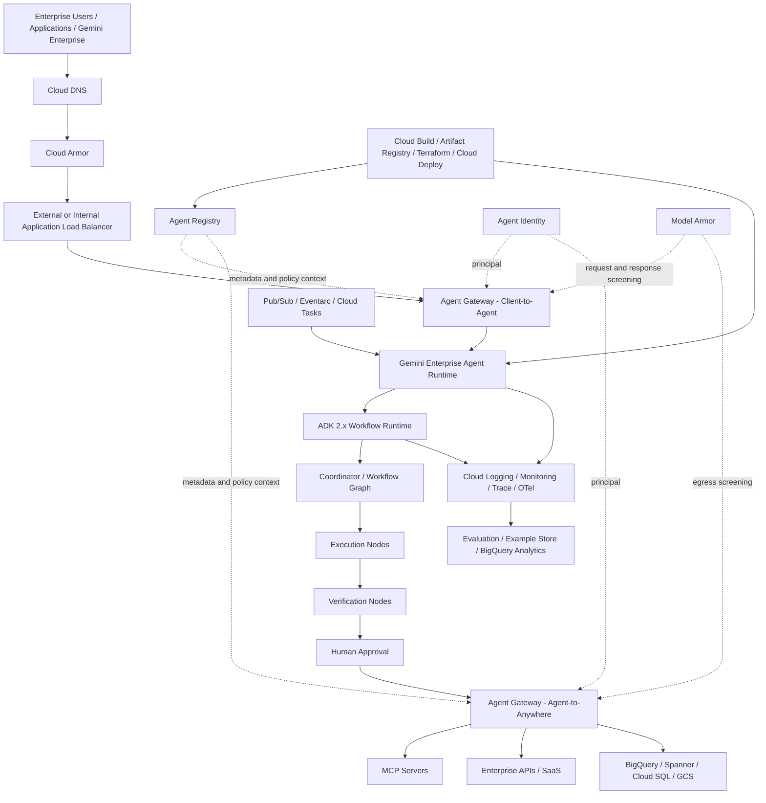
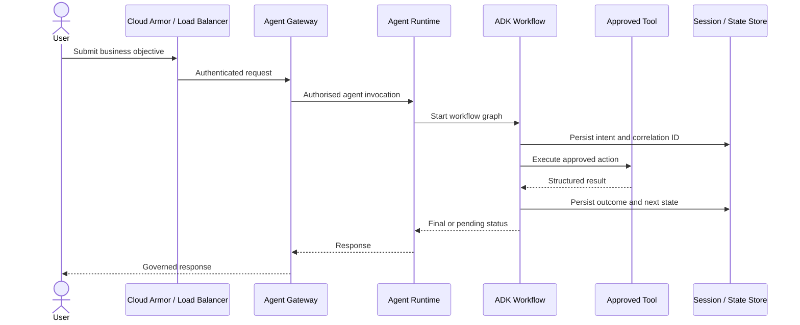
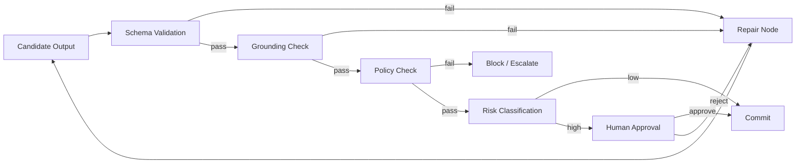
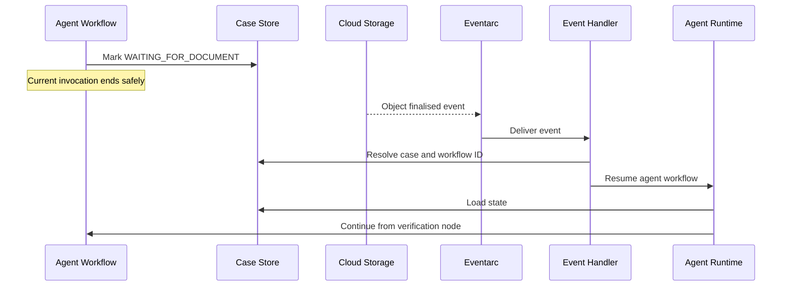
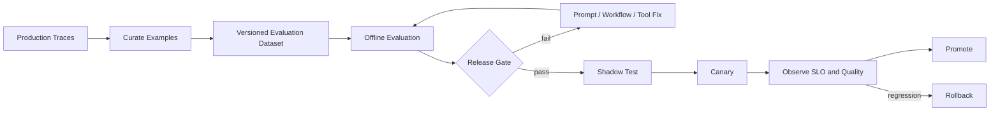
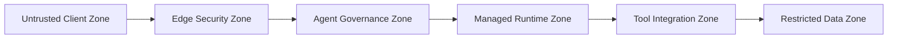

> [!IMPORTANT]
> **Publication status: Draft.** This volume is an engineering reference under review, not an official Google publication. Product behavior is sourced from official Google documentation or reviewed Google source and samples. Architecture recommendations and field patterns are labeled separately. Validate service maturity, region, quota, support, data residency, organization policy, and contractual requirements for the customer before production use.

# Volume 2 — Enterprise Agent Platform Architecture on Google Cloud

> [!CAUTION]
> **Status: Draft — not approved for production use.** Research was refreshed on 2 August 2026. Capability maturity is independent per service and sub-capability. This chapter must pass architecture, implementation, security, operations, and customer-delivery review before approval. See [content status](../STATUS.md) and the [bootstrap audit](../audits/2026-08-02-bootstrap-audit.md).

## Enterprise platform reference architecture

**Version:** 0.3-draft  
**Last researched:** 2 August 2026  
**Primary audience:** Forward Deployed Engineers, AI Platform Engineers, Principal Engineers, Cloud Architects, Security Architects, SREs, and customer delivery teams  
**Implementation baseline:** Google ADK Python 2.6.1, Terraform 1.15.8, Google provider 7.42.0, Cloud Foundation Fabric 57.0.0, Gemini Enterprise Agent Platform, Agent Runtime, Agent Registry, Agent Gateway, Agent Identity, Model Armor, Cloud Armor, and supporting Google Cloud services

---

## Executable companion

The production-shaped field kit for this volume is implemented in four independently reviewable layers:

- [platform admission service](../../examples/python/platform-admission/README.md) — strict request contract, IAP JWT verification, deterministic policy, Firestore idempotency, structured logging, and OpenTelemetry;
- [governed-cell Terraform](../../terraform/volume-2-platform/README.md) — project, APIs, identities, Artifact Registry, optional Firestore and Shared VPC attachment, secret boundary, budget, dashboard, alert, GitHub federation, and plan policy;
- [Cloud Build and Cloud Deploy](../../delivery/volume-2-platform/README.md) — digest-addressed build, separate targets, environment-specific identities, and production approval; and
- [field labs](../../labs/volume-2-platform/README.md) and [operations pack](../../operations/volume-2-platform/README.md) — executable gates, product qualification, incident response, and operator queries.

Every implementation claim and pin is mapped to an exact official source in the [Volume 2 implementation evidence ledger](../../references/implementation/volume-2-platform.md). These assets are a verified baseline as of 2 August 2026, not a substitute for a customer plan, cloud integration test, contractual review, or independent production approval.

---

## 1. Purpose of this chapter

This chapter converts the conceptual loop-engineering model into a practical Google Cloud reference architecture that an FDE can take into a customer engagement.

It focuses on a question that repeatedly appears in enterprise delivery:

> How do we build, govern, deploy, and operate production agents on Google Cloud without turning each agent into a bespoke application?

The answer is not “deploy an ADK container.” The production answer is to create an **enterprise agent platform** with clear separation between:

- agent development;
- deterministic workflow control;
- runtime execution;
- agent and tool registration;
- ingress and egress governance;
- agent identity;
- data and tool access;
- safety controls;
- observability;
- evaluation;
- release management; and
- operational ownership.

The design in this chapter maps those responsibilities to current Google Cloud capabilities and explicitly labels where the document provides an architectural recommendation rather than a guaranteed product capability.

---

## 2. Source and confidence model

This handbook uses the following labels.

### 2.1 Official capability

A statement directly supported by current Google documentation or official Google source code.

### 2.2 Recommended production pattern

A design recommendation built on documented Google capabilities. The pattern may not be a named Google product feature.

### 2.3 Customer-specific decision

A choice that must be resolved during discovery because it depends on regulatory, organisational, latency, networking, operational, or commercial constraints.

### 2.4 Preview warning

Some Gemini Enterprise Agent Platform capabilities are in preview or subject to Pre-GA terms. A production programme must confirm availability, support status, quota, region, and contractual suitability before committing to them.

---

## 3. Current official platform model

Google describes Gemini Enterprise Agent Platform as an open, comprehensive platform for building, scaling, governing, and optimising enterprise-grade agents grounded in enterprise data.

The platform documentation currently exposes the following major capability groups:

- **Build:** ADK, Agent Runtime, tools, grounding, skills, and development tooling.
- **Scale:** managed runtime, sessions, memory, identity, and deployment lifecycle.
- **Govern:** Agent Registry, Agent Gateway, IAM, Model Armor, and policy controls.
- **Optimise:** observability, evaluation, examples, tracing, and operational analysis.

### Official references

- Gemini Enterprise Agent Platform overview: <https://docs.cloud.google.com/gemini-enterprise-agent-platform>
- Agents overview: <https://docs.cloud.google.com/gemini-enterprise-agent-platform/agents>
- Agent Runtime: <https://docs.cloud.google.com/gemini-enterprise-agent-platform/build/runtime>
- Agent Registry: <https://docs.cloud.google.com/gemini-enterprise-agent-platform/govern/agent-registry>
- Agent Gateway overview: <https://docs.cloud.google.com/gemini-enterprise-agent-platform/govern/gateways/agent-gateway-overview>
- ADK 2.0 overview: <https://adk.dev/2.0/>
- ADK Python source: <https://github.com/google/adk-python>

---

## 4. What changed with ADK 2.x

ADK 2.x is not merely a version upgrade. It changes the orchestration model.

Google’s ADK 2.0 documentation states that the runtime transitions from a hierarchical agent executor to a **graph-based execution engine**. Agents, tools, and functions are evaluated as nodes in a workflow graph. The Python repository also documents support for routing, fan-out/fan-in, loops, retries, state management, dynamic nodes, human-in-the-loop, and nested workflows.

This matters for loop engineering because production loops require explicit control over:

- state transitions;
- retry paths;
- verification stages;
- parallel work;
- repair branches;
- human approval;
- termination conditions; and
- resumability.

ADK 1.x-style hierarchical delegation alone is not sufficient for these requirements.

### 4.1 Migration implications

ADK 2.0 introduces event schema fields including `node_info` and `output`. Custom session persistence and downstream consumers that use strict JSON validation must be updated accordingly.

ADK 2.0 also changes the execution hierarchy: `BaseAgent` is now evaluated as a workflow node. Code that bypasses the framework by directly appending session events can break graph determinism and must be removed.

### 4.2 FDE guidance

For a new enterprise implementation:

- standardise on ADK 2.x from day one;
- pin a tested minor version rather than using an unconstrained latest dependency;
- use the official constraints file for dependency protection;
- define an upgrade qualification pipeline;
- version session schemas;
- treat workflow topology as deployable software; and
- avoid direct session mutation outside supported ADK APIs.

### Official references

- ADK 2.0 migration and compatibility: <https://adk.dev/2.0/>
- ADK Python repository: <https://github.com/google/adk-python>
- ADK releases: <https://github.com/google/adk-python/releases>

---

## 5. Enterprise reference architecture



### 5.1 Architectural intent

The architecture establishes five distinct planes.

#### Experience plane

Channels through which users and applications interact with agents.

Examples:

- Gemini Enterprise;
- internal web applications;
- mobile applications;
- contact-centre systems;
- API clients;
- IDE or CLI clients; and
- other agents using A2A.

#### Governance plane

Controls what may communicate, what identity is used, which registered target is approved, and which policies must be enforced.

Key services:

- Agent Gateway;
- Agent Registry;
- Agent Identity;
- IAM;
- Model Armor;
- Cloud Armor; and
- Cloud Audit Logs.

#### Execution plane

Runs the actual agent and workflow logic.

Key services:

- Agent Runtime;
- ADK 2.x Workflow Runtime;
- Cloud Run or GKE for specialised components; and
- Cloud Tasks, Pub/Sub, Eventarc, or Workflows where external orchestration is required.

#### Data and tool plane

Contains enterprise systems the agent accesses.

Examples:

- MCP servers;
- internal APIs;
- SaaS systems;
- BigQuery;
- Spanner;
- Cloud SQL;
- AlloyDB;
- GCS;
- SAP;
- Salesforce;
- ServiceNow; and
- on-premises systems.

#### Operations plane

Provides traceability, evaluation, delivery automation, incident response, and continuous improvement.

Key services:

- Cloud Logging;
- Cloud Monitoring;
- Cloud Trace;
- OpenTelemetry;
- BigQuery;
- evaluation services;
- Cloud Build;
- Artifact Registry;
- Terraform; and
- release pipelines.

---

## 6. Component responsibilities

## 6.1 ADK 2.x Workflow Runtime

### Official capability

ADK 2.x provides graph-based and dynamic workflows. A workflow can compose agents, tools, functions, human input, branches, loops, retries, and nested workflows.

### Recommended production responsibility

Use ADK workflow graphs for **agent-local orchestration** where the steps are closely coupled to model reasoning, tool invocation, agent state, and verification.

Examples:

- plan → execute → verify → repair;
- retrieve → assess grounding → answer;
- parallel specialist analysis → merge → critic;
- request approval → wait → resume;
- tool failure → classify → retry or compensate; and
- policy check → action or escalation.

### Do not use ADK alone for every workflow problem

Use an external durable orchestration service when the process:

- spans hours or days and must survive independent system failures;
- involves broad non-agent service orchestration;
- requires strong business-process visibility outside the agent runtime;
- uses scheduled or event-driven enterprise integration at large scale;
- requires explicit compensation across many systems; or
- must be operated by a non-AI workflow team.

In those cases, use ADK for the agent decision segment and use Cloud Workflows, Cloud Tasks, Pub/Sub, or Eventarc for the broader business process.

---

## 6.2 Agent Runtime

### Official capability

Agent Runtime is a fully managed, opinionated runtime for deploying, operating, and scaling agentic applications. It abstracts underlying infrastructure, supports managed deployment, custom container build-time dependencies, VPC Service Controls, authentication and IAM, multiple frameworks, and full ADK integration.

The API resource may still be named `ReasoningEngine` for backward compatibility.

### Recommended production responsibility

Use Agent Runtime as the default managed execution target when:

- the workload is an agentic application;
- managed scaling and runtime integration are desired;
- ADK is the primary framework;
- platform teams want to minimise Kubernetes or container operations;
- Agent Identity and Agent Gateway integration are required; and
- the supported region and product stage meet customer requirements.

### Consider Cloud Run when

- the workload is mostly a stateless API around an agent;
- custom HTTP behaviour is central;
- the customer already has a strong Cloud Run platform;
- the application needs arbitrary sidecars or patterns not available in Agent Runtime; or
- a temporary migration bridge is required.

### Consider GKE when

- strict runtime customisation is necessary;
- specialised networking, sidecars, GPU, service mesh, or scheduling is required;
- the enterprise already operates a mature GKE platform;
- the workload includes non-agent services tightly coupled to the agent; or
- unsupported runtime controls are mandatory.

### FDE warning

Do not select GKE merely because the customer already uses Kubernetes. Managed agent runtime should be evaluated first. The operational burden of GKE is justified only when requirements exceed the managed runtime’s capabilities.

---

## 6.3 Agent Registry

### Official capability

Agent Registry centralises agents, MCP servers, endpoints, and related agentic components. It helps reduce fragmented tool access, isolated data, and redundant implementations while maintaining security and access control.

It supports registration of:

- agents;
- MCP servers;
- endpoints; and
- tools or skills where supported.

### Recommended production responsibility

Treat Agent Registry as the control-plane catalogue for approved agentic assets, not as a Git repository and not as the sole release system.

Store source code in Git. Store build artefacts in Artifact Registry. Use Agent Registry for discoverability, governance metadata, endpoint association, and runtime integration.

### Minimum metadata model

Each production agent registration should be linked to:

- business owner;
- technical owner;
- data classification;
- risk rating;
- autonomy level;
- allowed tools;
- approved runtime region;
- model family and configuration;
- source commit SHA;
- container digest or deployment version;
- evaluation scorecard;
- security review identifier;
- change ticket or release identifier;
- support group;
- SLO tier;
- deprecation date; and
- rollback target.

Some of this metadata may live in an external CMDB or governance repository if the registry schema does not support it directly. Link rather than duplicate where possible.

---

## 6.4 Agent Gateway

> [!WARNING]
> **Current maturity gate:** the Agent Runtime documentation labels Agent Gateway Preview. Use it only after the customer accepts the applicable Pre-GA terms, confirms region/support, and records a tested fallback. The executable qualification lab fails until that acceptance is recorded.

### Official capability

Agent Gateway acts as the network entry and exit point for agent interactions and integrates with Agent Registry, Agent Identity, managed runtimes, policy services, Model Armor, and observability.

It supports two documented modes:

- **Client-to-Agent:** governs ingress from clients to agents and tools on Google Cloud.
- **Agent-to-Anywhere:** governs egress from agents to agents, tools, APIs, MCP servers, and external systems.

The gateway supports protocol mediation across MCP, A2A, REST, and gRPC.

### Recommended production responsibility

Use Agent Gateway as the policy enforcement point for agent-specific communication. Do not try to reproduce all agent-aware governance only in application code.

The gateway should enforce:

- approved target registration;
- caller and agent authentication;
- agent-specific authorisation;
- protocol mediation;
- Model Armor inspection;
- audit telemetry;
- destination control; and
- centrally managed policies.

### Important documented topology constraint

Google currently documents that the Gemini Enterprise app, Runtime agents, Agent Gateway, and associated Agent Registry must be in the same Google Cloud project for the relevant deployment pattern.

This constraint directly affects enterprise landing-zone design. Do not assume that a central gateway project can govern arbitrary runtime projects unless the documented topology explicitly supports it.

### Regional design

Google documents centralised and independent regional governance patterns. The appropriate pattern depends on:

- Gemini Enterprise location;
- Runtime region;
- registry location;
- data residency;
- blast-radius requirements;
- latency; and
- operational ownership.

A regulated Australian enterprise must verify current Australian region support. Do not substitute a US or EU pattern without customer approval and legal review.

---

## 6.5 Agent Identity

> [!WARNING]
> **Current maturity gate:** the Agent Runtime documentation labels Agent Identity Preview. Treat per-agent identity as a conditional capability and use a dedicated least-privilege service account fallback when it is not contractually or regionally qualified.

### Official capability

Agent Identity provides a per-agent identity tied to the agent lifecycle. Google positions it as a more secure principal than shared service accounts for agent workloads. IAM can grant or deny access to Google Cloud APIs using the agent identity.

Credentials are protected through Google-managed Context-Aware Access controls and certificate-bound mechanisms. Logs can show agent identity and, for delegated flows, both user and agent identity.

### Recommended production responsibility

Use one identity per independently governed agent or agent product. Do not use a single shared service account for hundreds of agents.

Authorisation should consider both:

- **who initiated the request**, and
- **which agent is acting**.

This is especially important for delegated enterprise workflows.

### Example authorisation rule

A mortgage-document agent may read documents only when:

- the human caller is authorised for the customer case;
- the agent identity is authorised for the document repository;
- the tool is registered and approved;
- the requested operation is read-only;
- the data location is permitted; and
- the request satisfies policy and risk conditions.

---

## 6.6 Model Armor

### Official capability

When configured with Agent Gateway, Model Armor can evaluate incoming client requests, outgoing agent responses, and agent egress to external LLMs, agents, APIs, and MCP servers. Gateway behaviour can allow or block traffic based on the verdict.

### Recommended production responsibility

Use Model Armor as one layer in a defence-in-depth design. It does not replace:

- application input validation;
- output schemas;
- IAM;
- data loss prevention;
- tool allowlists;
- transaction limits;
- human approval;
- business-rule validation; or
- evaluation.

### Inspection points

Apply controls at four points:

1. user input before the agent;
2. model output before the user;
3. agent request before an external tool; and
4. tool response before it re-enters the agent context.

The fourth point is critical because prompt injection may be carried inside tool or document content.

---

## 6.7 Cloud Armor

### Official capability

Cloud Armor protects supported load-balanced applications from web attacks and distributed denial-of-service threats and can enforce WAF, IP, geography, rate, and adaptive protection policies.

### Recommended production responsibility

Use Cloud Armor at the internet-facing or enterprise-facing load-balancer boundary. Use Agent Gateway for agent-aware policies. These services solve different problems.

Cloud Armor should handle:

- L3/L4 and L7 attack protection;
- OWASP-style web filtering;
- IP and geography restrictions;
- volumetric abuse;
- coarse request throttling; and
- edge-layer policy.

Agent Gateway should handle:

- agent identity;
- registered target governance;
- agent protocol mediation;
- agent-specific policy;
- MCP and A2A traffic controls; and
- Model Armor integration.

### Anti-pattern

Do not describe Cloud Armor as the agent gateway. It is an edge-security service and does not replace agent-aware governance.

Official reference: <https://cloud.google.com/armor/docs/cloud-armor-overview>

---

## 7. Mapping the four foundational loops to Google Cloud

## 7.1 Loop 1 — Execution loop

### Objective

Progress work from user intent to a business outcome.

### Primary services

- ADK 2.x Workflow Runtime;
- Agent Runtime;
- Agent Gateway;
- Agent Identity;
- MCP or first-party tools;
- Cloud Tasks for asynchronous task execution;
- Pub/Sub for decoupled events; and
- state stores where required.

### Reference flow



### Production requirements

- every workflow instance has a unique correlation ID;
- tool calls include idempotency keys;
- side effects are explicitly marked;
- retry policies differ between read and write actions;
- state transitions are persisted;
- cancellation is supported;
- model and tool budgets are enforced;
- workflow termination is deterministic; and
- high-risk actions are gated.

---

## 7.2 Loop 2 — Verification loop

### Objective

Determine whether the result is safe, correct, sufficiently grounded, policy compliant, and fit for action.

### Primary services

- ADK verification nodes;
- structured output schemas;
- Model Armor;
- Vertex AI evaluation capabilities where applicable;
- business-rule services;
- human approval;
- BigQuery for evaluation analytics; and
- Cloud Logging and Trace.

### Recommended workflow pattern



### Verification must be independent

For high-risk use cases, do not rely only on the same model and prompt that generated the output. Use one or more of:

- deterministic rule validation;
- independent evaluator configuration;
- source-document comparison;
- transaction simulation;
- human review;
- policy-as-code; and
- post-condition checks against the system of record.

---

## 7.3 Loop 3 — Event loop

### Objective

Resume or initiate work when external state changes.

### Primary services

- Eventarc;
- Pub/Sub;
- Cloud Tasks;
- Cloud Scheduler;
- Cloud Run event handlers;
- Agent Runtime invocation; and
- ADK workflow continuation.

### Example

A customer complaint agent waits for a supporting document.



### Recommended production pattern

Do not keep an in-memory process open while waiting hours for an event. Persist a resumable state, return a pending status, and resume through an authenticated event path.

### Idempotency rule

Every event consumer must tolerate duplicate delivery. Store the event ID and processing result before applying irreversible side effects.

---

## 7.4 Loop 4 — Continuous-improvement loop

### Objective

Use production evidence to improve quality, reliability, safety, latency, and cost without introducing uncontrolled change.

### Primary services

- Cloud Logging and Trace;
- OpenTelemetry;
- BigQuery;
- evaluation services;
- Example Store where applicable;
- Cloud Build;
- Artifact Registry;
- Terraform;
- release pipelines; and
- Agent Registry.

### Recommended lifecycle



### Non-negotiable rule

Production telemetry must not automatically rewrite prompts or workflow logic and deploy the changes without review. Continuous improvement is a controlled software-delivery loop, not unrestricted self-modification.

---

## 8. Practical ADK 2.x project baseline

The following is a minimal **architecture skeleton**, not a complete banking application. It uses documented ADK 2.x concepts and deliberately keeps tool side effects behind typed interfaces.

### 8.1 Repository structure

```text
enterprise-agent-platform/
├── agents/
│   └── case_resolution/
│       ├── __init__.py
│       ├── agent.py
│       ├── workflow.py
│       ├── nodes/
│       │   ├── classify.py
│       │   ├── retrieve.py
│       │   ├── propose.py
│       │   ├── verify.py
│       │   ├── approve.py
│       │   └── commit.py
│       ├── tools/
│       │   ├── case_api.py
│       │   ├── document_api.py
│       │   └── audit_api.py
│       ├── schemas/
│       │   ├── request.py
│       │   ├── decision.py
│       │   └── verification.py
│       └── tests/
├── platform/
│   ├── gateway/
│   ├── registry/
│   ├── identity/
│   ├── observability/
│   └── evaluation/
├── infra/
│   ├── modules/
│   └── environments/
├── evals/
│   ├── datasets/
│   ├── scorecards/
│   └── regression/
├── policies/
│   ├── tool-access/
│   ├── data-classification/
│   └── approvals/
├── pyproject.toml
├── constraints-3.12.txt
└── README.md
```

### 8.2 Dependency strategy

```toml
[project]
name = "enterprise-case-resolution-agent"
version = "0.1.0"
requires-python = ">=3.12,<3.13"
dependencies = [
  "google-adk>=2.0,<3.0",
  "pydantic>=2.8,<3.0",
  "opentelemetry-api>=1.27,<2.0",
  "opentelemetry-sdk>=1.27,<2.0",
  "tenacity>=9.0,<10.0",
]

[project.optional-dependencies]
dev = [
  "pytest>=8.0,<9.0",
  "pytest-asyncio>=0.24,<1.0",
  "mypy>=1.11,<2.0",
  "ruff>=0.7,<1.0",
]
```

For production, replace the broad minor range with the exact version qualified by your platform team and install with the official Google constraints file matching the Python version.

### 8.3 Minimal ADK 2.x workflow

```python
from google.adk import Agent, Workflow

classify_agent = Agent(
    name="classify_case",
    model="gemini-2.5-flash",
    instruction=(
        "Classify the case into a supported type. "
        "Return only data conforming to the configured output schema."
    ),
)

propose_agent = Agent(
    name="propose_resolution",
    model="gemini-2.5-pro",
    instruction=(
        "Create a proposed resolution using only retrieved case evidence. "
        "Cite the evidence identifiers used for every material claim."
    ),
)

verify_agent = Agent(
    name="verify_resolution",
    model="gemini-2.5-pro",
    instruction=(
        "Verify the proposal against policy, evidence, and business rules. "
        "Do not approve unsupported claims."
    ),
)

root_agent = Workflow(
    name="case_resolution_workflow",
    edges=[
        ("START", classify_agent, propose_agent, verify_agent),
    ],
)
```

This example reflects the public ADK 2.x `Workflow` interface shown in Google’s repository. It does not yet implement branching, repair, human approval, persistence, or side effects. Those belong in later implementation chapters.

### 8.4 Workflow design rule

Use an LLM node only where probabilistic interpretation or generation is actually needed. Use deterministic functions for:

- amount comparisons;
- mandatory-field checks;
- entitlement checks;
- date calculations;
- policy thresholds;
- idempotency;
- transaction state;
- access decisions; and
- final system-of-record writes.

---

## 9. Enterprise state model

A production agent must expose a state machine that operators can understand without reading model traces.

### 9.1 Recommended workflow states

```text
RECEIVED
VALIDATED
PLANNING
EXECUTING
VERIFYING
WAITING_FOR_EVENT
WAITING_FOR_APPROVAL
REPAIRING
COMMITTING
COMPLETED
REJECTED
FAILED_RETRYABLE
FAILED_TERMINAL
CANCELLED
COMPENSATING
COMPENSATED
```

### 9.2 Minimum persisted fields

```json
{
  "workflow_id": "wf_01J...",
  "agent_id": "case-resolution-agent",
  "agent_version": "2026.07.29-3",
  "tenant_id": "business-unit-a",
  "user_subject": "user@example.com",
  "correlation_id": "corr_01J...",
  "current_state": "VERIFYING",
  "current_node": "verify_resolution",
  "attempt": 2,
  "created_at": "2026-07-29T00:00:00Z",
  "updated_at": "2026-07-29T00:02:31Z",
  "input_ref": "gs://.../input.json",
  "output_ref": "gs://.../candidate.json",
  "policy_version": "policy-42",
  "model_config_version": "modelcfg-18",
  "evaluation_profile": "high-risk-v5",
  "idempotency_key": "case-123:resolve:v1",
  "approval": null,
  "last_error": null
}
```

### 9.3 Storage selection

Choose based on access and consistency requirements.

- **Firestore:** flexible workflow state and event-oriented applications.
- **Cloud SQL / AlloyDB:** relational state, transactions, and established SQL operations.
- **Spanner:** globally scalable, strongly consistent enterprise state where justified.
- **Bigtable:** very high-throughput key-based state or telemetry patterns.
- **Cloud Storage:** immutable large artefacts, source documents, and replay payloads.
- **BigQuery:** analytics and evaluation, not primary transactional workflow state.

Do not store all workflow state only in prompts or conversational memory.

---

## 10. Security architecture

## 10.1 Trust boundaries



Every transition must authenticate, authorise, validate, and log as appropriate.

## 10.2 Identity model

Use separate identities for:

- human user;
- calling application;
- agent;
- runtime deployment;
- tool service;
- CI/CD pipeline;
- break-glass operations; and
- evaluation jobs.

Do not collapse these into one project-wide service account.

## 10.3 User delegation

For actions performed on behalf of a user, preserve both identities through the request chain:

```text
Human principal
  +
Calling application principal
  +
Agent identity
  +
Tool identity
  +
Target resource policy
```

The final authorisation decision may require all of them.

## 10.4 Tool security

Every tool must have:

- an explicit schema;
- authenticated transport;
- least-privilege credentials;
- input validation;
- output validation;
- timeout;
- retry classification;
- idempotency support for writes;
- audit events;
- rate limits;
- data-classification metadata;
- an owner; and
- a kill switch.

## 10.5 MCP security

An MCP server is code and a trust boundary, not merely a convenience connector.

Before registration:

- review the implementation and dependencies;
- verify tool schemas;
- restrict network destinations;
- validate authentication;
- test prompt-injection resistance;
- check data egress;
- define allowed callers;
- set resource limits;
- monitor tool discovery changes; and
- pin or approve versions.

## 10.6 Cloud Armor and gateway layering

Recommended order for external access:

```text
Client
→ External Application Load Balancer
→ Cloud Armor
→ Agent Gateway Client-to-Agent
→ Agent Runtime
```

This order provides edge protection before agent-aware governance.

## 10.7 VPC Service Controls

Use VPC Service Controls where supported and justified to reduce data-exfiltration risk around managed services. Confirm the exact supported services and limitations for the customer’s runtime and region.

## 10.8 Secrets

Use Secret Manager for third-party credentials. Prefer workload and agent identity over static credentials. Avoid placing secrets in:

- prompts;
- agent instructions;
- environment files committed to Git;
- workflow state;
- logs;
- trace attributes; or
- registry descriptions.

---

## 11. Networking patterns

## 11.1 Pattern A — Managed-first regional platform

Use when the customer can adopt Agent Runtime and supported managed integrations.

```text
Project: agent-platform-prod
Region: approved customer region

- Agent Runtime
- Agent Gateway
- Agent Registry
- Agent Identity
- Model Armor
- Logging / Monitoring / Trace
- Private connectivity to enterprise tools
```

Advantages:

- low operational burden;
- strong platform integration;
- consistent governance; and
- easier standardisation.

Constraints:

- product and regional availability;
- same-project topology requirements;
- preview terms for some features; and
- limited runtime customisation compared with GKE.

## 11.2 Pattern B — Runtime plus private integration services

Use Agent Runtime for agents and Cloud Run or GKE for MCP servers, adapters, and legacy integration.

```text
Agent Runtime
  → Agent Gateway egress
  → Private integration service
  → SAP / mainframe / SaaS / on-premises API
```

This is a strong default for enterprises with many legacy systems.

## 11.3 Pattern C — GKE specialised agent domain

Use only where managed runtime gaps are material.

Typical reasons:

- service mesh requirement;
- sidecar security controls;
- custom scheduling;
- specialist libraries;
- tight co-location with existing services;
- unsupported network topology; or
- enterprise platform mandate.

The customer must accept additional SRE ownership.

---

## 12. Deployment topology and project structure

The current Agent Gateway documentation includes same-project requirements for related Gateway, Registry, Runtime, and Gemini Enterprise resources. Therefore, a conventional “one central security project governing all agent projects” assumption may not be valid.

### Recommended landing-zone pattern

```text
folder: ai-platform
├── project: agent-control-prod
│   ├── Agent Gateway
│   ├── Agent Registry
│   ├── Gemini Enterprise integration
│   ├── central policies
│   └── central observability exports
├── project: agent-runtime-domain-a-prod
│   ├── Agent Runtime
│   ├── regional Agent Gateway if required
│   ├── regional Agent Registry
│   └── domain agents
├── project: agent-runtime-domain-b-prod
│   └── ...
├── project: agent-tools-prod
│   ├── MCP servers
│   ├── adapters
│   └── integration APIs
└── project: agent-data-prod
    ├── BigQuery
    ├── GCS
    └── approved data services
```

### Important

This topology must be reconciled with the exact deployment patterns documented for the selected Gemini Enterprise location and Runtime region. Do not create projects first and discover the gateway constraint later.

---

## 12.1 Platform product model

### 🟡 Enterprise Architecture Recommendation

Treat the agent platform as an internal product with consumers, contracts, service levels, a roadmap, and an explicit support boundary. A collection of centrally owned projects is not yet a platform. The platform exists when a workload team can request a supported capability, receive a predictable environment, deploy through a governed path, and obtain operational support without negotiating the foundation again.

The product boundary should expose the following capabilities:

| Platform capability | Consumer contract | Platform-owned evidence | Workload-owned evidence |
|---|---|---|---|
| Workload onboarding | Approved workload, risk tier, environment, region, and owner | Project placement, policies, quotas, budgets | Business owner and data classification |
| Runtime | Supported execution profile and deployment interface | Runtime configuration and platform SLO | Workload latency and correctness SLO |
| Identity | One deployer and runtime identity per workload/environment | Federation, role catalogue, IAM audit | Requested permissions and justification |
| Network | Approved ingress, egress, DNS, and private connectivity patterns | Routes, firewall policy, flow logs | Destination inventory and data-flow approval |
| Data and state | Supported stores by state class | Encryption, backup, retention primitives | Schema, record ownership, recovery tests |
| Tool access | Governed registration and invocation path | Gateway or adapter policy, audit trail | Typed contract, idempotency, side-effect class |
| Delivery | Immutable artifact promotion and infrastructure workflow | Build identity, provenance, policy gates | Tests, evaluations, migration and rollback |
| Operations | Logs, metrics, traces, incidents, capacity, and cost allocation | Shared dashboards, paging path, platform runbooks | Workload dashboards and business runbooks |

The minimum service catalogue entry is:

~~~yaml
apiVersion: platform.agent.example/v1
kind: AgentWorkload
metadata:
  name: service-case-resolution
  ownerGroup: customer-operations
spec:
  businessOwner: customer-operations-director
  technicalOwner: service-case-agent-team
  riskTier: high
  autonomyTier: propose-and-approve
  environments: [dev, test, stage, prod]
  productionRegion: customer-approved-region
  residencyBoundary: customer-approved-jurisdiction
  tenantModel: dedicated-project
  runtimeProfile: managed-regional
  dataClasses: [confidential, personal]
  tools:
    - name: case-read
      sideEffect: none
    - name: case-update
      sideEffect: reversible
      approval: required
  objectives:
    availability: "99.9%"
    p95Latency: "8s"
    recoveryTime: "4h"
    recoveryPoint: "15m"
~~~

This document is a declared request, not proof that controls exist. Admission automation must resolve it into project, identity, network, policy, quota, logging, and delivery configuration. The resolved configuration and review record become release evidence.

### 🔵 Field Pattern

Offer three supported profiles before offering dozens of toggles:

1. **Low-risk pooled:** shared runtime project, read-only tools, non-sensitive data, strict quotas.
2. **Protected domain:** dedicated service project and identities, private connectivity, governed writes.
3. **Regulated tenant:** dedicated project and data boundary, explicit perimeter design, customer-approved recovery location, enhanced evidence.

Exception paths should be possible, but they must have an owner, expiry, compensating controls, and a path back to a supported profile.

## 12.2 Organization, folder, and project topology

### 🟢 Official Google Capability

Google Cloud resources form an organization, folder, project, and resource hierarchy. IAM and organization policies can inherit down the hierarchy. A Shared VPC host project can provide centrally managed networks to attached service projects in the same organization. See the [resource hierarchy](https://cloud.google.com/resource-manager/docs/cloud-platform-resource-hierarchy) and [Shared VPC overview](https://docs.cloud.google.com/vpc/docs/shared-vpc).

### 🟡 Enterprise Architecture Recommendation

Use folders for stable policy and accountability boundaries. Use projects for workload lifecycle, quota, billing attribution, service enablement, IAM, and blast-radius boundaries. Do not create a project per microservice by default, and do not put unrelated regulated tenants in one project merely to simplify Terraform.

~~~mermaid
flowchart TB
    ORG[Google Cloud organization]
    BOOT[bootstrap]
    SEC[security]
    NET[networking]
    NP[non-production]
    PROD[production]
    SANDBOX[sandbox]

    ORG --> BOOT
    ORG --> SEC
    ORG --> NET
    ORG --> NP
    ORG --> PROD
    ORG --> SANDBOX

    BOOT --> SEED[foundation seed project]
    SEC --> LOG[central logging project]
    SEC --> KMS[security and key project]
    NET --> NPNET[non-prod Shared VPC host]
    NET --> PNET[prod Shared VPC host]
    NP --> NPCTL[non-prod agent control project]
    NP --> NPDOM[non-prod workload service projects]
    PROD --> PCTL[prod agent control project]
    PROD --> PDOM[prod tenant or domain service projects]

    NPNET -. approved subnets .-> NPCTL
    NPNET -. approved subnets .-> NPDOM
    PNET -. approved subnets .-> PCTL
    PNET -. approved subnets .-> PDOM
    NPCTL -. aggregated logs .-> LOG
    PCTL -. aggregated logs .-> LOG
    PDOM -. aggregated logs .-> LOG
~~~

The exact hierarchy must fit the customer’s existing landing zone. An FDE should integrate into established folder, networking, identity, logging, key-management, and billing controls rather than create a second foundation around AI.

### Project responsibility matrix

| Project type | Primary owner | Contains | Must not contain |
|---|---|---|---|
| Foundation seed | Cloud foundation | Terraform state/bootstrap identities | Application runtime |
| Network host | Network platform | Shared VPC, subnets, routes, DNS, NAT, firewall policy attachments | Agent code or tenant records |
| Security/logging | Security operations | Aggregated logs, detections, key resources where policy requires | Broad workload deploy permissions |
| Agent control | Agent platform | Registry, gateway and related governance components where topology permits | Unrelated tenant business data |
| Workload service | Workload/platform shared ownership | Runtime, workload identities, workload telemetry | Organization-wide privileged automation |
| Tool integration | Integration platform | MCP servers, API adapters, connector policy | Unrestricted general-purpose proxying |
| Data domain | Data owner | Authoritative or curated domain data | Platform state without an ownership agreement |

### Policy inheritance rule

Place a constraint at the highest level where it is true for every descendant. A policy that has many exceptions is probably at the wrong level. Test organization-policy changes against representative projects before broad enforcement, and record the rollback owner.

## 12.3 Environment and promotion model

### 🟡 Enterprise Architecture Recommendation

Production must not share an IAM administration path, mutable artifact location, state store, runtime quota pool, or network egress policy with developer sandboxes. Development and test can share a non-production foundation when their data classifications and failure domains permit it; production should have a distinct policy and operations boundary.

~~~mermaid
flowchart LR
    SRC[Reviewed source] --> CI[Build and verify]
    CI --> AR[Artifact Registry digest]
    AR --> DEV[Dev]
    DEV --> TEST[Test]
    TEST --> STAGE[Stage]
    STAGE --> APPROVAL[Change approval]
    APPROVAL --> PROD[Production canary]
    PROD --> PROMOTE[Production promotion]

    EVAL[Evaluation bundle] --> CI
    TF[Reviewed Terraform plan] --> DEV
    TF --> TEST
    TF --> STAGE
    TF --> PROD
    PROD -. rollback to prior digest .-> AR
~~~

| Boundary | Dev | Test | Stage | Production |
|---|---|---|---|---|
| Data | Synthetic by default | Synthetic or masked | Production-shaped, approved | Authoritative approved data |
| Identity | Developer deploy path | CI deploy path | Release identity | Production release identity |
| Artifact | Digest | Same digest | Same digest | Same approved digest |
| Policy | Fast feedback plus baseline | Enforced baseline | Production-equivalent | Enforced and monitored |
| Scale | Functional | Integration/load subset | Production-shaped | Forecast plus headroom |
| Approval | Team | Automated gates | Release owner | Segregated change authority |

Promotion moves evidence and immutable artifacts. It does not copy mutable sessions, memory, or customer records between environments.

## 12.4 Regional, availability, and residency architecture

### 🟢 Official Google Capability

Agent Platform capabilities have independently documented location support. Agent Runtime, Sessions, Memory Bank, and Agent Gateway do not necessarily have identical location coverage. The current source of truth is the [Agent Platform supported locations page](https://docs.cloud.google.com/gemini-enterprise-agent-platform/resources/agent-locations), not a region list copied into a design document.

### 🟡 Enterprise Architecture Recommendation

Select a deployment location only after answering all of these questions:

- Is every required managed capability supported in the location and API version?
- Does “data at rest” residency cover logs, traces, backups, model processing, session data, memory, artifacts, and support operations?
- Is the location acceptable under customer contracts and regulation?
- What is the end-to-end latency from users, tools, data, and model endpoints?
- Which resources are regional, multi-regional, or global control planes?
- What failure does the customer require the workload to survive?
- Can the customer operate the secondary location within the recovery objective?

Use a decision record like this:

| Decision dimension | Required answer | Evidence owner |
|---|---|---|
| User population | Locations and latency target | Product owner |
| Runtime | Supported region and maturity | Platform engineer |
| Gateway/Registry | Same-project and regional compatibility | Platform architect |
| Model | Endpoint location and quota | AI platform |
| State | Replication and recovery semantics | Data owner |
| Logs/traces | Storage location and retention | Security operations |
| Tools | Network path and dependency region | Integration owner |
| Legal | Residency and processing approval | Privacy/legal |
| DR | Secondary location and exercise | SRE/business continuity |

### Failure-domain model

~~~mermaid
flowchart TB
    USER[Users]
    DNS[DNS or traffic policy]
    PRI[Primary regional platform]
    SEC[Secondary regional platform]
    PRISTATE[Primary state]
    SECSTATE[Recovery state]
    TOOL[Enterprise systems]

    USER --> DNS
    DNS --> PRI
    DNS -. declared failover .-> SEC
    PRI --> PRISTATE
    SEC --> SECSTATE
    PRISTATE -. tested replication or restore .-> SECSTATE
    PRI --> TOOL
    SEC --> TOOL
~~~

Do not draw an active-active arrow unless session consistency, tool idempotency, model availability, secret/key access, DNS behavior, and operator authority have been tested. For many agent workloads, a tested redeploy-and-restore strategy is safer and cheaper than nominal active-active operation.

## 12.5 Tenancy and isolation

### 🟢 Official Google Capability

Google’s [multi-tenant agentic AI reference architecture](https://docs.cloud.google.com/architecture/multi-tenant-agentic-ai-system) uses a hub-and-spoke design with tenant projects, central routing and governance, IAM, Principal Access Boundary policies, VPC Service Controls, Model Armor, tenant-specific MCP servers and data stores. Its linked Terraform implementation is in the official Architecture Center samples repository.

### 🟡 Enterprise Architecture Recommendation

Tenancy is a set of independently selected boundaries, not a single “multi-tenant” switch.

| Boundary | Pooled | Partitioned | Dedicated |
|---|---|---|---|
| Project | Shared | Domain project | Tenant project |
| Runtime | Shared service | Separate service/revision | Separate runtime project |
| Identity | Per workload | Per workload and domain | Per workload and tenant |
| Data | Row/attribute isolation | Dataset/schema isolation | Dedicated instance/dataset/project |
| Keys | Shared key policy | Domain key | Tenant key where required |
| Network | Shared subnet | Domain subnet/policy | Dedicated VPC/project when justified |
| Quota | Shared pool | Reserved/limited domain | Tenant quota and budget |
| Operations | Shared on-call | Domain escalation | Tenant-specific response agreement |

Project isolation is valuable but does not by itself solve authorization. Runtime code still needs verified tenant context, resource-level authorization, data partitioning, safe caching, log partitioning, and negative tests.

### Tenant request sequence

~~~mermaid
sequenceDiagram
    participant U as User
    participant E as Enterprise identity/edge
    participant R as Trusted router
    participant P as Policy decision
    participant A as Tenant runtime
    participant T as Tenant tool/data
    participant O as Audit pipeline

    U->>E: authenticated request
    E->>R: verified identity context
    R->>P: principal, tenant, workload, action
    P-->>R: allow plus placement
    R->>A: request with signed internal context
    A->>P: authorize tool and resource
    P-->>A: bounded grant
    A->>T: least-privilege call
    T-->>A: result
    A-->>R: inspected response
    R-->>U: response
    R-->>O: decision and correlation metadata
    A-->>O: workflow and tool evidence
~~~

Never accept a tenant identifier from an untrusted client header as the authorization fact. Bind tenant context to the authenticated principal in a trusted routing or policy layer and propagate it in a tamper-resistant internal context.

## 12.6 Network and connectivity planes

### 🟢 Official Google Capability

Shared VPC separates centralized network administration in a host project from workload administration in attached service projects. VPC Service Controls adds a security boundary for supported Google-managed services and does not replace IAM. Google recommends planning perimeters early and using dry-run mode before enforcement. See [Shared VPC](https://docs.cloud.google.com/vpc/docs/shared-vpc), [perimeter architecture](https://docs.cloud.google.com/vpc-service-controls/docs/architect-perimeters), and [dry-run mode](https://docs.cloud.google.com/vpc-service-controls/docs/dry-run-mode).

### Physical network view

~~~mermaid
flowchart LR
    INTERNET[External users]
    CORP[Corporate network]
    EDGE[Application Load Balancer and Cloud Armor]
    IAP[IAP or approved identity-aware access]
    HOST[Shared VPC host project]
    PSC[Private Service Connect and private service paths]
    CONTROL[Agent control service project]
    TENANT[Tenant runtime service project]
    TOOLS[Tool integration service project]
    ONPREM[On-premises systems]
    GOOGLE[Restricted Google APIs]
    EGRESS[Controlled egress/NAT/proxy]

    INTERNET --> EDGE --> IAP --> CONTROL
    CORP -->|Interconnect or HA VPN| HOST
    HOST --> CONTROL
    HOST --> TENANT
    HOST --> TOOLS
    TENANT --> PSC --> GOOGLE
    TENANT --> TOOLS
    TOOLS --> ONPREM
    TOOLS --> EGRESS
~~~

The network design must separately specify:

1. **Ingress:** public, workforce-private, service-to-service, authentication termination, rate limits, WAF and DDoS controls.
2. **East-west:** service project to service project, workload-to-tool authorization, firewall policy, service identity, DNS.
3. **Google API access:** private access mode, DNS, supported-service perimeter behavior.
4. **Hybrid:** Interconnect or HA VPN availability, route advertisement, overlapping addresses, DNS forwarding, dependency ownership.
5. **Egress:** explicit destinations, TLS verification, proxy/NAT design, exfiltration controls, audit and break-glass.
6. **Administration:** privileged access path, workforce federation, device/context policy, emergency access.

### VPC Service Controls rollout

~~~mermaid
flowchart LR
    INVENTORY[Inventory services and flows] --> DESIGN[Design smallest understandable perimeter set]
    DESIGN --> DRY[Deploy dry-run]
    DRY --> OBSERVE[Observe violations]
    OBSERVE --> FIX[Fix dependencies and rules]
    FIX --> TEST[Test users, CI, runtime, backup and incident paths]
    TEST --> APPROVE[Security and service-owner approval]
    APPROVE --> ENFORCE[Enforce incrementally]
    ENFORCE --> MONITOR[Monitor and review]
~~~

A broad enforced perimeter is not an acceptable first test. Include the Shared VPC host and affected service projects when the documented operation requires them in the same perimeter. Verify every selected service is supported and document ingress/egress exceptions as reviewed data flows.

### DNS and egress acceptance tests

- Resolve private and restricted Google API names from each workload subnet.
- Prove that an unapproved public destination is blocked.
- Prove that the approved proxy or adapter preserves destination and workload identity evidence.
- Test on-premises DNS and routes during one hybrid-link failure.
- Confirm build and deployment identities can reach only required control endpoints.
- Confirm perimeter dry-run findings are owned and time-bounded.

## 12.7 Agent governance placement constraint

### 🟢 Official Google Capability

The current [Agent Gateway setup documentation](https://docs.cloud.google.com/gemini-enterprise-agent-platform/govern/gateways/set-up-agent-gateway) states that the Gemini Enterprise app, runtime agents, gateway, and associated registry must be in the same project. For Agent Runtime, use a regional registry in the same project and region as the agents and gateway. Product documentation is the authority if this constraint changes.

### 🟡 Enterprise Architecture Recommendation

“Central governance” should mean common policy, evidence, catalogue, and operating standards. It must not be translated automatically into one physical governance project. When the product requires co-location, deploy a governed cell per region/domain and aggregate metadata and logs centrally.

~~~mermaid
flowchart TB
    CATALOG[Enterprise platform catalogue]
    POLICY[Central policy source]
    SIEM[Central security and operations evidence]

    subgraph CELL_A[Governed cell: domain A / region A]
      GA[Gateway]
      RA[Registry]
      AA[Agent Runtime agents]
      GA --> AA
      RA -. metadata .-> GA
    end

    subgraph CELL_B[Governed cell: domain B / region B]
      GB[Gateway]
      RB[Registry]
      AB[Agent Runtime agents]
      GB --> AB
      RB -. metadata .-> GB
    end

    CATALOG -. desired state .-> CELL_A
    CATALOG -. desired state .-> CELL_B
    POLICY -. compiled controls .-> CELL_A
    POLICY -. compiled controls .-> CELL_B
    CELL_A -. logs and inventory .-> SIEM
    CELL_B -. logs and inventory .-> SIEM
~~~

This cell pattern prevents a landing-zone abstraction from contradicting a managed-product constraint. It also creates explicit failure and quota domains.

## 12.8 Data, state, memory, and evidence plane

### 🟡 Enterprise Architecture Recommendation

Classify information by responsibility before selecting a store.

| Information class | System-of-record property | Typical Google Cloud direction | Recovery and lifecycle question |
|---|---|---|---|
| Business record | Authoritative, externally meaningful | Existing system, AlloyDB, Cloud SQL, Spanner, BigQuery by use case | Who can mutate and reconcile it? |
| Workflow state | Durable transition and idempotency state | Transactional database or durable orchestrator | Can execution resume without repeating effects? |
| Session state | Interaction continuity | Documented session service or application store | What is the expiry and schema version? |
| Long-term memory | Derived user/workload knowledge | Memory capability or governed store | What consent, deletion, correction and provenance apply? |
| Retrieval corpus | Searchable approved knowledge | Approved retrieval/index service plus source records | How are freshness and access controls preserved? |
| Artifact | Immutable release or generated object | Artifact Registry or Cloud Storage | Is provenance and retention enforced? |
| Event | Immutable fact or delivery message | Pub/Sub/Eventarc plus consumer state | Are ordering, replay and deduplication defined? |
| Telemetry | Operational evidence | Logging, Monitoring, Trace, BigQuery export | What may be recorded and for how long? |
| Evaluation record | Release/quality evidence | Versioned dataset plus analytics store | Can the result be reproduced? |

Session state is not the business system of record. Memory is not authorization. A vector index is not the source of truth. Traces are not an unrestricted prompt archive.

### Data lifecycle

~~~mermaid
stateDiagram-v2
    [*] --> Classified
    Classified --> Approved: owner and purpose recorded
    Approved --> Ingested: controlled pipeline
    Ingested --> Indexed: retrieval representation
    Indexed --> Used: authorized request
    Used --> Evidenced: minimal audit metadata
    Ingested --> Refreshed: source changed
    Refreshed --> Indexed
    Approved --> Revoked: consent or authority removed
    Indexed --> Deleted: retention/deletion request
    Evidenced --> Archived: retention policy
    Archived --> Deleted
~~~

Every derived memory or index entry should retain source, tenant, classification, creation time, version, and deletion linkage sufficient to enforce the customer’s lifecycle policy.

## 12.9 Event and orchestration plane

### 🟢 Official Google Capability

Google documents event-driven architectures as producers, routers or brokers, and consumers that can evolve independently. Pub/Sub provides asynchronous messaging; Eventarc routes events to supported destinations; Workflows coordinates service/API calls; Cloud Tasks provides controlled task delivery. See [Eventarc event-driven architectures](https://cloud.google.com/eventarc/standard/docs/event-driven-architectures) and [Pub/Sub event-driven architecture](https://docs.cloud.google.com/solutions/event-driven-architecture-pubsub).

### 🟡 Enterprise Architecture Recommendation

Use ADK for reasoning and agent-local workflow. Use durable cloud orchestration and messaging for business processes that must survive long waits, cross service boundaries, external callbacks, or independent scaling.

~~~mermaid
sequenceDiagram
    participant API as Experience API
    participant WF as Durable orchestrator
    participant AG as Agent workflow
    participant Q as Pub/Sub or Tasks
    participant SYS as Enterprise system
    participant DB as Workflow state

    API->>WF: start operation with idempotency key
    WF->>DB: persist accepted operation
    WF->>AG: request proposal
    AG-->>WF: typed proposal and evidence
    WF->>DB: persist approval state
    WF->>Q: publish approved command
    Q->>SYS: deliver command
    SYS-->>Q: outcome
    Q-->>WF: completion event
    WF->>DB: commit terminal state
    WF-->>API: status available
~~~

### Event contract

~~~json
{
  "specversion": "1.0",
  "type": "com.example.case.update.requested.v1",
  "source": "//agent-platform/workloads/service-case-resolution",
  "id": "01J...ULID",
  "subject": "cases/CASE-123",
  "time": "2026-08-02T10:00:00Z",
  "datacontenttype": "application/json",
  "data": {
    "operation_id": "op-...",
    "tenant_id": "tenant-a",
    "requested_transition": "assign",
    "approval_id": "approval-...",
    "schema_version": 1
  }
}
~~~

The consumer must assume redelivery unless the product contract proves otherwise. Deduplicate by operation identity, not by model-generated text. Record unknown outcomes rather than blindly retrying non-idempotent writes.

## 12.10 Capacity, quotas, and cost allocation

### 🟡 Enterprise Architecture Recommendation

Quota is architecture. Model endpoints, runtime, gateway, load balancing, logging, data services, network paths, build systems, and downstream enterprise APIs can each saturate independently.

Maintain a capacity sheet per governed cell:

| Dimension | Measurement | Limit source | Alert threshold | Owner | Mitigation |
|---|---|---|---|---|---|
| Requests | Peak and sustained RPS | Service quota | 70% forecast / 85% actual | Platform | Request quota or shed load |
| Tokens | Input/output per minute | Model quota | Customer-specific | AI platform | Limit context, reserve quota |
| Concurrency | Active workflows | Runtime/load test | Customer-specific | Workload | Queue or scale |
| Tool calls | Calls per dependency | Downstream contract | 70% | Integration | Cache/read replica/rate limit |
| Logs | Bytes and entries | Logging quota/budget | Budget trend | SRE | Sampling and field reduction |
| State | Connections, storage, IOPS | Data service | 70% | Data owner | Scale or partition |
| Egress | Bytes and destinations | Network/budget | Budget trend | Network | Locality and controls |

### Cost attribution

Use project, billing account, labels/tags where supported, and exported billing data to allocate:

- shared foundation cost;
- governed-cell cost;
- workload runtime and model cost;
- tenant/domain data cost;
- telemetry cost;
- network egress;
- evaluation and build cost; and
- committed/shared capacity.

Never make a security boundary depend only on a billing label. Labels support attribution; IAM, projects, policies, and application authorization enforce access.

## 12.11 Deterministic platform admission implementation

The following Python module demonstrates a platform control-plane contract. It validates workload requests and produces placement decisions. It does not grant IAM, trust caller-provided identity headers, or deploy resources directly.

~~~python
from __future__ import annotations

from dataclasses import dataclass
from enum import StrEnum
import logging
import re

LOGGER = logging.getLogger("platform.admission")
NAME = re.compile(r"^[a-z][a-z0-9-]{2,39}$")


class AdmissionError(ValueError):
    """The requested workload cannot enter a supported platform profile."""


class RiskTier(StrEnum):
    LOW = "low"
    MODERATE = "moderate"
    HIGH = "high"
    REGULATED = "regulated"


class TenantModel(StrEnum):
    POOLED = "pooled"
    DOMAIN = "domain"
    DEDICATED_PROJECT = "dedicated-project"


@dataclass(frozen=True)
class TrustedPrincipal:
    subject: str
    groups: frozenset[str]
    assurance_level: str


@dataclass(frozen=True)
class WorkloadRequest:
    name: str
    owner_group: str
    environment: str
    region: str
    risk_tier: RiskTier
    tenant_model: TenantModel
    writes_business_data: bool


@dataclass(frozen=True)
class PlatformPolicy:
    approved_regions: frozenset[str]
    onboarding_groups: frozenset[str]
    production_folder_id: str
    nonproduction_folder_id: str


@dataclass(frozen=True)
class Placement:
    folder_id: str
    project_profile: str
    governed_cell: str
    requires_human_approval: bool
    required_controls: tuple[str, ...]


def _validate_request(request: WorkloadRequest, policy: PlatformPolicy) -> None:
    if not NAME.fullmatch(request.name):
        raise AdmissionError("workload name does not meet the platform naming contract")
    if request.environment not in {"dev", "test", "stage", "prod"}:
        raise AdmissionError("unsupported environment")
    if request.region not in policy.approved_regions:
        raise AdmissionError("region is not approved by the customer platform policy")
    if request.risk_tier is RiskTier.REGULATED and (
        request.tenant_model is not TenantModel.DEDICATED_PROJECT
    ):
        raise AdmissionError("regulated workloads require a dedicated-project profile")


def admit(
    principal: TrustedPrincipal,
    request: WorkloadRequest,
    policy: PlatformPolicy,
    correlation_id: str,
) -> Placement:
    """Return deterministic desired placement after trusted authorization."""
    if not principal.groups.intersection(policy.onboarding_groups):
        raise AdmissionError("principal is not authorized to onboard workloads")
    if principal.assurance_level != "high":
        raise AdmissionError("strong authentication is required for onboarding")

    _validate_request(request, policy)
    production = request.environment == "prod"
    protected = request.risk_tier in {RiskTier.HIGH, RiskTier.REGULATED}
    dedicated = request.tenant_model is TenantModel.DEDICATED_PROJECT

    controls = [
        "dedicated-runtime-identity",
        "immutable-release",
        "central-audit-export",
        "budget-and-quota-alerts",
    ]
    if protected:
        controls.extend(("private-connectivity", "perimeter-qualification"))
    if request.writes_business_data:
        controls.extend(("typed-tool-contract", "idempotency", "approval-policy"))

    placement = Placement(
        folder_id=(
            policy.production_folder_id
            if production
            else policy.nonproduction_folder_id
        ),
        project_profile="dedicated" if dedicated else "shared-domain",
        governed_cell=f"{request.region}-{'prod' if production else 'nonprod'}",
        requires_human_approval=request.writes_business_data or protected,
        required_controls=tuple(sorted(set(controls))),
    )
    LOGGER.info(
        "platform admission decided",
        extra={
            "correlation_id": correlation_id,
            "principal_subject_hash": hash(principal.subject),
            "workload": request.name,
            "environment": request.environment,
            "region": request.region,
            "project_profile": placement.project_profile,
        },
    )
    return placement
~~~

Production code should use a stable keyed pseudonym or approved subject reference rather than Python’s process-randomized `hash()` for cross-run correlation. The example deliberately logs no tokens, prompts, tenant records, or raw identity assertions.

Unit tests must cover negative paths:

~~~python
import unittest


class AdmissionTests(unittest.TestCase):
    def setUp(self) -> None:
        self.policy = PlatformPolicy(
            approved_regions=frozenset({"australia-southeast1"}),
            onboarding_groups=frozenset({"agent-platform-onboarders"}),
            production_folder_id="folders/100",
            nonproduction_folder_id="folders/200",
        )
        self.principal = TrustedPrincipal(
            subject="workforce-subject",
            groups=frozenset({"agent-platform-onboarders"}),
            assurance_level="high",
        )

    def test_regulated_workload_requires_dedicated_project(self) -> None:
        request = WorkloadRequest(
            name="claims-assistant",
            owner_group="claims",
            environment="prod",
            region="australia-southeast1",
            risk_tier=RiskTier.REGULATED,
            tenant_model=TenantModel.POOLED,
            writes_business_data=True,
        )
        with self.assertRaisesRegex(AdmissionError, "dedicated-project"):
            admit(self.principal, request, self.policy, "corr-1")

    def test_unapproved_region_fails_closed(self) -> None:
        request = WorkloadRequest(
            name="claims-assistant",
            owner_group="claims",
            environment="test",
            region="unapproved-region",
            risk_tier=RiskTier.MODERATE,
            tenant_model=TenantModel.DOMAIN,
            writes_business_data=False,
        )
        with self.assertRaisesRegex(AdmissionError, "region"):
            admit(self.principal, request, self.policy, "corr-2")
~~~

Admission output becomes desired state for reviewed infrastructure automation. It must not accept organization IDs, folder IDs, billing accounts, service accounts, perimeter names, or arbitrary Terraform module sources from the workload request.

## 12.12 Terraform landing-zone composition

### Reviewed baseline

This volume qualifies Terraform `1.15.8`, Google provider `7.42.0`, and [Cloud Foundation Fabric v57.0.0](https://github.com/GoogleCloudPlatform/cloud-foundation-fabric/releases/tag/v57.0.0). The official Fabric repository describes modular landing-zone and Terraform building blocks. The tagged release requires Terraform at least `1.12.2` and Google/Google Beta providers `>= 7.40.0, < 8.0.0`; the handbook pins a narrower tested set.

The official [multi-tenant agentic AI Terraform sample at reviewed commit](https://github.com/GoogleCloudPlatform/architecture-center-samples/tree/94e790edd2310cbdd5c63040e1773613d5af1293/terraform-google-multi-tenant-agentic-ai) demonstrates hub-and-spoke resources, VPC Service Controls, PAB policy and tenant projects. Treat it as reference code. Before production, add the customer’s remote state, pipeline identity, policy testing, dry-run rollout, naming, logging, quota, recovery, and review controls.

### State bootstrap

Use a separately bootstrapped state project and bucket with versioning, encryption policy, access logging as required, retention/recovery policy, and tightly scoped CI access. Terraform that manages the platform must not also be able to delete its own state recovery controls without a separate approval boundary.

### Root version contract

~~~hcl
terraform {
  required_version = "= 1.15.8"

  required_providers {
    google = {
      source  = "hashicorp/google"
      version = "= 7.42.0"
    }
  }

  backend "gcs" {}
}

provider "google" {
  project = var.platform_admin_project_id
  region  = var.region

  default_labels = {
    managed-by  = "terraform"
    platform    = "enterprise-agent-platform"
    environment = var.environment
    cost-centre = var.cost_centre
  }
}
~~~

Backend values should be supplied by the pipeline from an approved environment configuration:

~~~hcl
bucket = "CUSTOMER_APPROVED_STATE_BUCKET"
prefix = "agent-platform/prod/foundation"
~~~

### Typed variables and checks

~~~hcl
variable "environment" {
  type        = string
  description = "Deployment lifecycle boundary."

  validation {
    condition     = contains(["dev", "test", "stage", "prod"], var.environment)
    error_message = "environment must be dev, test, stage, or prod."
  }
}

variable "region" {
  type        = string
  description = "Customer-approved deployment region."
}

variable "approved_regions" {
  type        = set(string)
  description = "Regions approved through legal, security, product, and platform review."
}

variable "folder_id" {
  type        = string
  description = "Existing landing-zone folder in folders/NUMBER form."

  validation {
    condition     = can(regex("^folders/[0-9]+$", var.folder_id))
    error_message = "folder_id must use folders/NUMBER form."
  }
}

check "region_is_customer_approved" {
  assert {
    condition     = contains(var.approved_regions, var.region)
    error_message = "The selected region is not in the customer-approved set."
  }
}
~~~

An approved region variable is not proof that every required service is available there. The release workflow must also execute a current capability/location qualification and retain its evidence.

### Project module boundary

~~~hcl
module "runtime_project" {
  source = "github.com/GoogleCloudPlatform/cloud-foundation-fabric//modules/project?ref=v57.0.0"

  billing_account = var.billing_account
  name            = var.runtime_project_id
  parent          = var.folder_id

  services = [
    "aiplatform.googleapis.com",
    "artifactregistry.googleapis.com",
    "iam.googleapis.com",
    "logging.googleapis.com",
    "monitoring.googleapis.com",
    "run.googleapis.com",
    "secretmanager.googleapis.com",
    "serviceusage.googleapis.com",
  ]

  labels = {
    environment = var.environment
    platform    = "enterprise-agent-platform"
    owner       = var.owner_label
  }
}
~~~

The exact API list must come from the qualified workload and current product instructions. Enabling an API is a reviewed change because it can create service agents, permissions, quota, cost, and data paths.

### Shared VPC attachment

~~~hcl
resource "google_compute_shared_vpc_service_project" "runtime" {
  host_project    = var.network_host_project_id
  service_project = module.runtime_project.project_id
}

resource "google_compute_subnetwork_iam_member" "runtime_network_user" {
  project    = var.network_host_project_id
  region     = var.region
  subnetwork = var.runtime_subnetwork_name
  role       = "roles/compute.networkUser"
  member     = "serviceAccount:${var.runtime_service_account}"
}
~~~

Do not grant `roles/compute.networkUser` at the entire host project when a subnet-level grant meets the customer requirement. Confirm the managed service’s service agent and Shared VPC instructions before applying identities.

### Central log export

~~~hcl
resource "google_logging_project_sink" "security" {
  project                = module.runtime_project.project_id
  name                   = "central-security-export"
  destination            = var.security_log_destination
  unique_writer_identity = true
  filter                 = var.security_log_filter
}

output "security_sink_writer_identity" {
  description = "Grant only the destination permission required by the sink."
  value       = google_logging_project_sink.security.writer_identity
}
~~~

The destination permission must be managed in the destination stack. This avoids giving the workload foundation authority over the central security project.

### Plan policy

Reject a production plan when it:

- destroys a project, state bucket, audit sink, key, perimeter, or recovery resource without explicit exception;
- grants primitive Owner or Editor roles;
- creates long-lived service-account keys;
- adds public ingress or unrestricted egress without approval;
- changes an approved location;
- removes required labels, budgets, quota alerts, or evidence exports;
- changes a module source or provider outside the qualified version set; or
- enables a Preview dependency without recorded acceptance.

## 12.13 Infrastructure delivery pipeline

~~~yaml
steps:
  - name: hashicorp/terraform:1.15.8
    id: fmt
    args: ["fmt", "-check", "-recursive"]

  - name: hashicorp/terraform:1.15.8
    id: init
    args: ["init", "-backend=false"]

  - name: hashicorp/terraform:1.15.8
    id: validate
    args: ["validate"]

  - name: hashicorp/terraform:1.15.8
    id: plan
    args:
      - plan
      - -input=false
      - -lock-timeout=5m
      - -out=tfplan
      - -var-file=environments/prod.tfvars

options:
  logging: CLOUD_LOGGING_ONLY
~~~

This fragment illustrates gate ordering; the production trigger must use an approved private worker/network path where required, pinned builder images or approved mirrors, policy scanning, protected substitutions, and a separate apply authorization. The plan artifact must be cryptographically associated with the reviewed commit and applied without re-planning.

### Delivery identity sequence

~~~mermaid
sequenceDiagram
    participant GH as Source platform
    participant WIF as Workload Identity Federation
    participant CI as Build identity
    participant PLAN as Plan gate
    participant APP as Apply identity
    participant GCP as Google Cloud APIs

    GH->>WIF: short-lived federated assertion
    WIF->>CI: scoped credentials
    CI->>PLAN: build, test, plan, policy checks
    PLAN-->>APP: approved plan digest
    APP->>GCP: apply exact approved plan
    GCP-->>APP: audit logs and outputs
~~~

Separate plan and apply identities for production where the customer change model requires segregation of duties. Do not store service-account keys in CI secrets.

## 12.14 Security threat model for the platform topology

| Threat | Example | Preventive controls | Detective/recovery controls |
|---|---|---|---|
| Cross-tenant data access | Runtime resolves wrong tenant project | Trusted tenant binding, per-workload identity, data authorization, dedicated boundaries by risk | Negative isolation tests, audit correlation, containment runbook |
| Confused deputy | Agent uses its privilege for an unauthorized user | Preserve user and agent identity, action policy, resource checks | Decision logs, access anomaly detection |
| Prompt injection to tool use | Retrieved text asks agent to exfiltrate | Treat content as data, typed tools, allowlisted destinations, approval for writes | Tool-call evaluation, gateway and adapter audit |
| Foundation privilege escalation | Workload pipeline modifies org policy | Separate foundation identity, scoped modules, policy-as-code | IAM change alert, audit review, break-glass response |
| Perimeter outage | Enforced rule blocks production dependency | Dry-run, flow inventory, staged rollout | Violation monitoring, documented rollback |
| Artifact substitution | Production rebuild differs from tested artifact | Digest promotion, provenance, restricted registry | Deployment inventory, rollback |
| Telemetry leakage | Prompts or records exported centrally | Field allowlist, redaction, tenant metadata policy | DLP/detection, deletion and incident process |
| Quota starvation | One tenant exhausts shared model quota | Tenant rate limits, reservations/dedicated endpoints where justified | Saturation alerts, shedding and capacity runbook |
| Regional dependency mismatch | Secondary runtime cannot access tools/state | Dependency map and DR tests | Recovery exercise and restoration evidence |
| Orphaned agent | Owner leaves; identity remains active | Catalogue owner, lifecycle and expiry controls | Periodic access review and retirement automation |

### Security invariants

- A model output never grants authority.
- A prompt never replaces IAM or application authorization.
- Every workload and deployer uses a dedicated identity appropriate to its lifecycle boundary.
- Human identity remains available for user-scoped actions.
- Tool authorization is checked at the target resource boundary.
- Protected data cannot cross a trust boundary merely because it appears in model context.
- Production changes are attributable to reviewed source, an immutable artifact, and an authorized actor.
- A control failure defaults to a safe state unless an explicitly approved availability tradeoff says otherwise.

## 12.15 Platform SLOs and operational acceptance

Platform SLOs are different from workload correctness SLOs. The platform team can own admission, deployment, routing, policy, telemetry, and shared runtime objectives; the workload team owns the business outcome and agent quality.

| Platform service | Candidate SLI | Example initial objective | Exclusions require |
|---|---|---|---|
| Onboarding API | Valid requests completed within lead time | 95% within 2 business days | Recorded dependency/approval wait |
| Deployment path | Successful approved deployments / attempts | 99% over 30 days | Customer-caused invalid release |
| Runtime entry | Eligible requests accepted / total | 99.9% monthly | Agreed dependency exclusions |
| Policy decision | Valid decisions within latency budget | 99.95% monthly | Planned maintenance if contracted |
| Audit export | Required events delivered within freshness target | 99.9% within 5 minutes | Documented destination outage |
| Platform recovery | Critical cell restored in RTO | 100% of exercises | No silent exclusions |

### Platform telemetry

Record at minimum:

- governed cell, project, environment, region and workload identity;
- request and trace correlation identifiers;
- tenant pseudonym where approved;
- policy decision and rule version;
- runtime and artifact version;
- tool name, side-effect class, latency and outcome class;
- workflow transition and terminal state;
- quota/saturation dimensions;
- token and model-cost dimensions without raw content;
- deployment plan, approval and artifact digest; and
- recovery/checkpoint evidence.

### Core runbooks

#### Runbook: suspected cross-tenant exposure

1. Declare a security incident and preserve the incident timeline.
2. Disable affected routing, workload identity and tool path according to containment authority.
3. Preserve immutable audit evidence without broadening access to sensitive content.
4. Determine affected tenant, resources, time range, release and policy version.
5. Validate whether caches, memory, indexes, logs or downstream writes also crossed the boundary.
6. Notify customer security, privacy, legal and business owners through their approved process.
7. Restore only after negative isolation tests pass against the fixed release.
8. Record corrective actions across architecture, code, data lifecycle and tests.

#### Runbook: VPC Service Controls denial after change

1. Confirm the request identity, source, target service, project and perimeter mode.
2. Correlate the denial with the approved perimeter plan and dry-run history.
3. Do not add a broad ingress or egress exception to stop the alert.
4. If impact meets rollback criteria, restore the last approved policy.
5. If the flow is legitimate, add the narrowest reviewed rule and regression test.
6. Re-run CI, deployment, backup, incident, and data paths affected by the rule.

#### Runbook: governed-cell saturation

1. Identify whether the bottleneck is model quota, runtime concurrency, gateway, state, logs, network, or a tool dependency.
2. Apply tenant-aware rate limits or load shedding according to priority.
3. Preserve status for accepted operations; do not silently abandon writes.
4. Scale or request quota only after verifying the next dependency has headroom.
5. Reconcile delayed operations and record customer impact.

### Recovery unit map

| Unit | Recreated from | Restored from | Verification |
|---|---|---|---|
| Projects/policy/network | Reviewed Terraform and foundation state | State version/recovery process | Plan plus connectivity/security tests |
| Runtime artifact | Immutable registry digest | Registry replication/retention | Signature, digest, smoke and eval |
| Workflow state | Schema and transactional store | Backup/replica | Resume and idempotency test |
| Session/memory | Documented service/store | Product-specific recovery | User continuity and deletion controls |
| Registry/catalogue | Declarative metadata/source | Export or desired-state replay | Owner/version/tool policy reconciliation |
| Audit evidence | Central protected destination | Retention/archive | Query completeness and timestamp test |

## 12.16 FDE customer architecture workshop

The FDE’s role is to turn platform ambition into enforceable decisions, then prove those decisions in the customer environment.

### Required participants

- executive/business sponsor;
- workload and product owners;
- cloud foundation and network teams;
- identity and security architecture;
- privacy, risk and compliance;
- data owners;
- integration/API owners;
- SRE/operations and incident management;
- FinOps and procurement/support owners; and
- application engineering teams that will consume the platform.

### Workshop sequence

| Session | Objective | Required output |
|---|---|---|
| 1. Outcome and demand | Identify first workloads and common needs | Prioritized workload inventory |
| 2. Existing foundation | Understand hierarchy, network, identity, policy and delivery | Constraint and integration map |
| 3. Risk and tenancy | Classify authority, data and isolation | Risk/tenant profiles |
| 4. Regional/data | Resolve location, lifecycle and recovery | Residency and recovery matrix |
| 5. Runtime/tool | Select cells, execution and integration patterns | Component and data-flow design |
| 6. Operations | Assign SLOs, incidents, capacity and cost | Operating model and RACI |
| 7. Thin slice | Define implementation and acceptance tests | Milestone backlog and exit criteria |

### Questions that expose hidden architecture

#### Why a shared platform?

- Which controls and delivery steps repeat across at least three workloads?
- What remains owned by each workload team?
- Which team has funding and authority to operate the platform after the FDE leaves?
- What is the cost of an exception?

#### Why this project boundary?

- Which failure, quota, IAM, billing or lifecycle boundary does the project create?
- Can one tenant’s operator view another tenant’s logs?
- Can a workload pipeline alter shared network or organization policy?
- What happens when the project is retired?

#### Why this region?

- Which current product-location evidence supports every selected capability?
- Where are model processing, sessions, memory, logs, backups and keys handled?
- What latency measurements include the real tools and data?
- Who declares and operates regional failover?

#### Why Shared VPC?

- Which network controls truly need centralized ownership?
- Which service agents need subnet access?
- How are DNS, Google API access and hybrid routes tested?
- What is the blast radius of a host-project change?

#### Why this perimeter design?

- What protected data and services does the perimeter contain?
- Which business flows cross it?
- Which services are unsupported or have limitations?
- How long will dry-run observation last and who accepts remaining violations?

#### Why Agent Runtime, Cloud Run, or GKE?

- Which documented requirement eliminates the simpler managed option?
- Who owns patching, scaling, sidecars, service mesh and node operations?
- Does the chosen runtime support the required region and connectivity?
- What is the exit path if a Preview dependency changes?

#### Why this tenancy model?

- Is isolation required by contract, threat model, quota, ownership, operations, or cost?
- Which boundaries are pooled and which are dedicated?
- How is tenant identity established and propagated?
- Which negative tests prove isolation?

### Workshop exit criteria

- Every platform plane has a named owner.
- The first workload and its measurable business outcome are selected.
- Organization, folder, project and environment placement is agreed.
- Region and residency assumptions have named evidence owners.
- Trust boundaries and data flows are diagrammed.
- Tenant isolation and tool authorization are threat-modeled.
- Product topology constraints are validated against current documentation.
- CI/CD, state, identity, network, logging and recovery integration with the existing foundation is defined.
- SLO, quota, cost and incident ownership is accepted.
- The thin slice can be built without manual production privilege.

## 12.17 Hands-on labs

### Lab A — Customer landing-zone fit assessment

**Goal:** place a proposed agent workload into an existing enterprise foundation.

1. Inventory organization, folders, projects, billing, identities, Shared VPCs, DNS, hybrid paths, policies and log sinks.
2. Map the workload’s users, data, tools, authority and regions.
3. Produce logical, physical, identity, network and data-flow diagrams.
4. Identify every assumption that depends on current Agent Platform location or topology documentation.
5. Write an ADR for pooled, protected-domain or dedicated-tenant placement.

**Pass condition:** security, network, data, platform and workload owners agree on the placement and its explicit exceptions.

### Lab B — Admission policy

**Goal:** convert a workload request into deterministic desired placement.

1. Extract the Python module in Section 12.11.
2. Add stable subject pseudonymization using a customer-approved key service/process.
3. Add policy cases for data classification, Preview acceptance and recovery tier.
4. Add unit and property tests for malformed names, unknown enums, unapproved regions, weak identity and regulated pooling.
5. Emit an admission decision document without credentials or sensitive records.

**Pass condition:** every invalid request fails closed and every decision cites a policy version.

### Lab C — Terraform plan without apply

**Goal:** validate a foundation change safely.

1. Pin Terraform, provider and Fabric versions from this chapter.
2. Configure a non-production backend supplied by the customer foundation team.
3. Create a service-project plan using an approved folder, billing account and Shared VPC.
4. Run formatting, initialization, validation, plan and policy checks.
5. Verify the plan creates no primitive roles, public ingress, service-account keys or self-deleting state controls.

**Pass condition:** an independent reviewer can associate plan digest, commit, identity, variables and policy results.

### Lab D — Perimeter dry-run game day

**Goal:** discover dependencies before enforcement.

1. Build a service and data-flow inventory.
2. Configure the proposed policy in dry-run.
3. Exercise user ingress, runtime, model, state, tools, logs, CI/CD, backup and incident access.
4. Classify every violation as design defect, missing dependency, invalid traffic or approved exception candidate.
5. Re-test after remediation and practice policy rollback.

**Pass condition:** no unexplained violation remains and rollback evidence is recorded.

### Lab E — Tenant isolation failure injection

**Goal:** prove isolation outside the happy path.

Attempt:

- a valid user with the wrong tenant context;
- a valid runtime identity against another tenant’s data;
- cache reuse across tenants;
- a forged tenant header;
- a cross-project tool call;
- a central operator query against tenant-sensitive logs; and
- a quota-exhaustion attack from one tenant.

**Pass condition:** access is denied, no sensitive response is emitted, and evidence identifies the attempted principal, target, policy version, workload and correlation ID without logging protected content.

## 12.18 Platform architecture acceptance checklist

### Product and ownership

- [ ] Platform consumers, supported profiles and exception process are documented.
- [ ] Platform and workload responsibilities are separated.
- [ ] Every shared component has an SLO and funded owner.
- [ ] Service retirement and tenant offboarding are designed.

### Foundation

- [ ] Existing customer hierarchy and landing-zone standards are reused.
- [ ] Folder placement matches policy and accountability.
- [ ] Projects create deliberate lifecycle, quota, IAM and blast-radius boundaries.
- [ ] Billing, budgets, labels/tags and quota alerts are configured.
- [ ] Terraform state and apply authority have recovery and segregation controls.

### Location and resilience

- [ ] Current supported-location documentation was checked for every capability.
- [ ] Data residency covers state, memory, logs, backups, keys and model processing.
- [ ] Dependency regions and failure modes are recorded.
- [ ] RTO and RPO are owned and tested.
- [ ] No untested active-active claim appears in the design.

### Tenancy

- [ ] Tenant identity originates from a trusted authenticated context.
- [ ] Project, runtime, identity, data, network, key, quota and operations boundaries are selected independently.
- [ ] Negative cross-tenant tests pass.
- [ ] Caches, indexes, memory and telemetry preserve tenant isolation.

### Network and perimeter

- [ ] Ingress, east-west, Google API, hybrid, egress and administration paths are documented.
- [ ] Shared VPC grants are scoped to required subnets and service identities.
- [ ] DNS and route failure tests pass.
- [ ] VPC Service Controls was assessed for supported services and limitations.
- [ ] Dry-run findings are resolved before enforcement.
- [ ] Exceptions are narrow, approved, monitored and reviewable.

### Agent Platform placement

- [ ] Gateway, Registry, Runtime and Gemini Enterprise co-location constraints were checked in current docs.
- [ ] Governed cells align with project and region constraints.
- [ ] Central catalogue and evidence do not assume unsupported cross-project behavior.
- [ ] Preview and quota dependencies have explicit acceptance.

### Data and events

- [ ] Business, workflow, session, memory, retrieval, artifact, event, telemetry and evaluation data have named owners.
- [ ] Systems of record are explicit.
- [ ] Retention, deletion, correction, provenance and backup policies are tested.
- [ ] Events are versioned and consumers are idempotent.
- [ ] Unknown tool outcomes enter reconciliation instead of unsafe retry.

### Delivery and operations

- [ ] Provider, module, runtime and sample revisions are pinned.
- [ ] Production promotes the same tested artifact digest.
- [ ] Plan and apply are authorized and attributable.
- [ ] Required logs, traces, metrics and audit exports are tested.
- [ ] Platform and workload SLOs are separate and jointly cover the customer outcome.
- [ ] Cross-tenant, perimeter, saturation and regional-recovery runbooks are exercised.

---

## 13. Production delivery lifecycle

## 13.1 Lifecycle stages

```text
Discover
→ Qualify
→ Design
→ Threat model
→ Prototype
→ Evaluate
→ Build platform controls
→ Integrate tools
→ Pre-production test
→ Register
→ Deploy
→ Canary
→ Operate
→ Improve
→ Retire
```

## 13.2 Required artefacts

Before production:

- customer problem statement;
- persona and journey map;
- architecture decision records;
- data-flow diagram;
- threat model;
- tool inventory;
- IAM matrix;
- workflow state machine;
- failure-mode analysis;
- evaluation dataset;
- release scorecard;
- operational runbook;
- SLO and alert definitions;
- rollback plan;
- business continuity plan; and
- ownership matrix.

---

## 14. CI/CD and supply chain

## 14.1 Build pipeline

```mermaid
flowchart LR
    COMMIT[Git Commit] --> LINT[Lint and Type Check]
    LINT --> UNIT[Unit Tests]
    UNIT --> WF[Workflow Tests]
    WF --> SEC[Security and Dependency Scan]
    SEC --> EVAL[Offline Evals]
    EVAL --> BUILD[Build Immutable Artefact]
    BUILD --> SIGN[Sign and Attest]
    SIGN --> DEV[Deploy Dev]
    DEV --> INT[Integration Tests]
    INT --> PRE[Deploy Pre-prod]
    PRE --> RED[Red-team and Load Test]
    RED --> APPROVE[Release Approval]
    APPROVE --> CANARY[Production Canary]
    CANARY --> PROMOTE[Promote or Rollback]
```



## 14.2 Release immutability

Promote the same tested artefact digest between environments. Do not rebuild separately for production.

## 14.3 Version set

A release should bind the following versions:

```yaml
release:
  agent_version: 2026.07.29-3
  source_commit: 9e7c4b1
  container_digest: sha256:...
  adk_version: 2.x.y
  model_config: modelcfg-18
  prompt_bundle: prompts-31
  workflow_schema: workflow-12
  tool_contracts: tools-27
  policy_bundle: policy-42
  evaluation_dataset: evalset-15
  infrastructure: tf-commit-a821
```

Rolling back only the prompt while leaving workflow, model, and tool contracts changed is not a reliable rollback.

---

## 15. Observability model

## 15.1 Three levels of telemetry

### Platform telemetry

- runtime availability;
- gateway errors;
- registry operations;
- identity failures;
- network and quota signals.

### Workflow telemetry

- workflow starts and completions;
- node latency;
- branch selection;
- retries;
- loop count;
- tool calls;
- approval wait time;
- token usage;
- model latency;
- failure classification.

### Business telemetry

- case resolution rate;
- straight-through processing;
- rework rate;
- human escalation rate;
- policy breach count;
- customer outcome;
- financial or operational impact.

## 15.2 Trace structure

```text
request trace
├── gateway ingress span
├── runtime invocation span
├── workflow span
│   ├── classify node
│   ├── retrieve node
│   │   └── tool call
│   ├── propose node
│   ├── verify node
│   ├── approval node
│   └── commit node
└── gateway response span
```

### Trace attributes

Use identifiers, not sensitive payloads.

```text
agent.name
agent.version
workflow.name
workflow.id
workflow.node
workflow.attempt
tenant.id
risk.class
approval.required
tool.name
tool.operation
model.name
model.config_version
policy.version
outcome.status
```

## 15.3 Logging rule

Never log full prompts, retrieved documents, or tool responses by default in regulated production environments. Use redaction, sampling, references, and controlled replay storage.

---

## 16. SLO model

A single “agent uptime” SLO is insufficient.

### Recommended SLOs

#### Invocation availability

Percentage of valid invocations accepted by the platform.

#### Workflow completion reliability

Percentage of workflows reaching a valid terminal state within the defined window.

#### Correct-action rate

Percentage of sampled or evaluated actions meeting correctness criteria.

#### Unsafe-action prevention

Percentage of prohibited actions correctly blocked.

#### Tool execution reliability

Success rate by tool and operation.

#### Latency

Separate interactive response latency from long-running workflow completion time.

#### Human approval latency

Time spent waiting for review should be visible but normally excluded from runtime processing latency.

### Example

```yaml
slos:
  invocation_availability:
    target: 99.9
    window: 30d
  low_risk_completion:
    target: 99.0
    duration: 5m
  high_risk_unsafe_action_prevention:
    target: 100.0
    window: 30d
  tool_success_read:
    target: 99.5
    window: 30d
  tool_success_write:
    target: 99.9
    window: 30d
```

Quality SLOs require evaluated samples and cannot be derived solely from HTTP status codes.

---

## 17. Failure handling

## 17.1 Failure taxonomy

```text
MODEL_TRANSIENT
MODEL_POLICY_BLOCK
MODEL_INVALID_OUTPUT
TOOL_TIMEOUT
TOOL_RATE_LIMIT
TOOL_AUTH_FAILURE
TOOL_VALIDATION_FAILURE
DATA_NOT_FOUND
DATA_CONFLICT
GATEWAY_DENIED
IDENTITY_FAILURE
APPROVAL_REJECTED
APPROVAL_TIMEOUT
WORKFLOW_BUDGET_EXCEEDED
STATE_CONFLICT
UNKNOWN
```

## 17.2 Retry policy

Retry only when:

- the operation is safe to retry;
- an idempotency key exists for writes;
- the failure is classified as transient;
- the workflow budget allows it; and
- retry does not bypass policy.

### Example

```yaml
retry:
  max_attempts: 3
  initial_backoff: 1s
  max_backoff: 20s
  multiplier: 2
  retryable:
    - MODEL_TRANSIENT
    - TOOL_TIMEOUT
    - TOOL_RATE_LIMIT
  non_retryable:
    - TOOL_AUTH_FAILURE
    - GATEWAY_DENIED
    - MODEL_POLICY_BLOCK
    - APPROVAL_REJECTED
```

## 17.3 Repair loop

A repair loop must have:

- a bounded number of attempts;
- explicit failure feedback;
- no expansion of tool permissions;
- no weakening of policy;
- preserved evidence; and
- a terminal escalation path.

## 17.4 Compensation

For multi-system writes, define compensating operations before enabling autonomous execution.

Example:

```text
Reserve funds
→ Create order
→ Book shipment

If shipment booking fails:
→ Cancel order
→ Release funds
→ Record compensation outcome
```

Do not ask the LLM to invent compensation logic at runtime.

---

## 18. Evaluation gates

## 18.1 Evaluation dimensions

- task success;
- factual correctness;
- grounding;
- tool selection;
- tool argument correctness;
- policy compliance;
- safety;
- refusal quality;
- latency;
- token use;
- cost;
- determinism where required;
- workflow completion;
- recovery; and
- business outcome.

## 18.2 Dataset classes

```text
Golden cases
Adversarial cases
Policy boundary cases
Tool failure cases
Long-context cases
Multi-turn cases
Human approval cases
Data entitlement cases
Regression cases
Production-derived cases
```

## 18.3 Release gate example

```yaml
quality_gates:
  task_success: ">= 0.92"
  grounded_claim_precision: ">= 0.97"
  prohibited_action_rate: "= 0"
  tool_argument_validity: ">= 0.995"
  p95_interactive_latency_ms: "<= 5000"
  average_cost_delta_vs_baseline: "<= 10%"
  critical_regressions: "= 0"
```

Thresholds are customer-specific and should be risk-tiered.

---

## 19. FDE customer discovery playbook

Before selecting architecture, ask the following.

### Business

- What business outcome must improve?
- What is the current process baseline?
- Which decisions may the agent make?
- Which decisions must remain human-owned?
- What is the cost of a wrong action?
- What is the acceptable delay?

### Users and channels

- Who invokes the agent?
- Is it interactive, event-driven, or both?
- Is the channel Gemini Enterprise, an internal application, API, or another agent?
- Is user delegation required?

### Data

- Which data sources are required?
- What classifications apply?
- What regions are permitted?
- Can data leave the source system?
- Is retrieval enough, or are writes required?

### Tools

- Which APIs exist today?
- Which are idempotent?
- Which support OAuth or workload identity?
- Which are private?
- What are their latency and quota limits?
- Which actions are reversible?

### Security

- What identity provider is used?
- Is Agent Identity approved?
- What are the VPC Service Controls requirements?
- Is private connectivity mandatory?
- Which Model Armor or content controls are required?
- What audit retention applies?

### Runtime

- Are managed services permitted?
- Is Agent Runtime available in the approved region?
- Is GKE already a mandated platform?
- What concurrency and throughput are expected?
- Are workflows long-running?

### Operations

- Who owns incidents?
- What are the SLOs?
- What telemetry may be stored?
- Is replay permitted?
- What is the rollback objective?
- What is the business continuity requirement?

### Governance

- Who approves new agents?
- Who approves tools?
- How are versions promoted?
- Which autonomy tiers exist?
- What is the retirement process?

---

## 20. Architecture decision matrix

| Requirement | Preferred starting point | Alternative | Decision trigger |
|---|---|---|---|
| Managed agent execution | Agent Runtime | Cloud Run / GKE | Customisation or unsupported requirement |
| Agent-local deterministic orchestration | ADK 2.x Workflow | Custom orchestration | Only when ADK cannot satisfy required control |
| Long-running cross-service business process | Cloud Workflows / Tasks / Pub/Sub plus ADK | ADK-only | External durability and process ownership |
| Agent-aware ingress or egress governance | Agent Gateway | API gateway plus custom controls | Product availability or unsupported topology |
| Edge web and DDoS protection | Cloud Armor | Other approved edge control | Existing enterprise edge standard |
| Per-agent least privilege | Agent Identity | Dedicated service account | Availability and organisational support |
| Prompt and response screening | Model Armor plus app validation | Custom classifier | Policy, latency, region, or feature constraints |
| Tool catalogue and governance | Agent Registry | CMDB plus API catalogue | Registry support and enterprise integration |
| Tool interoperability | MCP / REST / gRPC / A2A | Custom adapter | Existing interface and security maturity |
| Analytics and evaluation | BigQuery plus evaluation pipeline | External platform | Enterprise standard or data restrictions |

---

## 21. Anti-patterns

### 21.1 One agent with every tool

Creates excessive privilege, poor tool selection, large context, and difficult governance.

### 21.2 Shared service account for all agents

Destroys agent-level accountability and least privilege.

### 21.3 Treating registry as source control

Registry metadata does not replace Git history, code review, and immutable build artefacts.

### 21.4 Relying on prompt instructions for security

Prompts are not an authorisation boundary.

### 21.5 Infinite reflection or repair loops

Creates runaway cost and unpredictable latency.

### 21.6 Logging full prompts by default

Creates data leakage and compliance risk.

### 21.7 Using only HTTP availability metrics

An agent can return HTTP 200 while producing an incorrect or unsafe result.

### 21.8 Deploying samples unchanged

Google’s ADK samples repository explicitly states that examples are starting points and not production-ready supported products.

### 21.9 Selecting GKE by habit

Adds unnecessary operational complexity when managed runtime meets the requirement.

### 21.10 Assuming product topology

Gateway, registry, runtime, and Gemini Enterprise placement constraints must be validated from current documentation before landing-zone design.

---

## 22. Production-readiness checklist

### Platform

- [ ] Region and product stage approved.
- [ ] Quotas validated under load.
- [ ] Agent Runtime, Gateway, and Registry topology validated.
- [ ] Project and network design approved.
- [ ] Disaster recovery strategy documented.

### Agent and workflow

- [ ] ADK 2.x version pinned and qualified.
- [ ] Workflow graph versioned.
- [ ] State machine documented.
- [ ] All loops are bounded.
- [ ] Termination conditions tested.
- [ ] Session schema migration tested.

### Identity and security

- [ ] Per-agent identity configured where supported.
- [ ] Human and agent identities preserved.
- [ ] Least-privilege IAM reviewed.
- [ ] Gateway policies tested.
- [ ] Cloud Armor policies tested.
- [ ] Model Armor policies tested.
- [ ] Tool and MCP threat model complete.
- [ ] Secrets removed from prompts and logs.

### Tools and data

- [ ] Every tool has a typed contract.
- [ ] Writes use idempotency keys.
- [ ] Timeouts and retry classes defined.
- [ ] Data classifications recorded.
- [ ] Egress destinations restricted.
- [ ] Compensation defined for irreversible workflows.

### Evaluation

- [ ] Golden and adversarial datasets versioned.
- [ ] Release thresholds approved.
- [ ] Safety and policy tests pass.
- [ ] Tool failure tests pass.
- [ ] Cost and latency baselines established.

### Operations

- [ ] SLOs agreed.
- [ ] Dashboards deployed.
- [ ] Alerts tested.
- [ ] Runbooks approved.
- [ ] On-call ownership assigned.
- [ ] Rollback tested.
- [ ] Audit retention configured.

### Governance

- [ ] Agent registered.
- [ ] Ownership metadata complete.
- [ ] Autonomy level approved.
- [ ] Release evidence linked.
- [ ] Deprecation and retirement path defined.

---

## 23. Architecture Decision Record

### ADR-V2-001: Governed regional cells within the enterprise landing zone

**Status:** Proposed  
**Decision owners:** customer cloud foundation, agent platform, security, network, data, SRE, and first-workload owners  
**Review trigger:** documented Agent Gateway/Registry topology changes, new residency requirements, a material tenant class, or failure to meet the platform SLO

#### Context

The customer needs multiple agent workloads with common onboarding, identity, network, delivery, policy, evidence and operations. Current Agent Platform placement guidance constrains related Gateway, Registry and Runtime resources. Tenants have different risk, data, quota and recovery needs. A single global project maximizes sharing but also couples lifecycle, IAM, quota and failures; a bespoke project stack for every agent creates operational sprawl.

#### Options

1. **One central global platform project.** Simple catalogue and administration, but high blast radius and potential conflict with region, tenancy, quota and product co-location requirements.
2. **One complete stack per agent.** Strong separation, but duplicates foundation controls and makes upgrades and operations expensive.
3. **Governed regional/domain cells.** Common desired-state catalogue and policy, with co-located managed components and workload projects placed by risk.
4. **GKE-only platform.** Maximum runtime control, but transfers cluster, mesh, upgrade, capacity and availability ownership to the customer without proving that managed options are insufficient.

#### Decision

Adopt governed regional/domain cells. Each cell is an explicit project, region, quota and operational failure domain. Central teams own the catalogue, admission policy, landing-zone modules, delivery controls and aggregated evidence. Workloads use pooled, protected-domain or dedicated-project profiles according to the risk decision. Managed Agent Platform components are preferred where qualified; Cloud Run or GKE is used only for a documented requirement.

#### Consequences

Positive:

- product co-location constraints are reflected in physical architecture;
- central policy does not create one global runtime blast radius;
- tenant and domain isolation can increase without redesigning the entire platform;
- quotas, cost and SLOs are attributable by cell;
- region-specific capability and residency decisions become explicit; and
- shared platform controls remain reusable.

Negative:

- gateway, registry and policy configuration may be repeated per cell;
- catalogue and evidence aggregation require reconciliation;
- releases must qualify multiple cells;
- cell creation needs capacity and lifecycle automation; and
- cross-cell discovery and routing must avoid hidden coupling.

#### Rejected shortcuts

- tenant identity supplied by a client header;
- one shared high-privilege runtime service account;
- enforced VPC Service Controls without dry-run evidence;
- copying an official sample into production unchanged;
- a region list embedded permanently in Terraform;
- rebuild-on-promotion;
- direct workload-team access to organization or network administration; and
- active-active claims without state, tool and operator testing.

#### Validation

The decision is accepted only when:

1. a thin-slice workload is admitted through a supported profile;
2. current product-location and topology checks pass;
3. an approved Terraform plan creates the cell without manual production privilege;
4. Shared VPC, DNS, private API and hybrid flows pass;
5. perimeter dry-run produces no unexplained violation;
6. tenant negative tests pass;
7. the same artifact digest promotes through environments;
8. audit evidence reaches the central destination;
9. capacity and cost appear by workload/cell; and
10. rollback and regional recovery are exercised.

## 24. Customer Workshop

Section 12.16 contains the detailed seven-session workshop. The customer-facing pack must leave the engagement with these signed or owned artifacts:

- platform product canvas and supported profiles;
- first-workload qualification record;
- organization/folder/project placement map;
- responsibility and escalation matrix;
- logical, physical, network, identity, security, deployment and data-flow diagrams;
- region, residency and dependency matrix;
- tenant isolation decision and threat model;
- service/API location and maturity evidence;
- tool catalogue and authorization map;
- event, state and recovery design;
- quota model and initial load-test plan;
- cost allocation model;
- platform and workload SLOs;
- ADR-V2-001 disposition;
- exception register;
- thin-slice backlog and acceptance tests; and
- production-readiness gap list with owners and dates.

The workshop is incomplete if the outcome is only a diagram. A diagram without decisions, owners, tests, evidence, SLOs, exceptions and recovery is a conversation artifact, not a production architecture.

## 25. Common Mistakes

| Mistake | Why it fails in production | Corrective action |
|---|---|---|
| Building a second landing zone for AI | Splits identity, network, logging and policy ownership | Extend the customer’s established foundation |
| Equating central governance with one project | Conflicts with topology and enlarges blast radius | Use governed cells and aggregate desired state/evidence |
| Selecting a region from a stale slide | Capability locations and maturity change | Check current official location docs in the release gate |
| Calling a project a tenant boundary | Leaves app, cache, log and data authorization unresolved | Select and test every isolation dimension |
| Enforcing VPC-SC immediately | Breaks undocumented dependencies and operations | Inventory, dry-run, remediate, test, then enforce |
| Giving workload teams host-project roles | Lets application change shared network behavior | Delegate subnet use and keep network administration separate |
| Sharing state across lifecycle boundaries | Couples production to developer changes and credentials | Separate state, identities and approval paths |
| Treating session or memory as authoritative | Loses business consistency and lifecycle control | Keep business and workflow systems of record explicit |
| Retrying every failed tool call | Repeats irreversible side effects after unknown outcomes | Use idempotency and reconciliation |
| Centralizing raw prompts in logs | Creates privacy and cross-tenant exposure | Log structured minimal evidence with governed sampling |
| Ignoring downstream quotas | Runtime scales into a tool or data outage | Capacity-test the complete dependency chain |
| Rebuilding for production | Production digest differs from evaluated digest | Promote the same immutable artifact |
| Using a sample’s IAM unchanged | Sample permissions and assumptions may not match customer risk | Derive roles from tested permission requirements |
| Choosing GKE for familiarity | Creates platform toil without a business requirement | Prove the managed-runtime gap in an ADR |

## 26. Performance Considerations

### End-to-end latency budget

Budget the user-visible objective across identity, edge, routing, policy, runtime startup, model, retrieval, tools, verification, persistence and response inspection.

| Stage | Example p95 budget | Primary control |
|---|---:|---|
| Edge, identity and routing | 250 ms | Regional ingress, connection reuse, policy cache with safe expiry |
| Admission/policy | 100 ms | Deterministic local decision data |
| Retrieval | 700 ms | Index locality, bounded results, access filtering |
| Model reasoning | 3,500 ms | Model choice, context budget, bounded generations |
| Tool calls | 2,000 ms | Parallel safe reads, deadlines, dependency SLO |
| Verification | 900 ms | Deterministic checks first, bounded model judge |
| Persistence and inspection | 350 ms | Batched evidence, local state, asynchronous noncritical export |
| Headroom | 2,200 ms | Variance and partial dependency degradation |

These numbers are an example, not a Google Cloud service commitment. Replace them with measurements from the customer path.

### Scaling rules

- Limit concurrency at the workload, tenant and downstream dependency boundaries.
- Reserve headroom for retries, failover and incident traffic.
- Apply backpressure before queues and databases saturate.
- Cache only data whose tenant, authorization, freshness and invalidation rules are explicit.
- Bound retrieval results and context size; more context can increase cost and latency while reducing relevance.
- Keep synchronous user paths free of exports and analytics that can complete asynchronously.
- Measure cold/warm behavior and the complete model/tool tail latency.
- Load-test policy and telemetry systems; shared controls can become global bottlenecks.

### Performance acceptance

A load test passes only if correctness, tenant isolation, audit delivery, tool idempotency and error behavior remain within objective under load. High RPS with missing evidence or unsafe fallbacks is a failed test.

## 27. Security Considerations

The platform threat model in Section 12.14 is the minimum baseline. Before production, security review must also confirm:

- workforce and workload identity federation, session assurance and break-glass;
- least-privilege roles at organization, folder, project, subnet, service and resource levels;
- service-agent creation and permissions for every enabled API;
- project liens/deletion protection and recovery for critical foundation resources;
- ingress authentication, Cloud Armor policy, rate limiting and denial behavior;
- east-west service authentication and authorization;
- private Google API, DNS, hybrid and egress controls;
- VPC Service Controls supported-service coverage and exceptions;
- Model Armor placement and residual application validation;
- MCP/tool endpoint authentication, schemas, destination allowlists and side-effect approval;
- secret creation, access, rotation, revocation and incident handling;
- customer-managed encryption requirements and key availability/recovery tradeoffs;
- supply-chain provenance, vulnerability handling and immutable promotion;
- log/trace field allowlists, retention, access and deletion;
- tenant offboarding across runtime, data, memory, indexes, caches and evidence; and
- security incident containment that operators can execute without improvising privileged changes.

Security controls must be tested in failure mode. Confirm what the runtime does when policy, identity, inspection, key, logging, network or tool dependencies are unavailable.

## 28. Operations Checklist

### Before launch

- [ ] Platform and workload on-call rotations accept their boundaries.
- [ ] Dependency owners and support escalation paths are current.
- [ ] Dashboards cover traffic, errors, latency, saturation, correctness, safety and cost.
- [ ] Alerts map to actions and have been fired in a test environment.
- [ ] Quota and capacity forecasts include model and enterprise dependencies.
- [ ] Deployment, rollback, perimeter, isolation, saturation and recovery runbooks are exercised.
- [ ] Backups are restored, not merely configured.
- [ ] Audit exports are queried for completeness and timeliness.
- [ ] Known Preview/region/support risks appear in the service record.
- [ ] Business owners accept degraded modes and manual fallback.

### During operation

- [ ] Review SLOs and error budgets by governed cell and workload.
- [ ] Reconcile catalogue, deployed resources, identities and policies.
- [ ] Review IAM, exceptions, egress destinations and orphaned agents.
- [ ] Track model, framework, provider, module and product changes.
- [ ] Re-run evaluation and load gates before material changes.
- [ ] Review tenant-level quota and cost anomalies.
- [ ] Exercise recovery on the committed schedule.
- [ ] Retire stale releases, identities, secrets, indexes and state according to policy.

### Handoff from FDE to customer

- [ ] Named customer owners can deploy and roll back without the FDE.
- [ ] Customer on-call can diagnose a real trace without raw sensitive content.
- [ ] Security can contain an identity, tenant, tool and governed cell.
- [ ] Foundation engineers can reproduce an approved plan.
- [ ] Product owners can explain the SLO and degraded business process.
- [ ] The backlog records every accepted gap, owner, due date and risk acceptance.

## 29. Cost Optimisation

Optimize for cost per successful, policy-compliant business outcome—not cost per request alone.

### Primary drivers

- model input/output and repeated reasoning;
- runtime duration and concurrency;
- retrieval/index storage and query volume;
- transactional state and connection capacity;
- gateway, load balancing and network egress;
- verbose logs, traces and long retention;
- duplicate environments and governed cells;
- evaluation and load testing;
- idle dedicated data/runtime resources; and
- operator effort created by excessive customization.

### Controls

- route simple deterministic cases without a model;
- select models by measured task quality and latency, not prestige;
- cap turns, loops, retries, context, tool calls and output;
- cache approved non-sensitive data with tenant-safe keys and expiry;
- use asynchronous processing for noninteractive work;
- sample high-volume telemetry while preserving required audit events;
- retain raw content only under a documented purpose and policy;
- allocate shared cost transparently and set tenant/workload budgets;
- consolidate low-risk workloads only when security, quota and SLOs permit;
- use dedicated infrastructure only when isolation or capacity evidence justifies it; and
- measure engineering/on-call cost when choosing managed runtime versus GKE.

Cost reduction must not remove identity, authorization, audit, recovery or evaluation evidence. If a cheaper architecture cannot demonstrate safe outcomes, it is not equivalent.

## 30. First customer implementation milestone

The first practical milestone should not be “500 agents.” It should be a narrow production slice proving the platform controls.

### Recommended thin slice

Build one agent that:

1. receives an authenticated request;
2. runs on ADK 2.x;
3. executes a graph workflow;
4. uses one read-only enterprise tool;
5. persists workflow state;
6. performs deterministic verification;
7. uses Agent Identity or a dedicated least-privilege identity;
8. routes through Agent Gateway where available;
9. applies Model Armor and Cloud Armor where relevant;
10. emits traces and metrics;
11. passes a versioned evaluation suite;
12. is registered with ownership and release metadata; and
13. can be rolled back.

Only after this slice is operational should the customer add write actions, multi-agent collaboration, or broad tool discovery.

---

## 31. Implementation handoff

The next implementation chapter should create a complete production repository for a real customer use case using:

- ADK 2.x graph workflow;
- execution, verification, event, and improvement loops;
- typed tool contracts;
- persisted workflow state;
- human approval;
- OpenTelemetry;
- evaluation tests;
- Agent Runtime deployment;
- Agent Registry registration;
- Agent Gateway ingress and egress design;
- Cloud Armor edge protection;
- Model Armor inspection;
- Terraform; and
- CI/CD.

The recommended reference use case is an **enterprise service-case resolution agent** because it exercises retrieval, policy interpretation, tool use, human approval, asynchronous events, and governed write-back without requiring the handbook to encode a customer’s proprietary banking logic.

---

## 32. Official References

### Gemini Enterprise Agent Platform

- Platform overview: <https://docs.cloud.google.com/gemini-enterprise-agent-platform>
- Agents overview: <https://docs.cloud.google.com/gemini-enterprise-agent-platform/agents>
- Product page: <https://cloud.google.com/products/gemini-enterprise-agent-platform>

### Agent Runtime

- Runtime overview: <https://docs.cloud.google.com/gemini-enterprise-agent-platform/build/runtime>
- Agent Identity with Runtime: <https://docs.cloud.google.com/gemini-enterprise-agent-platform/scale/runtime/agent-identity>

### Agent Registry and skills

- Agent Registry: <https://docs.cloud.google.com/gemini-enterprise-agent-platform/govern/agent-registry>
- Skill Registry: <https://docs.cloud.google.com/gemini-enterprise-agent-platform/build/skill-registry>

### Agent Gateway and security

- Agent Gateway overview: <https://docs.cloud.google.com/gemini-enterprise-agent-platform/govern/gateways/agent-gateway-overview>
- Set up Agent Gateway: <https://docs.cloud.google.com/gemini-enterprise-agent-platform/govern/gateways/set-up-agent-gateway>
- VPC connectivity: <https://docs.cloud.google.com/gemini-enterprise-agent-platform/govern/gateways/set-up-vpc-connectivity>
- Configure Model Armor: <https://docs.cloud.google.com/gemini-enterprise-agent-platform/govern/configure-model-armor>
- Cloud Armor overview: <https://cloud.google.com/armor/docs/cloud-armor-overview>

### ADK 2.x

- ADK home: <https://adk.dev/>
- ADK 2.0: <https://adk.dev/2.0/>
- Multi-agent workflows: <https://adk.dev/agents/multi-agents/>
- Graph workflow routes: <https://adk.dev/workflows/graph-routes/>
- Dynamic workflows: <https://adk.dev/workflows/dynamic/>
- Workflow data handling: <https://adk.dev/workflows/data-handling/>
- Template workflow migration guidance: <https://adk.dev/agents/workflow-agents/>
- Python source: <https://github.com/google/adk-python>
- Python releases: <https://github.com/google/adk-python/releases>
- Samples: <https://github.com/google/adk-samples>

---

### Google Cloud foundation and architecture

- Resource hierarchy: <https://cloud.google.com/resource-manager/docs/cloud-platform-resource-hierarchy>
- Enterprise foundations blueprint: <https://cloud.google.com/architecture/security-foundations>
- Shared VPC: <https://docs.cloud.google.com/vpc/docs/shared-vpc>
- VPC Service Controls perimeter architecture: <https://docs.cloud.google.com/vpc-service-controls/docs/architect-perimeters>
- VPC Service Controls dry-run mode: <https://docs.cloud.google.com/vpc-service-controls/docs/dry-run-mode>
- Supported Agent Platform locations: <https://docs.cloud.google.com/gemini-enterprise-agent-platform/resources/agent-locations>
- Multi-tenant agentic AI system: <https://docs.cloud.google.com/architecture/multi-tenant-agentic-ai-system>
- Event-driven architectures: <https://cloud.google.com/eventarc/standard/docs/event-driven-architectures>

### Official Google source and samples

- Cloud Foundation Fabric v57.0.0: <https://github.com/GoogleCloudPlatform/cloud-foundation-fabric/tree/v57.0.0>
- Multi-tenant Terraform sample at reviewed commit: <https://github.com/GoogleCloudPlatform/architecture-center-samples/tree/94e790edd2310cbdd5c63040e1773613d5af1293/terraform-google-multi-tenant-agentic-ai>
- Agent Starter Pack at reviewed commit: <https://github.com/GoogleCloudPlatform/agent-starter-pack/tree/659f047742457bd55e5db0edd088cf678b6f0669>
- ADK Python v2.6.1: <https://github.com/google/adk-python/tree/v2.6.1>

## 33. Research Caveats

1. Google Cloud product capabilities, names, release stages, regions, quotas, and APIs can change. Revalidate before customer design approval.
2. Preview capabilities require legal, support, and operational review.
3. The companion assets implement an admission service, Terraform foundation, and governed delivery path, but remain a baseline requiring a customer-specific plan, cloud integration tests, and independent approval.
4. Google’s sample repositories are valuable references but explicitly describe samples as starting points rather than production-ready supported products.
5. Enterprise deployment must be validated against the customer’s landing zone, data residency, security policy, and support requirements.

## 34. Next Chapter

Volume 3 moves from platform boundaries into ADK 2.x workflow engineering. It will consume the decisions from this volume rather than reopen them:

- governed cell and environment placement;
- runtime direction;
- workload and user identity contracts;
- tenant context;
- state, session and memory ownership;
- tool and event contracts;
- telemetry fields and SLOs;
- delivery artifact contract; and
- recovery and incident boundaries.

The next volume must not let workflow code bypass the platform. An ADK graph can reason, branch, retry and collaborate, but project placement, IAM, policy, budgets, authoritative state, side-effect approval, evidence and recovery remain deterministic platform and application responsibilities.
