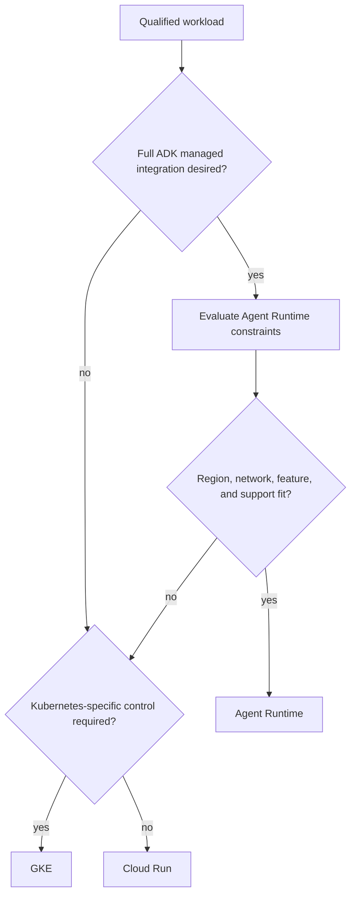
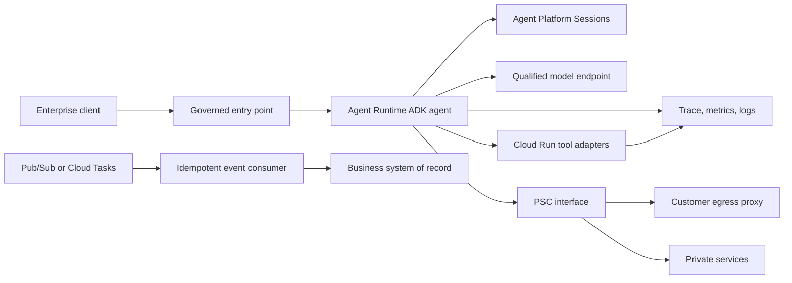
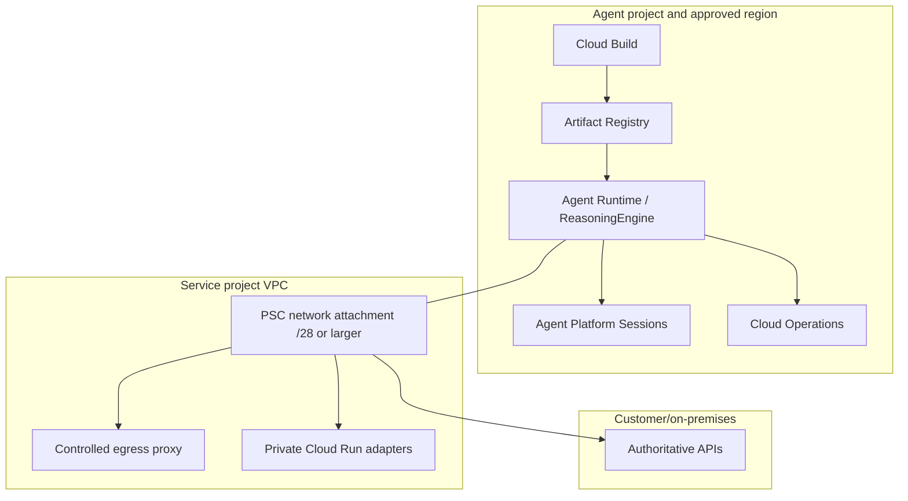
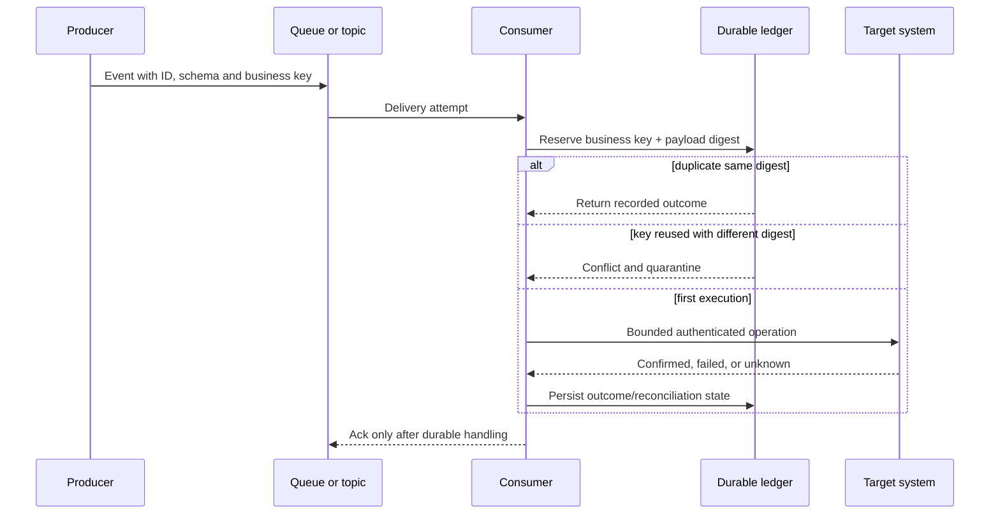
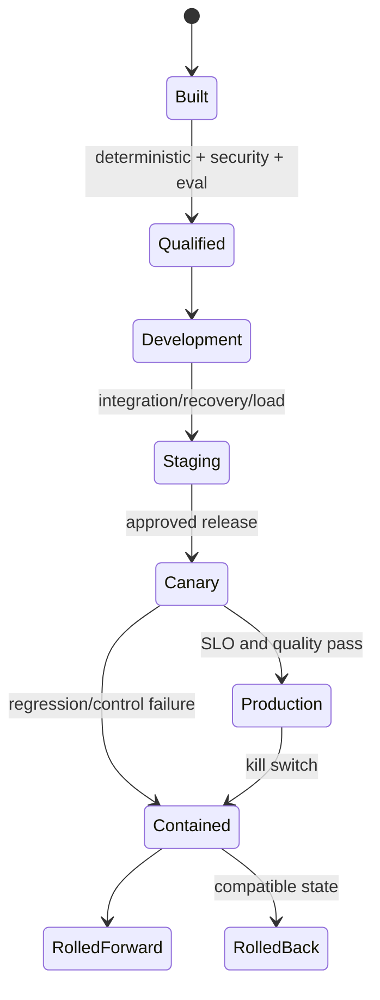

# Volume 4 — Runtime and deployment

> [!CAUTION]
> **Status: Draft — not approved for production use.** Re-researched 2 August
> 2026. Current Agent Runtime deployment, runtime-contract, PSC, monitoring,
> tracing, revision, Cloud Run, and GKE identity documentation was checked. The
> local placement/capacity implementation passes its tests; no customer runtime
> was deployed. See the [evidence ledger](../../references/implementation/volume-4-runtime.md).

**Audience:** Forward Deployed Engineers, platform engineers, SREs, security
engineers, architects, and customer delivery owners.  
**Qualified application baseline:** Python 3.12, ADK 2.6.1, Agent Platform SDK
1.163.0; managed-service availability and maturity are verified at deployment time.

## Mission

Engineer repeatable workload placement, packaging, deployment, scaling, event integration, and release operations across Agent Runtime, Cloud Run, and GKE.

## 🟢 Official Google Capability baseline

Agent Runtime is a managed service for deploying, managing, and scaling agents and integrates fully with ADK. Cloud Run provides managed container execution; GKE provides Kubernetes control for specialized workload requirements. The exact supported frameworks, runtime contract, networking, scaling, identity, region, and preview status come from [Agent Runtime](https://docs.cloud.google.com/gemini-enterprise-agent-platform/build/runtime), [Cloud Run](https://cloud.google.com/run/docs), and [GKE](https://cloud.google.com/kubernetes-engine/docs) documentation.

## Chapter map

| # | Chapter | Engineering outcome | Required artifacts |
|---|---|---|---|
| 1 | Workload placement | Select Agent Runtime, Cloud Run, GKE, or a hybrid using measurable drivers | Decision matrix; ADR; cost/operations comparison |
| 2 | Agent Runtime engineering | Deploy, invoke, version, access, observe, and operate managed agents | Runtime example; IAM; deployment/runbook |
| 3 | Cloud Run engineering | Host agent APIs, tools, adapters, and event handlers with explicit concurrency and network controls | Service module; load test; autoscaling plan |
| 4 | GKE engineering | Operate specialized runtimes requiring Kubernetes scheduling, sidecars, policy, or networking | Cluster/workload modules; policies; SRE runbook |
| 5 | Container and artifact contract | Build minimal, non-root, signed, scanned, reproducible images with SBOM and provenance | Dockerfile; Artifact Registry policy; attestations |
| 6 | Asynchronous execution | Integrate Pub/Sub, Eventarc, Cloud Tasks, and Workflows with idempotent consumers | Event schemas; retry/dead-letter design; lab |
| 7 | Scaling and performance | Model concurrency, cold start, quotas, token latency, tool latency, and backpressure | Load model; dashboards; capacity plan |
| 8 | Build and promotion | Implement Cloud Build/GitHub build, Artifact Registry, Cloud Deploy, approvals, and environment evidence | Pipeline definitions; promotion/rollback sequence |
| 9 | Release strategies | Use revisions, canaries, traffic splitting, schema compatibility, and safe rollback where supported | Release ADR; compatibility matrix; runbook |
| 10 | Runtime recovery and DR | Recover runtime configuration, artifacts, state dependencies, and event backlogs | RTO/RPO map; restore test; regional failure exercise |

## Placement decision flow

## 🟡 Enterprise Architecture Recommendation

Choose the highest-level managed runtime that meets documented workload constraints. Do not select GKE solely for perceived enterprise maturity, and do not select a managed agent runtime without verifying data residency, network path, quota, identity, observability, recovery, and contractual support.

## Runtime acceptance evidence

- Artifact digest, SBOM, provenance, vulnerabilities, and policy verdict.
- Deployment configuration, identity, network, secret, and data dependencies.
- Load, soak, failure, retry, backpressure, and recovery results.
- Traces covering runtime, model, workflow, and tool boundaries.
- Roll-forward and rollback tests, including in-flight execution behavior.

## Exit criteria

Each placement pattern has runnable Terraform and an application example; deployment is immutable and promotion-controlled; capacity and quotas are measured; operational teams can diagnose and recover failures; and every claimed feature is scoped to its documented runtime and maturity.

---

## 11. Executive summary and customer outcome

🔵 **Field Pattern.** Runtime selection is an operational contract, not a product
preference. The selected platform determines how code is packaged, how identity
is issued, what network path exists, how traffic shifts, what fails during an
upgrade, which telemetry is available, and who owns recovery. An FDE must turn
“deploy the agent” into a decision backed by workload measurements and customer
acceptance evidence.

The reference customer operates a regulated case-management workflow. ADK owns
the workflow, Agent Runtime hosts the primary agent, Cloud Run hosts deterministic
tool adapters and event consumers, and an existing GKE platform hosts one
specialized connector that requires Kubernetes policy and sidecars. This hybrid
layout is justified only because each boundary has a different documented need.
It is not an instruction to deploy all three runtimes for every customer.

The business outcome is a recoverable service with bounded latency and cost. A
release is successful only if it preserves business-action correctness, session
compatibility, idempotent tool execution, audit evidence, and an executable
rollback or roll-forward path. A healthy container that loses an approval or
duplicates a write is a failed release.

## 12. Evidence classes and volatility

🟢 **Official Google Capability.** Agent Runtime supports deployment from an
agent object, source, Dockerfile, container image, and Developer Connect. Current
documentation states that Agent Runtime deployment supports Python. A custom
container must listen on `0.0.0.0:8080`; SDK and playground integration require
the documented reasoning-engine endpoints and method modes. Agent Runtime retains
the `ReasoningEngine` API/resource name for backward compatibility.

🟢 **Official Google Capability.** Agent Runtime supports a PSC interface and DNS
peering for private egress to customer VPC, on-premises, and multi-cloud networks.
The runtime itself is in a Google-managed tenant network. Public internet access
through the PSC pattern requires an explicit customer egress path; it must not be
assumed.

🟢 **Official Google Capability — Preview.** Agent Runtime revisions and traffic
splitting are currently Preview and use the `v1beta1` API. A direct request to a
revision bypasses root-resource traffic rules. Versioned and unversioned fields
have different rollout semantics. Customer contractual acceptance is required
before relying on this mechanism for production canaries.

🟡 **Enterprise Architecture Recommendation.** Record maturity per capability,
not per product. Runtime GA does not make revision traffic, every identity mode,
every security detector, or every region GA. The qualification record captures
the source URL and date for each selected capability.

## 13. Discovery workshop

The FDE facilitates a two-hour workshop with product, platform, application,
network, security, data, SRE, support, finance, and change-management owners.
Capture answers as decisions with owners and dates.

### Workload questions

- Is the process request/response, streaming, event-driven, scheduled, or long-running?
- What is the measured arrival distribution, burst factor, service time, token
  latency, external-tool latency, payload size, and memory per concurrent request?
- Does the workload require ADK-managed Sessions, Memory Bank, Code Execution,
  Example Store, evaluation, or observability integration?
- Which operations may commit business side effects, and where is the durable
  idempotency and reconciliation ledger?
- Can a request be safely terminated at a deployment deadline or instance shutdown?
- Which in-flight sessions can cross a code, graph, event, prompt, model, or tool version?

### Platform questions

- Which regions are approved by data, risk, legal, and operations owners and are
  currently supported for every required capability?
- Must the agent reach RFC1918 services, on-premises systems, public SaaS, or the
  internet? Who owns DNS, proxy, NAT, firewall, certificate, and allowlist policy?
- Is the customer already capable of operating GKE upgrades, policies, workload
  identity, service mesh, autoscaling, backup, and incidents around the clock?
- What deployment identities, approvals, segregation, artifact evidence, and
  emergency-change paths are required?
- What are target RTO/RPO, multi-region expectations, support eligibility, quotas,
  and cost limits?

### Workshop outputs

Produce a workload profile, placement ADR, deployment and network diagrams,
identity matrix, dependency and failure map, capacity model, release strategy,
recovery plan, cost envelope, qualification backlog, and named go/no-go owner.

## 14. Logical architecture

The agent does not own the business record. Sessions retain interaction and
workflow context; the authoritative transaction, approval, idempotency record,
and target operation remain in customer-controlled systems. Event consumers do
not infer exactly-once delivery. They reserve a business key before executing.

## 15. Physical deployment and network view

🟡 **Enterprise Architecture Recommendation.** Treat the PSC attachment subnet,
DNS peering, routes, firewall rules, proxy policy, service perimeter, and target
authentication as one reviewed egress design. “Private connectivity enabled” is
not evidence that DNS resolves, the route is symmetric, the target trusts the
runtime identity, or public fallback is impossible.

## 16. Runtime selection matrix

| Driver | Agent Runtime | Cloud Run | GKE |
|---|---|---|---|
| ADK managed integration | strongest documented fit | application-owned adapter | application/platform-owned |
| Language | deployment currently Python | container language choice | container language choice |
| Custom API server | runtime contract/BYOC | native container contract | full Kubernetes control |
| Kubernetes APIs/DaemonSets/custom scheduling | no | no | yes |
| Operational ownership | most managed | managed container | customer Kubernetes platform |
| Private egress | PSC interface pattern | VPC networking patterns | VPC-native cluster patterns |
| Revision traffic | Agent Runtime Preview capability | Cloud Run revisions/traffic | Deployment/Gateway/service-mesh strategy |
| Long-running/event work | qualify documented methods and timeouts | services, jobs, worker pools, event sources | workloads/jobs/queues |
| Portability | framework/runtime contract dependent | OCI/container contract | OCI plus Kubernetes contracts |

Use [the executable placement policy](../../examples/python/fde-production-kit/src/fde_kit/runtime.py)
to make missing region evidence and privileged-host requirements visible. The
function is deliberately conservative and cannot replace a customer ADR.

## 17. Agent Runtime deployment engineering

### Choose a deployment route

- **Agent object:** useful for interactive qualification; least suitable for
  complex non-serializable production components.
- **Source files:** suited to automated workflows and declarative delivery; keep
  the source package within documented size and entrypoint contracts.
- **Dockerfile:** controls system dependencies and server implementation; the
  built container must satisfy the Agent Runtime contract.
- **Container image:** builds once through the customer supply chain and deploys
  an Artifact Registry image; validate the current minimum SDK requirement.
- **Developer Connect:** connects an approved repository; assess connection,
  revision, build identity, evidence, and separation of duties.

The release record contains source revision, dependency lock, Python version,
ADK/SDK versions, artifact digest, SBOM, provenance, vulnerability verdict,
runtime configuration, identity, network attachment, secrets by version,
session/event schemas, model and prompt IDs, evaluation dataset/report, and
rollback target.

### Custom runtime contract

For a custom container, bind to `0.0.0.0:8080`. Implement the documented unary
and streaming routing endpoints only for the operation modes actually exposed.
Reject unknown `class_method` values and unknown input fields. Authenticate the
outer Agent Platform call and authorize the business action again at the tool
boundary. Apply request/body limits, deadlines, cancellation, backpressure,
structured errors, health probes, and graceful termination. The Google `AdkApp`
source is a reference; copying an old endpoint shape without a contract test is
not qualification.

### Identity and secrets

Use Agent Identity or a dedicated service account only after its exact authority
mode and maturity are accepted. Avoid service-account keys. Do not set reserved
runtime environment variables documented by Agent Platform. When deployment-time
secret retrieval uses a service agent and runtime access uses another identity,
review both paths. A secret reference, access grant, rotation test, and revocation
runbook are required; an environment variable containing plaintext is not a secret strategy.

## 18. Cloud Run engineering

🟢 **Official Google Capability.** Cloud Run requires the ingress container to
listen on `0.0.0.0` on the injected/configured port, supports multiple request
concurrency, and applies a managed container security boundary without privileged
mode. Services scale based on requests/events/CPU; jobs and worker pools have
different lifecycle and scaling behavior.

Choose service concurrency from measured CPU, memory, model/tool wait time, SDK
thread safety, connection pools, rate limits, and tail latency. The default is not
a workload qualification. Lower concurrency can protect a non-thread-safe adapter
but increases instance count and cold-start pressure. Minimum instances can lower
cold latency but consume budget. Maximum instances protect cost but can transfer
overload into queues and timeouts. Set downstream admission and backpressure with
the same capacity model.

Cloud Run is a good home for deterministic tool proxies, webhook receivers,
event consumers, policy adapters, and APIs that need an explicit HTTP/container
contract. It is not automatically a durable workflow engine. Do not keep approval,
idempotency, or business state solely in instance memory or its writable filesystem.

## 19. GKE engineering

Select GKE only when a Kubernetes-specific requirement is documented: custom
scheduling, specialized accelerators, service-mesh policy, sidecars not supported
by the chosen managed runtime, operator-managed protocols, or integration with an
existing governed Kubernetes platform. Record why Cloud Run and Agent Runtime do
not meet the constraint.

Use Workload Identity Federation for GKE instead of key files. Define namespace
and Kubernetes service-account ownership, least-privilege IAM, Pod Security,
NetworkPolicy, image admission, resource requests/limits, disruption budgets,
topology spread, autoscaling signals, probes, termination grace, secrets, egress,
upgrade channels, backup, and cluster/platform on-call ownership. An application
team cannot declare GKE production-ready while the cluster control plane and node
lifecycle remain unowned.

## 20. Asynchronous execution and delivery semantics

Pub/Sub, Eventarc, Cloud Tasks, and Workflows solve different orchestration and
delivery problems. Capture ordering scope, retention, retry/backoff, maximum
delivery attempts, dead-letter behavior, task naming, authentication, deadline,
payload size, and replay ownership from current service documentation. None makes
an arbitrary downstream business API exactly once. The consumer creates that
property through durable keys and target reconciliation.

## 21. Capacity, performance, and cost

Estimate concurrent work using arrival rate multiplied by service time, then
divide by safe measured concurrency and add approved headroom. The executable
`required_instances` calculation makes this assumption visible. Validate it with
step, spike, soak, dependency-slowdown, cold-start, retry-storm, and quota tests.

Measure time-to-first-token, full response, workflow/node, model, tool, queue,
approval wait, and persistence independently. Record token input/output/cache,
model pricing class, runtime instance time, minimum instances, egress, telemetry,
storage, build, scanning, and support costs per successful business outcome.
Optimizing cost by suppressing evidence or safety evaluation is not acceptable.

## 22. Release, canary, and rollback

Build once and promote an immutable artifact. Agent Runtime revision traffic is
Preview, so document acceptance and test root-resource routing; direct revision
calls can bypass the split. Cloud Run revisions provide a different traffic model.
GKE rollout behavior depends on Deployment and routing configuration. Never use
one product's semantics to describe another.

Rollback is safe only when event, session, state, prompt, model, approval digest,
and tool contracts remain readable by the old code. If a new release emitted an
irreversible schema, roll forward with a compatibility fix or route in-flight work
to its owning version. Traffic rollback does not undo side effects.

## 23. Observability and SLOs

Agent Runtime provides built-in operational metrics on the ReasoningEngine
monitored resource and integrates with Cloud Trace, Monitoring, and Logging.
Current tracing documentation uses environment variables for `AdkApp`; content
capture is a separate, privacy-sensitive opt-in. Cloud Logging does not cover all
Agent Runtime subresources. Maintain application telemetry for business and
workflow contracts instead of assuming control-plane telemetry is complete.

Minimum runtime SLOs separate entry availability, workflow terminal completion,
correct routing, tool-side-effect correctness, model quality/safety, and customer
outcome. Alert on symptoms and multi-window budget burn. Measure approval wait
separately. Every span includes release, workflow/node, operation, environment,
region, and safe tenant correlation; never use raw prompts or arbitrary tool
parameters as metric labels.

## 24. Failure and recovery matrix

| Failure | Containment | Recovery evidence |
|---|---|---|
| deployment/import failure | keep previous artifact active | build/runtime logs and corrected immutable artifact |
| region/capability mismatch | block create/update | dated location and feature qualification |
| PSC/DNS/egress failure | fail closed; no public fallback | route, DNS, firewall, proxy and target-auth tests |
| runtime/model saturation | shed/admit/queue within deadline | capacity and quota evidence |
| session/resume incompatibility | route by version; pause affected work | event/state migration and replay test |
| unknown business write | stop retries; reconcile target | durable operation record |
| bad canary | kill switch and traffic containment | quality/SLO comparison and compatible rollback |
| artifact compromise | revoke/deprecate revision and identity | provenance, incident and clean rebuild |

DR is a dependency graph. Source, artifact, configuration, policy, secrets,
identity, network, sessions, business state, queues, evaluation evidence, and
audit records receive distinct RTO/RPO and restore procedures. A redeploy is not
a session restore; a data restore is not proof that queued events will not repeat.

## 25. Security considerations

Threat-model deployment authority, artifact substitution, dependency compromise,
secret exposure, over-privileged runtime identity, confused deputy, public/hidden
egress, SSRF, poisoned event payload, cross-tenant state, prompt/tool injection,
direct revision bypass, telemetry leakage, and destructive rollback. Enforce
artifact policy, identity separation, method/parameter authorization, network
allowlists, schema validation, budgets, immutable evidence, and emergency revocation.

The runtime identity authenticates the workload; it does not prove that a user
may perform a business action. Preserve the user/agent/tool decision context and
authorize at the enforcement point. High-risk writes require independent approval
bound to the exact action version.

## 26. CI/CD implementation contract

The pipeline performs source/secret/dependency/IaC checks, unit and graph tests,
hermetic evaluation, online evaluation in an approved project, artifact build,
SBOM/provenance/vulnerability policy, development deployment, contract and
failure tests, staging load/recovery, independent approval, canary, automated
containment, and evidence archiving. Deployment and runtime identities are
separate. Production mutation never occurs in a pull-request validation job.

The shared implementation is tested by
[the Volumes 4–10 CI workflow](../../.github/workflows/volumes-4-10-ci.yml).
Customer Terraform belongs in an approved platform stack with remote state,
saved plans, policy checks, service identities, and exact environment values;
this volume does not fabricate a universal network or organization hierarchy.

## 27. FDE notebook: why each platform?

**Why Agent Runtime?** Use it when ADK/full managed integration, documented
runtime features, region, identity, network, observability, quotas, maturity, and
support satisfy the customer. Evidence that changes the decision includes a
missing region, unsupported protocol, unacceptable Preview dependency, or network
contract that cannot be met.

**Why Cloud Run?** Use it for a stateless HTTP/container boundary, tool adapter,
event consumer, or custom service where its contract and scaling fit. Reject it
as the sole solution when durable orchestration or Kubernetes-only controls are required.

**Why GKE?** Use it for real Kubernetes-specific requirements and only when the
customer owns the operational burden. Familiarity or “enterprise” branding is
not a requirement.

**Why ADK?** It has full Agent Runtime integration and explicit workflow/session
contracts. A custom framework remains valid if its benefits exceed integration,
testing, migration, and operations cost. “Why not LangGraph?” is answered from
the workload, team capability, current Agent Runtime integration level, and exit
cost—not loyalty to a library.

**Why Gateway and Registry?** They govern communications and inventory when
their current modes, topology, maturity, and customer controls fit. They do not
replace application authorization or the business system of record.

## 28. Common mistakes

### Implementation artifact map

🔵 **Field Pattern.** The typed Python placement/capacity implementation is
[`fde_kit.runtime`](../../examples/python/fde-production-kit/src/fde_kit/runtime.py).
The governed-cell [Terraform](../../terraform/volume-2-platform/README.md) supplies
remote-state, identities, Artifact Registry, runtime/network and evidence
foundations; the [Volume 3 package](../../examples/python/adk-enterprise-workflow/README.md)
is the deployable ADK workload. Cloud Build validates/builds it, Cloud Deploy
promotes the immutable customer artifact, and [GitHub Actions](../../.github/workflows/volumes-4-10-ci.yml)
tests this volume's contracts. Runtime-specific Terraform is added only from a
documented provider/API resource; the handbook does not invent an Agent Runtime,
Gateway or revision resource merely to satisfy an IaC diagram.

- Selecting GKE before identifying a Kubernetes-only requirement.
- Calling an Agent Runtime object deployment a reproducible production pipeline.
- Treating traffic splitting as GA or assuming revision-direct calls obey the split.
- Enabling PSC without testing DNS, routes, proxy, target identity, and failure behavior.
- Using session state or local disk as an approval/idempotency/business ledger.
- Blindly retrying a write after timeout.
- Setting concurrency from a default rather than measured per-request resources.
- Logging prompts, responses, user IDs, or tool parameters without privacy approval.
- Rolling back code across an incompatible event/state/tool schema.
- Claiming multi-region DR after only redeploying an artifact.

## 29. Production checklist

- [ ] Placement ADR records measured drivers and rejected alternatives.
- [ ] Current region, maturity, quota, support, network, and identity evidence is attached.
- [ ] Artifact digest, SBOM, provenance, scan and policy verdict are immutable.
- [ ] Runtime contract, probes, deadlines, cancellation, termination, and errors are tested.
- [ ] PSC/VPC/DNS/egress and target authentication fail closed.
- [ ] Sessions, events, business state, approvals, idempotency and artifacts have owners.
- [ ] Capacity, concurrency, maximum/minimum instances, queue and quota limits are load-tested.
- [ ] Deterministic, model, adversarial, integration, resume, recovery and cost gates pass.
- [ ] Canary mechanism maturity is accepted and bypass paths are controlled.
- [ ] Rollback/roll-forward, kill switch, reconciliation, DR and customer communications are drilled.
- [ ] SLOs, alerts, dashboards, on-call, support and evidence retention are accepted.

## 30. Architecture decision record

**Decision:** Use Agent Runtime for the ADK agent, Cloud Run for deterministic
tool adapters, and no new GKE cluster.  
**Context:** The customer needs managed ADK sessions and observability, private
access to two APIs, and stateless tool boundaries. No Kubernetes-only control is
required.  
**Consequences:** Qualify the Agent Runtime location and PSC path; own two runtime
contracts; preserve business state outside both; accept only explicitly selected
Preview features.  
**Validation:** Run the placement policy, build/runtime contract tests, PSC
failure lab, load/soak, session resume, unknown-write reconciliation, canary, and
DR drill.  
**Revisit when:** a capability changes maturity/region, the workload needs a
Kubernetes primitive, the network contract changes, or SLO/cost evidence fails.

## 31. Customer workshop and lab

Run [the Volume 4 qualification lab](../../labs/volume-4-runtime/README.md). The
customer team must render the workload record, validate placement, deploy only to
an authorized sandbox, test the runtime contract and private path, inject
dependency failures, measure capacity, exercise canary/rollback, and attach
evidence. The lab provides no generic cloud cleanup command because runtime,
session, network, and evidence resources can be shared or retention-controlled.

## 32. Operations checklist

- [ ] Operators can map request → revision → workflow/node → tool operation.
- [ ] They can distinguish deployment, runtime, model, network, session, and target failures.
- [ ] Every alert names an owner, threshold rationale, runbook, and containment action.
- [ ] Unknown writes enter reconciliation and do not trigger automatic write retries.
- [ ] Old vulnerable revisions cannot be queried and quota is reclaimed deliberately.
- [ ] Restore evidence is current for every stateful dependency.
- [ ] Prompt/response capture, retention, access, deletion, and incident handling are approved.

## 33. Cost optimization

Optimize in order: remove unnecessary model/tool work; bound loops and context;
cache only safe/versioned reads; right-size model and runtime; tune concurrency
from load data; choose minimum instances from cold-latency value; batch compatible
event work; sample telemetry without losing audit evidence; and delete obsolete
revisions/artifacts according to retention. Track cost per successful business
outcome and reconciliation—not cost per API call alone.

## 34. Official references

- [Agent Starter Pack at the reviewed Google commit](https://github.com/GoogleCloudPlatform/agent-starter-pack/tree/659f047742457bd55e5db0edd088cf678b6f0669)
- [Cloud Run Python sample at the reviewed Google commit](https://github.com/GoogleCloudPlatform/python-docs-samples/tree/19f0efaa4a58007c9aa17ffe70e8101e6810abe6/run/helloworld)
- [Agent Runtime](https://docs.cloud.google.com/gemini-enterprise-agent-platform/build/runtime)
- [Deploy an agent](https://docs.cloud.google.com/gemini-enterprise-agent-platform/scale/runtime/deploy-an-agent)
- [Agent Platform runtime contract](https://docs.cloud.google.com/gemini-enterprise-agent-platform/scale/runtime/runtime-contract)
- [PSC interface for Agent Runtime](https://docs.cloud.google.com/gemini-enterprise-agent-platform/scale/runtime/private-service-connect-interface)
- [Agent Runtime revisions and traffic — Preview](https://docs.cloud.google.com/gemini-enterprise-agent-platform/scale/runtime/manage-revisions-and-traffic)
- [Agent Runtime monitoring](https://docs.cloud.google.com/gemini-enterprise-agent-platform/scale/runtime/monitoring)
- [Agent Runtime tracing](https://docs.cloud.google.com/gemini-enterprise-agent-platform/scale/runtime/tracing)
- [Agent Runtime logging](https://docs.cloud.google.com/gemini-enterprise-agent-platform/scale/runtime/logging)
- [Cloud Run container contract](https://docs.cloud.google.com/run/docs/container-contract)
- [Cloud Run concurrency](https://docs.cloud.google.com/run/docs/about-concurrency)
- [Workload Identity Federation for GKE](https://docs.cloud.google.com/kubernetes-engine/docs/concepts/workload-identity)
- [Implementation evidence ledger](../../references/implementation/volume-4-runtime.md)

## 35. Next volume

[Volume 5](../volume-5-security/README.md) applies identity, Gateway, Registry,
Model Armor, network, data, tool, supply-chain, and audit controls across these
runtime boundaries.
