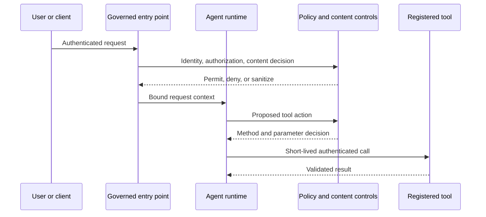
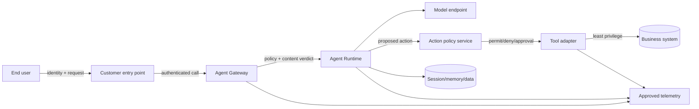
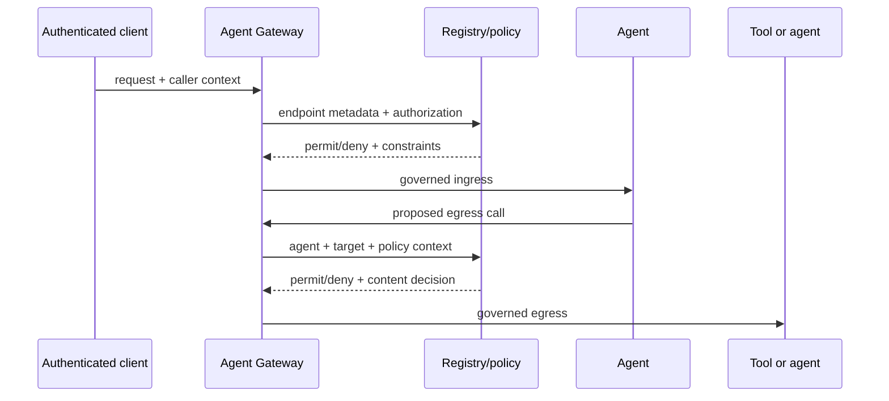
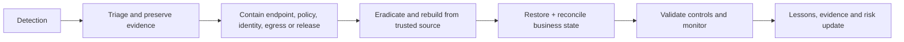

# Volume 5 — Security and governance

> [!CAUTION]
> **Status: Draft — not approved for production use.** Re-researched 2 August
> 2026 against current Google Cloud Agent Platform, IAM, Model Armor, Security
> Command Center, VPC Service Controls, Secret Manager, and supply-chain
> documentation. Product maturity is recorded per capability and authentication
> mode. The local policy implementation passes its tests; no customer policy or
> cloud resource was changed. See the [evidence ledger](../../references/implementation/volume-5-security.md).

**Audience:** Forward Deployed Engineers, security architects, IAM/network teams,
platform engineers, privacy and risk owners, SREs, and customer control owners.  
**Qualification baseline:** Google Cloud organization policy, data classification,
legal/privacy decisions, locations, support, quotas, and feature maturity are
revalidated in the customer's authorized environment.

## Mission

Define enforceable identity, authorization, network, content, data, tool, software-supply-chain, and audit controls for enterprise agent systems. Security claims are capability-specific; a platform-level GA label never implies every authentication mode, API, region, or integration is GA.

## 🟢 Official Google Capability baseline

Agent Identity provides per-agent cryptographic identity based on SPIFFE; Agent Gateway governs supported agentic communication modes; Agent Registry catalogs agents and MCP servers; Model Armor inspects content; IAM and VPC Service Controls enforce applicable access boundaries. Current maturity and limitations must be read from [Agent Identity](https://docs.cloud.google.com/gemini-enterprise-agent-platform/govern/agent-identity-overview), [Agent Gateway](https://docs.cloud.google.com/gemini-enterprise-agent-platform/govern/gateways/agent-gateway-overview), [Agent Registry](https://docs.cloud.google.com/gemini-enterprise-agent-platform/govern/agent-registry), and [release notes](https://docs.cloud.google.com/gemini-enterprise-agent-platform/release-notes).

## Chapter map

| # | Chapter | Engineering outcome | Required artifacts |
|---|---|---|---|
| 1 | Threat model | Model user, agent, model, tool, data, memory, runtime, supply-chain, and operator threats | Threat catalog; attack trees; trust-boundary diagrams |
| 2 | Identity architecture | Distinguish end user, client, agent, workload, service, tool, and operator identities | Identity matrix; token/certificate sequence; ADR |
| 3 | IAM and least privilege | Map principals to deployment, invocation, model, data, tool, and administration permissions | Role matrix; IAM Terraform; access tests |
| 4 | Workload Identity Federation | Remove long-lived keys from GitHub, external workloads, and delivery systems | Federation module; claims policy; rotation/revocation runbook |
| 5 | Agent Identity | Apply supported own-authority and delegated-authority patterns with maturity caveats | Auth-provider design; SPIFFE mapping; integration tests |
| 6 | Agent Gateway | Govern supported ingress/egress paths, registration, policy delegation, and observability | Deployment topology; authorization sequences; failure modes |
| 7 | Agent Registry and lifecycle governance | Control registration, ownership, interfaces, versions, approval, discovery, and retirement | Metadata schema; publication workflow; inventory controls |
| 8 | Content and model security | Place Model Armor and deterministic validators at documented inspection points | Inspection matrix; policy config; adversarial tests |
| 9 | Edge and network protection | Apply load balancing, Cloud Armor, private connectivity, DNS, firewall, and egress controls | Network/security diagrams; policy tests; runbooks |
| 10 | Tool, MCP, and A2A security | Authenticate peers, authorize methods, constrain parameters, validate content, and audit side effects | Tool threat model; allowlist; contract and abuse tests |
| 11 | Data, secrets, and privacy | Classify and protect prompts, outputs, state, memory, artifacts, traces, evaluations, and secrets | Data-flow map; retention matrix; key/secret lifecycle |
| 12 | Supply chain and assurance | Secure source, dependencies, builds, artifacts, IaC, deployment, evidence, and emergency change | SLSA-oriented controls; SBOM; attestations; audit pack |

## Security control path



## 🟡 Enterprise Architecture Recommendation

Authorize the proposed business action, not merely access to a tool endpoint. Bind policy to agent identity, end-user authority when delegated, tool/method, parameter constraints, data classification, environment, and risk tier. High-risk actions require deterministic validation and independent approval.

## Mandatory threat cases

- Direct and indirect prompt injection.
- Confused deputy and privilege escalation.
- Tool poisoning, schema manipulation, and malicious MCP metadata.
- Cross-tenant state, memory, cache, trace, or evaluation leakage.
- Credential exfiltration and unauthorized delegation.
- SSRF, unrestricted egress, callback forgery, replay, and duplicate side effects.
- Artifact, dependency, prompt, skill, model, or deployment supply-chain compromise.
- Excessive agency, unbounded cost, and audit-evidence tampering.

## Exit criteria

Every trust boundary has an authenticated principal and enforcement owner; authorization is tested at method and parameter level; customer data handling is approved; red-team and recovery exercises pass; preview constraints are accepted explicitly; and the platform can revoke an agent, credential, tool, artifact, or release without relying on model cooperation.

---

## 1. Customer outcome and security argument

🔵 **Field Pattern.** The deliverable is not a collection of enabled security
products. It is a defensible argument that every consequential business action is
authenticated, authorized, constrained, observable, revocable, and recoverable.
The model is an untrusted decision assistant inside that argument. Natural-language
intent is evidence, never an authorization credential.

Use this volume for a representative regulated case-workflow. Employees ask an
agent to summarize a case, retrieve approved records, draft a response, and—in a
strictly controlled path—propose an update. The user, calling application, agent,
runtime workload, Gateway, model, retrieval service, tool adapter, and business
system are distinct principals or enforcement boundaries. An FDE must be able to
answer: who requested the action, under whose authority, through which approved
agent and tool version, against which record, after which policy and content
decisions, with which approval, and how access can be revoked.

The minimum security argument contains:

1. a dated capability and maturity inventory;
2. a data-flow and trust-boundary model;
3. a principal and credential inventory;
4. deterministic method-and-parameter authorization;
5. content inspection at selected ingress and egress boundaries;
6. network and exfiltration containment;
7. immutable software and policy provenance;
8. privacy-approved telemetry and retention;
9. adversarial, abuse, revocation, and recovery evidence; and
10. named residual-risk acceptance by the customer.

## 2. Capability and maturity baseline

🟢 **Official Google Capability.** Agent Gateway is the policy-aware communication
boundary for supported client-to-agent and agent-to-tool/agent traffic. Current
documentation describes Registry lookup, Agent Identity, Context-Aware Access,
mTLS/DPoP, delegated authorization, Model Armor integration, and observability.
Google's 18 June 2026 release notes announce Agent Gateway generally available,
and 24 June notes announce Model Armor for Agent Gateway generally available.

🟢 **Official Google Capability with mode-specific maturity.** Agent Identity
supports documented authority and authentication combinations. The current
identity page marks three-legged OAuth user delegation for external services as
Preview. Own-authority access to Google Cloud and user-delegated access are not
interchangeable. Check the exact target, hosting product, region, authentication
mode, and terms before committing to it.

🟢 **Official Google Capability.** Agent Registry centrally catalogs agents,
tools, and MCP servers. Registration and discovery do not prove that an entry is
safe, approved for a given user, compatible with the caller, or authorized to
execute an action. Registry metadata is an input to policy and lifecycle controls.

🟢 **Official Google Capability.** Model Armor can inspect prompts and responses
passing through Agent Gateway and can block or redact according to a template.
Its filters address categories including prompt injection, jailbreaks, sensitive
data, malicious URLs, and harmful content. Exact supported locations, filters,
limits, request formats, and integration behavior must be checked at deployment.

🟢 **Official Google Capability — Preview.** Agent Platform Threat Detection in
Security Command Center is currently Preview. The current overview places it in
Premium and the deprecated Enterprise tier, describes runtime and control-plane
detection for Agent Runtime workloads, and states that findings appear in SCC.
It is detection, not preventive authorization or a substitute for application
logs. The Enterprise SCC tier retirement described by Google is a separate
commercial migration concern and must be checked with the customer.

🟡 **Enterprise Architecture Recommendation.** Freeze a capability ledger at
design approval and repeat it at production promotion. A single statement such
as “Agent Platform is GA” is not acceptable evidence. When overview pages,
release notes, or feature pages conflict, record the conflict, prefer the most
specific current authoritative page for the selected feature, and obtain Google
support confirmation for material ambiguity.

## 3. Security discovery workshop

The FDE runs the workshop with the business owner, application and platform
teams, IAM, network, SOC, privacy/legal, records management, and operations. Do
not accept “internal data” or “service account access” as sufficient detail.

| Question | Evidence required | Design consequence |
|---|---|---|
| Which outcomes may the agent read, propose, approve, or execute? | business-action catalog and impact rating | tool allowlist, approval tier, kill switch |
| Whose authority applies to each action? | principal/authority matrix | own-authority versus delegated flow |
| Which data enters prompts, state, memory, traces, evaluations, or findings? | field-level classification and lineage | inspection, minimization, residency, retention |
| What is the system of record? | owner and API contract | no model/session as authoritative ledger |
| Which destinations are necessary? | DNS/API/port and owner inventory | explicit egress and target authentication |
| What must never be autonomous? | legal/risk decision | hard policy denial or independent approval |
| How quickly must access be revoked? | incident and personnel SLA | credential lifetime, cache, session invalidation |
| What evidence can operators view? | privacy/SOC approval | log fields, redaction, access and retention |
| Which Pre-GA dependencies exist? | dated feature ledger and terms acceptance | alternative design and exit plan |

Workshop outputs are owned records, not meeting notes: threat model, DFD,
principal matrix, action catalog, control/evidence matrix, data inventory, risk
register, exception register, adversarial plan, incident roles, and go/no-go gates.

## 4. Trust boundaries and data flow



The diagram must be specialized with projects, VPCs, service perimeters,
locations, DNS paths, identities, credential exchanges, data classes, logging
sinks, external processors, and owners. Mark every place content is persisted or
copied. Browser history, CI logs, exception payloads, evaluation datasets, SCC
findings, and support bundles are data stores even when teams do not call them so.

### 4.1 Boundary rule

At every arrow, record protocol, caller identity, target identity, end-user
context, authorization owner, content inspection, encryption, replay protection,
timeout/retry behavior, audit record, and failure mode. A boundary without an
owner is a release blocker.

### 4.2 Confused-deputy rule

An agent workload identity proves which workload made a call. It does not carry
unlimited permission from the user and must not silently elevate the user. Bind
an authorization decision to the normalized action: tenant, subject, agent,
workflow version, tool, method, resource, constrained parameters, purpose,
environment, data class, approval, and expiry.

## 5. Threat model

Use attacker objectives and business impact, not only component vulnerabilities.

| Surface | Representative threat | Preventive control | Detective/recovery evidence |
|---|---|---|---|
| user input | direct prompt injection or authorization spoofing | schema, action policy, least privilege | denied-action and adversarial results |
| retrieved content | indirect injection or poisoned record | provenance, isolation, treat text as data | source/version trace and evaluation |
| model output | unsafe content or fabricated command | Model Armor where supported; deterministic validator | verdict and blocked-action metric |
| tools/MCP/A2A | metadata poisoning, method abuse, parameter smuggling | registered endpoint, contract validation, per-action authz | request hash and target audit |
| identity | token theft, replay, confused deputy | short-lived credentials, audience/binding, delegated scope | token/access anomaly investigation |
| state/memory | cross-user leakage or instruction persistence | partition, ownership checks, sanitization, deletion | isolation and deletion tests |
| network | SSRF, DNS rebinding, covert egress | explicit egress, target allowlist, redirect/IP validation | flow/DNS/proxy logs and drills |
| supply chain | malicious dependency, prompt, image, action, policy | review, pinning, SBOM, provenance, admission | reproducible release evidence |
| operator | excessive admin, break-glass abuse | separation of duties, PAM, approval | immutable admin/audit review |
| telemetry | secret/PII leakage or evidence tampering | minimization, redaction, CMEK where applicable, access | canary-secret and retention tests |
| availability/cost | loop, fan-out, token or tool exhaustion | budgets, deadlines, admission, quotas | spend/SLO alert and containment |

Model direct injection, indirect injection through every untrusted corpus and tool
result, data exfiltration in output and tool parameters, hostile filenames/URLs,
Unicode/encoding bypasses, multi-turn attacks, memory poisoning, social
engineering of approvers, and attacks that combine low-risk calls into a
high-impact action. Threat cases become automated tests and operator exercises.

## 6. Identity architecture

### 6.1 Principal matrix

| Principal | Authentication | May do | Must not do |
|---|---|---|---|
| end user | customer workforce or consumer IdP | invoke allowed experience | deploy, impersonate agent, bypass policy |
| client application | workload identity/OAuth client | call approved entry point | become user authority without delegation |
| agent | Agent Identity or runtime service account as supported | invoke selected model/tools | administer its own policy or identity |
| tool adapter | runtime workload identity | call one bounded backend surface | broad project/editor access |
| deployment pipeline | Workload Identity Federation | deploy approved digest/config | serve runtime traffic or access business data |
| policy administrator | workforce identity + controlled role | author policy | self-approve production release where prohibited |
| break-glass operator | time-bound elevated identity | contain/recover incident | routine operation or silent access |

🔵 **Field Pattern.** Separate identities by environment and responsibility.
Runtime, build, deploy, policy administration, evaluation, and break-glass
functions do not share a service account. Avoid service-account keys. For
external deployment systems, Google recommends Workload Identity Federation;
restrict pool principals with mapped attributes and conditions instead of
granting an entire pool.

### 6.2 Delegation

Delegation is an explicit protocol. Record the authenticating IdP, consent,
requested and granted scopes, subject, audience, expiry, refresh-token custody,
revocation, downstream token exchange, and audit correlation. If Agent Identity
and Gateway keep a raw user credential out of the agent in the selected supported
flow, document that exact flow; do not generalize the property to custom code.

When delegated access is unsupported, Pre-GA, or unacceptable, use a customer-
approved intermediary with an independently authenticated user, bounded business
API, and short-lived action authorization—or remove the feature. Never place a
user's durable OAuth token in prompt text, session state, or agent-visible memory.

## 7. IAM and authorization

IAM answers whether a principal may call a Google Cloud API on a resource. It
does not necessarily answer whether Alice may close Case 42 for reason X. Apply
both layers:

1. **Cloud authorization:** minimal predefined roles at the narrowest practical
   resource; custom roles only with ownership and drift review.
2. **Business-action authorization:** method, record/tenant, permitted field
   changes, numeric/enum boundaries, purpose, risk, user authority, approval,
   version, and time.

The shared [`fde_kit.security`](../../examples/python/fde-production-kit/src/fde_kit/security.py)
implementation demonstrates fail-closed parameter authorization. It is a
dependency-free reference, not a universal production policy engine.

```python
from fde_kit.security import ActionContext, Policy, authorize

ctx = ActionContext(
    user="employee:123", agent="case-agent-v7", tenant="customer-a",
    tool="case-api", method="update_status", resource="case/42",
    parameters={"status": "PENDING_REVIEW"}, risk="high", approved=True,
)
decision = authorize(ctx, Policy(
    allowed_methods={"case-api": {"update_status"}},
    allowed_parameter_values={"status": {"PENDING_REVIEW"}},
    approval_risks={"high"}, mandatory_threat_controls=frozenset({
        "prompt_injection", "confused_deputy", "credential_exfiltration"
    }),
))
assert decision.allowed
```

Policy tests include absent fields, altered case ID, cross-tenant subject,
unexpected method, Unicode/encoded parameter, extra field, stale approval,
replayed request, policy outage, and mismatch between proposed and executed
action. Default behavior is deny; a model cannot override the verdict.

## 8. Agent Gateway, Registry, and policy topology

🟢 **Official Google Capability.** The current Gateway overview documents
client-to-agent ingress and agent egress modes, Registry metadata, identity,
delegated policy, and observability. Use the exact supported topology guide for
the customer. “Put it behind Gateway” is incomplete until the caller, endpoint,
registration scope, network path, target type, auth delegation, and failures are
specified.



### Registry production metadata

Require owner, business purpose, environment, location, identity, endpoint and
protocol, interface/schema version, allowed callers, data classes, action risk,
support tier, SLO, dependencies, approval status, maturity constraints, evidence
links, artifact digest, policy version, last review, retirement date, and incident
contact. Publication is a controlled lifecycle: proposed → validated → approved →
available → deprecated → revoked → retired.

Registry discovery never auto-authorizes a call. Prevent name-squatting and
metadata poisoning through controlled publishers, schema validation, review,
immutable version evidence, and consumer pinning. Test removal and revocation;
inventory without a working kill switch is not governance.

### Gateway failure semantics

Gateway, Registry, policy, identity, or Model Armor failure denies protected
writes. Define separately whether a narrow read-only degraded mode is allowed.
Cache only signed/versioned decisions with short expiry and explicit revocation
semantics. Alert on policy bypass, direct endpoint access, registry drift, content
service errors, authentication spikes, denied calls, and unknown targets.

## 9. Content and model security

🟢 **Official Google Capability.** Model Armor integrated with Agent Gateway can
screen client-to-agent requests/responses using configured templates. Supported
flows and configuration are defined by the current integration documentation.

🟡 **Enterprise Architecture Recommendation.** Content inspection is one layer.
It does not grant authority, prove factual accuracy, enforce a business invariant,
or make arbitrary tool execution safe. Place controls at four points:

- **before model:** authenticate, validate envelope, classify, minimize, inspect;
- **after retrieval/tool read:** preserve provenance and isolate instructions from data;
- **before tool write:** parse a typed action, validate invariants and authorize;
- **before user/output/tool egress:** inspect, redact or block and record the verdict.

Define template owner, version, threshold rationale, false-positive/negative
process, exception path, residency, latency budget, unavailable behavior, and
monitoring. Store content only when approved; a verdict, template version, request
hash, category and enforcement action are often sufficient audit evidence.

Adversarial gates include known injection corpora, customer threat cases,
obfuscation/encoding, split attacks across turns, malicious retrieved documents,
tool result injection, secrets and synthetic PII, malicious URLs, safe-content
regression, latency, availability, and policy-bypass attempts. Never put real
customer secrets into a red-team corpus.

## 10. Tool, MCP, and A2A security

Treat tool descriptions, schemas, server instructions, resource names, and agent
cards as untrusted supply-chain input. An MCP server or remote agent is a software
dependency and a security principal, not a harmless prompt extension.

For each operation, enforce:

- registered and approved endpoint/version/digest where applicable;
- authenticated peer and expected audience;
- permitted caller agent and end-user authority;
- strict schema with unknown fields rejected;
- resource/tenant ownership and parameter bounds;
- egress destination, redirect, DNS and IP restrictions;
- request deadline, result size, rate/cost budget and circuit breaker;
- idempotency key and unknown-write reconciliation;
- content validation/inspection on inputs and results;
- immutable action decision and target-system audit correlation.

High-impact actions use prepare/approve/commit. The model proposes a canonical
action. Deterministic code validates it. An authorized human or independent
service approves the exact hash and expiry. The executor revalidates immediately
before commit. Any mutation invalidates approval.

## 11. Network and exfiltration controls

Draw actual ingress and egress. Use private connectivity and service perimeters
where supported and appropriate, but do not treat “private IP” as authorization.
Authenticate endpoints, enforce TLS, restrict routes, firewall/proxy targets and
DNS, and test failure. PSC attachments, private Google access paths, load
balancers, Gateway paths, and on-premises routes each have distinct semantics.

SSRF controls resolve and validate the final destination, restrict schemes and
ports, reject unsafe redirects, block link-local/metadata/internal ranges unless
explicitly required, revalidate DNS/IP changes, bound response sizes and times,
and prevent user-controlled proxy configuration. An allowlisted hostname with an
unrestricted redirect is not an allowlist.

VPC Service Controls can reduce data-exfiltration risk for supported services,
but it does not protect every service or application path. Document protected
resources, ingress/egress policy, access levels, dry-run findings, exceptions,
unsupported dependencies, and break-glass. Test from intended and forbidden
networks/principals.

## 12. Data, privacy, secrets, and keys

Build a field-level inventory for input, output, retrieval, tool arguments,
sessions, Memory Bank or application memory, caches, artifacts, evaluations,
traces, logs, metrics, findings, support data, and backups. For each record:
owner, purpose, subject/tenant key, class, residency, processor, encryption,
access, retention, deletion, legal hold, backup, and incident route.

Minimize before sending data to a model or control service. Pseudonymization is
not automatically anonymization. Do not claim customer-managed encryption keys,
data residency, non-retention, or training behavior unless the selected service,
location, configuration, and contract explicitly support the claim.

Use Secret Manager or another customer-approved secrets system, runtime identity,
least privilege, version pinning where rollout requires it, rotation, revocation,
access logging, and leak detection. Secrets never belong in source, image layers,
Terraform state, prompt templates, tool descriptions, session/memory, exception
text, CI output, or telemetry. Exercise rotation while traffic is active and
revocation during an incident.

## 13. Software supply chain and policy change

The production unit is code + prompts/instructions + model configuration + tool
schemas + policies + infrastructure + dependencies + data/evaluation versions.
Review and version all of it.

Required pipeline evidence:

1. protected source and reviewer identity;
2. secret, dependency, license, SAST, IaC and policy checks;
3. pinned dependency lock and reproducible tests;
4. deterministic/adversarial/authorization/evaluation results;
5. container or package digest, SBOM, provenance and vulnerability verdict;
6. signed/controlled promotion of the same immutable artifact;
7. policy and prompt/config diff with approval;
8. deployment identity separated from runtime identity;
9. canary, containment and recovery evidence; and
10. retained release manifest mapping every version and approver.

Never run untrusted pull-request code with production credentials. Use Workload
Identity Federation with repository, organization, branch/environment and
workflow claims constrained to the approved pipeline. Pin third-party CI actions
to reviewed commit SHAs and update them through a controlled dependency process.

## 14. Audit and observability

Correlate user request → authenticated subject → Gateway request → agent/workflow
version → policy/content decisions → model/retrieval steps → proposed action →
approval → tool call → target-system commit. Do not require raw prompts to obtain
this chain.

Minimum structured fields are timestamp, environment, tenant pseudonym, request
and trace IDs, subject/agent/tool identities, release and policy versions, action
type/resource pseudonym, decision and reason code, approval ID/hash, idempotency
key, target transaction ID, latency/outcome, and evidence classification.

Separate debugging telemetry from immutable business/security audit. Restrict
both. Validate redaction with canary tokens; scan logging paths for synthetic
secrets and PII; test retention and deletion; alert on sink/route/config change.
Cloud Audit Logs coverage varies by service and operation, so build a coverage
matrix rather than asserting “everything is audited.”

## 15. Detection, incident response, and revocation

🟢 **Official Google Capability — Preview.** SCC Agent Platform Threat Detection
can produce Agent Runtime threat findings for supported runtime and control-plane
activity. The current service description notes that a watcher may take time to
start and that collected information is processed in memory unless reported as a
finding. Operators must understand detector coverage, delay, finding contents,
CLI-argument sensitivity configuration, roles, and tier.

Detection sources include Gateway/Agent Observability, runtime/application logs,
Cloud Audit Logs, target-system audit, IAM changes, network/DNS/proxy telemetry,
Model Armor verdicts, artifact/policy changes, and SCC findings. Normalize them
into an incident timeline without copying disallowed content.



Practice revoke-agent, revoke-user-delegation, disable-tool, remove-registry
entry, deny-egress, rotate-secret, block-artifact, rollback-policy, contain bad
content template, stop costly loop, and reconcile unknown writes. Revocation must
propagate through caches, long sessions, queues and in-flight work within the
customer SLA.

## 16. Security testing program

| Test family | Examples | Release condition |
|---|---|---|
| identity | wrong audience, expired/replayed token, disabled agent | all fail closed and are observable |
| authorization | cross-tenant, extra parameter, stale/mutated approval | no target-side mutation |
| content | direct/indirect injection, secret exfiltration, obfuscation | threshold and safe-regression budget pass |
| network | forbidden DNS/IP/redirect, metadata endpoint, policy outage | blocked with useful evidence |
| isolation | session/cache/memory/evaluation/log tenant probes | no cross-boundary disclosure |
| supply chain | changed digest, unsigned artifact, vulnerable dependency | admission/promotion blocked |
| detection | synthetic finding paths and telemetry outage | routed to named owner in SLA |
| recovery | key rotation, identity/tool/release revocation | measured propagation and reconciliation |

Use synthetic data and an authorized environment. Red-team authorization records
scope, prohibited techniques, contacts, stop conditions, evidence handling, and
cleanup. A successful block without an operator-visible reason can still be an
operational failure; a detector hit without containment ownership is only a finding.

## 17. CI/CD and qualification contract

[The shared workflow](../../.github/workflows/volumes-4-10-ci.yml) runs local
policy and qualification tests without cloud mutation. Customer deployment adds
approved IaC, policy-as-code, organization constraints, artifact admission,
online integration tests, and evidence upload in an authorized project. The
pipeline fails if evidence is missing; it does not convert `false` to `true`.

Production gates require current source/maturity review, threat-model approval,
principal/action/data/network inventories, method-and-parameter tests, content
and adversarial results, secret/key rotation, artifact provenance, telemetry
privacy approval, incident/revocation drill, residual-risk acceptance, and named
security/operations owners. See the [qualification lab](../../labs/volume-5-security/README.md).

## 18. Common mistakes

### Implementation artifact map

🔵 **Field Pattern.** [`fde_kit.security`](../../examples/python/fde-production-kit/src/fde_kit/security.py)
is the typed, tested action-policy reference. The [governed-cell Terraform](../../terraform/volume-2-platform/README.md)
implements keyless plan/apply identity, least-privileged workload identities,
secrets, private foundation inputs, immutable artifacts, logging and plan-policy
checks. The [Cloud Build qualification](../../delivery/volumes-4-10/cloudbuild.yaml)
performs no cloud mutation; the customer Cloud Build/Cloud Deploy path in Volume
2 promotes only the reviewed digest after security evidence. [GitHub Actions](../../.github/workflows/volumes-4-10-ci.yml)
runs policy and fail-closed qualification tests. Gateway/Registry/Identity/Model
Armor settings remain customer-qualified API/IaC overlays when the documented
resource and maturity fit; no fictional Terraform resource appears here.

- Treating Agent Identity, a service account, or user authentication as business authorization.
- Treating a Registry entry or MCP schema as trusted merely because it is discoverable.
- Saying Gateway or Model Armor “solves prompt injection” without tool authorization.
- Forwarding raw delegated credentials to agent code or model context.
- Granting a whole Workload Identity pool or repository organization broad access.
- Relying on private networking without target identity and application policy.
- Allowlisting a hostname while allowing arbitrary redirects or DNS rebinding.
- Logging complete prompts/responses by default for “audit.”
- Sharing runtime, deployment, and emergency identities.
- Retrying a timed-out write without an idempotency/reconciliation contract.
- Treating a Preview detector as a preventive or contractual control.
- Keeping revoked agents, sessions, queues, cached policy, and credentials active.

## 19. Production checklist

- [ ] Exact capabilities, regions, maturity, terms and support are dated and accepted.
- [ ] DFD and threat model cover model, retrieval, state, memory, tools, network, supply chain and operators.
- [ ] Every boundary has caller/target identity, authorization and failure owner.
- [ ] Own and delegated authority are explicit; durable keys/tokens are absent.
- [ ] IAM is least-privileged and business actions are authorized at method/parameter level.
- [ ] Registry lifecycle, publisher control, version pinning and revocation are tested.
- [ ] Gateway/direct-endpoint paths and fail-closed behavior are verified.
- [ ] Content controls are layered with deterministic business validators.
- [ ] Data purpose, residency, processing, retention, deletion and evidence access are approved.
- [ ] Egress, SSRF, DNS, redirect, perimeter and target-auth controls pass abuse tests.
- [ ] Build, policy and prompt supply-chain evidence binds to the promoted release.
- [ ] SOC detection, incident, kill switch, credential rotation and revocation drills pass.
- [ ] Residual risks and every Pre-GA dependency have named acceptance and exit plans.

## 20. Architecture decision record

**Decision:** Route supported agent ingress and tool egress through Agent Gateway;
use selected Agent Identity modes only where current documentation and customer
terms permit; enforce business actions in deterministic tool policy; use Model
Armor for selected content paths; and retain the business system as authority.

**Context:** The customer needs workforce invocation, user-scoped reads, and a
small set of proposed case writes. It prohibits raw delegated credentials in the
agent and autonomous high-impact writes.

**Consequences:** Gateway/Registry/identity availability joins the dependency
graph. Content latency and false decisions require SLOs. Every direct endpoint is
blocked or explicitly excepted. Preview identity or detector modes need customer
acceptance and an exit design.

**Validation:** Cross-principal/tenant tests, delegated-token custody review,
Gateway bypass test, Model Armor adversarial regression, tool parameter abuse,
egress/SSRF exercise, secret rotation, artifact rejection, agent/tool revocation,
and incident/recovery drill.

**Revisit when:** maturity, mode, location or terms change; a new action/data class
is introduced; direct connectivity appears; or testing exceeds the residual-risk budget.

## 21. FDE customer notebook

**Why Agent Gateway?** It supplies a managed governance boundary and telemetry
for supported communications. It is chosen only after validating topology,
protocol, maturity, location, identity, policy delegation, failure and cost. A
custom gateway may remain necessary for unsupported protocols or customer-
specific enforcement, but then the customer owns equivalent controls and evidence.

**Why Agent Identity?** It can give agents distinct trackable identity and
supported delegated flows. A shared runtime service account is simpler but loses
principal granularity; raw user credentials in agent code are rejected. The exact
authority mode matters more than the product label.

**Why Model Armor?** It centralizes documented content screening in selected
Gateway paths. It is not the source of business truth and cannot replace typed
action validation, access control, grounding evaluation or human approval.

**Why Registry?** It provides governed inventory and discovery. The customer
still needs publication authority, metadata quality, compatibility, approval,
consumer policy, revocation and ownership.

**What evidence changes the design?** Unsupported region/mode, unacceptable
Pre-GA terms, inability to keep delegated credentials away from the agent,
Gateway bypass, data-processing conflict, false-decision rate, latency, missing
revocation, or a customer control that cannot be enforced.

## 22. Workshop and lab

Run [the Volume 5 lab](../../labs/volume-5-security/README.md) with security,
platform, application and SOC teams. Participants classify actions and data,
construct the principal matrix and DFD, configure a synthetic policy, run abuse
tests, inspect evidence, simulate Gateway/policy outage, revoke identities/tools,
and reconcile a deliberately ambiguous write. Cloud deployment is optional and
requires the customer's sandbox, billing, permissions, cleanup plan and approval.

## 23. Operations checklist

- [ ] SOC and on-call can correlate identity, policy, content, release and target transaction.
- [ ] Direct endpoint, policy bypass, denied action, exfiltration and cost-loop alerts have owners.
- [ ] Operators know which controls are preventive, detective and compensating.
- [ ] Content/prompt visibility respects privacy and does not expose secrets during incident handling.
- [ ] Agent, delegated token, runtime identity, tool, policy, artifact and egress can be revoked independently.
- [ ] Cache/session/queue propagation time is measured against revocation SLA.
- [ ] Unknown writes are reconciled against the target ledger before retry.
- [ ] Exceptions expire and are reviewed; Pre-GA dependencies are requalified.

## 24. Cost and performance without control erosion

Measure security-control latency, availability, false decisions, log volume,
finding volume, retained bytes, key/secret operations, Gateway/model-inspection
usage, and incident labor per successful business outcome. Optimize by minimizing
data and calls, caching only safe signed decisions, sampling debug telemetry while
preserving audit events, tuning inspection by data/action risk, and expiring stale
inventory/evidence according to policy. Never disable authorization, inspection,
audit, provenance, or revocation merely to meet a latency/cost target; change the
workflow or explicitly accept residual risk.

## 25. Official references

- [ADK authentication source at the qualified v2.6.1 commit](https://github.com/google/adk-python/tree/740582e9f283cd23ff5cec1389400b422513f765/src/google/adk/auth)
- [Cloud Foundation Fabric at reviewed v57.0.0](https://github.com/GoogleCloudPlatform/cloud-foundation-fabric/tree/v57.0.0)
- [Govern your agents](https://docs.cloud.google.com/gemini-enterprise-agent-platform/govern)
- [Agent Gateway overview](https://docs.cloud.google.com/gemini-enterprise-agent-platform/govern/gateways/agent-gateway-overview)
- [Agent Identity overview](https://docs.cloud.google.com/gemini-enterprise-agent-platform/govern/agent-identity-overview)
- [Agent Registry](https://docs.cloud.google.com/gemini-enterprise-agent-platform/govern/agent-registry)
- [Configure Model Armor on Agent Gateway](https://docs.cloud.google.com/gemini-enterprise-agent-platform/govern/configure-model-armor)
- [Agent Platform release notes](https://docs.cloud.google.com/gemini-enterprise-agent-platform/release-notes)
- [Workload Identity Federation](https://docs.cloud.google.com/iam/docs/workload-identity-federation)
- [IAM best practices for service accounts](https://docs.cloud.google.com/iam/docs/best-practices-service-accounts)
- [VPC Service Controls](https://docs.cloud.google.com/vpc-service-controls/docs/overview)
- [Secret Manager best practices](https://docs.cloud.google.com/secret-manager/docs/best-practices)
- [Agent Platform Threat Detection overview](https://docs.cloud.google.com/security-command-center/docs/agent-platform-threat-detection-overview)
- [Use Agent Platform Threat Detection](https://docs.cloud.google.com/security-command-center/docs/use-agent-platform-threat-detection)
- [Software supply-chain security](https://docs.cloud.google.com/software-supply-chain-security/docs/overview)
- [Implementation evidence ledger](../../references/implementation/volume-5-security.md)

## 26. Next volume

[Volume 6](../volume-6-sre/README.md) turns these boundaries into measurable
SLIs/SLOs, failure containment, capacity, incident response, recovery, and
continuous production verification.
