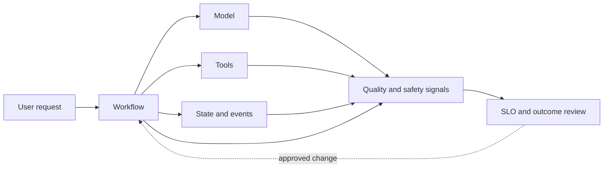
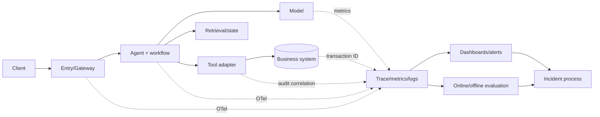

# Volume 6 — Reliability and operations

> [!CAUTION]
> **Status: Draft — not approved for production use.** Re-researched 2 August
> 2026 against current Agent Observability, online evaluation, Cloud Monitoring
> SLO, Agent Runtime, and Google Cloud reliability guidance. Local SLO/recovery
> logic passes tests, but no customer SLO, alert, restore, or DR claim has been
> proven. See the [evidence ledger](../../references/implementation/volume-6-sre.md).

**Audience:** Forward Deployed Engineers, SREs, platform and application teams,
product owners, incident commanders, data/model evaluators, and customer support.  
**Production premise:** a responsive agent can still be wrong, unsafe, duplicated,
unauthorized, economically unbounded, or operationally unrecoverable.

## Mission

Make agent systems observable, measurable, supportable, recoverable, and economically sustainable. This volume treats model quality, workflow correctness, tool execution, and business outcome as separate reliability dimensions.

## 🟢 Official Google Capability baseline

Agent Runtime integrates with Cloud Trace, OpenTelemetry, Cloud Monitoring, and Cloud Logging. Google Cloud provides managed telemetry, alerting, incident-supporting data, and reliability guidance; exact generated metrics, default tracing behavior, and content logging options are version- and configuration-sensitive. See [Agent Runtime](https://docs.cloud.google.com/gemini-enterprise-agent-platform/build/runtime), [Cloud Operations](https://cloud.google.com/products/operations), and the [Google SRE books](https://sre.google/books/).

## Chapter map

| # | Chapter | Engineering outcome | Required artifacts |
|---|---|---|---|
| 1 | Service ownership and readiness | Establish owners, dependencies, support tiers, launch criteria, and escalation | Service catalog; RACI; readiness review |
| 2 | Telemetry architecture | Correlate user, agent, workflow, model, node, tool, event, and data operations | OTel conventions; trace/log diagrams; privacy rules |
| 3 | Metrics and dashboards | Measure traffic, latency, errors, saturation, quality, safety, cost, and outcomes | Metric catalog; dashboards; cardinality budget |
| 4 | SLIs, SLOs, and error budgets | Define service, workflow, tool, quality, human-wait, and outcome objectives | SLO specs; burn-rate alerts; policy |
| 5 | Alerting and incident response | Produce actionable symptom-based alerts and agent-specific incident procedures | Alerts; severity matrix; incident template |
| 6 | Failure engineering | Classify model, runtime, graph, state, event, tool, policy, identity, dependency, and human failures | Failure-mode analysis; injection lab; containment map |
| 7 | Retry, idempotency, and reconciliation | Prevent retry storms and duplicate business effects | Retry taxonomy; idempotency contract; reconciler example |
| 8 | Capacity, performance, and cost | Plan quotas, tokens, concurrency, queues, storage, telemetry, and external limits | Capacity model; load/soak report; unit economics |
| 9 | Backup, recovery, and DR | Assign RTO/RPO to configuration, artifacts, state, data, events, and evidence | Backup matrix; restore automation; DR exercise |
| 10 | Continuous improvement | Convert production outcomes into evaluation cases and controlled releases | Review cadence; failure clustering; release feedback loop |

## Reliability signal model



## 🟡 Enterprise Architecture Recommendation

Do not represent “the agent is healthy” with one availability metric. Operate at least five explicit contracts: entry-point availability, workflow completion/correct routing, tool-side-effect correctness, model quality/safety, and customer outcome. Human approval wait time should be measured separately from compute latency.

## Minimum telemetry dimensions

- Environment, region, service, agent, workflow, and release version.
- Node and tool identity without uncontrolled high-cardinality parameters.
- Model identifier, response class, latency, token usage, and safety verdict.
- Retry reason, attempt, deadline, idempotency result, and terminal state.
- Trace and audit correlation identifiers, with content capture governed separately.

## Exit criteria

SLOs have tested data sources and burn-rate alerts; runbooks resolve real injected failures; retries cannot duplicate irreversible actions; capacity limits and unit costs are known; restore and DR exercises meet approved RTO/RPO; and operational evidence is sufficient to reconstruct an action without retaining prohibited content.

---

## 1. Reliability contract

🔵 **Field Pattern.** Reliability is the probability that the system produces an
acceptable customer outcome within the promised time and control boundary. It is
not HTTP success. Establish separate contracts for:

- **access:** an authorized user can reach the service;
- **workflow:** the request reaches a correct terminal state;
- **action:** tools execute at most the intended business effect;
- **quality:** the answer/action meets grounded task criteria;
- **safety/security:** mandatory controls do not regress or bypass;
- **freshness:** source and state are within the promised age;
- **human operation:** approval and support complete within their own clocks;
- **economics:** cost and resource consumption remain bounded; and
- **recoverability:** configuration, state, events, evidence and business truth can be restored/reconciled.

The customer case-agent example has a 99.9% entry availability objective, but
also a workflow completion objective, zero-tolerance duplicate-write invariant,
quality threshold on a representative evaluation set, a freshness bound, and a
separate approval-wait target. These measures must not be averaged into a single
green score that conceals a critical failure.

## 2. Official capability baseline and caveats

🟢 **Official Google Capability.** Agent Observability currently provides
topology, agent and MCP views using OpenTelemetry exported to Google Cloud
Observability storage. Documented dashboards include traffic, latency
percentiles, error rates, token use, tools, models, evaluation and runtime usage.
Google's 18 June 2026 release notes announce Agent Observability GA and describe
default-on tracing for newly deployed ADK agents; configuration and content
capture still require explicit verification.

🟢 **Official Google Capability.** Agent Platform online monitors asynchronously
sample production traces, run configured evaluation metrics, and write results
to Logging/Monitoring. The current guide describes a scheduled loop typically
around ten minutes, caps for sampling, required telemetry, a project service
agent, and special handling for multimodal content. This mechanism is not a
synchronous safety gate and does not evaluate traffic that telemetry filters or
sampling miss.

🟢 **Official Google Capability.** Cloud Monitoring service monitoring supports
custom services, SLIs, SLOs, error budgets, and SLO-based alerting. Google
recommends fast- and slow-burn alert policies. A configured SLO is useful only if
its good/total events express the customer's reliability contract.

🟢 **Official Google Guidance.** The Well-Architected AI/ML reliability
perspective recommends scalable/available infrastructure, modular architecture,
automated lifecycle, governance, holistic observability, and validation at
component boundaries. Recommendations are architecture guidance, not proof of
availability for an individual deployment.

🟡 **Enterprise Architecture Recommendation.** Maintain an observability coverage
ledger. Platform-generated spans and metrics do not automatically cover business
commit, end-user correctness, every subresource, external tool state, privacy,
or recovery. Instrument the missing boundaries and prove data continuity.

## 3. Service ownership and production readiness

One accountable service owner owns the end-to-end customer promise even when
Google, a model provider, customer platform, business API, or SaaS tool owns a
dependency. Each dependency still has a technical owner, support path, SLO/limit,
fallback, and evidence source.

| Record | Required content |
|---|---|
| service catalog | purpose, users, owner, support tier, locations, data/action risk |
| dependency map | endpoint, owner, quota, timeout, SLO, change channel, fallback |
| on-call model | primary/secondary, SOC/privacy/product escalation, time zones |
| support model | severity, customer communications, Google support entitlement/case path |
| readiness review | SLOs, capacity, security, deploy/rollback, recovery, documentation |
| exception register | unmet control, compensating measure, approver, expiry, exit plan |

Launch is blocked if operators cannot distinguish user failure, authentication,
Gateway/policy, runtime, quota, model, workflow, state, memory, retrieval, tool,
target-system, evaluation, or telemetry failure. “Escalate to engineering” is not
a runbook step unless the escalation payload and containment action are defined.

## 4. Telemetry architecture and privacy



Propagate a trace/request ID and durable operation/idempotency ID across all
boundaries. Record release, workflow, prompt/config, policy, tool schema, model
and evaluation versions. Preserve tenant and subject correlation with approved
pseudonyms; do not place arbitrary record IDs or user input into metric labels.

### 4.1 Signal types

- **metrics:** bounded-cardinality rates, distributions, gauges and counters;
- **traces:** causal path, spans, attributes, events and sampled payload pointers;
- **logs:** structured events for diagnosis and control decisions;
- **audit:** immutable principal/action/approval/target correlation;
- **evaluations:** reproducible task, quality, safety and trajectory results;
- **business ledger:** authoritative side-effect and outcome state.

### 4.2 Content controls

Prompt/response and multimodal capture is a separate privacy decision from trace
enablement. Define purpose, sampling, minimization, redaction, storage, region,
access, retention, deletion, legal hold, incident use, and evaluation processing.
Prefer hashes, categorical outcomes, token counts, source IDs and approved object
pointers when raw content is not necessary. Test redaction using synthetic canary
secrets and PII. Never depend on raw prompt retention to reconstruct a business write.

## 5. Metric catalog

| Plane | Golden signals and agent-specific measures |
|---|---|
| entry/Gateway | accepted/denied traffic, good-event ratio, p50/p95/p99 latency, auth/policy/content errors |
| runtime | active work, cold starts, CPU/memory, queue/concurrency, termination, quota/rejection |
| workflow | start/terminal state, node latency, retries, loops, fan-out, stuck join, pause/resume age |
| model | call/error/quota/latency, input/output/cached tokens, model/version, finish/safety class |
| retrieval | freshness, coverage, zero-result, source/ACL filter, latency, citation validity |
| tool | call/error/timeout, unknown outcome, idempotency hit/conflict, target commit/reconcile age |
| quality | task success, groundedness, safety, hallucination, tool trajectory and evaluator agreement |
| human | approval queue age, decision time, abandonment and after-hours coverage |
| cost | model/tool/runtime/evaluation/storage/telemetry cost per accepted and successful outcome |
| recovery | backup age, restore verification age, RTO/RPO observed, replay/reconciliation backlog |

Every metric has semantic owner, unit, event source, good/bad/total definition,
aggregation, cardinality budget, expected delay, retention, privacy class,
dashboard, alert use, tests, and failure behavior. A dashboard screenshot is not a
metric contract.

## 6. SLIs, SLOs, invariants, and error budgets

For request-based SLIs:

```text
SLI = good events / valid total events
error budget = 1 - SLO target
burn rate = observed bad-event ratio / allowed bad-event ratio
```

The local [`fde_kit.reliability`](../../examples/python/fde-production-kit/src/fde_kit/reliability.py)
performs exact error-budget arithmetic and validates restoration evidence.

### 6.1 Example SLO specification

| Field | Example—not a universal target |
|---|---|
| promise | authorized case-summary requests return an accepted terminal result |
| population | production interactive requests excluding customer-declared invalid input |
| good event | terminal success under 12 s with required source citations and no fallback |
| objective | 99.5% over rolling 28 days |
| exclusions | predeclared maintenance only; dependency errors are not silently excluded |
| data source | entry event joined to terminal workflow event |
| delay/gaps | 5-minute expected delay; missing joins count bad after terminal deadline |
| alert | customer-tuned fast and slow multi-window burn |
| owner/action | agent SRE; contain releases or dependency route |

Define separate SLOs for interactive latency, asynchronous completion, data
freshness, online/offline quality, approval wait, and recovery. An asynchronous
quality signal must not page as if it were immediate. Zero-tolerance invariants—
cross-tenant disclosure, unauthorized or duplicate write, bypassed approval—are
incident triggers rather than percentage budgets.

### 6.2 SLO policy

The error-budget policy states what happens at healthy, warning, exhausted, and
critical states: release pace, feature work, reliability work, exception
authority and customer communications. Quality and safety regressions can freeze
release independently of availability budget. Do not spend an error budget on a
security invariant.

## 7. Alerting and dashboards

Page on actionable symptoms that threaten a customer promise; ticket trends and
capacity forecasts; log diagnostic detail. Each alert records signal, population,
threshold rationale, lookback, missing-data behavior, notification, deduplication,
severity, owner, runbook, containment, and validation.

Recommended dashboard layers:

1. executive outcome/SLO/error-budget view;
2. service entry and dependency map;
3. workflow/node/session/event view;
4. model/retrieval/tool quality and performance;
5. runtime/capacity/quota/cost;
6. release canary comparison;
7. security/policy/content signals; and
8. recovery readiness and evidence freshness.

Avoid one dashboard per product with no cross-boundary correlation. Test alerts
by injecting the underlying condition and verifying the notification reaches a
human with enough context to contain it.

## 8. Failure taxonomy and containment

| Failure | Detection | Safe immediate action | Recovery proof |
|---|---|---|---|
| authentication/policy unavailable | auth/decision error and dependency health | deny writes; optional preapproved read degradation | negative authorization test |
| model timeout/quota/safety block | model span/metric | bounded retry for safe call or approved fallback | task/safety evaluation |
| workflow loop/stuck join | step/fan-out/age budget | cancel/quarantine execution | replay from checkpoint |
| session/state conflict | version/ownership error | stop affected workflow | compatibility/migration test |
| retrieval stale/empty | freshness/coverage | disclose/route to manual, not fabricate | source reconciliation |
| tool timeout before write | timeout + no commit | retry only with stable operation key | one target transaction |
| tool timeout after unknown write | missing response, ledger unknown | stop automatic retry; reconcile | target ledger match |
| duplicate event | operation key hit | return prior result | one business effect |
| telemetry/evaluator outage | heartbeat/gap | preserve service only if risk policy permits | gap accounting/backfill |
| bad release/quality drift | canary/online/offline evaluation | kill action or route qualified release | post-containment comparison |
| cost/fan-out runaway | budget/rate/saturation | cancel, shed, cap tenant/action | ledger and queue drained |
| regional dependency loss | synthetic and service health | route only to prequalified path | DR objectives measured |

🔵 **Field Pattern.** Maintain explicit degradation modes: normal, restricted
read-only, manual handoff, queued, and unavailable. Each names permitted actions,
forbidden actions, user message, data freshness, operator decision, maximum
duration and exit criteria. Silent model downgrade or ungrounded answer is not a
safe fallback.

## 9. Retry, idempotency, and reconciliation

Retries are allowed only when the error class, operation semantics, remaining
deadline and target contract make them safe. Apply exponential backoff with
jitter, attempt/deadline budgets and circuit breaking. Align application,
library, proxy, Gateway, runtime, queue and target retries so they do not multiply.

### 9.1 Durable operation record

For every consequential action store operation ID, tenant, subject/agent,
canonical action hash, approval hash/version, target, idempotency key, attempts,
state, timestamps, target transaction, last error, reconciliation result and
audit correlation. States may include `PROPOSED`, `APPROVED`, `STARTED`,
`COMMITTED`, `REJECTED`, `UNKNOWN`, `RECONCILED`, `COMPENSATED`.

The idempotency key is stable for one intended effect and cannot be reused with a
different payload. Target enforcement is strongest; adapter-only deduplication
cannot protect against a crash after the target commits but before local state
updates. For `UNKNOWN`, query the authoritative target before any retry. A
compensating action is a new audited business action, not a technical rollback.

## 10. Capacity, quotas, performance, and unit economics

Build a workload model with arrival rate, burst shape, concurrency, request
classes, model calls/tokens, tool calls, workflow duration, human waits, queue
age, retries, telemetry/evaluation volume, runtime resources, dependency limits,
and growth. Measure rather than infer service time and memory.

Run cold, steady, step, spike, soak, dependency-slow, quota, retry-storm,
large-context, long-session, high-fan-out, cancellation and regional-routing
tests. Capture client-observed latency and terminal correctness, not just
container CPU. Verify admission, backpressure and fairness by tenant/action.

Unit economics includes model input/output/cached tokens, runtime, tool/API,
retrieval/storage, network, Gateway/content inspection, evaluation, observability,
security, support and reconciliation. Track:

```text
cost per accepted request
cost per correct terminal outcome
cost per completed business action
cost per failed or reconciled action
```

Budgets notify; they do not necessarily stop spend. Enforce application budgets
for steps, tokens, wall time, parallelism, retries and tenant/action rate. Capacity
headroom covers failure and canary conditions, not only median demand.

## 11. Backup, restore, and disaster recovery

Inventory each recoverable asset separately:

| Asset | Source of truth | Typical recovery mechanism | Required proof |
|---|---|---|---|
| source/config/prompt/policy | controlled repository | rebuild reviewed revision | digest/version match |
| artifact/SBOM/provenance | artifact/evidence store | promote trusted immutable artifact | signature/policy verdict |
| infrastructure/IAM/network | approved IaC + controlled state | plan/apply exact stack | drift and negative access tests |
| sessions/workflow state | selected data service | backup/export/replication as supported | resume/ownership/version test |
| memory/retrieval data | authoritative source/index lineage | rebuild or supported restore | freshness/ACL/citation checks |
| events/operations | durable queue and operation ledger | replay with idempotency | one effect and reconciled unknowns |
| business state | business system | system-owned restore/compensation | owner reconciliation |
| telemetry/evidence | approved sinks/archives | restore/read according to retention | incident/action reconstruction |

Assign RTO and RPO from business impact, then verify product capability and
architecture meet them. “Multi-region” is not an RTO. Data location, model
availability, identity, DNS, quotas, secrets/keys, Gateway/policy, artifacts and
staff access all participate in failover.

DR phases: declare → contain writes → preserve evidence → establish dependency
truth → activate prequalified path → restore/rebuild state → replay/reconcile →
canary → communicate → return or remain. Test regional loss, corrupt backup,
stale policy, unavailable key, partial event replay and unknown writes. Measure
actual recovery and data loss.

## 12. Incident response

Severity derives from customer impact: unauthorized action/disclosure, safety
harm, widespread unavailability, unreconciled business effects, data loss,
quality degradation, or budget exhaustion. The incident commander coordinates;
technical leads diagnose; a business-action owner controls workflow; security and
privacy lead their obligations; communications owns truthful updates.

The first priorities are human safety/business containment, stopping new harmful
effects, preserving approved evidence, and establishing the authoritative
business state. Do not blindly roll back or replay. A code rollback does not undo
a target-system transaction.

Incident record: detection and impact start, affected users/tenants/actions,
release/model/policy/tool versions, containment decision, evidence access,
business reconciliation, customer/Google support communications, recovery
validation, residual uncertainty, and follow-up owners/dates. The retrospective
is blameless but controls and owners are explicit.

## 13. Continuous evaluation and production quality

Online monitors are delayed, sampled production evaluation. Use them for drift
and regression detection, with privacy-approved telemetry and caps. They
complement:

- deterministic unit/contract/invariant tests;
- curated offline golden and adversarial sets;
- trajectory/tool-use evaluation;
- preproduction integration and shadow/canary evaluation;
- target-system business outcome metrics; and
- manual review of high-risk or ambiguous samples.

Record evaluator/model/prompt/version, dataset lineage, sample population,
confidence/uncertainty, delay, missingness and cost. Calibrate model-based judges
against expert labels, track disagreement and avoid using the same opaque judge
as the only gate for itself. A quality alert must map to containment: disable an
action, route a qualified version, increase review, or pause launch.

## 14. Release operations and error-budget policy

Every release manifest binds artifact, source, dependency, workflow/state schema,
prompt/instruction, tool schema, model, policy, infrastructure and evaluation
versions. Canary compares correct outcome, safety, action invariants, latency,
errors, token/tool use and cost—not only HTTP health.

Before rollback, check state/event/tool compatibility and already-committed
effects. Prefer roll-forward where old code cannot safely read new state. Keep a
kill switch at business-action level so operators can stop risky writes without
removing safe reads.

When error budget is exhausted, freeze relevant risk-changing releases, contain
the driver, restore budget through reliability work, and document any customer-
approved exception. A separate quality/safety gate may freeze sooner.

## 15. Runbook standard

Each alert links to a versioned runbook containing purpose, customer symptom,
preconditions and access, privacy rules, dashboards/queries, differential
diagnosis, safe containment, exact reversible actions, decision/approval points,
business reconciliation, recovery, validation, escalation, communications,
evidence, and cleanup. Commands use placeholders and read-only inspection first.
Never publish a broad delete/restart command as universal incident advice.

Validate runbooks through game days with a person who did not author them.
Record time to detect, acknowledge, diagnose, contain, reconcile and recover;
wrong turns; missing permission/data; communications; and corrective work.

## 16. Production qualification gates

The [Volume 6 lab](../../labs/volume-6-sre/README.md) keeps these false until
evidence exists: ownership; telemetry privacy and coverage; tested SLI data; SLO
and burn alerts; failure injection; idempotency/reconciliation; capacity/cost;
restore; DR; incident exercise; continuous improvement. Local CI validates only
schema and reference logic.

No readiness review may mark a gate complete from a planned test, dashboard
screenshot, architecture diagram, vendor SLA, or successful redeploy. Attach the
actual dated report, environment, release and acceptor.

## 17. Common mistakes

### Implementation artifact map

🔵 **Field Pattern.** [`fde_kit.reliability`](../../examples/python/fde-production-kit/src/fde_kit/reliability.py)
contains typed SLO/error-budget, retry and restore-evidence controls. The Volume 2
[Terraform](../../terraform/volume-2-platform/README.md) includes log-based
metrics, alerting, dashboards, budgets and protected evidence/state foundations;
customer SLOs and notification channels are rendered from approved values.
[Cloud Build](../../delivery/volumes-4-10/cloudbuild.yaml) runs hermetic gates;
Cloud Deploy promotes the application digest whose SLO/load/recovery evidence was
reviewed; [GitHub Actions](../../.github/workflows/volumes-4-10-ci.yml) runs local
reliability and qualification tests. Terraform configuration is not restore or DR
evidence—the authorized game day supplies that.

- Calling HTTP 200 or runtime uptime the agent SLO.
- Averaging safety, quality, availability and cost into one score.
- Excluding dependency failures to make an SLI look healthy.
- Paging on every model error without user-impact or action.
- Logging raw prompts to compensate for missing correlation IDs.
- Using unbounded metric labels such as user input, session ID or URL.
- Layering retries at every hop and duplicating target writes.
- Assuming timeout means failure or retry is safe.
- Calling a redeploy, backup configuration or multi-region diagram a DR test.
- Treating sampled online evaluation as a synchronous control.
- Rolling back incompatible workflow/state/event versions.
- Optimizing tokens while ignoring failed outcomes and reconciliation labor.

## 18. Production checklist

- [ ] Service, dependency, security, privacy, business and on-call owners accept responsibility.
- [ ] Entry, workflow, action, quality, safety, freshness, human and recovery contracts are separate.
- [ ] Telemetry coverage, correlation, privacy, cardinality, retention and missing-data behavior are tested.
- [ ] SLIs reflect customer outcomes; SLO/error-budget and fast/slow burn policy are approved.
- [ ] Invariants page immediately and cannot be consumed as ordinary error budget.
- [ ] Failure modes, degradation and business-action kill switches are exercised.
- [ ] Retry ownership, deadlines, idempotency and unknown-write reconciliation pass.
- [ ] Load/soak/quota/dependency/cost tests establish headroom and fairness.
- [ ] Release canary covers outcome, quality, safety, latency, cost and state compatibility.
- [ ] Restore and DR exercise every asset and meet measured RTO/RPO.
- [ ] Runbooks, escalation, support and communications work in a game day.
- [ ] Production outcomes feed controlled evaluation and improvement.

## 19. Architecture decision record

**Decision:** Operate a composite reliability contract with Cloud Monitoring SLOs
for immediate request/workflow signals, deterministic action invariants, offline
and approved online quality evaluation, a durable operation ledger, and separate
recovery objectives.

**Context:** The customer has interactive summaries and asynchronous proposed
writes; approvals can take hours. An endpoint-only SLO hides wrong terminal states,
duplicate writes and human wait.

**Consequences:** More instrumentation and joins are required. Raw content remains
privacy-controlled. Online evaluation delay cannot page urgent safety issues.
Operations owns reconciliation and business-action containment.

**Validation:** Signal loss, auth/policy/model/tool/state failures, unknown write,
retry storm, quality regression, quota/cost spike, incompatible release, corrupt
backup and regional game day.

**Revisit when:** action/data risk, dependency topology, user promise, feature
maturity, telemetry coverage, workload distribution, or measured recovery changes.

## 20. FDE customer notebook

**Why Cloud Monitoring SLOs?** They provide managed service/SLO primitives, burn
data and alert integration. The decisive work is still defining good/total events
and emitting trustworthy application/business signals.

**Why Agent Observability?** It supplies current platform topology, traces and
agent/model/tool/runtime views from OTel. It accelerates diagnosis but does not
automatically prove business commit, privacy compliance or DR.

**Why online monitors?** They continuously sample live behavior to detect quality
drift. They are selected only with approved trace data, evaluator validation,
sampling/cost control and a concrete response. Offline gates remain necessary.

**Why an operation ledger?** Distributed timeouts make write results uncertain.
The ledger and target idempotency/reconciliation protect business truth when
traces, sessions or process memory are incomplete.

## 21. Workshop and operating exercise

Run [the lab](../../labs/volume-6-sre/README.md) with product, SRE, application,
platform, security/privacy and business-system owners. Define promises and
invariants, instrument the thin slice, validate SLI joins, tune burn alerts, inject
failures, reconcile an unknown write, load/soak the service, restore every state
class, execute DR, and hand an unfamiliar operator the runbook. Use synthetic data.

## 22. Operations checklist

- [ ] On-call can move from customer symptom to request/workflow/model/tool/target correlation.
- [ ] Operators can identify missing telemetry rather than interpret missing data as healthy.
- [ ] Every page has a safe containment action and business owner.
- [ ] Manual mode and approval queues have capacity and communications.
- [ ] Unknown writes never enter blind retry; reconciliation age is visible.
- [ ] Error-budget, quality, security and cost policies independently control release.
- [ ] Restore age and DR qualification are continuously visible.
- [ ] Incident learnings become owned tests, evaluations, runbooks or architecture changes.

## 23. Official references

- [GoogleCloudPlatform OpenTelemetry Python sample at the reviewed commit](https://github.com/GoogleCloudPlatform/opentelemetry-samples/tree/4cdacf711acb9d106fcc3a4ba5b0cd55cd192b26/python/otlptrace)
- [ADK telemetry source at the qualified v2.6.1 commit](https://github.com/google/adk-python/tree/740582e9f283cd23ff5cec1389400b422513f765/src/google/adk/telemetry)
- [Agent Observability overview](https://docs.cloud.google.com/gemini-enterprise-agent-platform/optimize/observability/overview)
- [Continuous evaluation with online monitors](https://docs.cloud.google.com/gemini-enterprise-agent-platform/optimize/evaluation/evaluate-online)
- [Agent Runtime monitoring](https://docs.cloud.google.com/gemini-enterprise-agent-platform/scale/runtime/monitoring)
- [Agent Runtime tracing](https://docs.cloud.google.com/gemini-enterprise-agent-platform/scale/runtime/tracing)
- [Agent Runtime logging](https://docs.cloud.google.com/gemini-enterprise-agent-platform/scale/runtime/logging)
- [Cloud Monitoring SLO concepts](https://docs.cloud.google.com/stackdriver/docs/solutions/slo-monitoring)
- [Retrieving SLO and burn-rate data](https://docs.cloud.google.com/stackdriver/docs/solutions/slo-monitoring/api/timeseries-selectors)
- [AI/ML reliability perspective](https://docs.cloud.google.com/architecture/framework/perspectives/ai-ml/reliability)
- [Google SRE books](https://sre.google/books/)
- [Implementation evidence ledger](../../references/implementation/volume-6-sre.md)

## 24. Next volume

[Volume 7](../volume-7-reference/README.md) converts the volatile Google Cloud
product surface into a dated, machine-checkable reference catalog and change-trigger system.
