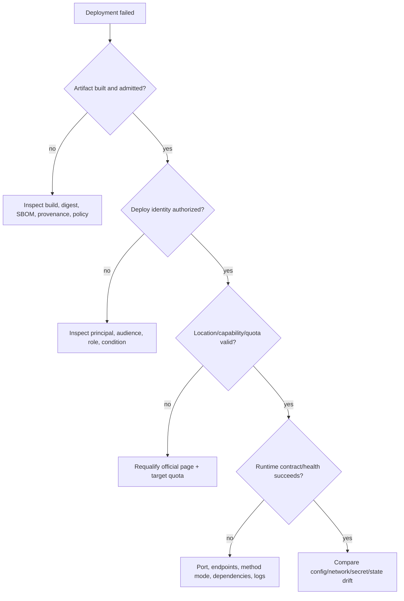
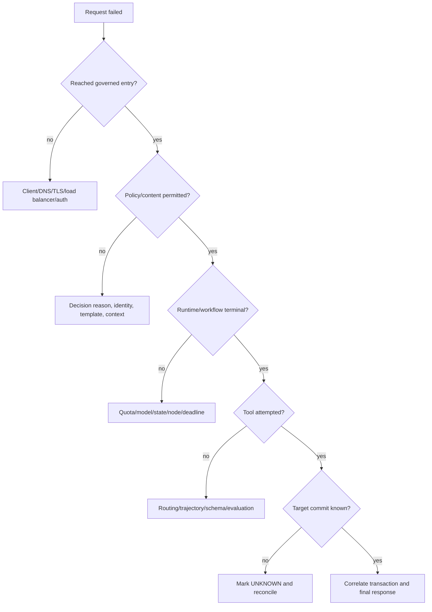

# Volume 7 — Engineering reference

> [!CAUTION]
> **Status: Draft reference snapshot — not production authority.** Revalidated 2
> August 2026. High-volatility facts intentionally point to official live pages
> instead of copying region, quota, model, price, or maturity lists that can age
> silently. The source catalog passes local structural/freshness tests; deployment
> values still require customer-project verification. See the
> [evidence ledger](../../references/implementation/volume-7-reference.md).

**Audience:** FDEs operating under incident/design pressure, platform and
security engineers, SREs, architects, reviewers, and documentation owners.  
**Rule:** if a fact affects production eligibility, security, data location,
availability, cost, compatibility or support, follow the cited official page and
record a fresh observation in the customer decision record.

## Mission

Provide concise, versioned lookup material for engineers designing or troubleshooting platforms under delivery pressure. Reference tables are generated or date-stamped wherever possible because terse facts become dangerous when stale.

## Reference catalog

| # | Reference | Contents | Update trigger |
|---|---|---|---|
| 1 | Product naming and API compatibility | Current product names, legacy names, API/resource names, migration notes | Platform naming or API release |
| 2 | Capability and maturity matrix | GA/Preview status, supported topology, documented limitations, source date | Agent Platform release notes |
| 3 | Region and endpoint matrix | Regions, multi-regions, global endpoints, residency/CMEK caveats | Location documentation change |
| 4 | Runtime selection matrix | Agent Runtime, Cloud Run, and GKE requirements and tradeoffs | Runtime capability change |
| 5 | Identity and authorization matrix | Principal, credential, audience, delegation, enforcement point, audit identity | IAM/Agent Identity change |
| 6 | State and storage matrix | Session, workflow, business, memory, artifact, analytics, cache, and audit stores | Storage/runtime schema change |
| 7 | Event delivery matrix | Pub/Sub, Eventarc, Cloud Tasks, Workflows, ordering, retries, deadlines, deduplication | Event-service documentation change |
| 8 | Telemetry and SLO catalog | Metric names, semantic conventions, labels, formulas, dashboards, alerts | Observability/OTel change |
| 9 | Error and retry taxonomy | Failure classes, retry owner, backoff, dead letter, compensation, escalation | Runtime/tool contract change |
| 10 | Quota and capacity checklist | Discovery links, quota ownership, test method, increase lead time | Service quota change |
| 11 | Security control catalog | Threat, preventive/detective/corrective control, evidence, limitations | Security capability change |
| 12 | Troubleshooting decision trees | Deployment, invocation, auth, routing, state, model, tool, trace, and event failures | Incident learning or API change |
| 13 | Production checklists | Design, implementation, security, operations, launch, recovery, and handover | Review standard change |

## 🟢 Official Google Capability rule

Each capability row links directly to official documentation or a tagged official source. The table records `verified_at`, maturity, location, and known limitation independently; a missing field is `unknown`, not an invitation to infer behavior.

## 🟡 Enterprise Architecture Recommendation

Generate machine-verifiable rows from `references/` where possible and place customer-specific values—quotas, contracts, approved regions, retention, and SLOs—in deployment records rather than pretending they are universal reference facts.

## Reference entry contract

Every entry includes:

- Fact or decision in compact form.
- Classification and official source URL.
- Verification date and next review date.
- Product/library/API version where applicable.
- Region and maturity scope.
- Known limitations and “do not infer” warning.
- Owning volume and chapter.
- Automated or manual validation method.

## Exit criteria

Every catalog has a named owner and update trigger; high-volatility tables are machine-checked at least weekly; troubleshooting trees are exercised in labs; no table contains unscoped preview or regional claims; and all entries link back to explanatory chapters.

---

## 1. How to use this reference

This volume is a routing layer, not a replacement for Volumes 1–6. Look up the
decision surface, open the official source, record exact selected values and date,
then follow the owning volume for design and testing. During an incident, use the
decision trees to classify the fault; use the deployed runbook for exact actions.

🔵 **Field Pattern.** Every production fact has four representations:

1. **source entry:** official URL, owner, review interval and last verification;
2. **normalized fact:** capability, scope, maturity, location, version and warning;
3. **customer selection:** project/location/mode/quota/terms and approver;
4. **observed evidence:** API response, test result, artifact or support record.

The first two belong in this repository. The last two belong in the customer-
controlled evidence store. Never publish project identifiers, support cases,
credentials, customer data, contracts, or sensitive topology here.

## 2. Evidence hierarchy

| Tier | Source | Use | Warning |
|---|---|---|---|
| 1 | current Google product/API documentation, locations, quotas, release/deprecation pages | product fact and maturity | scope to exact feature/mode/date |
| 2 | tagged official Google source/release | library behavior and reviewed implementation | source is not managed-service commitment |
| 3 | commit-pinned official Google sample | pattern/example comparison | sample is not a production guarantee |
| 4 | Google Cloud Architecture Center or SRE guidance | architecture recommendation | guidance is not product availability |
| 5 | customer observed/API/support/contract evidence | target-environment acceptance | store privately with owner/date |

🟡 **Enterprise Architecture Recommendation.** Prefer the most specific primary
source. If a release note and overview differ, record both and the reason for the
selected interpretation; obtain support clarification when the decision is
material. Search snippets, generated summaries, blog posts and recollection are
discovery aids, not final evidence.

## 3. Product naming and compatibility

| Current name | Legacy/underlying identifier that may remain | Do not infer | Primary source |
|---|---|---|---|
| Gemini Enterprise Agent Platform | Vertex AI naming remains in historical docs, APIs and IAM roles | a rename is not an API migration | [22 April 2026 naming changes](https://docs.cloud.google.com/gemini-enterprise-agent-platform/release-notes#April_22_2026) |
| Agent Runtime | Vertex AI Agent Engine | API resource may still be `ReasoningEngine`/`reasoningEngines` | [Agent Runtime](https://docs.cloud.google.com/gemini-enterprise-agent-platform/build/runtime) |
| Agent Platform Sessions | Agent Builder Sessions | selected endpoint/location maturity is not universal | [agent locations](https://docs.cloud.google.com/gemini-enterprise-agent-platform/resources/agent-locations) |
| Agent Platform Memory Bank | Memory Bank | memory is not business/system-of-record state | [Memory Bank](https://docs.cloud.google.com/gemini-enterprise-agent-platform/optimize/memory-bank/overview) |
| Agent Platform API | Vertex AI API in older naming | service names, client types and IAM permissions can retain old identifiers | [release notes](https://docs.cloud.google.com/gemini-enterprise-agent-platform/release-notes) |

At code review, distinguish marketing/documentation name, API service, REST
resource, SDK class, Terraform resource, IAM permission, monitored resource and
log label. Do not mechanically rename identifiers because a product was renamed.

## 4. Capability and maturity lookup

This snapshot captures selected 2 August 2026 observations. Reopen each page.

| Capability | Snapshot | Scope/warning | Official source |
|---|---|---|---|
| Agent Runtime | managed agent runtime | deployment currently Python; resource naming compatibility remains | [overview](https://docs.cloud.google.com/gemini-enterprise-agent-platform/build/runtime), [deployment](https://docs.cloud.google.com/gemini-enterprise-agent-platform/scale/runtime/deploy-an-agent) |
| runtime revisions/traffic | Preview | `v1beta1`; direct revision calls bypass root split | [revisions](https://docs.cloud.google.com/gemini-enterprise-agent-platform/scale/runtime/manage-revisions-and-traffic) |
| Agent Gateway | GA announced 18 June 2026 | exact ingress/egress topology and integrations vary | [release notes](https://docs.cloud.google.com/gemini-enterprise-agent-platform/release-notes), [overview](https://docs.cloud.google.com/gemini-enterprise-agent-platform/govern/gateways/agent-gateway-overview) |
| Agent Observability | GA announced 18 June 2026 | telemetry setup/content/storage still configuration-specific | [release notes](https://docs.cloud.google.com/gemini-enterprise-agent-platform/release-notes), [overview](https://docs.cloud.google.com/gemini-enterprise-agent-platform/optimize/observability/overview) |
| Agent Identity | capability/mode-specific | current 3-legged external OAuth delegation is Preview; API migrations may differ | [identity](https://docs.cloud.google.com/gemini-enterprise-agent-platform/govern/agent-identity-overview), [release notes](https://docs.cloud.google.com/gemini-enterprise-agent-platform/release-notes) |
| Model Armor for Gateway | GA announced 24 June 2026 | template/filter/flow/location are selected separately | [configuration](https://docs.cloud.google.com/gemini-enterprise-agent-platform/govern/configure-model-armor), [release notes](https://docs.cloud.google.com/gemini-enterprise-agent-platform/release-notes) |
| Managed Agents API | Preview in 19 May 2026 notes | not interchangeable with ADK on Agent Runtime | [create/manage](https://docs.cloud.google.com/gemini-enterprise-agent-platform/build/managed-agents/create-manage) |
| Skill Registry | Preview in 19 May 2026 notes | skill packages are untrusted supply-chain inputs until approved | [release notes](https://docs.cloud.google.com/gemini-enterprise-agent-platform/release-notes) |
| SCC Agent Platform Threat Detection | Preview | supported Agent Runtime coverage and SCC tier apply; detective only | [overview](https://docs.cloud.google.com/security-command-center/docs/agent-platform-threat-detection-overview) |

Never infer that: platform GA makes every row GA; an allowlist is ordinary GA;
Preview means unavailable; a console UI proves API stability; a feature in one
Gemini Enterprise product exists in Agent Platform; or a release note removes the
need to inspect the feature page and terms.

## 5. Region, endpoint, residency, encryption and availability

Do not maintain a prose region list. Use the live [supported locations for
agents](https://docs.cloud.google.com/gemini-enterprise-agent-platform/resources/agent-locations),
[model locations](https://docs.cloud.google.com/gemini-enterprise-agent-platform/models/learn/locations),
[data residency](https://docs.cloud.google.com/gemini-enterprise-agent-platform/resources/data-residency),
and each dependency's location page.

### Location record schema

| Field | Required observation |
|---|---|
| resource | exact feature/API/model/runtime/store |
| endpoint | global, multi-region or regional hostname/location |
| data at rest | documented location and selected resource setting |
| processing | documented processing scope for exact model/service |
| control plane/metadata | documented behavior or `unknown` |
| telemetry/evaluation | sink and processing locations |
| keys | CMEK support, key location and protected resource if required |
| maturity | capability + endpoint maturity and terms |
| availability | architecture/contract; not inferred from endpoint label |
| evidence | official URL/date, target API observation and acceptor |

🟢 **Official Google Capability.** Current data-residency documentation
distinguishes data-at-rest location from ML processing determined by endpoint and
states that global endpoints do not provide regional isolation. This distinction
must be carried into the customer's data flow. A region name does not prove every
model, subservice, telemetry path or processor is in that region.

## 6. Quotas, limits and capacity

Use the live [Agent Platform quotas and limits](https://docs.cloud.google.com/gemini-enterprise-agent-platform/machine-learning/quotas),
model-specific quota pages, Cloud Quotas in the target project, and dependency
service pages. Quota and immutable system limits are different. Published default
quota is not the customer's granted value or guaranteed capacity.

Qualification record:

```text
service / metric / limit name
project + location + endpoint + model
published value and date
observed effective value and method
steady / burst / failover / canary demand
headroom and shared consumers
increase owner, lead time and fallback
load/soak/quota test evidence
```

Do not copy a current numeric quota into an architecture as timeless capacity.
Quotas can be per project, region, model, endpoint or resource; limits may be
fixed; model consumption modes can have distinct semantics.

## 7. Runtime selection quick reference

| Driver | Agent Runtime | Cloud Run | GKE |
|---|---|---|---|
| primary fit | managed ADK/full agent integration | stateless container/API/tool/event handler | Kubernetes-specific workload/control |
| contract | selected managed deployment/runtime contract | Cloud Run container/service/job/worker contract | Kubernetes workload/platform contract |
| control | highest managed abstraction | container/runtime configuration | cluster, scheduling, sidecars and policies |
| state | external/documented sessions/memory as selected | external durable state | external/stateful services by explicit design |
| network | runtime documented PSC/public paths | Cloud Run ingress/egress/VPC options | VPC-native cluster/service networking |
| identity | runtime service identity/Agent Identity modes | service identity | WIF for GKE/KSA patterns |
| choose only after | region/maturity/network/quotas/support | concurrency/deadline/scale/network tests | actual Kubernetes requirement and ops ownership |

Decision logic and executable validation are in [Volume 4](../volume-4-runtime/README.md).

## 8. Identity and authorization quick reference

| Identity | Authenticates | Does not prove | Enforcement |
|---|---|---|---|
| workforce/end user | human subject/session | authority for every record/action | application/action policy |
| client workload | calling application | end-user delegation | entry/Gateway and application |
| Agent Identity/runtime SA | agent/workload | user intent or business permission | IAM + action policy |
| pipeline WIF principal | approved external workload claims | runtime/business access | IAM conditions and pipeline gates |
| tool identity | executing adapter/server | caller's record/action authority | peer auth + method/parameter policy |
| approver | approval actor | validity after action mutation/expiry | approval binding and commit recheck |

Preferred credentials are short-lived and audience-bound. Avoid service-account
keys. Record own versus delegated authority, consent/scopes, credential custody,
refresh/revocation, and audit subject. See [Volume 5](../volume-5-security/README.md).

## 9. State and storage quick reference

| State | Authority | Partition key | Critical control | Recovery question |
|---|---|---|---|---|
| request/trace | diagnostic/evidence only | tenant/request | privacy + correlation | can action be reconstructed without content? |
| session/events | interaction/workflow context | tenant/user/session | ownership/version/concurrency | can in-flight work resume safely? |
| workflow checkpoint | orchestration position | workflow instance | atomic transitions | can step replay duplicate effects? |
| memory | derived personalization/knowledge | tenant/user/namespace | provenance/deletion/injection | can it be rebuilt and invalidated? |
| cache | performance copy | tenant/resource/version | authorization + expiry | can it be discarded safely? |
| operation ledger | intended/executed business action | tenant/operation ID | idempotency/reconciliation | which writes are unknown? |
| business system | authoritative business truth | domain key | domain controls | what actually committed? |
| evaluation set/result | quality evidence | dataset/release | lineage/privacy | can a gate be reproduced? |
| artifact/evidence | release authority | digest/release | immutability/retention | can trusted release be rebuilt? |

Never use prompt history, model memory, local filesystem or cache as approval,
idempotency, financial, clinical, legal, access-control or business authority.

## 10. Event delivery and retry quick reference

| Service/pattern | Suitable use | Required design check |
|---|---|---|
| Pub/Sub | decoupled fan-out/event delivery | delivery semantics, ordering key, retention, DLQ, idempotent consumer |
| Eventarc | event routing from supported sources | event type/region/identity/retry/destination contract |
| Cloud Tasks | controlled per-task HTTP delivery | schedule/rate/retry/deadline/auth/idempotency |
| Workflows | deterministic service orchestration | step retries, callback/timeouts, state and execution limits |
| application queue/ledger | domain-specific long-running work | ownership, transaction/outbox, replay, reconcile and retention |

For every attempt: classify error, remaining deadline, safe retry owner, maximum
attempts, backoff/jitter, idempotency key, unknown-write behavior and terminal
route. Avoid retry amplification across client, Gateway, runtime, SDK, queue and target.

## 11. Telemetry and SLO quick reference

| Signal | Required dimensions (bounded) | Warning |
|---|---|---|
| request | environment/location/service/release/outcome/latency class | no raw user input in labels |
| workflow | workflow/node/version/terminal state/retry class | session ID belongs in trace/log, not metric label |
| model | model/version/latency/error/quota/token/safety class | model success is not task correctness |
| tool | tool/method/version/outcome/idempotency class | target commit is separately correlated |
| quality | evaluator/dataset/version/metric/population | model judge must be calibrated |
| cost | component/action/outcome class | track cost per correct outcome |
| recovery | asset/RTO/RPO/last proof/outcome | configured backup is not restore evidence |

SLO definition includes population, good/total, target/window, exclusions, data
source, missing/delay handling, alert, owner and response. Invariants do not have
an ordinary error budget. See [Volume 6](../volume-6-sre/README.md).

## 12. Error taxonomy

| Class | Examples | Default disposition |
|---|---|---|
| invalid/permanent | schema, denied action, unsupported capability | no retry; surface categorical failure |
| transient safe read | unavailable before effect, throttling | bounded jittered retry within deadline |
| quota/capacity | resource exhausted, concurrency saturation | admission/backpressure; capacity owner |
| policy/security | auth, content, perimeter, secret failure | fail closed for protected actions; investigate |
| model quality | unsupported claim, wrong trajectory | fallback/manual or contained release; evaluate |
| state/version | ownership conflict, incompatible checkpoint | quarantine/migrate/route compatible version |
| write unknown | timeout after possible target commit | reconcile target; never blind retry |
| duplicate | repeated event/idempotency key | return existing result; alert on conflict |
| telemetry unknown | missing/gapped signals | report unknown, not healthy |

## 13. Security control lookup

| Threat | Required control family | Evidence |
|---|---|---|
| prompt/retrieval injection | isolation + content inspection + deterministic action policy | adversarial and safe-regression report |
| confused deputy | caller/agent/user context + method/parameter authorization | negative cross-user/tenant/action tests |
| credential leakage | short-lived custody, secret manager, redaction, revocation | rotation and canary-secret test |
| tool/MCP poisoning | publisher control, registration, pinning, schema/action validation | lifecycle and abuse tests |
| SSRF/exfiltration | explicit egress, DNS/IP/redirect validation, target identity | forbidden-route exercise |
| cross-tenant state | partition and ownership checks at every access | isolation/deletion tests |
| supply chain | reviewed source, pins, SBOM, provenance, admission | immutable release manifest/verdict |
| excessive agency/cost | action allowlist/approval, budgets, kill switch | boundary and containment drills |

## 14. Troubleshooting decision trees

### Deployment



### Invocation and tools



### Missing traces

Check deployment/version, OTel configuration, exporter identity/permissions,
endpoint/network, sampling, content-event settings, storage destination, filters,
clock/correlation, quotas/errors and retention. Do not enable unrestricted content
capture as the first diagnostic action.

## 15. Production checklist index

| Review | Minimum evidence | Owning volume |
|---|---|---|
| foundations/use case | measurable outcome, autonomy/risk boundary, evaluation | [Volume 1](../volume-1-foundations/README.md) |
| platform | hierarchy, IAM, network, data, environments, governance | [Volume 2](../volume-2-platform/README.md) |
| ADK/application | graph, state, tools, tests, evaluation, packaging | [Volume 3](../volume-3-adk/README.md) |
| runtime | placement, contract, artifact, capacity, release, DR | [Volume 4](../volume-4-runtime/README.md) |
| security | threat, identity/action, content, egress, supply chain, incident | [Volume 5](../volume-5-security/README.md) |
| SRE | SLOs, telemetry, failure, reconcile, capacity, restore/DR | [Volume 6](../volume-6-sre/README.md) |
| industry | jurisdiction, material decisions, data/control overlay | [Volume 8](../volume-8-industries/README.md) |
| engagement | charter, discovery, thin slice, hardening, launch, handover | [Volume 9](../volume-9-fde/README.md) |
| lifecycle | drift, qualification, migration, publication, retirement | [Volume 10](../volume-10-evolution/README.md) |

## 16. Machine-readable source contract

[`references/sources.json`](../../references/sources.json) is the source registry.
[`fde_kit.reference`](../../examples/python/fde-production-kit/src/fde_kit/reference.py)
validates unique IDs, approved primary domains, dates and freshness. Repository
checks validate Markdown links and source structure. Availability of a URL does
not prove the content still supports a fact; semantic review remains mandatory.

Minimum entry:

```json
{
  "id": "agent-platform-release-notes",
  "title": "Gemini Enterprise Agent Platform release notes",
  "url": "https://docs.cloud.google.com/gemini-enterprise-agent-platform/release-notes",
  "tier": 1,
  "owner": "volume-10-evolution",
  "verified_at": "2026-08-02",
  "review_interval_days": 7
}
```

High-volatility owners review at least weekly; source failure, meaningful content
change, release/deprecation notice, security advisory, package update, region or
quota change creates an impact assessment. Never automatically rewrite a
production decision from scraped documentation.

## 17. Customer values overlay

Keep customer values in a separate private record:

```yaml
customer_selection:
  evidence_date: YYYY-MM-DD
  project_number: PRIVATE
  locations: [APPROVED_VALUES]
  selected_capabilities:
    - name: EXACT_FEATURE_AND_MODE
      maturity: OBSERVED
      terms_accepted_by: NAMED_ROLE
  quotas: PRIVATE_OBSERVED_VALUES
  slo_rto_rpo: CUSTOMER_APPROVED
  data_retention: CUSTOMER_APPROVED
  support_path: PRIVATE
```

Repository examples contain placeholders and must fail production qualification.
Do not convert a reference default into a customer value.

## 18. Update and publication workflow

1. trigger arrives from weekly review, release notes, dependency bot, incident or support;
2. owner opens the primary source and captures exact affected text/metadata privately;
3. classify addition, change, deprecation, removal, security or naming-only;
4. map affected volumes, code, IaC, policies, models, data/state and customers;
5. test a proposed reference change and contradictory/negative cases;
6. obtain technical, security, SRE, product and documentation review as applicable;
7. publish with verification date and migration/operational note;
8. notify customer owners and start qualification where required.

Broken links are maintenance signals. A reachable but semantically changed page
is more dangerous; the owner must compare content and claims.

## 19. Common mistakes

### Implementation artifact map

🔵 **Field Pattern.** [`fde_kit.reference`](../../examples/python/fde-production-kit/src/fde_kit/reference.py)
validates typed reference entries; [`sources.json`](../../references/sources.json)
and [`versions.json`](../../references/versions.json) hold machine-readable facts.
The current Terraform/provider/module versions are consumed by the [Volume 2
stack](../../terraform/volume-2-platform/README.md); source drift never updates a
Terraform lock automatically. [Cloud Build](../../delivery/volumes-4-10/cloudbuild.yaml)
and [GitHub Actions](../../.github/workflows/volumes-4-10-ci.yml) validate the
catalog. Cloud Deploy uses the catalog only as reviewed release evidence—it does
not promote a new model, provider, region or maturity value because a page changed.

- Copying the current region, quota, model or price list into evergreen prose.
- Using one maturity value for a platform, feature and authentication mode.
- Treating a Google sample repository as a service commitment or secure baseline.
- Treating a release note headline as the complete feature contract.
- Renaming API/IAM/metric identifiers to match new product marketing names.
- Recording `unknown` as supported or using absence as proof of unsupported.
- Combining data at rest, processing, telemetry and support location.
- Treating published quota as assigned capacity.
- Automatically applying scraped changes to customer deployments.
- Mixing customer IDs, contracts and support evidence into a public handbook.

## 20. Qualification checklist

- [ ] Each catalog has owner, review interval, trigger and owning chapter.
- [ ] Each fact has classification, official URL, verification date and scope.
- [ ] Maturity is feature/mode/API/location specific.
- [ ] Region/residency facts distinguish resource, storage, processing and telemetry.
- [ ] Quota/limit entries distinguish published, observed, requested and tested values.
- [ ] Naming table preserves actual API/resource/IAM/metric identifiers.
- [ ] Official source/sample commit is pinned where behavior depends on code.
- [ ] Customer selections remain separate and private.
- [ ] Machine checks pass and semantic review is recorded.
- [ ] Troubleshooting trees have current lab evidence.
- [ ] Release/deprecation/security changes trigger impact analysis.

## 21. FDE field drill

Run [the Volume 7 lab](../../labs/volume-7-reference/README.md). An evaluator gives
the engineer an ambiguous production statement such as “deploy Agent Identity GA
globally with the default quota.” The engineer must decompose product, exact auth
mode/API, location/residency, quota, terms and observed project values; find the
primary pages; label unknowns; produce a dated decision; and demonstrate one
troubleshooting tree. Passing requires resisting unsupported certainty.

## 22. Operations checklist

- [ ] Weekly source review and failed-check notifications reach named owners.
- [ ] Operators can locate exact API/resource/log identifiers despite product rename.
- [ ] Incident runbooks link to customer observations, not public defaults.
- [ ] Release/deprecation changes are tied to inventory and customer owners.
- [ ] Stale entries visibly fail and cannot silently pass qualification.
- [ ] Support clarification and exceptions have expiry and re-review.

## 23. Official reference roots

- [Gemini Enterprise Agent Platform documentation](https://docs.cloud.google.com/gemini-enterprise-agent-platform/overview)
- [Agent Platform release notes](https://docs.cloud.google.com/gemini-enterprise-agent-platform/release-notes)
- [Supported agent locations](https://docs.cloud.google.com/gemini-enterprise-agent-platform/resources/agent-locations)
- [Agent Platform data residency](https://docs.cloud.google.com/gemini-enterprise-agent-platform/resources/data-residency)
- [Agent Platform quotas and limits](https://docs.cloud.google.com/gemini-enterprise-agent-platform/machine-learning/quotas)
- [Google ADK documentation](https://adk.dev/)
- [Google ADK Python releases](https://github.com/google/adk-python/releases)
- [GoogleCloudPlatform Agent Starter Pack](https://github.com/GoogleCloudPlatform/agent-starter-pack)
- [Google Cloud release notes](https://docs.cloud.google.com/release-notes)
- [Implementation evidence ledger](../../references/implementation/volume-7-reference.md)

## 24. Next volume

[Volume 8](../volume-8-industries/README.md) applies the platform and engineering
controls as jurisdiction- and customer-specific industry overlays without
inventing legal or regulatory conclusions.
