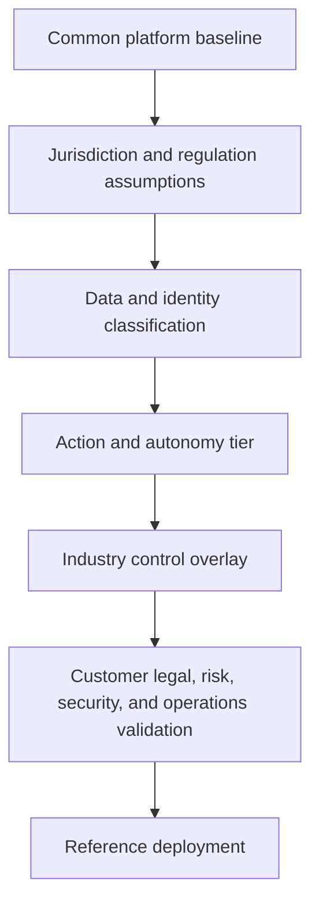
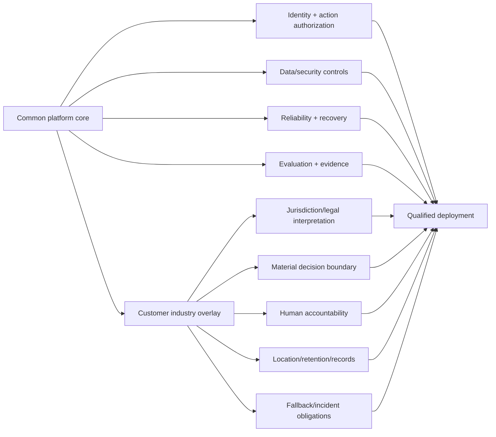
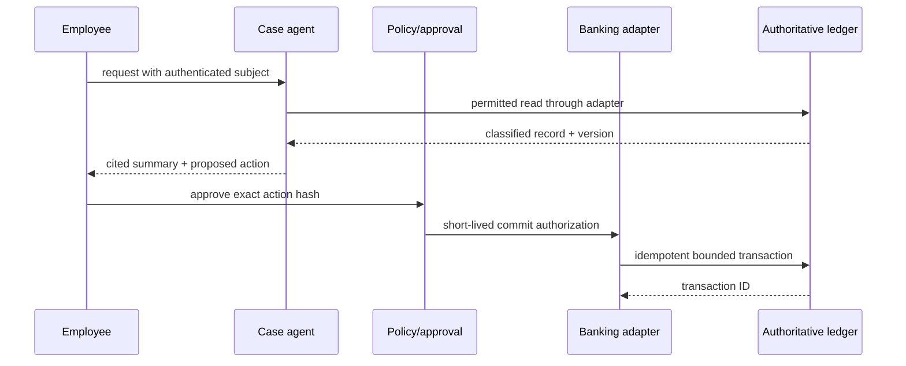
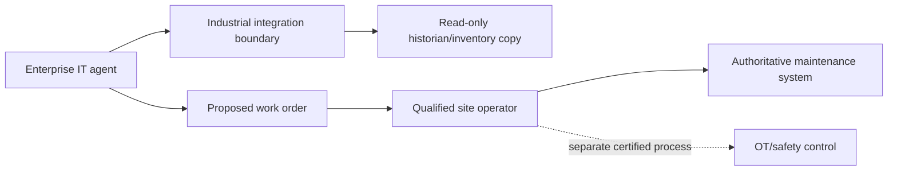

# Volume 8 — Industry architectures

> [!CAUTION]
> **Status: Draft patterns — not legal, clinical, financial, safety, compliance,
> regulatory, accessibility, records-management, or procurement advice.** Updated
> 2 August 2026 from current official Google Cloud product/compliance and
> architecture guidance. Customer counsel, risk, privacy, security, safety,
> records, accessibility and accountable business owners must approve the exact
> jurisdiction and use. Reference code rejects named unsafe autonomy patterns but
> is not a legal rules engine. See the [evidence ledger](../../references/implementation/volume-8-industries.md).

**Audience:** Forward Deployed Engineers working with regulated customers,
industry architects, data/security/privacy teams, SREs, domain risk owners, and
accountable customer decision-makers.

## Mission

Apply the common platform to representative regulated and operational contexts without presenting architecture guidance as legal, clinical, financial, safety, or regulatory advice. Every industry chapter records its country, jurisdiction, data, risk, and operating assumptions.

## Industry chapter map

| # | Industry | Reference workload | Primary engineering focus | Required control overlay |
|---|---|---|---|---|
| 1 | Banking and capital markets | Governed customer-service or operations action | Delegated authority, transaction limits, segregation, evidence | Financial-risk tiering; immutable decisions; reconciliation |
| 2 | Insurance | Claim intake, evidence assessment, and human decision support | Explainability, document provenance, fraud signals, approval | No autonomous adverse decision; evidence lineage |
| 3 | Healthcare | Clinical-administrative workflow, not diagnosis | Sensitive data, purpose limitation, human accountability, safety | Clinical boundary; minimum necessary access; emergency containment |
| 4 | Government | Citizen or caseworker service workflow | Sovereignty, accessibility, records, transparency, procurement | Jurisdiction-specific residency; public-record lifecycle |
| 5 | Telecommunications | Service assurance and field operations | High event volume, inventory/tool integration, outage response | Blast-radius limits; real-time backpressure; operator approval |
| 6 | Retail | Customer and supply-chain operations | Tenant/channel identity, seasonal scale, fraud, personalization | Consent and retention; price/order action validation |
| 7 | Manufacturing | Maintenance and production support | OT/IT boundary, safety, offline behavior, asset identity | No direct safety-control authority; site isolation |
| 8 | Aviation and aerospace | Engineering knowledge and maintenance support | Safety classification, export/data constraints, traceability | Authoritative-manual grounding; certified human decision boundary |
| 9 | Cross-industry pattern comparison | Reuse common platform capabilities across risk tiers | Standard core versus customer overlay | Variance register and reusable ADRs |

## Industry architecture method

## 🔵 Field Pattern

Use a stable platform core and a versioned customer control overlay. The overlay contains policy, data residency, approval, retention, evaluation, recovery, and evidence requirements that are not universal Google Cloud capabilities.

## Mandatory customer questions

- Which jurisdiction and regulator or assurance framework applies?
- What decisions may materially affect a person, safety, money, service, or legal right?
- Which system remains the authoritative source of truth?
- What evidence must be retained, for how long, and who may inspect it?
- Which actions require a licensed, cleared, certified, or operationally accountable human?
- What fallback must work when cloud, model, identity, tool, or connectivity is unavailable?

## Chapter deliverables

Each industry chapter includes a discovery workshop, representative customer story, risk classification, complete diagram set, data and identity mapping, runnable non-sensitive reference workflow, security and SRE overlay, failure lab, ADR, production checklist, and explicit list of customer/legal decisions that the handbook cannot make.

## Exit criteria

Industry reviewers validate assumptions; examples contain no real customer or regulated data; architecture never automates a prohibited decision; jurisdictional statements cite primary authorities where included; and common controls trace back to their owning platform chapters.

---

## 1. Industry-overlay contract

🔵 **Field Pattern.** The common platform supplies engineering mechanisms. The
customer overlay decides whether, where and how they may be used. A Google Cloud
certification, covered service, architecture guide or product control can support
a customer's compliance program; it does not certify the customer's application
or determine whether an agent action is lawful or appropriate.

The FDE does not translate broad labels such as “HIPAA,” “APRA,” “government,”
“PCI,” “critical infrastructure,” or “safety-related” into an architecture alone.
Create a decision record with country, state/territory, regulator, entity role,
contract, data category, people affected, material action, assurance framework,
retention/records rules, support requirements and named customer interpreters.

## 2. Shared control core versus customer overlay

Common core controls include identity separation, method/parameter authorization,
content and injection defenses, tenant isolation, immutable release evidence,
telemetry privacy, SLOs, idempotency/reconciliation, restore/DR and incident
response. The overlay adds customer-approved policy, action tiers, jurisdiction,
service eligibility, location/processing, retention, consent, explanation,
human qualifications, accessibility, records, reporting and fallback.

## 3. Evidence and compliance boundary

🟢 **Official Google Resource.** The Google Cloud Compliance Resource Center and
Trust Center publish current compliance offerings, reports and supporting
materials. The covered products, service configuration, contract and customer
responsibility must be reviewed for the exact workload.

🟢 **Official Google Guidance.** Google Cloud's HIPAA guide explicitly states it
is informational, not legal advice, describes shared responsibility, requires an
applicable BAA and covered products for PHI, and warns against Pre-GA offerings
with PHI unless expressly allowed. That guidance is specific to US HIPAA; do not
project it onto other jurisdictions or data types.

🟢 **Official Google Capability.** Cloud Healthcare API supports FHIR, HL7v2 and
DICOM modalities, location-selected datasets, IAM and audit capabilities; its
current overview identifies it as a covered service under the Google Cloud HIPAA
BAA with appropriate configuration. This does not make an agent using it a
clinical device, compliant workflow or safe decision-maker.

🟢 **Official Google Guidance.** The Well-Architected financial-services
perspective provides global architecture recommendations for security,
reliability, performance, cost and operations and notes that it cannot address
every organization's unique challenges. Customer regulatory interpretation and
control testing remain mandatory.

## 4. Industry discovery and control record

| Decision | Required customer owner | Evidence |
|---|---|---|
| applicable countries/jurisdictions/entity roles | legal/compliance | dated written interpretation |
| Google services/contracts in scope | procurement/legal/cloud governance | current service and contract matrix |
| data categories and subjects | data/privacy/domain owner | field-level lineage and purpose |
| material decisions/actions | business risk/safety owner | action catalog and impact tier |
| human qualification/accountability | domain governance | named role, approval and override |
| source of truth | business system owner | API/data contract and reconciliation |
| storage/processing/telemetry locations | privacy/security/legal | current product evidence + deployed values |
| retention/deletion/records/legal hold | records/privacy/legal | lifecycle policy and tested implementation |
| explanations/notices/consent/appeal | legal/product/accessibility | approved user journey |
| availability/fallback/continuity | business continuity/SRE | SLO, manual mode and DR exercise |
| incident/reporting | security/privacy/legal/operations | severity, clock, roles and exercise |

The repository's [`validate_overlay`](../../examples/python/fde-production-kit/src/fde_kit/industry.py)
checks completeness, synthetic-data use and a small conservative denylist. Extend
the customer policy from customer-approved decisions; do not encode invented law.

## 5. Action and autonomy tiering

| Tier | Agent role | Example | Minimum boundary |
|---|---|---|---|
| 0 | navigation/search | locate approved policy | citations, ACL, freshness, feedback |
| 1 | summarize/draft | draft case note | provenance, privacy, human owns use |
| 2 | recommend/propose | propose claim next step | explanation, independent review, no commit |
| 3 | bounded reversible action | create low-risk task | typed policy, approval as required, idempotency |
| 4 | material/irreversible/safety action | transfer money, deny benefit, alter control | normally prohibited or independently authorized by qualified owner |

The tier is based on actual effect, not the UI verb. “Send message” can trigger a
legal notice; “update field” can change coverage or production safety. Composite
sequences are rated by the highest possible effect. Human review is meaningful
only when the reviewer has authority, time, context, explanation, ability to
reject, independence where required, and an audited decision bound to the action.

## 6. Banking and capital markets overlay

### Reference workload

A service-operations agent retrieves customer-authorized account/service records,
summarizes a case and proposes an operational task. It does not make credit,
investment, trading, fraud-disposition or customer-funds decisions. A separate
business service validates and commits a narrowly approved action.

Controls: customer/employee authority separation, maker-checker where selected,
record/field/amount/product/channel bounds, sanctions/fraud/credit systems kept
authoritative, no raw credential delegation to model, immutable approval/action
hash, target idempotency and reconciliation, market/session time rules, data
lineage, communications/record retention, operational resilience and third-party
dependency inventory.

Failure lab: timeout after target commit, stale balance/version, duplicated event,
changed amount after approval, model proposes an unlisted product, delegated
credential revoked, regional dependency unavailable. Safe result is containment
and ledger reconciliation, not a second transaction.

Customer decisions this handbook cannot make: prudential/market/consumer rules,
materiality, books-and-records classification, outsourcing notification, data
location, model risk classification, adverse-action/explanation requirements,
approval segregation, or whether any action may be automated.

## 7. Insurance overlay

### Reference workload

The agent ingests synthetic claim documents, detects missing fields, summarizes
evidence with source pointers and prepares questions for an authorized adjuster.
It cannot approve, price, reduce, deny, rescind, flag fraud as fact, or communicate
an adverse outcome autonomously.

Controls: claimant/party/claim partitioning; document malware and indirect-
injection protection; OCR/source/page/version lineage; explicit uncertainty and
conflicts; policy/version/effective-date retrieval; deterministic calculation in
approved engines; fraud signal restricted to trained investigators; sensitive-
category and fairness evaluation; adjuster authority; notice/explanation/appeal
workflow; immutable evidence; retention and legal hold; catastrophe surge and
manual fallback.

Failure lab: poisoned attachment, mismatched policy effective date, duplicate
claim identity, missing page, contradictory reports, unsupported loss category,
unsafe confidence, and evaluator drift. The correct behavior is to disclose the
gap and route to an authorized human, never fabricate completion.

## 8. Healthcare and life-sciences overlay

### Reference workload

The agent supports a clinical-administrative records workflow: an authorized
staff member locates an approved record, obtains a cited summary and drafts a
non-clinical task. It does not diagnose, triage emergencies, prescribe, select or
change treatment, calculate a clinical dose, or write directly to safety-critical
clinical devices.

| Boundary | Control |
|---|---|
| patient identity | authoritative matching; no model-only merge |
| workforce access | role, patient/encounter relationship, purpose and break-glass audit |
| clinical data | minimum necessary, field/metadata protection, BAA/covered-service check where applicable |
| interoperability | versioned FHIR/HL7v2/DICOM contract and provenance |
| summary | source/time/version citations, missing/conflicting data surfaced |
| human decision | licensed/authorized clinician or accountable staff remains responsible |
| write | typed validated resource, optimistic concurrency, approval and target audit |
| emergency | explicit message and approved emergency/manual route; no false reassurance |

The current Google HIPAA guide warns not to place PHI in monitoring metadata,
resource metadata, build artifacts and other named surfaces. Apply field-level
data-flow review to prompts, traces, metrics, logs, evaluation, filenames,
resource names and support bundles. Do not assume de-identification eliminates
re-identification risk or all legal obligations.

Failure lab: wrong-patient context, stale medication/allergy record, unavailable
clinical source, FHIR version mismatch, revoked staff relationship, hidden prompt
in a document, PHI canary in metric label, emergency language and attempted
autonomous diagnosis. All safety-boundary attempts fail closed and route visibly.

## 9. Government and public-sector overlay

### Reference workload

A citizen-service or caseworker assistant locates published guidance, summarizes
case material for an authorized official and drafts correspondence. It does not
determine eligibility, enforcement, immigration status, liberty, benefits,
licensing, taxation or other rights/obligations without the customer's legally
approved human process.

Controls: jurisdiction and agency authority; public/private/controlled/classified
data separation; employee/citizen identity and delegated representation;
accessibility and language-quality testing; transparent AI notice where required;
authoritative policy with effective date; records schedules, legal hold and
public-record handling; explanation/appeal/channel equity; procurement/supply-
chain constraints; personnel/clearance; sovereignty/Assured Workloads eligibility
where selected; manual/non-digital fallback; continuity during emergencies.

Failure lab: superseded policy, inaccessible output, language changes meaning,
cross-case disclosure, forged representative, unsupported global processing,
record deletion conflict, appeal deadline and high-volume incident. Measure
disparate safe failure, not only average answer quality.

## 10. Telecommunications overlay

### Reference workload

The agent correlates alarms, inventory and approved runbooks; proposes a bounded
maintenance step to a network operator. It cannot change routing, subscriber
service, emergency communications, lawful-access systems, radio parameters or
wide-area configuration without deterministic controls and qualified approval.

Controls: subscriber/network/operational data partition; read replicas for agent
analysis; inventory and topology freshness; alarm storm backpressure; maintenance
window and blast-radius policy; two-person approval for high-risk changes;
prepare/validate/commit; device/site identity; staged rollout; automated
post-checks; rollback or roll-forward; outage communications; degraded/offline
runbooks; target transaction and reconciliation.

Failure lab: stale topology, alarm duplication/storm, partial fleet update,
unreachable device, conflicting human change, unsafe model command, bad canary and
regional NOC loss. Stop the rollout at the smallest blast radius and establish
actual device state before retry.

## 11. Retail and consumer overlay

### Reference workload

An employee agent summarizes order/supply status and proposes a customer-service
task; a consumer agent provides grounded catalog assistance. Neither silently
changes price, promotion, order, payment, refund, inventory or consent.

Controls: customer/session/channel identity; catalog/price/inventory freshness;
consent and purpose for personalization; sensitive inference restrictions;
payment data minimization and covered service scope; deterministic promotion/tax/
refund engines; fraud and account-takeover controls; action confirmation;
idempotent order operations; consumer notice/return/complaint journey; seasonal
capacity, bot/abuse protection, fair admission and fallback.

Failure lab: cached wrong price, cross-customer order, duplicate refund, prompt
in a seller listing, malicious URL, consent withdrawal, inventory race and peak
quota exhaustion. The authoritative commerce service resolves price and commit.

## 12. Manufacturing and industrial overlay

### Reference workload

The agent searches approved manuals and maintenance history, summarizes sensor or
work-order context, and proposes an inspection checklist. It never directly
controls a safety instrumented system, PLC, robot, interlock, emergency shutdown
or certified process parameter.

Controls: physical site/asset identity, IT/OT segmentation, read-only integration,
approved one-way patterns where required, authoritative manual revision and asset
applicability, maintenance/permit/lockout procedure, qualified operator,
change-window/blast-radius rules, offline/site-local fallback, safety case and
hazard review, vendor access, firmware/software provenance and incident isolation.

Failure lab: wrong asset/serial, obsolete manual, unit conversion, sensor clock
skew, site connectivity loss, malicious document instruction, compromised vendor
account and attempted direct safety-control action. Safety system remains
independent and authoritative.

## 13. Aviation and aerospace overlay

### Reference workload

An engineering knowledge assistant locates approved publications and prepares a
cited research summary. It does not make airworthiness, dispatch, maintenance
release, flight-control, mission-safety, export-classification or certified
engineering decisions.

Controls: program/fleet/tail/configuration applicability; controlled technical-
publication source and revision; approved parts/tools/procedures; export/data and
personnel-access decisions by customer authorities; safety and certification
classification; qualified signatory; complete traceability from claim to source;
independent verification; configuration/change control; offline operational
publication availability; long retention and supplier provenance.

Failure lab: wrong aircraft effectivity, superseded bulletin, missing limitation,
unit/coordinate conversion, ambiguous diagram, inaccessible authoritative manual,
cross-program leak, export-restricted retrieval and attempted unreviewed
airworthiness decision. The agent must show uncertainty and refuse the decision.

## 14. Cross-industry comparison

| Dimension | Lower-risk common pattern | High-risk overlay response |
|---|---|---|
| authority | authenticated user + agent | qualified role, delegation, segregation, action-bound approval |
| grounding | source citations | authoritative revision/applicability/freshness and conflict handling |
| action | typed reversible task | prohibited autonomy or prepare/approve/commit with ledger |
| data | tenant classification | field purpose, special category, jurisdiction and strict evidence handling |
| quality | task success | subgroup/safety/domain expert evaluation and no-automation thresholds |
| availability | retry/degrade | manual/offline safety route and continuity obligations |
| recovery | restore/replay | reconciliation, records preservation and domain authority |
| explanation | useful rationale | customer-approved notice, evidence, review/appeal process |

The platform core remains stable; overlay policy/config/evaluations/runbooks are
versioned customer artifacts. Variance from the core is recorded with rationale,
owner, risk, evidence, expiry and upstream merge opportunity.

## 15. Data architecture across industries

Classify every field and derivative. A summary, embedding, extracted entity,
evaluation label, trace, cache key, filename and model rationale may retain
sensitivity. For every flow record subject/tenant, source, purpose, authority,
processor, at-rest and processing location, retention/deletion/hold, access,
encryption/key needs, telemetry, backup, and incident obligations.

Use synthetic or formally approved de-identified data in development and this
handbook. Tokenization/pseudonymization should preserve a controlled mapping
outside the agent path. De-identification must be customer-assessed for the exact
dataset and linkage risk. Do not put regulated identifiers in resource names,
labels, dashboards, CI artifacts or support tickets.

## 16. Evaluation and assurance

Build a domain evaluation set with source lineage and legally permitted data.
Measure task completion, citation validity, factual consistency, missing/conflict
disclosure, abstention, action-policy compliance, sensitive-data exposure,
injection resistance, human agreement, subgroup/language/accessibility outcomes,
latency, cost and recovery.

Domain experts label material cases. Model-based judges can scale review only
after calibration against experts. Define critical failures with zero release
tolerance. Evaluate workflows and committed effects, not just final text. Maintain
separate sets for development, release, adversarial and post-incident regression.

## 17. Human accountability and interface

A valid review screen shows authenticated user/role, affected subject/resource,
source and version, proposed action and changed fields, uncertainty/conflicts,
policy checks, impact, alternatives, approval expiry, and commit result. It allows
reject/edit/escalate without dark patterns. Approval must bind to the canonical
action hash; any change requires new review.

Measure automation bias, approval time, override rate, disagreement, error
detection and downstream outcome. Do not use a ceremonial click to claim human
control. Train reviewers and test competency under time pressure and degraded mode.

## 18. Reliability and incident overlay

Industry SLOs follow the material customer process: payment/claim/case/order/
work-order/publication outcome, not just agent response. Invariants include no
unauthorized material decision, no cross-subject disclosure and no duplicate
effect. Recovery distinguishes agent configuration, data, workflow, action ledger,
business system and statutory/operational records.

Incident plans identify business/safety lead, security/privacy, legal/compliance,
communications, records, regulator/customer notification decision owners, Google
support, vendor and manual-process owners. The handbook does not prescribe a
reporting clock; customer authorities record the exact applicable obligation.

## 19. Production qualification workflow

1. Customer legal/risk names jurisdiction, rules, entity role and prohibited actions.
2. Domain owner defines authoritative systems and meaningful human accountability.
3. Data/privacy maps every field and service processor/location/retention path.
4. Security defines identity, action policy, content, egress and supply-chain controls.
5. SRE defines outcome SLOs, invariants, manual fallback, restore/DR and incident exercise.
6. Engineering implements a read-only synthetic thin slice and evaluates it.
7. Any proposed action advances one tier at a time with independent evidence.
8. Customer reviews service eligibility, contracts, maturity and support at launch.
9. Named owners accept residual risk; exceptions expire.
10. Continuous monitoring and change management feed requalification.

See [the Volume 8 lab](../../labs/volume-8-industries/README.md). The example
qualification must remain false until customer decisions and observed evidence exist.

## 20. Common mistakes

### Implementation artifact map

🔵 **Field Pattern.** [`fde_kit.industry`](../../examples/python/fde-production-kit/src/fde_kit/industry.py)
is a typed completeness/unsafe-autonomy guard, not a legal engine. Customer overlay
values feed the governed-cell [Terraform](../../terraform/volume-2-platform/README.md),
which enforces approved regions and separated identities but cannot determine
jurisdiction or compliance. [Cloud Build](../../delivery/volumes-4-10/cloudbuild.yaml)
and [GitHub Actions](../../.github/workflows/volumes-4-10-ci.yml) reject incomplete
synthetic qualification. Cloud Deploy promotes the same immutable application
only after the industry review; it must not encode legal approval as an unchecked
pipeline variable. Domain adapters belong in the typed Volume 3 application and
preserve the authoritative system.

- Asking the FDE or model to decide which law applies.
- Claiming a Google certification or BAA makes the application compliant.
- Moving PHI or regulated data through a Pre-GA service without explicit approval/terms.
- Calling a proposed write “decision support” when it commits a material outcome.
- Using a generic human approval with no authority, context or action binding.
- Treating generated explanations as truthful audit evidence without source lineage.
- Putting sensitive identifiers into metrics, resource names or build artifacts.
- Using a global endpoint without processing-location review.
- Treating de-identification as guaranteed anonymity.
- Connecting an IT agent directly to safety/flight/industrial controls.
- Measuring average quality while ignoring languages, groups or critical cases.
- Reusing one region, retention, SLO or control overlay across countries/customers.

## 21. Production checklist

- [ ] Jurisdiction, entity role, customer legal/risk interpretation and service eligibility are recorded.
- [ ] Material decisions and prohibited autonomous actions are explicit and tested.
- [ ] Accountable, qualified humans have real review/reject/escalate capability.
- [ ] Authoritative systems remain outside model/session/memory and reconcile every action.
- [ ] Data lineage, purpose, classification, location, retention, deletion, hold and incident rules are approved.
- [ ] Google product maturity, locations, contracts and covered-service status are current.
- [ ] Identity, delegation, tenant/subject isolation, action policy and egress tests pass.
- [ ] Domain grounding uses approved source revision/applicability/freshness.
- [ ] Evaluation includes critical, subgroup/language/accessibility, adversarial and safe-regression cases.
- [ ] Outcome SLOs, invariants, manual/offline fallback, restore and DR pass.
- [ ] Incident roles include domain, safety, legal/compliance, records and communications.
- [ ] Synthetic-data lab, customer reviews, residual risk and expiring exceptions are retained.

## 22. Architecture decision record

**Decision:** Deploy one customer-specific industry overlay on the common platform;
start read-only/draft-only; prohibit material and safety decisions; introduce only
bounded actions with typed policy, accountable approval and authoritative ledger.

**Context:** The customer wants productivity without delegating regulated or
safety authority to a probabilistic system. Jurisdiction, data and existing
control systems vary by business unit.

**Consequences:** Legal/domain approval and service eligibility become release
gates. More data minimization, explanation, evaluation, manual fallback and
records evidence are required. Some desired automation remains prohibited.

**Validation:** Synthetic domain workflow, source/applicability tests,
cross-subject isolation, injection/exfiltration, prohibited-action attempts,
human review, unknown-write reconciliation, quality/accessibility, fallback,
restore/DR and industry incident game day.

**Revisit when:** jurisdiction, product terms/maturity, data category, material
action, model/tool, authoritative system, customer policy or regulation changes.

## 23. Operations checklist

- [ ] Operators know the material-decision boundary and never bypass it during outage.
- [ ] Manual/offline process capacity and qualified staff availability are monitored.
- [ ] Incidents preserve authoritative records and avoid unapproved sensitive telemetry access.
- [ ] Wrong-subject, wrong-source/version, approval mutation and unknown writes have dedicated runbooks.
- [ ] Service/contract/maturity and legal overlays are revalidated on change.
- [ ] Customer—not the FDE—owns legal, clinical, financial, safety and regulatory conclusions.

## 24. Official references

- [GoogleCloudPlatform healthcare Python samples at the reviewed commit](https://github.com/GoogleCloudPlatform/python-docs-samples/tree/19f0efaa4a58007c9aa17ffe70e8101e6810abe6/healthcare)
- [ADK Python source at qualified v2.6.1](https://github.com/google/adk-python/tree/740582e9f283cd23ff5cec1389400b422513f765)
- [Google Cloud Compliance Resource Center](https://cloud.google.com/compliance)
- [Google Cloud Trust Center](https://cloud.google.com/trust-center)
- [Google Cloud Well-Architected Framework](https://docs.cloud.google.com/architecture/framework)
- [Financial-services perspective](https://docs.cloud.google.com/architecture/framework/perspectives/fsi)
- [Financial-services security perspective](https://docs.cloud.google.com/architecture/framework/perspectives/fsi/security)
- [Financial-services reliability perspective](https://docs.cloud.google.com/architecture/framework/perspectives/fsi/reliability)
- [HIPAA compliance on Google Cloud](https://cloud.google.com/security/compliance/hipaa)
- [Cloud Healthcare API overview](https://docs.cloud.google.com/healthcare-api/docs/introduction)
- [Deploy and operate generative AI applications](https://docs.cloud.google.com/architecture/deploy-operate-generative-ai-applications)
- [Agent Platform data residency](https://docs.cloud.google.com/gemini-enterprise-agent-platform/resources/data-residency)
- [Implementation evidence ledger](../../references/implementation/volume-8-industries.md)

## 25. Next volume

[Volume 9](../volume-9-fde/README.md) provides the customer-facing engagement
system that discovers, builds, hardens, launches and transfers these architectures.
