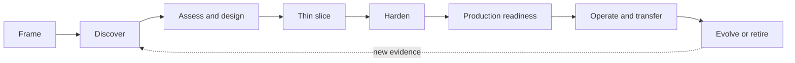
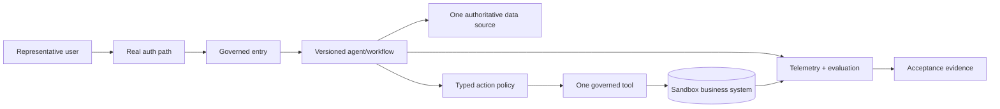
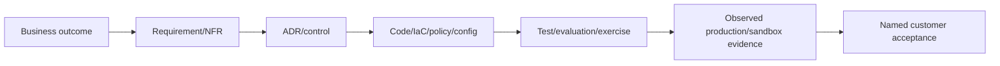

# Volume 9 — FDE delivery handbook

> [!CAUTION]
> **Status: Draft delivery system — not customer acceptance.** Updated 2 August
> 2026. The method aligns with current Google Cloud Adoption and Well-Architected
> guidance and current Agent Platform evidence in this handbook. It is an
> independent FDE field pattern, not a representation of Google Cloud Consulting's
> proprietary method or a contractual service. Local gate logic passes tests; no
> customer launch or handover is asserted. See the [evidence ledger](../../references/implementation/volume-9-fde.md).

**Audience:** Forward Deployed Engineers and their customer sponsors, product,
platform, security, data, SRE, domain, change, support and enablement teams.  
**Primary outcome:** the customer owns a measurable, governed, operable service—not
a demo that remains dependent on the FDE.

## Mission

Give Forward Deployed Engineers a repeatable method for moving from an ambiguous customer objective to a secure production service, an owned operating model, and measurable value transfer.

## Delivery chapter map

| # | Chapter | FDE outcome | Customer artifacts |
|---|---|---|---|
| 1 | Engagement framing | Establish outcome, sponsor, scope, constraints, decision rights, and success measures | Engagement charter; stakeholder map; RAID log |
| 2 | Discovery workshop | Surface workflow, data, identity, tools, controls, NFRs, operations, and economics | Workshop deck; question bank; current-state map |
| 3 | Workload and autonomy assessment | Reject unsuitable use cases and tier acceptable actions | Qualification rubric; autonomy/risk matrix |
| 4 | Architecture workshop | Convert requirements into logical/physical topology and explicit decisions | Diagrams; ADR backlog; NFR traceability |
| 5 | Thin vertical slice | Prove one governed end-to-end path with production-shaped controls | Working slice; demo script; evidence report |
| 6 | Hardening plan | Close identity, network, data, security, testing, SRE, and delivery gaps | Gap assessment; prioritized backlog; exit criteria |
| 7 | Production readiness | Conduct six review gates, failure exercises, rollback, and launch decision | Readiness review; runbooks; go/no-go record |
| 8 | Operating model | Assign product, platform, workload, security, data, model, and incident ownership | RACI; service catalog; support model; SLO policy |
| 9 | Handover and enablement | Transfer code, infrastructure, evidence, skills, and operational authority | Handover pack; training labs; competency checks |
| 10 | Value and evolution | Measure outcomes, manage drift, prioritize improvements, and retire safely | Outcome dashboard; review cadence; roadmap |

## Delivery lifecycle



## 🔵 Field Pattern

The thin vertical slice should include a real identity path, one authoritative data source, one governed tool, persisted state, telemetry, evaluation, failure handling, and deployment automation. A UI-only demonstration does not reduce production architecture risk.

## FDE notebook answers required in every chapter

- Why Agent Runtime, Agent Gateway, Agent Registry, Cloud Run, or GKE for this customer constraint?
- Why ADK and why this workflow topology?
- Why is an agent platform needed instead of a custom application or simple model call?
- Why not LangGraph or custom orchestration for this workload?
- Which answer is an official capability, recommendation, or field pattern?
- What evidence would change the decision?

## Customer delivery review

A reviewer who was not part of authoring must be able to use the chapter to run the workshop, explain tradeoffs, capture decisions, implement the thin slice, identify blockers, define acceptance, and hand over operations without relying on undocumented author knowledge.

## Exit criteria

All templates have been used in realistic delivery simulations; decisions trace from business outcome through requirement, architecture, code, test, and operational evidence; handover competency is tested; and customer-specific assumptions are never embedded as universal platform guidance.

---

## 1. FDE operating principles

🔵 **Field Pattern.** Forward deployment combines product discovery, architecture,
software delivery, security, reliability, change leadership and knowledge
transfer inside the customer's constraints. The FDE is temporarily close to every
decision, but must design themselves out of the operating dependency.

1. Start with a measured business workflow, not an agent product.
2. Establish decision rights before architecture debates.
3. Prefer the least autonomous solution that proves value.
4. Prove one end-to-end path with production-shaped boundaries early.
5. Make unknowns, assumptions, risks and Pre-GA dependencies visible.
6. Keep official capability, architecture recommendation and field pattern distinct.
7. Turn every claim into acceptance evidence and an owner.
8. Test unsafe, failed and recovery paths before expanding scope.
9. Transfer skills by customer performance, not presentation attendance.
10. Measure business outcome and retire what does not create acceptable value.

🟢 **Official Google Guidance.** The Google Cloud Adoption Framework groups
readiness across lead, learn, scale and secure. The Well-Architected Framework
organizes operational excellence, security/privacy/compliance, reliability, cost,
performance and sustainability. Google Cloud Consulting publicly describes
agent engagements with discovery, design, architecture, code and enterprise-
readiness outcomes. This handbook uses those as public context; the detailed
stage/gate method below is a field pattern.

## 2. Engagement charter

Do not begin implementation until these are explicit:

| Charter field | Required statement |
|---|---|
| outcome | baseline, target, population, measurement source and date |
| workflow | start/end, actors, systems, volume, variants and failure impact |
| scope | in/out use cases, environments, countries/business units and actions |
| sponsor | accountable business sponsor with prioritization authority |
| product owner | accepts workflow, quality and user outcomes |
| technical owner | accepts architecture and code |
| control owners | security, privacy/legal, data, risk/domain, SRE and records |
| decision rights | who recommends, approves, vetoes, accepts risk and resolves conflict |
| constraints | time, budget, contract, location, maturity, platform, procurement, skills |
| success/stop | launch gates, value threshold, unsafe threshold, pause/retire condition |
| deliverables | code/IaC/tests/docs/evidence/training/runbooks and destination |
| working model | cadence, access, environments, communications and escalation |

The scope explicitly excludes production access or mutation not authorized by
the customer. The FDE never accepts legal, clinical, financial, safety or customer
risk on the customer's behalf. Access is least privileged, time-bound, named and auditable.

## 3. Stakeholders, RACI and delivery governance

Identify sponsor, workflow owner, end users, affected non-users, domain experts,
platform/cloud foundation, application/integration, identity/network/security,
privacy/legal/records, data governance, SRE/support, FinOps/procurement, change/
training/accessibility, internal audit and Google support/account teams.

RACI is attached to decisions, not job titles. At minimum:

| Decision | Accountable customer role |
|---|---|
| business outcome and acceptable behavior | product/workflow owner |
| material actions and autonomy | risk/domain/legal owner |
| data purpose/location/retention | data/privacy/legal owner |
| identity/network/security | security/platform owner |
| runtime/architecture | technical/platform owner |
| SLO, launch and incident | service/SRE owner |
| spend and consumption | FinOps/sponsor |
| residual risk/Pre-GA | authorized customer risk acceptor |
| handover competency | receiving engineering/operations managers |

Maintain RAID—risks, assumptions, issues and dependencies—with impact,
probability, owner, next action/date, evidence and decision. Assumptions expire.
Red status is useful information; hiding it to preserve a milestone is delivery failure.

## 4. Discovery workshop

Run discovery with real workflow participants. Ask them to demonstrate current
work and exceptions rather than describe an ideal process.

### 4.1 Business and user

- What triggers work; what terminal outcome creates value?
- How is value, quality, harm, rework and cycle time measured today?
- Who requests, performs, reviews, is affected and can appeal?
- Which steps use judgment versus deterministic rules?
- What are peak, backlog, abandonment and seasonal patterns?
- Which languages, abilities, channels and time zones must work?

### 4.2 Data and knowledge

- Which system/field/version is authoritative at each decision?
- How fresh must it be; how are conflicts and missing data handled?
- Which subjects/tenants/classes/jurisdictions and consents apply?
- May data enter model, retrieval, state, memory, telemetry, evaluation or support?
- What are location, processing, key, retention, deletion, hold and lineage requirements?

### 4.3 Identity, actions and risk

- Who authenticates, under whose authority, with which delegation/scopes?
- What can the system read, draft, recommend, approve and execute?
- Which parameters/records/amounts are bounded and which actions are prohibited?
- Who is qualified and accountable to review high-impact actions?
- What fraud, injection, confused-deputy, exfiltration and supply-chain cases matter?

### 4.4 Technology and operations

- Current projects, networks, perimeters, DNS, identity, CI/CD and runtime standards?
- APIs, protocols, tools, queues, sessions, data stores, quotas, support and vendors?
- SLO, RTO/RPO, incident, change windows, release/rollback and manual fallback?
- Skills, on-call, procurement, cost allocation and lifecycle ownership?

Outputs: current-state swimlane, business metric baseline, data/identity/action
maps, dependency inventory, NFRs, constraints, risk/autonomy assessment, threat
seed, candidate thin slice, architecture options and open decisions.

## 5. Use-case and autonomy assessment

Score each candidate using observed evidence rather than enthusiasm.

| Dimension | Favor early slice | Warning/reject signal |
|---|---|---|
| value | high-volume measurable rework/cycle-time problem | novelty without baseline/owner |
| task fit | language/knowledge work with bounded outcome | deterministic function better solved normally |
| data | authorized, accessible, representative, authoritative | unknown rights, poor lineage, no source of truth |
| action | read/draft/propose or reversible bounded write | irreversible/material/safety autonomy |
| evaluation | expert labels and observable acceptance | subjective goal with no acceptor/test |
| integration | stable bounded API | desktop/manual bypass or unsafe broad credentials |
| operations | service owner, fallback and support exist | no owner/manual capacity/recovery |
| platform | selected services meet region/maturity/terms | required capability unsupported/unaccepted Pre-GA |

Decision outcomes: proceed; proceed with constraints; discovery spike; use a
non-agent solution; defer; reject. Record why. A simple form/search/rules/API call
is superior when it meets the outcome with lower risk and cost.

### Autonomy ladder

Move only one step at a time: retrieve → summarize/draft → recommend → propose
typed action → human-approved bounded action → narrowly automated reversible
action. Material, adverse, rights-affecting, financial, clinical or safety actions
remain customer-prohibited unless their authorities explicitly design and accept
another boundary. Do not treat a successful demo as autonomy evidence.

## 6. Architecture options and ADRs

Create at least two viable options, including “do not use an agent platform” when
appropriate. Compare capability fit, maturity, location/data, integration,
identity/security, reliability/recovery, operations/skills, cost, exit/migration
and time-to-evidence.

Required ADRs typically cover:

- ADK versus custom/LangGraph/other orchestration;
- single/model call versus workflow versus multi-agent;
- Agent Runtime versus Cloud Run versus GKE;
- Gateway/Registry/Agent Identity topology and exact modes;
- session/state/memory/business system boundaries;
- retrieval/source/freshness and data location;
- own versus delegated authority and action policy;
- synchronous versus asynchronous execution and event semantics;
- model selection/evaluation/fallback;
- telemetry/content/privacy and audit;
- release/revision strategy, rollback/roll-forward and DR; and
- industry/customer overlay.

Each ADR contains context, measurable drivers, options, decision, current official
evidence/date, consequences, risks, validation, reversibility/exit and revisit
triggers. “Google best practice” without a link, scope and customer driver is not rationale.

## 7. Thin vertical slice

The slice proves one representative request through the real boundary shape:



Production-shaped does not mean production data/traffic. Use customer-approved
synthetic data and sandbox resources, but preserve identity, project/environment
separation, immutable build, state/operation ledger, target contract, telemetry,
evaluation and failure behavior. Avoid UI polish until risks are reduced.

### Slice acceptance

- baseline/target outcome and representative tasks exist;
- official capabilities/versions/locations/maturity are dated;
- real authentication and least-privileged sandbox identity work;
- one authoritative source proves ACL/freshness/provenance;
- one typed governed tool proves allow/deny, approval and idempotency;
- trace-to-target correlation works without prohibited content;
- deterministic, quality, adversarial and failure tests run;
- immutable artifact deploys through automation and can be removed safely;
- customer engineers explain and modify the slice.

## 8. Hardening backlog

After the slice, assess gaps across product, architecture, application/ADK,
platform/runtime, identity/security, data/privacy, model/evaluation, delivery/
supply chain, reliability/DR, cost, industry/legal, operations/change/handover.

Prioritize by customer harm and launch dependency, not engineering preference:

```text
priority = impact × likelihood × exposure × time-criticality
```

Do not pretend the formula is exact; use it to expose assumptions. Every item has
owner, acceptance evidence, dependency, target date, status and residual risk.
Security, privacy, correctness and recovery blockers cannot be traded silently for demo scope.

## 9. Six production reviews

### Review 1 — Outcome, workflow and product

Validate sponsor, users/affected parties, workflow variants, baseline/target,
material-action boundary, UX/accessibility, adoption, feedback and stop criteria.

### Review 2 — Architecture and platform

Validate diagrams/ADRs, current official product/maturity/location/quotas,
projects/network/runtime/state/event/tool contracts, capacity, cost and exit.

### Review 3 — Security, privacy, legal and industry

Validate threat model, principals/delegation/action authorization, Gateway/
Registry/content/egress, data flow/location/retention, supply chain, red team,
customer interpretations, exceptions and incident/revocation.

### Review 4 — Application, model and evaluation

Validate workflow graph/state, prompts/instructions, tool schemas, model/version,
grounding/freshness, deterministic/quality/safety/trajectory/adversarial datasets,
judge calibration, canary and release thresholds.

### Review 5 — Reliability and operations

Validate owners/service catalog, telemetry privacy/coverage, SLO/error budget,
alerts/runbooks/on-call/support, failure injection, idempotency/reconciliation,
load/quota/cost, backup/restore, DR and incident exercises.

### Review 6 — Delivery, launch and transfer

Validate immutable CI/CD/evidence/promotion/rollback, production access/change,
cutover/coexistence, communications/training, manual fallback, RACI, competency,
support/warranty, roadmap and customer acceptance.

Reviewers are independent enough to challenge authors. Findings are blocker,
accepted residual risk, time-bound exception or post-launch improvement. An open
blocker is not converted to green by changing its label.

## 10. Evidence traceability



Use stable IDs. The release manifest maps source, artifact, dependencies, ADK,
model, workflow/state/event schema, prompt/tool/policy, infrastructure and
evaluation versions. Evidence records environment, date, actor, command/test,
result, immutable attachment and limitation. Never mark “passed” from a plan.

The local [`fde_kit.delivery`](../../examples/python/fde-production-kit/src/fde_kit/delivery.py)
implements fail-closed stage gates. It demonstrates that later work cannot erase
missing earlier evidence; it is not a project-management system.

## 11. Launch decision and cutover

Go/no-go records scope/release/environment, review findings, current risk and
exceptions, SLO/capacity/DR/security results, on-call/support, rollback/roll-
forward, manual fallback, customer communications, decision-makers and time.

Cut over progressively: internal users → selected low-risk population → bounded
traffic/action → wider population. Compare quality/safety/outcome/latency/cost and
support burden. Keep old/manual paths long enough to meet customer recovery and
change needs. Never canary an irreversible action without a safe action boundary.

Rollback code only after checking state, event, tool, data and policy
compatibility. Stop or reconcile in-flight work. A rollback does not reverse
business effects; use target-ledger reconciliation and approved compensation.

## 12. Operating model

| Role | Owns after transfer |
|---|---|
| product/workflow | outcome, backlog, users, policy of acceptable behavior |
| application/agent | code, workflow, tools, evaluations and releases |
| platform | projects, runtime, network, identity primitives, CI/CD and quotas |
| security/privacy | threats, policies, data handling, findings, exceptions, incidents |
| data/domain | authoritative sources, quality, lineage, access and retention |
| SRE/service | SLOs, telemetry, capacity, on-call, recovery and support |
| FinOps | allocation, forecast and outcome unit economics |
| change/enablement | communications, training, adoption and competency |
| vendor/Google liaison | support entitlement, cases, roadmaps and current docs |

Define level 1/2/3 support, severity and response, hours/time zones, ticket fields,
privacy-safe diagnostic bundle, escalation, Google support route, vendor contacts,
known limitations, change cadence, error-budget policy and warranty/engagement exit.

## 13. Handover and competency

Handover pack: charter/outcomes, stakeholders/RACI, diagrams/ADRs, source and
release manifests, environment/IaC/deployment, IAM/network/data/threat/evaluation,
SLO/dashboards/alerts/runbooks, capacity/cost, backup/DR, incident history, support,
known risks/exceptions, roadmap and evidence index. Secrets are transferred only
through customer credential systems, never documents.

Competency is performance-based. Customer staff must independently:

1. explain architecture, data/action and risk boundary;
2. build/test an approved change;
3. deploy/canary/contain/rollback or roll forward;
4. diagnose an injected identity/model/state/tool failure;
5. reconcile an unknown write;
6. rotate/revoke identity/tool/secret/release;
7. restore state and execute a DR role;
8. update an evaluation and source/maturity record; and
9. communicate an incident and product outcome.

Record person/role, scenario, observed result, gaps, remediation and manager
acceptance. Training attendance is not evidence of operational authority.

## 14. Value realization

Baseline before intervention. Measure accepted/correct outcome rate, cycle and
human handling time, rework/error/escalation, backlog, user/affected-party outcome,
adoption and abandonment, safety/control incidents, reliability, cost per correct
outcome and support/reconciliation effort. Compare against counterfactual or
phased cohorts where ethically and operationally appropriate.

Do not count generated tokens, agent sessions, tool calls or adoption alone as
business value. Report uncertainty, population and unintended effects. If value
does not exceed risk, cost and opportunity cost, reduce scope, redesign, use a
simpler system, or retire.

## 15. Change management and adoption

Map roles/tasks that change, new decision responsibility, escalation and manual
mode. Co-design with users and affected groups. Communicate capability and limits
truthfully. Train on verification, abstention, security reporting and outage—not
only the happy path. Provide accessible help and feedback routes.

Monitor automation bias, over-reliance, work displacement, approval queues,
shadow workflows and policy bypass. Never use adoption targets to pressure users
to accept unsafe output. Product owners act on feedback with release evidence.

## 16. FDE technical notebook

For every material choice write:

```text
customer constraint and measured driver
options considered, including simpler/non-agent option
official capability evidence + date
recommendation/field-pattern assumptions
selected design and rejected alternatives
security/data/reliability/cost/operations consequences
validation evidence and limitations
what observation would reverse the decision
owner and revisit trigger
```

**Why an agent platform?** Because the workflow needs governed multi-step model,
state, tool, identity and observability integration whose value exceeds added
complexity. If a single deterministic API/model call solves it, use that.

**Why ADK?** Full Agent Runtime integration, graph/workflow and ecosystem fit may
reduce delivery cost. Choose another framework/custom orchestration when customer
skills, protocol, portability or semantics outweigh that benefit—then qualify it.

**Why Agent Runtime?** Highest managed fit for the selected ADK workload when
current region, mode, network, maturity, quota, support and operations satisfy the
customer. Cloud Run or GKE remain valid where their contracts fit better.

**Why Gateway/Registry/Identity?** Supported managed governance and inventory can
centralize policy and telemetry. They do not replace business authorization, data
governance or target-system audit.

## 17. Common delivery failure modes

### Implementation artifact map

🔵 **Field Pattern.** [`fde_kit.delivery`](../../examples/python/fde-production-kit/src/fde_kit/delivery.py)
implements typed stage gates; the [qualification validator](../../delivery/volumes-4-10/validate_qualification.py)
indexes customer evidence. The FDE composes the Volume 2 [Terraform](../../terraform/volume-2-platform/README.md),
Volume 3 Python application, Cloud Build validation/build, Cloud Deploy immutable
promotion and [GitHub Actions](../../.github/workflows/volumes-4-10-ci.yml) rather
than rebuilding an ungoverned demo pipeline. Customer values remain outside
source; saved Terraform plans and digests are approved artifacts; production
deployment and runtime identities stay separate. A boolean gate never replaces
the test report, plan, approval, workshop record or competency observation.

- Starting code before sponsor, outcome, authority and source of truth exist.
- Selecting a platform/framework before proving an agent is needed.
- Treating a polished chat UI as a vertical slice.
- Hiding Preview, region, quota, data or support uncertainty.
- Using customer production data to make the demo realistic.
- Delegating broad permissions to avoid integration work.
- Deferring security, idempotency, telemetry and recovery until “hardening.”
- Marking a planned control or vendor feature as implemented evidence.
- Measuring model score without business outcome or unsafe cases.
- Launching without manual fallback, support and incident ownership.
- Transferring documents without testing customer competency.
- Allowing the FDE to remain sole deployer, debugger or decision historian.

## 18. Engagement checklist

- [ ] Charter names outcome/baseline/target, scope, sponsor, owners, rights and stop criteria.
- [ ] Discovery outputs map real workflow, exceptions, data, identity, actions, dependencies and NFRs.
- [ ] Use-case/autonomy assessment includes simpler alternative and prohibited actions.
- [ ] ADRs cite current official evidence and state reversibility/revisit triggers.
- [ ] Thin slice includes real auth shape, authoritative source, governed tool, state, telemetry, evaluation and failure.
- [ ] Hardening backlog covers all control/operating domains with evidence owners.
- [ ] Six independent reviews close blockers or record authorized expiring risk.
- [ ] Launch/cutover/canary/containment/reconciliation/manual fallback are exercised.
- [ ] RACI, service catalog, on-call/support, SLO policy and FinOps are accepted.
- [ ] Customer staff pass competency scenarios and control production authority.
- [ ] Outcome/value is measured against baseline; retire/exit criteria are real.

## 19. Architecture decision record

**Decision:** Use a stage-gated FDE engagement with a production-shaped synthetic
thin slice, six independent reviews, progressive cutover and competency-based transfer.

**Context:** The customer has a valuable but ambiguous workflow and limited agent
operations experience. A demo-first approach would defer the highest risks.

**Consequences:** Discovery and evidence consume early time; scope remains narrow;
customer owners attend working sessions; launch can be blocked; the FDE cannot be
a permanent privileged operator.

**Validation:** Gate validator, traceability audit, thin-slice demo including
failures, six reviews, game day, release/rollback/reconciliation, competency exam
and 30/60/90-day outcome review.

**Revisit when:** customer maturity/ownership, use-case risk, scope, platform
capability, delivery timeline or outcome evidence changes.

## 20. Workshop cadence example

| Phase | Working sessions | Exit |
|---|---|---|
| frame | sponsor/outcome/charter and access | signed charter, decision rights |
| discover | workflow/users; data/identity; controls/NFR/ops | maps, baseline, RAID, slice candidate |
| design | options/ADRs; threat/data; evaluation/SRE | approved design and test plan |
| slice | pair-build and daily evidence review | end-to-end accepted synthetic path |
| harden | domain reviews, failure/load/recovery | blockers closed and runbooks exercised |
| launch | six reviews, go/no-go, progressive cutover | accepted production scope |
| handover | paired then reverse-shadow operations | competency and authority transfer |
| evolve | 30/60/90-day outcome and drift | roadmap, expand/redesign/retire decision |

Cadence is adapted to customer change and access—not compressed by skipping gates.

## 21. Qualification lab

Run [the FDE simulation](../../labs/volume-9-fde/README.md). One participant is
customer sponsor/product, one domain/security/SRE authority, and one receiving
engineer/operator. Use the case-agent synthetic workload. The FDE must expose and
resolve incomplete outcomes, prohibited action, stale source, missing policy,
unknown write, capacity limit, bad release and transfer gap. Passing requires the
customer team to operate the system without hidden FDE knowledge.

## 22. Operations checklist after FDE exit

- [ ] Customer controls source, CI/CD, credentials, evidence, production and support.
- [ ] No runbook depends on an FDE laptop, personal account or memory.
- [ ] On-call and business owner can contain action and reconcile target state.
- [ ] Dependency/release/source/maturity drift reaches customer owners.
- [ ] Exceptions, access and FDE accounts expire according to the charter.
- [ ] Outcome, quality, risk, reliability and cost reviews continue.
- [ ] Expansion repeats qualification; retirement preserves required evidence/data lifecycle.

## 23. Official references

- [Agent Starter Pack at the reviewed Google commit](https://github.com/GoogleCloudPlatform/agent-starter-pack/tree/659f047742457bd55e5db0edd088cf678b6f0669)
- [ADK samples at the reviewed Google commit](https://github.com/google/adk-samples/tree/739bb34c0bd22516dbbda88f3e5a9f9375bb963c)
- [Google Cloud Adoption Framework](https://cloud.google.com/adoption-framework)
- [Google Cloud Well-Architected Framework](https://docs.cloud.google.com/architecture/framework)
- [Operational excellence pillar](https://docs.cloud.google.com/architecture/framework/operational-excellence)
- [AI/ML operational excellence](https://docs.cloud.google.com/architecture/framework/perspectives/ai-ml/operational-excellence)
- [Google Cloud Consulting services portfolio](https://cloud.google.com/consulting/portfolio)
- [Deploy and operate generative AI applications](https://docs.cloud.google.com/architecture/deploy-operate-generative-ai-applications)
- [Implementation evidence ledger](../../references/implementation/volume-9-fde.md)

## 24. Next volume

[Volume 10](../volume-10-evolution/README.md) defines how the customer monitors
upstream change, qualifies upgrades, migrates in-flight state, publishes revisions
and retires old capabilities after the engagement.
