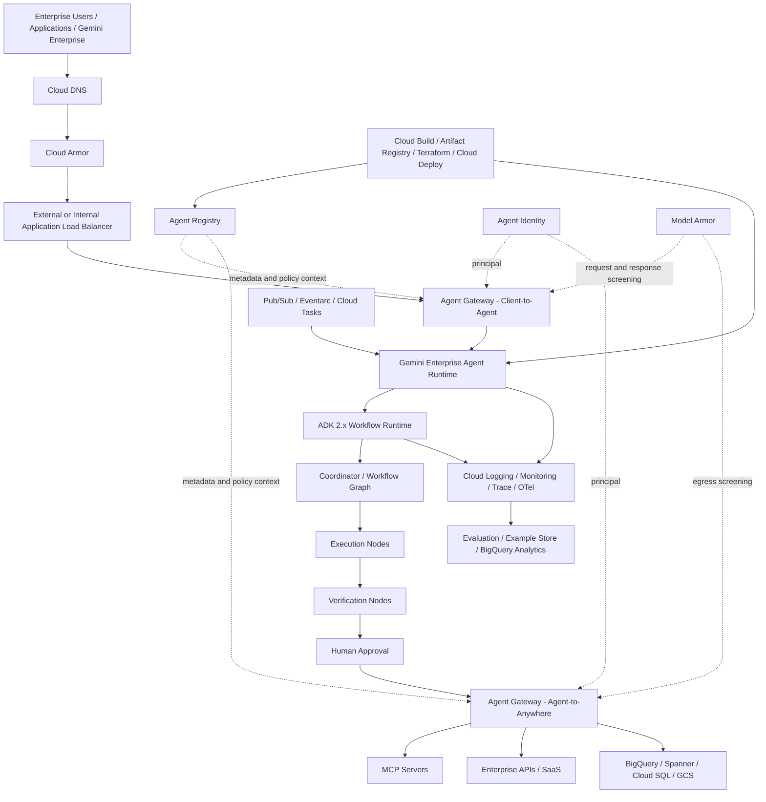
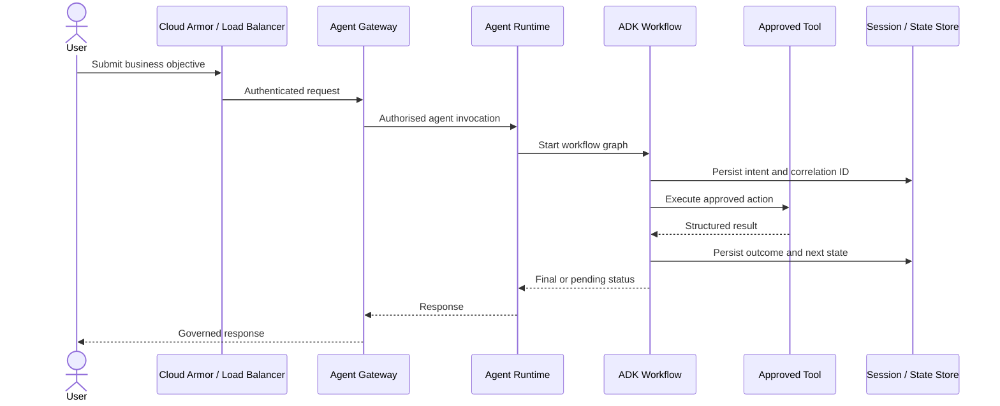
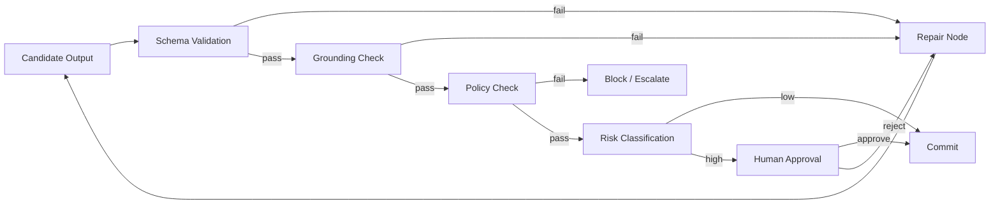
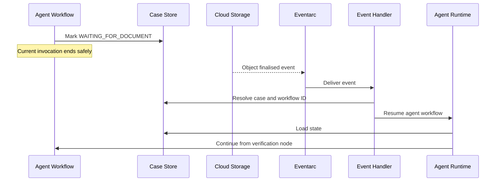
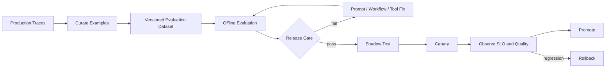
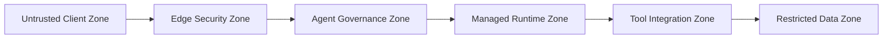

# Enterprise Loop Engineering on Google Cloud

> [!CAUTION]
> **Status: Draft — not approved for production use.** Bootstrap audit completed 2 August 2026. Agent Gateway and Agent Registry reached GA on 18 June 2026, while sub-capabilities retain independent maturity constraints. This imported draft predates the repository's evidence classification and six review gates. See [content status](docs/STATUS.md) and the [bootstrap audit](docs/audits/2026-08-02-bootstrap-audit.md).
## Chapter 2 — Gemini Enterprise Agent Platform Reference Architecture

**Version:** 0.2-draft  
**Last researched:** 29 July 2026  
**Primary audience:** Forward Deployed Engineers, AI Platform Engineers, Principal Engineers, Cloud Architects, Security Architects, SREs, and customer delivery teams  
**Implementation baseline:** Google ADK Python 2.x, Gemini Enterprise Agent Platform, Agent Runtime, Agent Registry, Agent Gateway, Agent Identity, Model Armor, Cloud Armor, and supporting Google Cloud services

---

## 1. Purpose of this chapter

This chapter converts the conceptual loop-engineering model into a practical Google Cloud reference architecture that an FDE can take into a customer engagement.

It focuses on a question that repeatedly appears in enterprise delivery:

> How do we build, govern, deploy, and operate production agents on Google Cloud without turning each agent into a bespoke application?

The answer is not “deploy an ADK container.” The production answer is to create an **enterprise agent platform** with clear separation between:

- agent development;
- deterministic workflow control;
- runtime execution;
- agent and tool registration;
- ingress and egress governance;
- agent identity;
- data and tool access;
- safety controls;
- observability;
- evaluation;
- release management; and
- operational ownership.

The design in this chapter maps those responsibilities to current Google Cloud capabilities and explicitly labels where the document provides an architectural recommendation rather than a guaranteed product capability.

---

## 2. Source and confidence model

This handbook uses the following labels.

### 2.1 Official capability

A statement directly supported by current Google documentation or official Google source code.

### 2.2 Recommended production pattern

A design recommendation built on documented Google capabilities. The pattern may not be a named Google product feature.

### 2.3 Customer-specific decision

A choice that must be resolved during discovery because it depends on regulatory, organisational, latency, networking, operational, or commercial constraints.

### 2.4 Preview warning

Some Gemini Enterprise Agent Platform capabilities are in preview or subject to Pre-GA terms. A production programme must confirm availability, support status, quota, region, and contractual suitability before committing to them.

---

## 3. Current official platform model

Google describes Gemini Enterprise Agent Platform as an open, comprehensive platform for building, scaling, governing, and optimising enterprise-grade agents grounded in enterprise data.

The platform documentation currently exposes the following major capability groups:

- **Build:** ADK, Agent Runtime, tools, grounding, skills, and development tooling.
- **Scale:** managed runtime, sessions, memory, identity, and deployment lifecycle.
- **Govern:** Agent Registry, Agent Gateway, IAM, Model Armor, and policy controls.
- **Optimise:** observability, evaluation, examples, tracing, and operational analysis.

### Official references

- Gemini Enterprise Agent Platform overview: <https://docs.cloud.google.com/gemini-enterprise-agent-platform>
- Agents overview: <https://docs.cloud.google.com/gemini-enterprise-agent-platform/agents>
- Agent Runtime: <https://docs.cloud.google.com/gemini-enterprise-agent-platform/build/runtime>
- Agent Registry: <https://docs.cloud.google.com/gemini-enterprise-agent-platform/govern/agent-registry>
- Agent Gateway overview: <https://docs.cloud.google.com/gemini-enterprise-agent-platform/govern/gateways/agent-gateway-overview>
- ADK 2.0 overview: <https://adk.dev/2.0/>
- ADK Python source: <https://github.com/google/adk-python>

---

## 4. What changed with ADK 2.x

ADK 2.x is not merely a version upgrade. It changes the orchestration model.

Google’s ADK 2.0 documentation states that the runtime transitions from a hierarchical agent executor to a **graph-based execution engine**. Agents, tools, and functions are evaluated as nodes in a workflow graph. The Python repository also documents support for routing, fan-out/fan-in, loops, retries, state management, dynamic nodes, human-in-the-loop, and nested workflows.

This matters for loop engineering because production loops require explicit control over:

- state transitions;
- retry paths;
- verification stages;
- parallel work;
- repair branches;
- human approval;
- termination conditions; and
- resumability.

ADK 1.x-style hierarchical delegation alone is not sufficient for these requirements.

### 4.1 Migration implications

ADK 2.0 introduces event schema fields including `node_info` and `output`. Custom session persistence and downstream consumers that use strict JSON validation must be updated accordingly.

ADK 2.0 also changes the execution hierarchy: `BaseAgent` is now evaluated as a workflow node. Code that bypasses the framework by directly appending session events can break graph determinism and must be removed.

### 4.2 FDE guidance

For a new enterprise implementation:

- standardise on ADK 2.x from day one;
- pin a tested minor version rather than using an unconstrained latest dependency;
- use the official constraints file for dependency protection;
- define an upgrade qualification pipeline;
- version session schemas;
- treat workflow topology as deployable software; and
- avoid direct session mutation outside supported ADK APIs.

### Official references

- ADK 2.0 migration and compatibility: <https://adk.dev/2.0/>
- ADK Python repository: <https://github.com/google/adk-python>
- ADK releases: <https://github.com/google/adk-python/releases>

---

## 5. Enterprise reference architecture



### 5.1 Architectural intent

The architecture establishes five distinct planes.

#### Experience plane

Channels through which users and applications interact with agents.

Examples:

- Gemini Enterprise;
- internal web applications;
- mobile applications;
- contact-centre systems;
- API clients;
- IDE or CLI clients; and
- other agents using A2A.

#### Governance plane

Controls what may communicate, what identity is used, which registered target is approved, and which policies must be enforced.

Key services:

- Agent Gateway;
- Agent Registry;
- Agent Identity;
- IAM;
- Model Armor;
- Cloud Armor; and
- Cloud Audit Logs.

#### Execution plane

Runs the actual agent and workflow logic.

Key services:

- Agent Runtime;
- ADK 2.x Workflow Runtime;
- Cloud Run or GKE for specialised components; and
- Cloud Tasks, Pub/Sub, Eventarc, or Workflows where external orchestration is required.

#### Data and tool plane

Contains enterprise systems the agent accesses.

Examples:

- MCP servers;
- internal APIs;
- SaaS systems;
- BigQuery;
- Spanner;
- Cloud SQL;
- AlloyDB;
- GCS;
- SAP;
- Salesforce;
- ServiceNow; and
- on-premises systems.

#### Operations plane

Provides traceability, evaluation, delivery automation, incident response, and continuous improvement.

Key services:

- Cloud Logging;
- Cloud Monitoring;
- Cloud Trace;
- OpenTelemetry;
- BigQuery;
- evaluation services;
- Cloud Build;
- Artifact Registry;
- Terraform; and
- release pipelines.

---

## 6. Component responsibilities

## 6.1 ADK 2.x Workflow Runtime

### Official capability

ADK 2.x provides graph-based and dynamic workflows. A workflow can compose agents, tools, functions, human input, branches, loops, retries, and nested workflows.

### Recommended production responsibility

Use ADK workflow graphs for **agent-local orchestration** where the steps are closely coupled to model reasoning, tool invocation, agent state, and verification.

Examples:

- plan → execute → verify → repair;
- retrieve → assess grounding → answer;
- parallel specialist analysis → merge → critic;
- request approval → wait → resume;
- tool failure → classify → retry or compensate; and
- policy check → action or escalation.

### Do not use ADK alone for every workflow problem

Use an external durable orchestration service when the process:

- spans hours or days and must survive independent system failures;
- involves broad non-agent service orchestration;
- requires strong business-process visibility outside the agent runtime;
- uses scheduled or event-driven enterprise integration at large scale;
- requires explicit compensation across many systems; or
- must be operated by a non-AI workflow team.

In those cases, use ADK for the agent decision segment and use Cloud Workflows, Cloud Tasks, Pub/Sub, or Eventarc for the broader business process.

---

## 6.2 Agent Runtime

### Official capability

Agent Runtime is a fully managed, opinionated runtime for deploying, operating, and scaling agentic applications. It abstracts underlying infrastructure, supports managed deployment, custom container build-time dependencies, VPC Service Controls, authentication and IAM, multiple frameworks, and full ADK integration.

The API resource may still be named `ReasoningEngine` for backward compatibility.

### Recommended production responsibility

Use Agent Runtime as the default managed execution target when:

- the workload is an agentic application;
- managed scaling and runtime integration are desired;
- ADK is the primary framework;
- platform teams want to minimise Kubernetes or container operations;
- Agent Identity and Agent Gateway integration are required; and
- the supported region and product stage meet customer requirements.

### Consider Cloud Run when

- the workload is mostly a stateless API around an agent;
- custom HTTP behaviour is central;
- the customer already has a strong Cloud Run platform;
- the application needs arbitrary sidecars or patterns not available in Agent Runtime; or
- a temporary migration bridge is required.

### Consider GKE when

- strict runtime customisation is necessary;
- specialised networking, sidecars, GPU, service mesh, or scheduling is required;
- the enterprise already operates a mature GKE platform;
- the workload includes non-agent services tightly coupled to the agent; or
- unsupported runtime controls are mandatory.

### FDE warning

Do not select GKE merely because the customer already uses Kubernetes. Managed agent runtime should be evaluated first. The operational burden of GKE is justified only when requirements exceed the managed runtime’s capabilities.

---

## 6.3 Agent Registry

### Official capability

Agent Registry centralises agents, MCP servers, endpoints, and related agentic components. It helps reduce fragmented tool access, isolated data, and redundant implementations while maintaining security and access control.

It supports registration of:

- agents;
- MCP servers;
- endpoints; and
- tools or skills where supported.

### Recommended production responsibility

Treat Agent Registry as the control-plane catalogue for approved agentic assets, not as a Git repository and not as the sole release system.

Store source code in Git. Store build artefacts in Artifact Registry. Use Agent Registry for discoverability, governance metadata, endpoint association, and runtime integration.

### Minimum metadata model

Each production agent registration should be linked to:

- business owner;
- technical owner;
- data classification;
- risk rating;
- autonomy level;
- allowed tools;
- approved runtime region;
- model family and configuration;
- source commit SHA;
- container digest or deployment version;
- evaluation scorecard;
- security review identifier;
- change ticket or release identifier;
- support group;
- SLO tier;
- deprecation date; and
- rollback target.

Some of this metadata may live in an external CMDB or governance repository if the registry schema does not support it directly. Link rather than duplicate where possible.

---

## 6.4 Agent Gateway

### Official capability

Agent Gateway acts as the network entry and exit point for agent interactions and integrates with Agent Registry, Agent Identity, managed runtimes, policy services, Model Armor, and observability.

It supports two documented modes:

- **Client-to-Agent:** governs ingress from clients to agents and tools on Google Cloud.
- **Agent-to-Anywhere:** governs egress from agents to agents, tools, APIs, MCP servers, and external systems.

The gateway supports protocol mediation across MCP, A2A, REST, and gRPC.

### Recommended production responsibility

Use Agent Gateway as the policy enforcement point for agent-specific communication. Do not try to reproduce all agent-aware governance only in application code.

The gateway should enforce:

- approved target registration;
- caller and agent authentication;
- agent-specific authorisation;
- protocol mediation;
- Model Armor inspection;
- audit telemetry;
- destination control; and
- centrally managed policies.

### Important documented topology constraint

Google currently documents that the Gemini Enterprise app, Runtime agents, Agent Gateway, and associated Agent Registry must be in the same Google Cloud project for the relevant deployment pattern.

This constraint directly affects enterprise landing-zone design. Do not assume that a central gateway project can govern arbitrary runtime projects unless the documented topology explicitly supports it.

### Regional design

Google documents centralised and independent regional governance patterns. The appropriate pattern depends on:

- Gemini Enterprise location;
- Runtime region;
- registry location;
- data residency;
- blast-radius requirements;
- latency; and
- operational ownership.

A regulated Australian enterprise must verify current Australian region support. Do not substitute a US or EU pattern without customer approval and legal review.

---

## 6.5 Agent Identity

### Official capability

Agent Identity provides a per-agent identity tied to the agent lifecycle. Google positions it as a more secure principal than shared service accounts for agent workloads. IAM can grant or deny access to Google Cloud APIs using the agent identity.

Credentials are protected through Google-managed Context-Aware Access controls and certificate-bound mechanisms. Logs can show agent identity and, for delegated flows, both user and agent identity.

### Recommended production responsibility

Use one identity per independently governed agent or agent product. Do not use a single shared service account for hundreds of agents.

Authorisation should consider both:

- **who initiated the request**, and
- **which agent is acting**.

This is especially important for delegated enterprise workflows.

### Example authorisation rule

A mortgage-document agent may read documents only when:

- the human caller is authorised for the customer case;
- the agent identity is authorised for the document repository;
- the tool is registered and approved;
- the requested operation is read-only;
- the data location is permitted; and
- the request satisfies policy and risk conditions.

---

## 6.6 Model Armor

### Official capability

When configured with Agent Gateway, Model Armor can evaluate incoming client requests, outgoing agent responses, and agent egress to external LLMs, agents, APIs, and MCP servers. Gateway behaviour can allow or block traffic based on the verdict.

### Recommended production responsibility

Use Model Armor as one layer in a defence-in-depth design. It does not replace:

- application input validation;
- output schemas;
- IAM;
- data loss prevention;
- tool allowlists;
- transaction limits;
- human approval;
- business-rule validation; or
- evaluation.

### Inspection points

Apply controls at four points:

1. user input before the agent;
2. model output before the user;
3. agent request before an external tool; and
4. tool response before it re-enters the agent context.

The fourth point is critical because prompt injection may be carried inside tool or document content.

---

## 6.7 Cloud Armor

### Official capability

Cloud Armor protects supported load-balanced applications from web attacks and distributed denial-of-service threats and can enforce WAF, IP, geography, rate, and adaptive protection policies.

### Recommended production responsibility

Use Cloud Armor at the internet-facing or enterprise-facing load-balancer boundary. Use Agent Gateway for agent-aware policies. These services solve different problems.

Cloud Armor should handle:

- L3/L4 and L7 attack protection;
- OWASP-style web filtering;
- IP and geography restrictions;
- volumetric abuse;
- coarse request throttling; and
- edge-layer policy.

Agent Gateway should handle:

- agent identity;
- registered target governance;
- agent protocol mediation;
- agent-specific policy;
- MCP and A2A traffic controls; and
- Model Armor integration.

### Anti-pattern

Do not describe Cloud Armor as the agent gateway. It is an edge-security service and does not replace agent-aware governance.

Official reference: <https://cloud.google.com/armor/docs/cloud-armor-overview>

---

## 7. Mapping the four foundational loops to Google Cloud

## 7.1 Loop 1 — Execution loop

### Objective

Progress work from user intent to a business outcome.

### Primary services

- ADK 2.x Workflow Runtime;
- Agent Runtime;
- Agent Gateway;
- Agent Identity;
- MCP or first-party tools;
- Cloud Tasks for asynchronous task execution;
- Pub/Sub for decoupled events; and
- state stores where required.

### Reference flow



### Production requirements

- every workflow instance has a unique correlation ID;
- tool calls include idempotency keys;
- side effects are explicitly marked;
- retry policies differ between read and write actions;
- state transitions are persisted;
- cancellation is supported;
- model and tool budgets are enforced;
- workflow termination is deterministic; and
- high-risk actions are gated.

---

## 7.2 Loop 2 — Verification loop

### Objective

Determine whether the result is safe, correct, sufficiently grounded, policy compliant, and fit for action.

### Primary services

- ADK verification nodes;
- structured output schemas;
- Model Armor;
- Vertex AI evaluation capabilities where applicable;
- business-rule services;
- human approval;
- BigQuery for evaluation analytics; and
- Cloud Logging and Trace.

### Recommended workflow pattern



### Verification must be independent

For high-risk use cases, do not rely only on the same model and prompt that generated the output. Use one or more of:

- deterministic rule validation;
- independent evaluator configuration;
- source-document comparison;
- transaction simulation;
- human review;
- policy-as-code; and
- post-condition checks against the system of record.

---

## 7.3 Loop 3 — Event loop

### Objective

Resume or initiate work when external state changes.

### Primary services

- Eventarc;
- Pub/Sub;
- Cloud Tasks;
- Cloud Scheduler;
- Cloud Run event handlers;
- Agent Runtime invocation; and
- ADK workflow continuation.

### Example

A customer complaint agent waits for a supporting document.



### Recommended production pattern

Do not keep an in-memory process open while waiting hours for an event. Persist a resumable state, return a pending status, and resume through an authenticated event path.

### Idempotency rule

Every event consumer must tolerate duplicate delivery. Store the event ID and processing result before applying irreversible side effects.

---

## 7.4 Loop 4 — Continuous-improvement loop

### Objective

Use production evidence to improve quality, reliability, safety, latency, and cost without introducing uncontrolled change.

### Primary services

- Cloud Logging and Trace;
- OpenTelemetry;
- BigQuery;
- evaluation services;
- Example Store where applicable;
- Cloud Build;
- Artifact Registry;
- Terraform;
- release pipelines; and
- Agent Registry.

### Recommended lifecycle



### Non-negotiable rule

Production telemetry must not automatically rewrite prompts or workflow logic and deploy the changes without review. Continuous improvement is a controlled software-delivery loop, not unrestricted self-modification.

---

## 8. Practical ADK 2.x project baseline

The following is a minimal **architecture skeleton**, not a complete banking application. It uses documented ADK 2.x concepts and deliberately keeps tool side effects behind typed interfaces.

### 8.1 Repository structure

```text
enterprise-agent-platform/
├── agents/
│   └── case_resolution/
│       ├── __init__.py
│       ├── agent.py
│       ├── workflow.py
│       ├── nodes/
│       │   ├── classify.py
│       │   ├── retrieve.py
│       │   ├── propose.py
│       │   ├── verify.py
│       │   ├── approve.py
│       │   └── commit.py
│       ├── tools/
│       │   ├── case_api.py
│       │   ├── document_api.py
│       │   └── audit_api.py
│       ├── schemas/
│       │   ├── request.py
│       │   ├── decision.py
│       │   └── verification.py
│       └── tests/
├── platform/
│   ├── gateway/
│   ├── registry/
│   ├── identity/
│   ├── observability/
│   └── evaluation/
├── infra/
│   ├── modules/
│   └── environments/
├── evals/
│   ├── datasets/
│   ├── scorecards/
│   └── regression/
├── policies/
│   ├── tool-access/
│   ├── data-classification/
│   └── approvals/
├── pyproject.toml
├── constraints-3.12.txt
└── README.md
```

### 8.2 Dependency strategy

```toml
[project]
name = "enterprise-case-resolution-agent"
version = "0.1.0"
requires-python = ">=3.12,<3.13"
dependencies = [
  "google-adk>=2.0,<3.0",
  "pydantic>=2.8,<3.0",
  "opentelemetry-api>=1.27,<2.0",
  "opentelemetry-sdk>=1.27,<2.0",
  "tenacity>=9.0,<10.0",
]

[project.optional-dependencies]
dev = [
  "pytest>=8.0,<9.0",
  "pytest-asyncio>=0.24,<1.0",
  "mypy>=1.11,<2.0",
  "ruff>=0.7,<1.0",
]
```

For production, replace the broad minor range with the exact version qualified by your platform team and install with the official Google constraints file matching the Python version.

### 8.3 Minimal ADK 2.x workflow

```python
from google.adk import Agent, Workflow

classify_agent = Agent(
    name="classify_case",
    model="gemini-2.5-flash",
    instruction=(
        "Classify the case into a supported type. "
        "Return only data conforming to the configured output schema."
    ),
)

propose_agent = Agent(
    name="propose_resolution",
    model="gemini-2.5-pro",
    instruction=(
        "Create a proposed resolution using only retrieved case evidence. "
        "Cite the evidence identifiers used for every material claim."
    ),
)

verify_agent = Agent(
    name="verify_resolution",
    model="gemini-2.5-pro",
    instruction=(
        "Verify the proposal against policy, evidence, and business rules. "
        "Do not approve unsupported claims."
    ),
)

root_agent = Workflow(
    name="case_resolution_workflow",
    edges=[
        ("START", classify_agent, propose_agent, verify_agent),
    ],
)
```

This example reflects the public ADK 2.x `Workflow` interface shown in Google’s repository. It does not yet implement branching, repair, human approval, persistence, or side effects. Those belong in later implementation chapters.

### 8.4 Workflow design rule

Use an LLM node only where probabilistic interpretation or generation is actually needed. Use deterministic functions for:

- amount comparisons;
- mandatory-field checks;
- entitlement checks;
- date calculations;
- policy thresholds;
- idempotency;
- transaction state;
- access decisions; and
- final system-of-record writes.

---

## 9. Enterprise state model

A production agent must expose a state machine that operators can understand without reading model traces.

### 9.1 Recommended workflow states

```text
RECEIVED
VALIDATED
PLANNING
EXECUTING
VERIFYING
WAITING_FOR_EVENT
WAITING_FOR_APPROVAL
REPAIRING
COMMITTING
COMPLETED
REJECTED
FAILED_RETRYABLE
FAILED_TERMINAL
CANCELLED
COMPENSATING
COMPENSATED
```

### 9.2 Minimum persisted fields

```json
{
  "workflow_id": "wf_01J...",
  "agent_id": "case-resolution-agent",
  "agent_version": "2026.07.29-3",
  "tenant_id": "business-unit-a",
  "user_subject": "user@example.com",
  "correlation_id": "corr_01J...",
  "current_state": "VERIFYING",
  "current_node": "verify_resolution",
  "attempt": 2,
  "created_at": "2026-07-29T00:00:00Z",
  "updated_at": "2026-07-29T00:02:31Z",
  "input_ref": "gs://.../input.json",
  "output_ref": "gs://.../candidate.json",
  "policy_version": "policy-42",
  "model_config_version": "modelcfg-18",
  "evaluation_profile": "high-risk-v5",
  "idempotency_key": "case-123:resolve:v1",
  "approval": null,
  "last_error": null
}
```

### 9.3 Storage selection

Choose based on access and consistency requirements.

- **Firestore:** flexible workflow state and event-oriented applications.
- **Cloud SQL / AlloyDB:** relational state, transactions, and established SQL operations.
- **Spanner:** globally scalable, strongly consistent enterprise state where justified.
- **Bigtable:** very high-throughput key-based state or telemetry patterns.
- **Cloud Storage:** immutable large artefacts, source documents, and replay payloads.
- **BigQuery:** analytics and evaluation, not primary transactional workflow state.

Do not store all workflow state only in prompts or conversational memory.

---

## 10. Security architecture

## 10.1 Trust boundaries



Every transition must authenticate, authorise, validate, and log as appropriate.

## 10.2 Identity model

Use separate identities for:

- human user;
- calling application;
- agent;
- runtime deployment;
- tool service;
- CI/CD pipeline;
- break-glass operations; and
- evaluation jobs.

Do not collapse these into one project-wide service account.

## 10.3 User delegation

For actions performed on behalf of a user, preserve both identities through the request chain:

```text
Human principal
  +
Calling application principal
  +
Agent identity
  +
Tool identity
  +
Target resource policy
```

The final authorisation decision may require all of them.

## 10.4 Tool security

Every tool must have:

- an explicit schema;
- authenticated transport;
- least-privilege credentials;
- input validation;
- output validation;
- timeout;
- retry classification;
- idempotency support for writes;
- audit events;
- rate limits;
- data-classification metadata;
- an owner; and
- a kill switch.

## 10.5 MCP security

An MCP server is code and a trust boundary, not merely a convenience connector.

Before registration:

- review the implementation and dependencies;
- verify tool schemas;
- restrict network destinations;
- validate authentication;
- test prompt-injection resistance;
- check data egress;
- define allowed callers;
- set resource limits;
- monitor tool discovery changes; and
- pin or approve versions.

## 10.6 Cloud Armor and gateway layering

Recommended order for external access:

```text
Client
→ External Application Load Balancer
→ Cloud Armor
→ Agent Gateway Client-to-Agent
→ Agent Runtime
```

This order provides edge protection before agent-aware governance.

## 10.7 VPC Service Controls

Use VPC Service Controls where supported and justified to reduce data-exfiltration risk around managed services. Confirm the exact supported services and limitations for the customer’s runtime and region.

## 10.8 Secrets

Use Secret Manager for third-party credentials. Prefer workload and agent identity over static credentials. Avoid placing secrets in:

- prompts;
- agent instructions;
- environment files committed to Git;
- workflow state;
- logs;
- trace attributes; or
- registry descriptions.

---

## 11. Networking patterns

## 11.1 Pattern A — Managed-first regional platform

Use when the customer can adopt Agent Runtime and supported managed integrations.

```text
Project: agent-platform-prod
Region: approved customer region

- Agent Runtime
- Agent Gateway
- Agent Registry
- Agent Identity
- Model Armor
- Logging / Monitoring / Trace
- Private connectivity to enterprise tools
```

Advantages:

- low operational burden;
- strong platform integration;
- consistent governance; and
- easier standardisation.

Constraints:

- product and regional availability;
- same-project topology requirements;
- preview terms for some features; and
- limited runtime customisation compared with GKE.

## 11.2 Pattern B — Runtime plus private integration services

Use Agent Runtime for agents and Cloud Run or GKE for MCP servers, adapters, and legacy integration.

```text
Agent Runtime
  → Agent Gateway egress
  → Private integration service
  → SAP / mainframe / SaaS / on-premises API
```

This is a strong default for enterprises with many legacy systems.

## 11.3 Pattern C — GKE specialised agent domain

Use only where managed runtime gaps are material.

Typical reasons:

- service mesh requirement;
- sidecar security controls;
- custom scheduling;
- specialist libraries;
- tight co-location with existing services;
- unsupported network topology; or
- enterprise platform mandate.

The customer must accept additional SRE ownership.

---

## 12. Deployment topology and project structure

The current Agent Gateway documentation includes same-project requirements for related Gateway, Registry, Runtime, and Gemini Enterprise resources. Therefore, a conventional “one central security project governing all agent projects” assumption may not be valid.

### Recommended landing-zone pattern

```text
folder: ai-platform
├── project: agent-control-prod
│   ├── Agent Gateway
│   ├── Agent Registry
│   ├── Gemini Enterprise integration
│   ├── central policies
│   └── central observability exports
├── project: agent-runtime-domain-a-prod
│   ├── Agent Runtime
│   ├── regional Agent Gateway if required
│   ├── regional Agent Registry
│   └── domain agents
├── project: agent-runtime-domain-b-prod
│   └── ...
├── project: agent-tools-prod
│   ├── MCP servers
│   ├── adapters
│   └── integration APIs
└── project: agent-data-prod
    ├── BigQuery
    ├── GCS
    └── approved data services
```

### Important

This topology must be reconciled with the exact deployment patterns documented for the selected Gemini Enterprise location and Runtime region. Do not create projects first and discover the gateway constraint later.

---

## 13. Production delivery lifecycle

## 13.1 Lifecycle stages

```text
Discover
→ Qualify
→ Design
→ Threat model
→ Prototype
→ Evaluate
→ Build platform controls
→ Integrate tools
→ Pre-production test
→ Register
→ Deploy
→ Canary
→ Operate
→ Improve
→ Retire
```

## 13.2 Required artefacts

Before production:

- customer problem statement;
- persona and journey map;
- architecture decision records;
- data-flow diagram;
- threat model;
- tool inventory;
- IAM matrix;
- workflow state machine;
- failure-mode analysis;
- evaluation dataset;
- release scorecard;
- operational runbook;
- SLO and alert definitions;
- rollback plan;
- business continuity plan; and
- ownership matrix.

---

## 14. CI/CD and supply chain

## 14.1 Build pipeline

```mermaid
flowchart LR
    COMMIT[Git Commit] --> LINT[Lint and Type Check]
    LINT --> UNIT[Unit Tests]
    UNIT --> WF[Workflow Tests]
    WF --> SEC[Security and Dependency Scan]
    SEC --> EVAL[Offline Evals]
    EVAL --> BUILD[Build Immutable Artefact]
    BUILD --> SIGN[Sign and Attest]
    SIGN --> DEV[Deploy Dev]
    DEV --> INT[Integration Tests]
    INT --> PRE[Deploy Pre-prod]
    PRE --> RED[Red-team and Load Test]
    RED --> APPROVE[Release Approval]
    APPROVE --> CANARY[Production Canary]
    CANARY --> PROMOTE[Promote or Rollback]
```



## 14.2 Release immutability

Promote the same tested artefact digest between environments. Do not rebuild separately for production.

## 14.3 Version set

A release should bind the following versions:

```yaml
release:
  agent_version: 2026.07.29-3
  source_commit: 9e7c4b1
  container_digest: sha256:...
  adk_version: 2.x.y
  model_config: modelcfg-18
  prompt_bundle: prompts-31
  workflow_schema: workflow-12
  tool_contracts: tools-27
  policy_bundle: policy-42
  evaluation_dataset: evalset-15
  infrastructure: tf-commit-a821
```

Rolling back only the prompt while leaving workflow, model, and tool contracts changed is not a reliable rollback.

---

## 15. Observability model

## 15.1 Three levels of telemetry

### Platform telemetry

- runtime availability;
- gateway errors;
- registry operations;
- identity failures;
- network and quota signals.

### Workflow telemetry

- workflow starts and completions;
- node latency;
- branch selection;
- retries;
- loop count;
- tool calls;
- approval wait time;
- token usage;
- model latency;
- failure classification.

### Business telemetry

- case resolution rate;
- straight-through processing;
- rework rate;
- human escalation rate;
- policy breach count;
- customer outcome;
- financial or operational impact.

## 15.2 Trace structure

```text
request trace
├── gateway ingress span
├── runtime invocation span
├── workflow span
│   ├── classify node
│   ├── retrieve node
│   │   └── tool call
│   ├── propose node
│   ├── verify node
│   ├── approval node
│   └── commit node
└── gateway response span
```

### Trace attributes

Use identifiers, not sensitive payloads.

```text
agent.name
agent.version
workflow.name
workflow.id
workflow.node
workflow.attempt
tenant.id
risk.class
approval.required
tool.name
tool.operation
model.name
model.config_version
policy.version
outcome.status
```

## 15.3 Logging rule

Never log full prompts, retrieved documents, or tool responses by default in regulated production environments. Use redaction, sampling, references, and controlled replay storage.

---

## 16. SLO model

A single “agent uptime” SLO is insufficient.

### Recommended SLOs

#### Invocation availability

Percentage of valid invocations accepted by the platform.

#### Workflow completion reliability

Percentage of workflows reaching a valid terminal state within the defined window.

#### Correct-action rate

Percentage of sampled or evaluated actions meeting correctness criteria.

#### Unsafe-action prevention

Percentage of prohibited actions correctly blocked.

#### Tool execution reliability

Success rate by tool and operation.

#### Latency

Separate interactive response latency from long-running workflow completion time.

#### Human approval latency

Time spent waiting for review should be visible but normally excluded from runtime processing latency.

### Example

```yaml
slos:
  invocation_availability:
    target: 99.9
    window: 30d
  low_risk_completion:
    target: 99.0
    duration: 5m
  high_risk_unsafe_action_prevention:
    target: 100.0
    window: 30d
  tool_success_read:
    target: 99.5
    window: 30d
  tool_success_write:
    target: 99.9
    window: 30d
```

Quality SLOs require evaluated samples and cannot be derived solely from HTTP status codes.

---

## 17. Failure handling

## 17.1 Failure taxonomy

```text
MODEL_TRANSIENT
MODEL_POLICY_BLOCK
MODEL_INVALID_OUTPUT
TOOL_TIMEOUT
TOOL_RATE_LIMIT
TOOL_AUTH_FAILURE
TOOL_VALIDATION_FAILURE
DATA_NOT_FOUND
DATA_CONFLICT
GATEWAY_DENIED
IDENTITY_FAILURE
APPROVAL_REJECTED
APPROVAL_TIMEOUT
WORKFLOW_BUDGET_EXCEEDED
STATE_CONFLICT
UNKNOWN
```

## 17.2 Retry policy

Retry only when:

- the operation is safe to retry;
- an idempotency key exists for writes;
- the failure is classified as transient;
- the workflow budget allows it; and
- retry does not bypass policy.

### Example

```yaml
retry:
  max_attempts: 3
  initial_backoff: 1s
  max_backoff: 20s
  multiplier: 2
  retryable:
    - MODEL_TRANSIENT
    - TOOL_TIMEOUT
    - TOOL_RATE_LIMIT
  non_retryable:
    - TOOL_AUTH_FAILURE
    - GATEWAY_DENIED
    - MODEL_POLICY_BLOCK
    - APPROVAL_REJECTED
```

## 17.3 Repair loop

A repair loop must have:

- a bounded number of attempts;
- explicit failure feedback;
- no expansion of tool permissions;
- no weakening of policy;
- preserved evidence; and
- a terminal escalation path.

## 17.4 Compensation

For multi-system writes, define compensating operations before enabling autonomous execution.

Example:

```text
Reserve funds
→ Create order
→ Book shipment

If shipment booking fails:
→ Cancel order
→ Release funds
→ Record compensation outcome
```

Do not ask the LLM to invent compensation logic at runtime.

---

## 18. Evaluation gates

## 18.1 Evaluation dimensions

- task success;
- factual correctness;
- grounding;
- tool selection;
- tool argument correctness;
- policy compliance;
- safety;
- refusal quality;
- latency;
- token use;
- cost;
- determinism where required;
- workflow completion;
- recovery; and
- business outcome.

## 18.2 Dataset classes

```text
Golden cases
Adversarial cases
Policy boundary cases
Tool failure cases
Long-context cases
Multi-turn cases
Human approval cases
Data entitlement cases
Regression cases
Production-derived cases
```

## 18.3 Release gate example

```yaml
quality_gates:
  task_success: ">= 0.92"
  grounded_claim_precision: ">= 0.97"
  prohibited_action_rate: "= 0"
  tool_argument_validity: ">= 0.995"
  p95_interactive_latency_ms: "<= 5000"
  average_cost_delta_vs_baseline: "<= 10%"
  critical_regressions: "= 0"
```

Thresholds are customer-specific and should be risk-tiered.

---

## 19. FDE customer discovery playbook

Before selecting architecture, ask the following.

### Business

- What business outcome must improve?
- What is the current process baseline?
- Which decisions may the agent make?
- Which decisions must remain human-owned?
- What is the cost of a wrong action?
- What is the acceptable delay?

### Users and channels

- Who invokes the agent?
- Is it interactive, event-driven, or both?
- Is the channel Gemini Enterprise, an internal application, API, or another agent?
- Is user delegation required?

### Data

- Which data sources are required?
- What classifications apply?
- What regions are permitted?
- Can data leave the source system?
- Is retrieval enough, or are writes required?

### Tools

- Which APIs exist today?
- Which are idempotent?
- Which support OAuth or workload identity?
- Which are private?
- What are their latency and quota limits?
- Which actions are reversible?

### Security

- What identity provider is used?
- Is Agent Identity approved?
- What are the VPC Service Controls requirements?
- Is private connectivity mandatory?
- Which Model Armor or content controls are required?
- What audit retention applies?

### Runtime

- Are managed services permitted?
- Is Agent Runtime available in the approved region?
- Is GKE already a mandated platform?
- What concurrency and throughput are expected?
- Are workflows long-running?

### Operations

- Who owns incidents?
- What are the SLOs?
- What telemetry may be stored?
- Is replay permitted?
- What is the rollback objective?
- What is the business continuity requirement?

### Governance

- Who approves new agents?
- Who approves tools?
- How are versions promoted?
- Which autonomy tiers exist?
- What is the retirement process?

---

## 20. Architecture decision matrix

| Requirement | Preferred starting point | Alternative | Decision trigger |
|---|---|---|---|
| Managed agent execution | Agent Runtime | Cloud Run / GKE | Customisation or unsupported requirement |
| Agent-local deterministic orchestration | ADK 2.x Workflow | Custom orchestration | Only when ADK cannot satisfy required control |
| Long-running cross-service business process | Cloud Workflows / Tasks / Pub/Sub plus ADK | ADK-only | External durability and process ownership |
| Agent-aware ingress or egress governance | Agent Gateway | API gateway plus custom controls | Product availability or unsupported topology |
| Edge web and DDoS protection | Cloud Armor | Other approved edge control | Existing enterprise edge standard |
| Per-agent least privilege | Agent Identity | Dedicated service account | Availability and organisational support |
| Prompt and response screening | Model Armor plus app validation | Custom classifier | Policy, latency, region, or feature constraints |
| Tool catalogue and governance | Agent Registry | CMDB plus API catalogue | Registry support and enterprise integration |
| Tool interoperability | MCP / REST / gRPC / A2A | Custom adapter | Existing interface and security maturity |
| Analytics and evaluation | BigQuery plus evaluation pipeline | External platform | Enterprise standard or data restrictions |

---

## 21. Anti-patterns

### 21.1 One agent with every tool

Creates excessive privilege, poor tool selection, large context, and difficult governance.

### 21.2 Shared service account for all agents

Destroys agent-level accountability and least privilege.

### 21.3 Treating registry as source control

Registry metadata does not replace Git history, code review, and immutable build artefacts.

### 21.4 Relying on prompt instructions for security

Prompts are not an authorisation boundary.

### 21.5 Infinite reflection or repair loops

Creates runaway cost and unpredictable latency.

### 21.6 Logging full prompts by default

Creates data leakage and compliance risk.

### 21.7 Using only HTTP availability metrics

An agent can return HTTP 200 while producing an incorrect or unsafe result.

### 21.8 Deploying samples unchanged

Google’s ADK samples repository explicitly states that examples are starting points and not production-ready supported products.

### 21.9 Selecting GKE by habit

Adds unnecessary operational complexity when managed runtime meets the requirement.

### 21.10 Assuming product topology

Gateway, registry, runtime, and Gemini Enterprise placement constraints must be validated from current documentation before landing-zone design.

---

## 22. Production-readiness checklist

### Platform

- [ ] Region and product stage approved.
- [ ] Quotas validated under load.
- [ ] Agent Runtime, Gateway, and Registry topology validated.
- [ ] Project and network design approved.
- [ ] Disaster recovery strategy documented.

### Agent and workflow

- [ ] ADK 2.x version pinned and qualified.
- [ ] Workflow graph versioned.
- [ ] State machine documented.
- [ ] All loops are bounded.
- [ ] Termination conditions tested.
- [ ] Session schema migration tested.

### Identity and security

- [ ] Per-agent identity configured where supported.
- [ ] Human and agent identities preserved.
- [ ] Least-privilege IAM reviewed.
- [ ] Gateway policies tested.
- [ ] Cloud Armor policies tested.
- [ ] Model Armor policies tested.
- [ ] Tool and MCP threat model complete.
- [ ] Secrets removed from prompts and logs.

### Tools and data

- [ ] Every tool has a typed contract.
- [ ] Writes use idempotency keys.
- [ ] Timeouts and retry classes defined.
- [ ] Data classifications recorded.
- [ ] Egress destinations restricted.
- [ ] Compensation defined for irreversible workflows.

### Evaluation

- [ ] Golden and adversarial datasets versioned.
- [ ] Release thresholds approved.
- [ ] Safety and policy tests pass.
- [ ] Tool failure tests pass.
- [ ] Cost and latency baselines established.

### Operations

- [ ] SLOs agreed.
- [ ] Dashboards deployed.
- [ ] Alerts tested.
- [ ] Runbooks approved.
- [ ] On-call ownership assigned.
- [ ] Rollback tested.
- [ ] Audit retention configured.

### Governance

- [ ] Agent registered.
- [ ] Ownership metadata complete.
- [ ] Autonomy level approved.
- [ ] Release evidence linked.
- [ ] Deprecation and retirement path defined.

---

## 23. First customer implementation milestone

The first practical milestone should not be “500 agents.” It should be a narrow production slice proving the platform controls.

### Recommended thin slice

Build one agent that:

1. receives an authenticated request;
2. runs on ADK 2.x;
3. executes a graph workflow;
4. uses one read-only enterprise tool;
5. persists workflow state;
6. performs deterministic verification;
7. uses Agent Identity or a dedicated least-privilege identity;
8. routes through Agent Gateway where available;
9. applies Model Armor and Cloud Armor where relevant;
10. emits traces and metrics;
11. passes a versioned evaluation suite;
12. is registered with ownership and release metadata; and
13. can be rolled back.

Only after this slice is operational should the customer add write actions, multi-agent collaboration, or broad tool discovery.

---

## 24. What the next chapter will build

The next implementation chapter should create a complete production repository for a real customer use case using:

- ADK 2.x graph workflow;
- execution, verification, event, and improvement loops;
- typed tool contracts;
- persisted workflow state;
- human approval;
- OpenTelemetry;
- evaluation tests;
- Agent Runtime deployment;
- Agent Registry registration;
- Agent Gateway ingress and egress design;
- Cloud Armor edge protection;
- Model Armor inspection;
- Terraform; and
- CI/CD.

The recommended reference use case is an **enterprise service-case resolution agent** because it exercises retrieval, policy interpretation, tool use, human approval, asynchronous events, and governed write-back without requiring the handbook to encode a customer’s proprietary banking logic.

---

# Official reference catalogue

## Gemini Enterprise Agent Platform

- Platform overview: <https://docs.cloud.google.com/gemini-enterprise-agent-platform>
- Agents overview: <https://docs.cloud.google.com/gemini-enterprise-agent-platform/agents>
- Product page: <https://cloud.google.com/products/gemini-enterprise-agent-platform>

## Agent Runtime

- Runtime overview: <https://docs.cloud.google.com/gemini-enterprise-agent-platform/build/runtime>
- Agent Identity with Runtime: <https://docs.cloud.google.com/gemini-enterprise-agent-platform/scale/runtime/agent-identity>

## Agent Registry and skills

- Agent Registry: <https://docs.cloud.google.com/gemini-enterprise-agent-platform/govern/agent-registry>
- Skill Registry: <https://docs.cloud.google.com/gemini-enterprise-agent-platform/build/skill-registry>

## Agent Gateway and security

- Agent Gateway overview: <https://docs.cloud.google.com/gemini-enterprise-agent-platform/govern/gateways/agent-gateway-overview>
- Set up Agent Gateway: <https://docs.cloud.google.com/gemini-enterprise-agent-platform/govern/gateways/set-up-agent-gateway>
- VPC connectivity: <https://docs.cloud.google.com/gemini-enterprise-agent-platform/govern/gateways/set-up-vpc-connectivity>
- Configure Model Armor: <https://docs.cloud.google.com/gemini-enterprise-agent-platform/govern/configure-model-armor>
- Cloud Armor overview: <https://cloud.google.com/armor/docs/cloud-armor-overview>

## ADK 2.x

- ADK home: <https://adk.dev/>
- ADK 2.0: <https://adk.dev/2.0/>
- Multi-agent workflows: <https://adk.dev/agents/multi-agents/>
- Graph workflow routes: <https://adk.dev/workflows/graph-routes/>
- Dynamic workflows: <https://adk.dev/workflows/dynamic/>
- Workflow data handling: <https://adk.dev/workflows/data-handling/>
- Template workflow migration guidance: <https://adk.dev/agents/workflow-agents/>
- Python source: <https://github.com/google/adk-python>
- Python releases: <https://github.com/google/adk-python/releases>
- Samples: <https://github.com/google/adk-samples>

---

# Research caveats

1. Google Cloud product capabilities, names, release stages, regions, quotas, and APIs can change. Revalidate before customer design approval.
2. Preview capabilities require legal, support, and operational review.
3. The code in this chapter demonstrates the documented ADK 2.x programming model but is not a complete deployable solution.
4. Google’s sample repositories are valuable references but explicitly describe samples as starting points rather than production-ready supported products.
5. Enterprise deployment must be validated against the customer’s landing zone, data residency, security policy, and support requirements.
