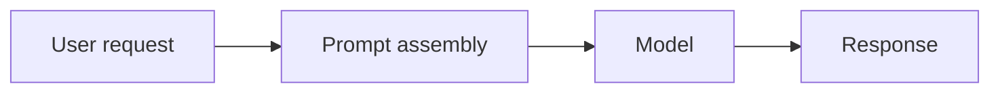
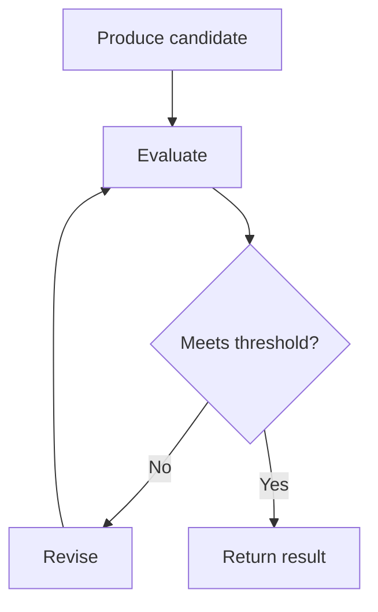
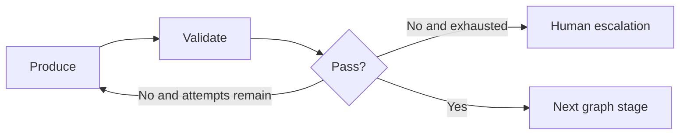
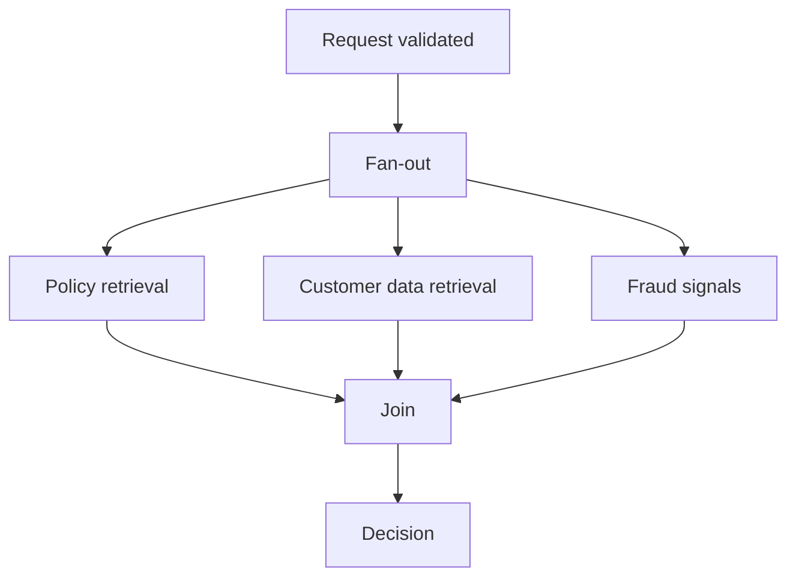
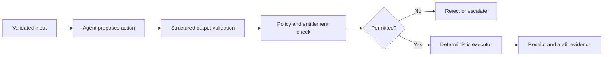
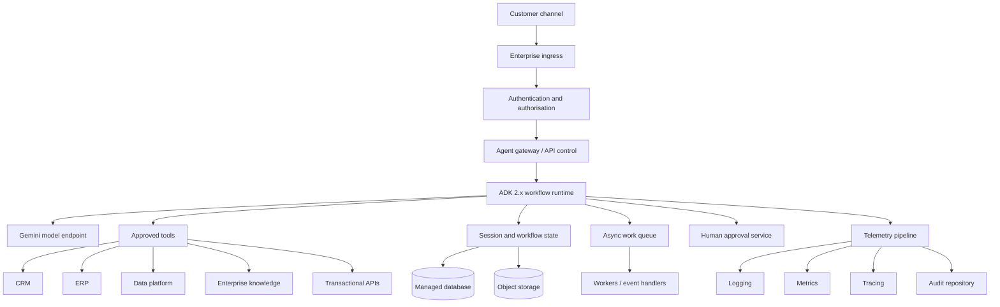
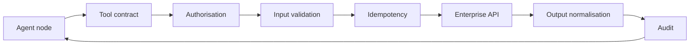
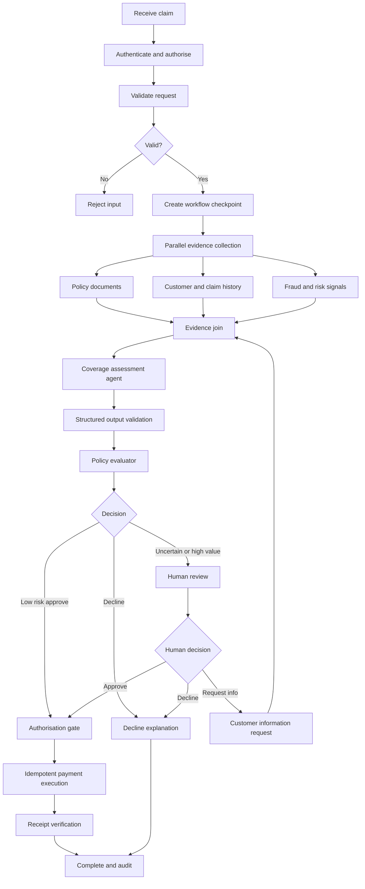
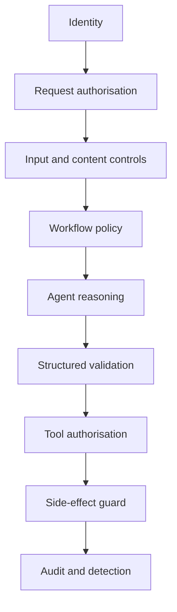

# Enterprise Graph Engineering for Agentic Systems

> [!CAUTION]
> **Status: Draft — not approved for production use.** Bootstrap audit completed 2 August 2026. The latest verified ADK Python release is v2.6.1. This imported draft predates the repository's evidence classification and six review gates; its code examples have not yet passed the v2.6.1 execution test suite. See [content status](docs/STATUS.md) and the [bootstrap audit](docs/audits/2026-08-02-bootstrap-audit.md).

## Chapter 1 — From Loop Engineering to Production Graph Engineering with Google ADK 2.x

**Document status:** Production design handbook — Chapter 1  
**Version:** 1.0  
**Last verified:** 29 July 2026  
**Primary platform:** Google Agent Development Kit (ADK) 2.x, Python  
**Target audience:** Forward Deployed Engineers, Staff/Principal AI Engineers, Enterprise Architects, Platform Engineers, Security Engineers, SREs and Technical Delivery Leads

---

## Document intent

This chapter establishes the engineering foundation for designing production-grade agentic systems as explicit execution graphs. It is written for engineers who must convert an ambiguous customer problem into a secure, observable, testable and operable implementation.

The chapter intentionally separates three kinds of material:

1. **Official platform capability** — behaviour documented by Google for ADK 2.x and Google Cloud.
2. **Industry concept** — ideas such as loop engineering and graph engineering discussed by practitioners.
3. **Engineering recommendation** — production patterns proposed in this handbook for enterprise delivery.

Where an API is likely to evolve, the document recommends pinning the ADK version and validating examples against the API reference and release notes before production use.

---

## Source hierarchy

### Primary, authoritative sources

- [Google ADK 2.0 overview](https://adk.dev/2.0/)
- [Google ADK documentation](https://adk.dev/)
- [Graph routes](https://adk.dev/workflows/graph-routes/)
- [Dynamic workflows](https://adk.dev/workflows/dynamic/)
- [Collaborative workflows](https://adk.dev/workflows/collaboration/)
- [Workflow data handling](https://adk.dev/workflows/data-handling/)
- [Human input and tool confirmation](https://adk.dev/workflows/human-input/)
- [ADK session state](https://adk.dev/sessions/state/)
- [ADK evaluation](https://adk.dev/evaluate/)
- [ADK observability](https://adk.dev/observability/)
- [ADK Python releases](https://github.com/google/adk-python/releases)
- [Gemini Enterprise Agent Platform](https://cloud.google.com/products/gemini-enterprise-agent-platform)
- [Gemini Enterprise Agent Platform documentation](https://docs.cloud.google.com/gemini-enterprise-agent-platform)
- [Vertex AI Agent Builder documentation](https://docs.cloud.google.com/agent-builder)

### Secondary perspective

- Gao Dalie, [“FORGET Loop Engineering. Graph Engineering is about THIS”](https://gaodalie.substack.com/p/forget-loop-engineering-graph-engineering)

The article is used as an industry framing source, not as an API or platform authority.

---

# 1. Executive summary

The central engineering shift is not that loops have become obsolete. It is that a loop solves only one class of control problem: repeated execution until a condition is met.

Real customer workflows involve:

- multiple specialised responsibilities;
- explicit dependencies;
- conditional routes;
- parallel execution;
- human approvals;
- policy checks;
- external-system transactions;
- failure recovery;
- persistent state;
- audit evidence;
- runtime security boundaries;
- evaluation and release governance.

These requirements are better represented as an execution graph.

Google ADK 2.0 formalises this shift. Google describes ADK 2.0 as introducing a **Workflow Runtime** that transitions ADK from a hierarchical agent executor to a graph-based execution engine. Agents, tools and functions are evaluated as workflow nodes. ADK 2.0 adds graph-based workflows, dynamic workflows and collaborative workflows. Python 2.0 reached general availability on 19 May 2026.

The production conclusion is:

> Use prompts to shape a model call, loops to improve or repeat a bounded task, and graphs to control the topology of an end-to-end business process.

A graph does not remove model autonomy. It constrains autonomy to places where it is valuable and wraps it with deterministic controls where customer risk requires predictability.

---

# 2. The engineering evolution

## 2.1 Prompt engineering

Prompt engineering improves a single model interaction.

Typical controls include:

- role and objective;
- context supplied to the model;
- constraints;
- output schema;
- examples;
- refusal rules;
- tool-use instructions.

A prompt-centric implementation often resembles:



This pattern is useful for:

- summarisation;
- classification;
- extraction;
- drafting;
- low-risk question answering.

It is insufficient when the system must coordinate several steps, enforce approvals, call transactional systems, or recover from partial failure.

## 2.2 Context engineering

Context engineering controls what information is available to the model at each decision point.

It includes:

- session history;
- retrieved enterprise knowledge;
- policy excerpts;
- user identity and entitlements;
- tool results;
- structured workflow state;
- current objective;
- permitted actions;
- compact summaries of prior work.

Context engineering is not merely “put more text into the prompt.” It is the deliberate selection, transformation, isolation and lifecycle management of information.

## 2.3 Loop engineering

Loop engineering adds iterative control.

A generic loop is:



A loop is effective when:

- the task is cohesive;
- one state owner is sufficient;
- iteration has a measurable stopping condition;
- the work can safely remain inside one trust boundary;
- failure does not require business compensation;
- iteration limits can be bounded.

Examples include:

- draft–critic–revise;
- retrieve–assess sufficiency–retrieve again;
- generate code–run tests–repair;
- plan–execute next action–observe–replan.

A loop becomes dangerous when it has no hard iteration limit, no cost budget, no progress test, or no safe escalation path.

## 2.4 Graph engineering

Gao Dalie’s framing is useful: loop engineering improves an agent’s behaviour, while graph engineering makes collaboration among multiple processes or agents more reliable. The article emphasises that real work contains dependencies, approvals, branching and exceptions, and that humans design the paths in a graph.

For production engineering, the concept should be stated more precisely:

> Graph engineering is the discipline of defining, implementing and operating the topology through which deterministic logic, model reasoning, tools, humans and external systems collaborate.

A graph introduces explicit:

- nodes;
- routes;
- state transitions;
- joins;
- loops;
- terminal conditions;
- error paths;
- approval points;
- permissions;
- telemetry;
- evidence.

## 2.5 Enterprise orchestration engineering

Graph engineering describes topology. Enterprise orchestration engineering adds operational and organisational controls:

- durable execution;
- transaction semantics;
- idempotency;
- service-level objectives;
- identity propagation;
- policy enforcement;
- audit retention;
- tenant isolation;
- versioning;
- release governance;
- disaster recovery;
- cost governance.

The distinction matters. A graph can be logically correct but still fail production requirements because it cannot resume after a crash, produces duplicate transactions, leaks tenant state, or cannot explain why an action occurred.

---

# 3. Why ADK 2.x changes the implementation model

Google’s ADK 2.0 documentation identifies three major workflow categories:

1. **Graph-based workflows** — deterministic workflows with explicit routing and execution control.
2. **Dynamic workflows** — code-based workflows for complex branching and iterative logic.
3. **Collaborative workflows** — coordinator and subagent structures for agent collaboration.

ADK 2.0 also introduces important runtime changes:

- `BaseAgent` is a `BaseNode`;
- agents execute as nodes in the workflow graph;
- the event schema includes graph-related fields such as node information and workflow output;
- workflow execution owns event emission, routing and streaming;
- framework-level exception handling supports retries and human-in-the-loop pauses;
- direct manipulation of session events can break graph determinism.

These changes have practical consequences for a Forward Deployed Engineer:

- Do not carry forward ADK 1.x execution overrides without reviewing migration guidance.
- Do not manually append workflow events.
- Do not hide failures inside broad `except Exception` blocks when the runtime must apply retry policy.
- Do not catch `BaseException`, because doing so can interfere with workflow interruption and human-input handling.
- Update rigid custom session schemas to accommodate ADK 2.x event fields.
- Pin the exact ADK release used by a customer deployment.

### Recommended dependency policy

```toml
# pyproject.toml — illustrative policy
[project]
requires-python = ">=3.11,<3.15"
dependencies = [
  "google-adk==2.x.y",
  "pydantic>=2,<3",
  "opentelemetry-api>=1,<2",
  "opentelemetry-sdk>=1,<2"
]
```

Replace `2.x.y` with the organisation-approved release. A production repository should not use an unconstrained `google-adk>=2` dependency.

---

# 4. Core graph anatomy

A production agent graph can be modelled as:

\[
G = (V, E, S, R, P, O)
\]

Where:

- \(V\) is the set of nodes;
- \(E\) is the set of directed edges;
- \(S\) is workflow state;
- \(R\) is routing logic;
- \(P\) is policy;
- \(O\) is observability and evidence.

The final three elements are deliberately included. A bare graph of nodes and edges is not sufficient for an enterprise system.

## 4.1 Nodes

A node is an executable unit with a bounded responsibility.

Common node classes include:

| Node type | Purpose | Prefer deterministic implementation when |
|---|---|---|
| Input validation | Validate schema, identity and required fields | Always |
| Policy | Enforce non-negotiable rules | Always |
| Router | Choose next path | Risk is high or rules are known |
| LLM agent | Interpret ambiguity or reason over evidence | Rules cannot be fully enumerated |
| Tool | Call an API or execute a capability | Side effects are controlled |
| Retrieval | Fetch authorised evidence | Query and filters can be explicit |
| Evaluator | Score output, trajectory or policy compliance | Quality gates matter |
| Human approval | Pause and request authorised decision | Action is material or regulated |
| Join | Merge outputs from parallel branches | Fan-out occurs |
| Persistence | Write checkpoint or business state | Resume/recovery is required |
| Compensation | Reverse or mitigate a prior side effect | Distributed transaction can partially fail |
| Terminal | Return, reject, escalate or cancel | Always explicit |

### Node contract

Every production node should declare:

```yaml
node_contract:
  id: coverage_check
  purpose: Determine whether the submitted claim is covered
  input_schema: ClaimCoverageRequest.v1
  output_schema: ClaimCoverageDecision.v1
  side_effects: none
  identity: claims-coverage-runtime
  data_classification:
    reads: [customer_pii, policy_data]
    writes: [workflow_evidence]
  timeout_seconds: 10
  retry:
    max_attempts: 3
    strategy: exponential_backoff
    retryable_errors: [UNAVAILABLE, DEADLINE_EXCEEDED]
  idempotency: naturally_idempotent
  observability:
    metrics: [latency, outcome, retry_count]
    trace_attributes: [claim_id_hash, policy_version]
  evaluation:
    dataset: coverage-golden-set-v3
    release_threshold: 0.98
```

This contract is an engineering recommendation, not an ADK-native schema. It can be represented using Python metadata, configuration files or a platform control plane.

## 4.2 Edges and routes

An edge defines a possible transition.

Important edge types include:

- unconditional;
- condition-based;
- model-selected;
- event-triggered;
- retry;
- timeout;
- approval;
- compensation;
- escalation;
- loop-back;
- completion.

A route must answer:

1. What condition activates it?
2. Which state fields may it inspect?
3. Is the decision deterministic?
4. What evidence is recorded?
5. What happens when no route matches?
6. Is the transition allowed by policy?

### Route design rule

For high-impact actions, route on **structured state**, not free-form model prose.

Poor:

```python
if "looks risky" in agent_text.lower():
    route_to_manual_review()
```

Better:

```python
class RiskDecision(BaseModel):
    risk_band: Literal["LOW", "MEDIUM", "HIGH"]
    score: float
    reason_codes: list[str]
    evidence_ids: list[str]
```

Then apply deterministic routing:

```python
if decision.risk_band == "HIGH":
    return "manual_review"
if decision.risk_band == "MEDIUM":
    return "enhanced_due_diligence"
return "straight_through_processing"
```

The model may produce the structured decision, but workflow code owns the route.

## 4.3 State

State is the controlled data plane of the workflow.

Google ADK describes session state as a key-value scratchpad associated with a session, while session events hold the interaction history. Production designs should distinguish several scopes:

| Scope | Example | Lifetime |
|---|---|---|
| Invocation | Current tool input | One node call |
| Workflow | Claim data and decisions | One workflow run |
| Session | User preferences and conversation context | Conversation |
| User | Stable user settings | Cross-session |
| Tenant | Policy configuration | Long-lived |
| Enterprise memory | Approved reusable knowledge | Long-lived |
| Audit | Immutable evidence and decisions | Retention period |

Do not place all scopes in one dictionary. That creates accidental coupling, retention problems and access-control ambiguity.

### State ownership rules

- Each field has one authoritative writer.
- Readers are explicitly defined.
- State changes use schema validation.
- Sensitive fields are minimised.
- State stores identifiers and evidence references rather than unnecessary raw payloads.
- State versions are immutable or revisioned when used for decisions.
- Human edits create a new revision and preserve prior values.
- Terminal state includes outcome, reason codes, policy version and evidence references.

## 4.4 Artifacts

Artifacts are larger or durable outputs that should not live directly in conversational state:

- uploaded documents;
- generated reports;
- extracted tables;
- code patches;
- signed approvals;
- evaluation reports;
- model input/output snapshots, where policy permits;
- transaction receipts.

Use object storage or a domain repository and store only references, hashes and metadata in workflow state.

## 4.5 Loops inside graphs

Loops remain first-class structures within a graph.



A production loop requires:

- maximum iterations;
- maximum elapsed time;
- maximum token or cost budget;
- progress measurement;
- state checkpoint per iteration;
- terminal reason code;
- escalation path.

### Recommended loop guard

```python
@dataclass(frozen=True)
class LoopBudget:
    max_iterations: int
    max_elapsed_seconds: int
    max_model_calls: int
    max_tool_calls: int
    max_estimated_cost_aud: Decimal
```

The currency is illustrative and should be replaced by the customer’s accounting currency.

## 4.6 Fan-out and fan-in

Parallelism reduces latency when branches are independent.



A join node must specify:

- required branches;
- optional branches;
- timeout behaviour;
- partial-result policy;
- merge schema;
- conflict resolution;
- deterministic ordering where required.

Avoid parallel branches that mutate the same state fields.

## 4.7 Human-in-the-loop

Human participation is not a fallback after engineering failure. It is an explicit control.

Use human input for:

- high-value transactions;
- regulated decisions;
- low-confidence outcomes;
- policy exceptions;
- irreversible actions;
- ambiguous identity;
- missing evidence;
- override of an automated recommendation.

The approval record should include:

- approver identity;
- authority or role;
- timestamp;
- decision;
- reason;
- evidence viewed;
- policy version;
- workflow version;
- any modifications;
- cryptographic or platform audit reference.

Google ADK 2.x provides human input and tool-confirmation mechanisms. The exact integration should follow the current official page and API reference for the pinned version.

---

# 5. Determinism and autonomy

A production design should not ask whether the system is “deterministic” or “agentic” as a binary choice. It should allocate each responsibility to the appropriate control mechanism.

## 5.1 Deterministic zones

Use deterministic code for:

- authentication;
- authorisation;
- schema validation;
- policy enforcement;
- financial calculations;
- threshold comparisons;
- state transitions;
- retry limits;
- timeout handling;
- idempotency;
- audit emission;
- side-effect execution;
- compensation;
- release gating.

## 5.2 Agentic zones

Use model reasoning for:

- intent interpretation;
- planning under ambiguity;
- evidence synthesis;
- natural-language explanation;
- semantic classification;
- generating candidate options;
- identifying missing information;
- proposing remediation.

## 5.3 Controlled autonomy pattern



The model proposes. Deterministic controls authorise. A tool or service executes. The workflow records evidence.

This pattern is preferred for enterprise side effects.

---

# 6. Production reference architecture

The following architecture is a generic Google Cloud mapping. Product names and availability must be verified for the customer’s region and organisation policy.



## 6.1 Runtime placement

Potential runtime options include:

- a managed agent runtime in Gemini Enterprise Agent Platform;
- Cloud Run for serverless container execution;
- GKE for greater platform control, custom networking or workload patterns.

The choice should be driven by:

- regional availability;
- data residency;
- network topology;
- workload duration;
- concurrency;
- custom dependencies;
- operational ownership;
- compliance;
- cost model;
- managed-service maturity.

Do not select GKE merely because the organisation already uses Kubernetes. Do not select serverless without validating execution duration, connection behaviour, concurrency and state requirements.

## 6.2 Identity

Use workload identity and short-lived credentials.

Recommended principles:

- one runtime identity per deployable trust boundary;
- tool-specific permissions;
- no long-lived service-account keys;
- end-user identity preserved where downstream authorisation requires it;
- service identity used only where delegated user identity is not appropriate;
- explicit tenant context;
- deny-by-default tool access;
- separate read and write capabilities;
- high-risk tools behind approval and policy nodes.

## 6.3 Network

Typical controls include:

- private connectivity to enterprise APIs;
- controlled egress;
- TLS everywhere;
- service-to-service authentication;
- API gateway policy;
- web application protection at public ingress;
- restricted administrative endpoints;
- separate management and data planes;
- DNS and certificate governance;
- private model access where supported and required.

## 6.4 State and durability

A production workflow must survive process restart if the business process is long-running or materially consequential.

State design options:

- ADK-managed sessions where suitable;
- managed relational or document store for domain workflow state;
- object storage for artifacts;
- queue or event service for asynchronous work;
- immutable audit store for evidence;
- domain system as source of truth for business transactions.

Do not treat in-memory state as production durability.

## 6.5 Tool boundary

Tools should be wrapped by an enterprise tool adapter rather than exposing raw SDKs directly to an agent.



The adapter should enforce:

- allowed operations;
- input schema;
- output schema;
- identity;
- timeout;
- retry;
- idempotency;
- rate limit;
- data filtering;
- audit;
- error normalisation.

---

# 7. ADK 2.x implementation strategy

## 7.1 Choose the workflow style deliberately

### Graph-based workflow

Use when:

- paths are known;
- auditability matters;
- explicit routes are valuable;
- deterministic control is dominant;
- branching and joins are understandable at design time.

### Dynamic workflow

Use when:

- workflow structure requires full programming-language control;
- complex iteration is difficult to express as static routes;
- runtime logic constructs the execution pattern;
- the graph would become less understandable than the code.

Google describes dynamic workflows as a programmatic alternative that uses the full power of the implementation language.

### Collaborative workflow

Use when:

- a coordinator delegates bounded tasks to specialist subagents;
- specialists need distinct instructions, tools or context;
- agent-to-agent collaboration is part of the solution.

A collaborative topology is not automatically a production workflow. It still needs policy, state, durability, telemetry and release controls.

## 7.2 Suggested repository structure

```text
customer-agent-platform/
├── pyproject.toml
├── uv.lock
├── README.md
├── src/
│   └── customer_solution/
│       ├── app.py
│       ├── config/
│       │   ├── settings.py
│       │   ├── policy.yaml
│       │   └── routing.yaml
│       ├── workflows/
│       │   ├── root.py
│       │   ├── claims.py
│       │   └── approvals.py
│       ├── nodes/
│       │   ├── validation.py
│       │   ├── retrieval.py
│       │   ├── reasoning.py
│       │   ├── evaluation.py
│       │   └── persistence.py
│       ├── agents/
│       │   ├── intake_agent.py
│       │   ├── coverage_agent.py
│       │   └── explanation_agent.py
│       ├── tools/
│       │   ├── policy_api.py
│       │   ├── claims_api.py
│       │   └── tool_contracts.py
│       ├── schemas/
│       │   ├── input.py
│       │   ├── state.py
│       │   └── output.py
│       ├── security/
│       │   ├── authorisation.py
│       │   └── data_policy.py
│       ├── telemetry/
│       │   ├── tracing.py
│       │   ├── metrics.py
│       │   └── audit.py
│       └── evaluation/
│           ├── rubrics.py
│           └── datasets.py
├── tests/
│   ├── unit/
│   ├── contract/
│   ├── workflow/
│   ├── evaluation/
│   ├── security/
│   └── resilience/
├── evalsets/
├── deployment/
│   ├── terraform/
│   ├── cloud-run/
│   └── gke/
└── docs/
    ├── architecture.md
    ├── threat-model.md
    ├── runbook.md
    └── model-card.md
```

## 7.3 Typed state model

```python
from __future__ import annotations

from datetime import datetime
from typing import Literal
from pydantic import BaseModel, Field, ConfigDict


class EvidenceRef(BaseModel):
    model_config = ConfigDict(extra="forbid")

    evidence_id: str
    source_type: Literal["policy", "customer", "transaction", "human"]
    uri: str
    content_hash: str
    retrieved_at: datetime


class WorkflowDecision(BaseModel):
    model_config = ConfigDict(extra="forbid")

    outcome: Literal["APPROVE", "DECLINE", "REVIEW"]
    confidence: float = Field(ge=0.0, le=1.0)
    reason_codes: list[str]
    evidence: list[EvidenceRef]
    policy_version: str


class ClaimWorkflowState(BaseModel):
    model_config = ConfigDict(extra="forbid")

    workflow_id: str
    tenant_id: str
    user_id_hash: str
    claim_id: str
    status: Literal[
        "RECEIVED",
        "VALIDATED",
        "EVIDENCE_READY",
        "ASSESSED",
        "AWAITING_APPROVAL",
        "COMPLETED",
        "REJECTED",
        "FAILED",
    ]
    iteration: int = 0
    decision: WorkflowDecision | None = None
```

Benefits:

- explicit schema;
- validation at node boundaries;
- safer routing;
- API contract generation;
- controlled schema evolution;
- easier testing and replay.

## 7.4 Deterministic node example

```python
from pydantic import ValidationError


def validate_claim(payload: dict) -> ClaimWorkflowState:
    """Pure deterministic validation node."""
    try:
        state = ClaimWorkflowState.model_validate(payload)
    except ValidationError as exc:
        # Translate into a domain error that the workflow can route.
        raise InvalidClaimInput(str(exc)) from exc

    if state.status != "RECEIVED":
        raise InvalidWorkflowTransition(
            f"Expected RECEIVED, got {state.status}"
        )

    return state.model_copy(update={"status": "VALIDATED"})
```

The node should not:

- call a model;
- mutate global state;
- swallow exceptions;
- perform hidden network operations;
- append events directly.

## 7.5 Agent output schema

```python
class CoverageAssessment(BaseModel):
    model_config = ConfigDict(extra="forbid")

    coverage_status: Literal["COVERED", "NOT_COVERED", "UNCERTAIN"]
    confidence: float = Field(ge=0.0, le=1.0)
    policy_clauses: list[str]
    missing_information: list[str]
    explanation: str
```

The agent instruction should require this output, but downstream code must still validate it.

## 7.6 Side-effect executor

```python
from dataclasses import dataclass


@dataclass(frozen=True)
class PaymentCommand:
    workflow_id: str
    claim_id: str
    amount_cents: int
    currency: str
    idempotency_key: str


class PaymentExecutor:
    def __init__(self, client, authoriser, audit):
        self._client = client
        self._authoriser = authoriser
        self._audit = audit

    async def execute(self, command: PaymentCommand, principal) -> dict:
        self._authoriser.require(
            principal=principal,
            permission="claims.payment.execute",
            resource=command.claim_id,
        )

        result = await self._client.create_payment(
            claim_id=command.claim_id,
            amount_cents=command.amount_cents,
            currency=command.currency,
            idempotency_key=command.idempotency_key,
            timeout_seconds=15,
        )

        await self._audit.record(
            event_type="CLAIM_PAYMENT_EXECUTED",
            workflow_id=command.workflow_id,
            claim_id=command.claim_id,
            transaction_id=result["transaction_id"],
        )
        return result
```

The model never receives raw payment SDK access.

## 7.7 Workflow composition pseudocode

Because graph APIs may change between ADK 2.x minor releases, the following shows the intended composition rather than claiming a version-independent constructor signature:

```python
# Pseudocode — map to the exact ADK 2.x API for the pinned release.

workflow = Workflow(name="claim_assessment")

workflow.add_node("validate", validate_claim_node)
workflow.add_node("retrieve", retrieve_evidence_node)
workflow.add_node("assess", coverage_agent_node)
workflow.add_node("evaluate", assessment_evaluator_node)
workflow.add_node("human_review", human_approval_node)
workflow.add_node("execute", payment_executor_node)
workflow.add_node("complete", completion_node)
workflow.add_node("reject", rejection_node)

workflow.route("validate", to="retrieve", when=validation_passed)
workflow.route("retrieve", to="assess")
workflow.route("assess", to="evaluate")

workflow.route(
    "evaluate",
    to="execute",
    when=lambda state: state.decision.outcome == "APPROVE"
    and state.decision.confidence >= 0.95,
)
workflow.route(
    "evaluate",
    to="human_review",
    when=lambda state: state.decision.outcome == "REVIEW"
    or state.decision.confidence < 0.95,
)
workflow.route(
    "evaluate",
    to="reject",
    when=lambda state: state.decision.outcome == "DECLINE",
)
workflow.route("human_review", to="execute", when=human_approved)
workflow.route("human_review", to="reject", when=human_rejected)
workflow.route("execute", to="complete")
```

Before implementation, use:

- the official graph routes page;
- the Python API reference;
- the ADK GitHub examples for the pinned release;
- release notes for breaking changes.

---

# 8. End-to-end customer example: insurance claim assessment

## 8.1 Business objective

Automate low-risk claim assessment while retaining human control for uncertain, high-value or policy-exception cases.

## 8.2 Non-functional requirements

- 99.9% workflow API availability;
- no duplicate payment;
- complete decision audit;
- tenant and customer isolation;
- approved policy version recorded;
- personally identifiable information minimised in logs;
- human approval above configured threshold;
- recoverable after runtime restart;
- explainable decline or review reason;
- evaluation gate before production release.

## 8.3 Workflow



## 8.4 Failure routes

| Failure | Route |
|---|---|
| Policy repository unavailable | Retry, then pause or route to manual review |
| Fraud service timeout | Use configured partial-result policy; do not silently assume low risk |
| Agent output invalid | Retry with bounded repair; then escalate |
| Human approval expires | Cancel or re-request according to policy |
| Payment API timeout | Query by idempotency key before retry |
| Audit write fails | Do not report transaction complete until evidence durability policy is met |
| State version conflict | Re-read, reconcile deterministically, retry |
| Model endpoint unavailable | Retry within budget; optionally use approved fallback model; otherwise pause |

## 8.5 Compensation

A payment workflow is not “rolled back” by deleting state. It requires a domain compensation process.

Examples:

- payment cancellation before settlement;
- reversal after settlement;
- account adjustment;
- case creation for manual remediation.

The compensation node must be explicit, authorised and audited.

---

# 9. Reliability engineering for graphs

This handbook uses the term **Graph Reliability Engineering (GRE)** for the application of reliability practices to agent workflows. This is an engineering framework proposed here, not an official Google product term.

## 9.1 Suggested SLO model

### Availability SLI

Percentage of eligible workflow-start requests accepted and durably recorded.

### Completion SLI

Percentage of accepted workflows reaching an allowed terminal state within the target time.

### Correct-route SLI

Percentage of evaluated workflows following an acceptable route for the scenario.

### Tool-success SLI

Percentage of tool calls completing successfully, excluding caller-invalid requests.

### Human-wait SLI

Time spent waiting for required human action, reported separately from machine execution latency.

### Evaluation SLI

Percentage of sampled production workflows meeting quality and policy thresholds.

## 9.2 Example SLOs

```yaml
slos:
  workflow_acceptance:
    target: 99.9%
    window: 30d

  low_risk_completion:
    target: 99.0%
    objective: "complete within 120 seconds"
    window: 30d

  duplicate_side_effects:
    target: 0
    window: all_time

  audit_completeness:
    target: 100%
    required_fields:
      - workflow_version
      - policy_version
      - outcome
      - reason_codes
      - evidence_refs
      - actor_identity

  high_risk_human_approval:
    target: 100%
```

## 9.3 Node-level metrics

- invocation count;
- success count;
- failure count;
- retry count;
- latency;
- timeout count;
- input/output validation failures;
- model token consumption;
- tool-call count;
- cost estimate;
- confidence distribution;
- route distribution;
- human escalation rate;
- policy denial rate.

## 9.4 Graph-level metrics

- workflows started;
- workflows completed;
- workflows abandoned;
- terminal-state distribution;
- end-to-end latency;
- active workflows;
- stuck workflows;
- loop iteration distribution;
- path frequency;
- compensation count;
- replay count;
- version distribution.

## 9.5 Retry policy

Retry only transient failures.

Retryable examples:

- temporary service unavailability;
- rate limit;
- connection reset;
- deadline exceeded, where the operation is idempotent or status can be checked.

Non-retryable examples:

- invalid schema;
- policy denial;
- unauthorised action;
- unsupported operation;
- deterministic business-rule failure.

Use exponential backoff with jitter and a global workflow budget.

## 9.6 Idempotency

Every side-effecting node should answer:

- Is the operation naturally idempotent?
- Does the target accept an idempotency key?
- Can outcome be queried after timeout?
- What uniqueness boundary applies?
- How long is the key retained?
- What happens during replay?

Recommended key:

```text
<tenant-id>:<workflow-id>:<node-id>:<business-operation-version>
```

Do not use a random key generated per retry.

## 9.7 Checkpointing

Checkpoint after:

- validated intake;
- expensive retrieval;
- human approval;
- external side effect;
- completion of each loop iteration;
- route decision with material consequence.

A checkpoint should include:

- workflow version;
- node;
- state version;
- route decision;
- evidence references;
- retry count;
- timestamp;
- correlation identifiers.

---

# 10. Observability and audit

Google ADK documentation states that basic input/output monitoring is insufficient for non-trivial agents and identifies logging, metrics and traces as built-in observability areas.

## 10.1 Trace model

Recommended span hierarchy:

```text
workflow.run
├── node.validate
├── node.retrieve
│   ├── tool.policy_search
│   ├── tool.customer_lookup
│   └── tool.fraud_signal
├── node.assess
│   └── model.generate
├── node.evaluate
├── node.human_approval
├── node.execute
│   └── tool.payment
└── node.complete
```

Recommended attributes:

- workflow ID;
- workflow version;
- node ID;
- route ID;
- tenant ID, pseudonymised where required;
- model name and version;
- prompt/template version;
- tool name and version;
- policy version;
- retry attempt;
- terminal outcome;
- error class.

Do not place raw secrets, credentials or unredacted sensitive content in trace attributes.

## 10.2 Logs

Use structured logs:

```json
{
  "severity": "INFO",
  "event_type": "WORKFLOW_ROUTE_SELECTED",
  "workflow_id": "wf_01...",
  "workflow_version": "claims-v12",
  "from_node": "evaluate",
  "to_node": "human_review",
  "reason_codes": ["LOW_CONFIDENCE", "HIGH_VALUE"],
  "policy_version": "claims-policy-2026-07",
  "trace_id": "..."
}
```

## 10.3 Audit versus operational logs

Operational logs support diagnosis and may have shorter retention.

Audit records support accountability and should be:

- immutable or tamper-evident;
- access-controlled;
- retained according to policy;
- complete enough to reconstruct the decision;
- separated from debug content;
- exportable for review.

## 10.4 Content capture

Capturing full prompts, model responses or tool payloads may improve debugging but creates privacy and retention risk.

Use:

- redaction;
- selective sampling;
- field-level encryption;
- restricted access;
- shorter retention;
- synthetic test data outside production;
- hashes and evidence references when full content is unnecessary.

---

# 11. Evaluation engineering

Google ADK recommends evaluating both:

1. trajectory and tool use;
2. final response.

This distinction is essential for graph systems. A correct final answer reached through an unsafe or inefficient path is not a successful production outcome.

## 11.1 Evaluation layers

| Layer | Question |
|---|---|
| Node unit test | Does deterministic logic behave correctly? |
| Contract test | Does each tool match schema and error semantics? |
| Route test | Does state produce the correct next node? |
| Trajectory evaluation | Did the workflow use the expected agents and tools? |
| Output evaluation | Is the result correct, relevant and well formed? |
| Policy evaluation | Were controls and approvals applied? |
| Security evaluation | Can prompts or tools bypass boundaries? |
| Resilience test | Does the graph recover from failures? |
| Production evaluation | Does sampled live behaviour meet thresholds? |

## 11.2 Golden scenario

```yaml
case_id: claim-low-risk-001
input:
  claim_type: accidental_damage
  amount_aud: 850
  policy_id: P123
expected:
  terminal_state: COMPLETED
  required_nodes:
    - validate
    - retrieve_policy
    - retrieve_claim_history
    - assess
    - evaluate
    - execute
    - complete
  forbidden_nodes:
    - human_review
  required_tools:
    - policy_api.get_policy
    - claims_api.get_history
    - payments_api.create_payment
  required_reason_codes:
    - COVERED_EVENT
    - BELOW_AUTO_APPROVAL_LIMIT
  max_model_calls: 2
```

## 11.3 Adversarial scenarios

Test:

- prompt injection in uploaded documents;
- instructions embedded in retrieved content;
- request to bypass approval;
- cross-tenant identifiers;
- tool arguments containing unexpected fields;
- forged human approval payload;
- repeated side-effect request;
- maliciously long input;
- route manipulation through free-form output;
- attempts to extract system prompts or credentials.

## 11.4 Release gate

A graph release should be blocked when:

- route accuracy drops below threshold;
- policy-control coverage is incomplete;
- a critical security scenario fails;
- duplicate side effects are observed;
- audit fields are missing;
- latency or cost exceeds budget without approved exception;
- evaluation datasets do not cover modified paths.

---

# 12. Security architecture

## 12.1 Threat model

Threat actors and failures include:

- malicious external user;
- compromised internal user;
- prompt injection from retrieved content;
- over-privileged tool;
- compromised dependency;
- data leakage across tenants;
- model hallucination;
- workflow-state tampering;
- forged approval;
- replay attack;
- operator mistake;
- insecure debug logging.

## 12.2 Control layers



No single prompt should be treated as a security boundary.

## 12.3 Tool least privilege

Separate tools by capability:

- read customer;
- update customer;
- read payment status;
- create payment;
- reverse payment.

Do not expose a generic “call any API” tool.

## 12.4 Prompt injection controls

- classify retrieved content as untrusted data;
- keep system policy outside retrieved text;
- separate instructions from evidence;
- validate every tool argument;
- authorise every tool call independently;
- restrict tool availability per node;
- use allowlists;
- prevent retrieved text from changing workflow routes directly;
- record evidence provenance;
- apply human review for high-risk outcomes.

## 12.5 Human approval security

- authenticate approver;
- verify authority for transaction value and action;
- bind approval to workflow and exact action;
- expire approval;
- prevent replay;
- record decision and reason;
- re-approve if material inputs change.

---

# 13. Cost and performance engineering

## 13.1 Cost drivers

- model input tokens;
- model output tokens;
- repeated loop iterations;
- retrieval calls;
- tool/API calls;
- state storage;
- trace volume;
- artifact storage;
- human review;
- duplicate work after failure.

## 13.2 Cost controls

- route simple cases to deterministic logic;
- use smaller approved models for classification or extraction;
- reserve larger models for complex reasoning;
- summarise state;
- cache immutable retrieval results;
- cap loop iterations;
- avoid passing entire session history to every node;
- parallelise only when branches are likely to be needed;
- sample detailed telemetry;
- measure cost per terminal outcome, not only cost per model call.

## 13.3 Latency budget

```yaml
latency_budget_ms:
  ingress_and_auth: 150
  validation: 50
  evidence_parallel:
    policy: 400
    customer: 500
    fraud: 700
  join_overhead: 50
  model_assessment: 2500
  evaluation: 300
  execution: 1000
  audit: 200
  total_target: 4950
```

The critical path, not the sum of parallel branches, determines expected latency.

---

# 14. Delivery methodology for a Forward Deployed Engineer

## Phase 1 — Discovery

Deliverables:

- customer objective;
- user journeys;
- current process map;
- system inventory;
- data classification;
- risk classification;
- non-functional requirements;
- success metrics;
- candidate automation boundaries.

Questions:

- What decision is being made?
- Who is accountable?
- What systems are authoritative?
- Which actions are reversible?
- Which cases require a human?
- What is the cost of false approval and false rejection?
- What evidence is required?
- How long can the process wait?
- What happens when a dependency is unavailable?

## Phase 2 — Topology design

Create:

- node catalogue;
- route catalogue;
- state model;
- trust-boundary diagram;
- tool contracts;
- failure matrix;
- human-control map;
- evidence model;
- evaluation plan.

## Phase 3 — Thin vertical slice

Build one complete path:

```text
request → validate → retrieve → reason → evaluate → human review → response
```

Use real identity, telemetry and one real enterprise integration. Avoid a disconnected chatbot proof of concept.

## Phase 4 — Hardening

Add:

- schema validation;
- retries;
- idempotency;
- checkpointing;
- policy enforcement;
- threat mitigations;
- evaluation datasets;
- dashboards;
- alerts;
- runbooks;
- load testing.

## Phase 5 — Controlled production

- shadow mode;
- read-only mode;
- recommendation mode;
- human-approved execution;
- low-risk auto-execution;
- expanded scope after evidence.

## Phase 6 — Operate and improve

- weekly evaluation review;
- route drift review;
- tool failure analysis;
- cost and latency review;
- prompt and policy versioning;
- incident learning;
- dataset expansion;
- retirement of unused paths.

---

# 15. Anti-patterns

## 15.1 “One super-agent”

A single agent receives every tool and owns every decision.

Risks:

- excessive privilege;
- opaque routing;
- large context;
- poor testability;
- difficult ownership;
- broad blast radius.

## 15.2 Model-controlled compliance

The prompt says “follow policy,” but no deterministic policy node exists.

Risk: policy becomes probabilistic.

## 15.3 Free-form routing

Workflow parses natural-language output to choose a path.

Risk: brittle and manipulable routing.

## 15.4 Hidden retries inside tools

Tool catches every exception and retries indefinitely.

Risk: runtime cannot observe failure, budgets are bypassed, duplicate effects occur.

## 15.5 In-memory workflow state

A long-running workflow depends on one process.

Risk: restart loses business progress.

## 15.6 Shared mutable state across parallel branches

Risk: race conditions and non-reproducible output.

## 15.7 Logs as audit

Risk: incomplete evidence, mutable retention and excessive sensitive content.

## 15.8 Unlimited reflection loop

Risk: cost growth, latency, repeated hallucination and no progress.

## 15.9 Human approval as a generic “yes”

Risk: approval is not bound to a specific action, value, evidence or policy state.

## 15.10 Graph complexity without business need

Not every task requires a graph. A simple deterministic service or one model call may be better.

---

# 16. Definition of done

A customer agent graph is not production-ready until the team can answer “yes” to the following.

## Architecture

- [ ] Every node has one bounded responsibility.
- [ ] Routes are explicit and have default/failure behaviour.
- [ ] Loops are bounded.
- [ ] Parallel branches have deterministic joins.
- [ ] Terminal states are explicit.
- [ ] State scopes and owners are defined.

## Security

- [ ] Identity and tenant context are verified.
- [ ] Tool permissions are least privilege.
- [ ] Side effects have independent authorisation.
- [ ] Prompt injection is included in the threat model.
- [ ] Human approvals are authenticated, scoped and replay-protected.
- [ ] Sensitive data is controlled in logs and traces.

## Reliability

- [ ] Retryable and non-retryable errors are classified.
- [ ] Side effects are idempotent or reconcilable.
- [ ] Checkpoints support recovery.
- [ ] Timeouts and global budgets exist.
- [ ] Compensation paths are defined.
- [ ] SLOs and alerts exist.

## Evaluation

- [ ] Node tests exist.
- [ ] Route tests exist.
- [ ] Tool contracts are tested.
- [ ] Trajectory and output evaluations exist.
- [ ] Security/adversarial cases exist.
- [ ] Release thresholds are automated.

## Operations

- [ ] Workflow, node and tool telemetry exists.
- [ ] Audit evidence is durable.
- [ ] On-call runbook exists.
- [ ] Rollback and version compatibility are documented.
- [ ] Cost per outcome is measured.
- [ ] Production sampling and review are defined.

---

# 17. Key decisions to carry into Chapter 2

1. A graph is a control structure, not merely a diagram.
2. Loops remain useful but must be bounded and embedded within a wider topology when the process has multiple responsibilities.
3. Deterministic code owns policy, routing, side effects and lifecycle controls.
4. Models operate inside constrained reasoning zones.
5. State, artifacts, policy and evidence are first-class architecture elements.
6. ADK 2.x workflow runtime should be treated as a graph execution engine, not as an ADK 1.x agent hierarchy with new naming.
7. Production readiness requires durability, identity, observability, evaluation and operational governance beyond graph construction.
8. Official ADK documentation and release notes are the source of truth for API-level implementation.
9. Industry articles provide useful framing but do not replace platform documentation.
10. The correct architecture is the simplest topology that satisfies the customer’s risk and operational requirements.

---

# 18. Official-reference verification notes

The following facts were verified against official Google documentation at the time of writing:

- ADK Python 2.0 was released for general availability on 19 May 2026.
- ADK 2.0 includes graph-based, dynamic and collaborative workflows.
- ADK 2.0 introduces a Workflow Runtime and changes execution from a hierarchical agent executor to a graph-based engine.
- Agents, tools and functions are evaluated as nodes.
- `BaseAgent` subclasses `BaseNode`.
- ADK 2.x events add graph-related workflow fields.
- Directly appending session events is unsafe because the workflow runtime controls routing, persistence and streaming.
- Broad exception handling can mask failures from runtime retry handling.
- Catching `BaseException` can interfere with human-in-the-loop interruption.
- ADK evaluation covers trajectory/tool use and final output.
- ADK observability includes logging, metrics and traces.

Always re-check these pages when upgrading the ADK dependency.

---

# 19. Next chapter

**Chapter 2 — Graph Theory and Workflow Topology for Agentic Systems**

Planned content:

- directed graphs, DAGs and cyclic graphs;
- reachability and terminal states;
- topological ordering;
- fan-out, fan-in and joins;
- nested and composite graphs;
- static versus dynamic topology;
- graph invariants;
- route completeness;
- dead paths and livelocks;
- state-machine equivalence;
- graph versioning;
- ADK 2.x graph-route implementation patterns;
- topology testing and visualisation;
- customer architecture exercises.

---

## References

1. Google, **Welcome to ADK 2.0** — <https://adk.dev/2.0/>
2. Google, **Agent Development Kit documentation** — <https://adk.dev/>
3. Google, **Graph routes** — <https://adk.dev/workflows/graph-routes/>
4. Google, **Dynamic workflows** — <https://adk.dev/workflows/dynamic/>
5. Google, **Collaborative workflows** — <https://adk.dev/workflows/collaboration/>
6. Google, **Data handling for agent workflows** — <https://adk.dev/workflows/data-handling/>
7. Google, **Human input** — <https://adk.dev/workflows/human-input/>
8. Google, **State: The Session’s Scratchpad** — <https://adk.dev/sessions/state/>
9. Google, **Why evaluate agents** — <https://adk.dev/evaluate/>
10. Google, **Observability for agents** — <https://adk.dev/observability/>
11. Google, **ADK Python releases** — <https://github.com/google/adk-python/releases>
12. Google Cloud, **Gemini Enterprise Agent Platform** — <https://cloud.google.com/products/gemini-enterprise-agent-platform>
13. Google Cloud, **Gemini Enterprise Agent Platform documentation** — <https://docs.cloud.google.com/gemini-enterprise-agent-platform>
14. Gao Dalie, **FORGET Loop Engineering. Graph Engineering is about THIS** — <https://gaodalie.substack.com/p/forget-loop-engineering-graph-engineering>

---

**End of Chapter 1**
